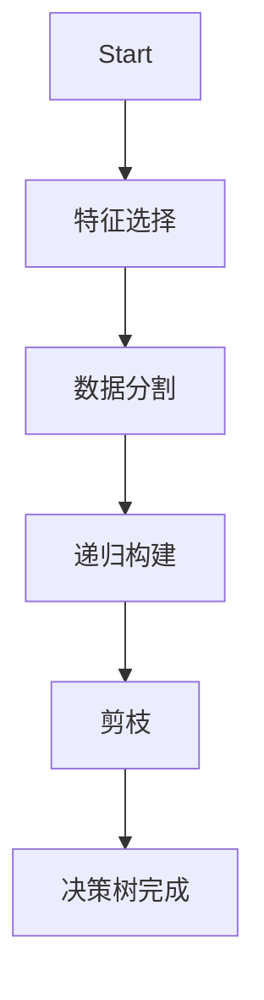
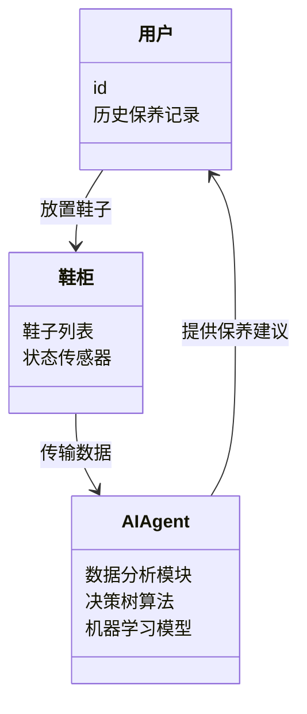
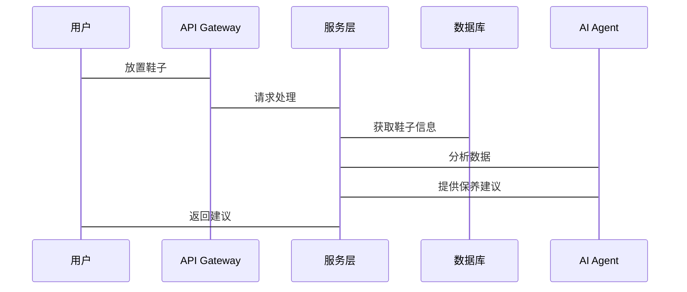

                 


# 文章标题：智能鞋柜：AI Agent的鞋履保养指导

## 文章关键词：AI Agent, 智能鞋柜, 鞋履保养, 机器学习, 系统架构

## 文章摘要：本文详细探讨了AI Agent在智能鞋柜中的应用，分析了鞋履保养的核心问题，介绍了AI Agent的算法原理和系统架构设计，并通过实际案例展示了如何利用AI技术实现智能化鞋履保养。

---

# 目录大纲：《智能鞋柜：AI Agent的鞋履保养指导》

## 第一部分：背景介绍

### 第1章：问题背景与需求分析

#### 1.1 问题背景
- 1.1.1 鞋履保养的重要性
  - 鞋子是人们日常生活的重要配饰，定期保养可以延长使用寿命，保持美观。
  - 不当的保养可能导致鞋变形、开裂，甚至影响穿着舒适度。
- 1.1.2 当前鞋履保养的痛点
  - 用户缺乏专业知识，难以正确判断保养需求。
  - 现有保养方法效率低下，难以满足多样化的鞋类需求。
  - 保养信息分散，用户难以获取专业的指导。
- 1.1.3 智能化鞋履保养的需求
  - 利用AI技术提供个性化的保养建议。
  - 自动监测鞋的状态，提醒用户及时保养。
  - 提供便捷的保养服务，如预约专业人员。

#### 1.2 问题描述
- 1.2.1 鞋履保养的常见问题
  - 不同材质的鞋子保养方法不同。
  - 用户缺乏专业的保养工具和知识。
  - 保养步骤复杂，用户难以掌握。
- 1.2.2 智能鞋柜的定义与目标
  - 智能鞋柜是一种结合AI技术的设备，能够监测鞋子的状态，并提供保养建议。
  - 目标是通过智能化手段，简化鞋履保养过程，延长鞋子使用寿命。
- 1.2.3 用户需求分析
  - 用户希望得到个性化的保养指导。
  - 用户需要便捷的操作界面和及时的反馈。
  - 用户期待智能化的提醒和自动化的保养建议。

#### 1.3 问题解决与边界
- 1.3.1 智能鞋柜的功能范围
  - 监测鞋子的状态，包括材质、磨损程度等。
  - 提供保养建议，如清洁、上油、打蜡等。
  - 提醒用户何时需要进行深层保养。
- 1.3.2 边界与外延
  - 系统不涉及实际的保养操作，只提供指导和建议。
  - 系统不处理鞋子的实际清洁或保养工作，仅提供信息支持。
- 1.3.3 核心要素与组成
  - AI算法模块：用于分析鞋子的状态和提供保养建议。
  - 数据采集模块：收集鞋子的相关数据。
  - 用户交互界面：方便用户查看建议和操作。

---

## 第二部分：核心概念与联系

### 第2章：AI Agent与智能鞋柜的核心概念

#### 2.1 AI Agent的原理
- 2.1.1 AI Agent的定义
  - AI Agent是一种智能主体，能够感知环境并采取行动以实现目标。
- 2.1.2 AI Agent的核心特征
  - 自主性：能够在没有外部干预的情况下运行。
  - 反应性：能够根据环境变化调整行为。
  - 学习能力：通过数据和经验不断优化性能。
- 2.1.3 AI Agent的分类
  - 简单反射型：基于预设规则做出反应。
  - 基于模型型：利用内部模型进行推理和决策。
  - 学习型：通过机器学习不断优化行为。

#### 2.2 智能鞋柜的系统架构
- 2.2.1 系统组成
  - 数据采集模块：包括传感器和摄像头，用于收集鞋子的状态数据。
  - AI算法模块：分析数据并生成保养建议。
  - 用户交互界面：展示建议和操作指南。
- 2.2.2 功能模块划分
  - 数据采集：获取鞋子的材质、磨损程度等信息。
  - 数据分析：利用AI算法判断鞋子的状态。
  - 用户交互：提供保养建议和操作指南。
- 2.2.3 实体关系图（Mermaid）

```
Mermaid图示：
```mermaid
graph TD
    AI Agent-->数据采集模块
    AI Agent-->数据分析模块
    AI Agent-->用户交互界面
    数据采集模块-->鞋子
    数据分析模块-->保养建议
    保养建议-->用户交互界面
```

### 第3章：AI Agent与智能鞋柜的关联

#### 3.1 核心概念的联系
- 3.1.1 AI Agent在鞋柜中的应用
  - 数据采集：AI Agent通过传感器和摄像头获取鞋子的状态数据。
  - 数据分析：AI Agent利用机器学习算法分析数据，生成保养建议。
  - 用户交互：AI Agent通过界面与用户互动，提供个性化建议。
- 3.1.2 数据流与信息处理
  - 数据从鞋柜传输到AI Agent，进行分析处理。
  - 处理后的建议返回给用户。
- 3.1.3 用户交互与反馈
  - 用户根据建议进行操作，AI Agent收集反馈，优化建议。

#### 3.2 概念属性对比表

**表3.1：AI Agent与传统鞋柜的对比**

| 属性          | 传统鞋柜                 | 智能鞋柜（AI Agent）         |
|---------------|--------------------------|-----------------------------|
| 功能          | 存储和展示鞋子           | 存储、展示并提供保养建议     |
| 技术          | 无智能技术               | 集成AI技术，自动化分析       |
| 交互方式      | 手动操作                 | 自动提示和建议               |
| 学习能力      | 无                       | 可以通过数据学习和优化       |

---

## 第三部分：算法原理讲解

### 第4章：AI Agent的算法原理

#### 4.1 决策树算法
- 4.1.1 决策树的基本概念
  - 决策树是一种树状结构，用于分类和回归问题。
  - 每个节点代表一个特征，叶子节点代表结果。
- 4.1.2 决策树的构建过程
  - 收集数据：获取鞋子的状态数据，如材质、磨损程度等。
  - 特征选择：选择对分类影响最大的特征。
  - 数据分割：根据特征将数据分成不同的子集。
  - 递归构建：对每个子集重复特征选择和数据分割的过程。
  - 剪枝：防止过拟合，提高泛化能力。
- 4.1.3 用例分析（Mermaid流程图）

```
Mermaid图示：


- 4.1.4 代码示例
  ```python
  from sklearn.tree import DecisionTreeClassifier
  import pandas as pd

  # 示例数据
  data = {
      '材质': ['革质', '布质', '革质', '布质'],
      '磨损程度': ['轻微', '严重', '中等', '轻微'],
      '保养建议': ['清洁', '深度清洁', '上油', '无需处理']
  }
  df = pd.DataFrame(data)

  # 创建模型
  model = DecisionTreeClassifier()
  # 训练模型
  model.fit(df[['材质', '磨损程度']], df['保养建议'])
  # 预测
  print(model.predict([['革质', '轻微']]))
  ```

- 4.1.5 优缺点分析
  - 优点：易于理解，适合中小规模数据。
  - 缺点：对噪声数据敏感，易过拟合。

#### 4.2 机器学习模型
- 4.2.1 简单线性回归模型（Python代码示例）
  ```python
  import numpy as np
  from sklearn.linear_model import LinearRegression

  # 示例数据
  X = np.array([[1], [2], [3], [4]])
  y = np.array([2, 4, 5, 4])

  # 创建模型
  model = LinearRegression()
  # 训练模型
  model.fit(X, y)
  # 预测
  print(model.predict([[5]]))
  ```
  - 该模型用于预测鞋子的磨损程度与保养时间的关系。
  - 数学模型：$y = a x + b$
  - 其中，$y$是保养时间，$x$是磨损程度，$a$和$b$是模型参数。

- 4.2.2 模型训练与优化
  - 使用训练数据进行模型训练。
  - 通过交叉验证优化模型参数。
  - 调整正则化参数防止过拟合。

- 4.2.3 模型评估与应用
  - 使用测试数据评估模型性能。
  - 应用模型生成保养建议，如清洁频率和深度清洁的建议。

---

## 第四部分：系统分析与架构设计

### 第5章：系统架构设计

#### 5.1 问题场景介绍
- 系统目标：通过AI Agent实现智能化鞋履保养指导。
- 使用场景：用户将鞋子放入智能鞋柜，系统自动分析并提供保养建议。
- 用户角色：普通消费者，希望方便快捷地进行鞋履保养。

#### 5.2 系统功能设计
- 领域模型（Mermaid类图）

```
Mermaid图示：


#### 5.3 系统架构设计
- 分层架构（Mermaid架构图）

```
Mermaid图示：


- 接口设计：定义RESTful API接口，用于数据传输和用户交互。
- 交互流程（Mermaid序列图）

```
Mermaid图示：


---

## 第五部分：项目实战

### 第6章：智能鞋柜的实现

#### 6.1 环境安装与配置
- 开发环境：Python 3.8+
- 依赖库：Scikit-learn, Pandas, Mermaid, Flask
- 安装命令：
  ```bash
  pip install scikit-learn pandas mermaid4jupyter flask
  ```

#### 6.2 系统核心实现源代码

##### 数据采集模块
```python
import pandas as pd
import numpy as np

def collect_data(material, wear_level):
    data = {
        '材质': [material],
        '磨损程度': [wear_level]
    }
    df = pd.DataFrame(data)
    return df
```

##### AI算法模块
```python
from sklearn.tree import DecisionTreeClassifier

def train_model(data, target):
    model = DecisionTreeClassifier()
    model.fit(data, target)
    return model

# 示例数据
data = {
    '材质': ['革质', '布质', '革质', '布质'],
    '磨损程度': ['轻微', '严重', '中等', '轻微']
}
target = ['清洁', '深度清洁', '上油', '无需处理']

model = train_model(pd.DataFrame(data), pd.Series(target))
```

##### 用户交互界面
```python
from flask import Flask, render_template, request

app = Flask(__name__)

@app.route('/')
def home():
    return render_template('index.html')

@app.route('/建议', methods=['POST'])
def 建议():
    材质 = request.form['材质']
    磨损程度 = request.form['磨损程度']
    # 调用AI模型进行分析
    建议 = model.predict([[材质, 磨损程度]])
    return render_template('建议.html', 建议=建议)
```

#### 6.3 代码应用解读与分析
- 数据采集模块：从用户输入获取鞋子的材质和磨损程度。
- AI算法模块：利用决策树算法训练模型，根据输入数据生成保养建议。
- 用户交互界面：通过Flask框架创建Web界面，方便用户提交数据并查看建议。

#### 6.4 实际案例分析和详细讲解剖析
- 案例1：用户放入一双革质鞋子，磨损程度轻微。
  - 数据采集：材质为“革质”，磨损程度为“轻微”。
  - 模型分析：建议进行清洁。
  - 用户操作：用户执行清洁步骤，系统记录操作。
- 案例2：用户放入一双布质鞋子，磨损程度严重。
  - 数据采集：材质为“布质”，磨损程度为“严重”。
  - 模型分析：建议进行深度清洁。
  - 用户操作：用户执行深度清洁步骤，系统提醒下次保养时间。

#### 6.5 项目小结
- 通过实际案例分析，展示了系统在不同情况下的应用。
- 系统能够根据鞋子的状态提供个性化的保养建议，帮助用户延长鞋子使用寿命。

---

## 第六部分：最佳实践 tips、小结、注意事项、拓展阅读

### 6.1 小结
- 本文详细介绍了AI Agent在智能鞋柜中的应用，从背景分析到系统实现，全面展示了如何利用AI技术实现智能化鞋履保养。

### 6.2 注意事项
- 数据隐私：确保用户数据的安全性和隐私性。
- 系统维护：定期更新模型，优化算法性能。
- 用户教育：提供足够的用户指导，帮助用户正确使用系统。

### 6.3 拓展阅读
- 《机器学习实战》：深入理解机器学习算法和模型。
- 《设计模式：可复用面向对象软件的基础》：学习系统设计的优秀实践。
- 《Mermaid图表实战》：掌握更多图表的绘制技巧。

---

## 结语
通过本文的详细讲解，读者可以全面理解AI Agent在智能鞋柜中的应用，掌握从理论到实践的整个过程。希望本文能够为相关领域的研究和开发提供有价值的参考和指导。

---

