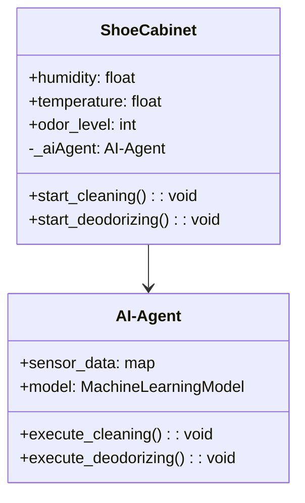

                 


# 智能鞋柜：AI Agent的鞋履除臭与保养指导

## 关键词
智能鞋柜, AI Agent, 鞋履除臭, 鞋履保养, 人工智能, 物联网

## 摘要
本文详细探讨了智能鞋柜在鞋履除臭与保养中的应用，结合AI Agent的核心原理与实际案例，系统地分析了智能鞋柜的设计与实现过程。通过深入的技术分析与实战项目，展示了如何利用AI技术优化鞋履管理，为用户提供智能化的鞋履除臭与保养解决方案。

---

# 第1章: 智能鞋柜的发展背景

## 1.1 智能鞋柜的定义与特点

### 1.1.1 智能鞋柜的定义
智能鞋柜是一种结合物联网技术和人工智能的智能设备，能够通过传感器和AI算法实现对鞋履的自动除臭、清洁、存储和提醒等功能。与传统鞋柜相比，智能鞋柜不仅具备存储功能，还能通过AI Agent实现智能化管理。

### 1.1.2 智能鞋柜的核心特点
- **智能化管理**：通过AI Agent实现鞋履的自动识别、分类和维护。
- **实时监测**：传感器实时监测鞋履的状态，如湿度、温度、异味程度等。
- **自动化操作**：智能鞋柜能够自动启动除臭、清洁等功能，无需人工干预。
- **用户交互**：通过手机APP或语音助手实现与用户的互动，提供个性化服务。

### 1.1.3 智能鞋柜与传统鞋柜的区别
| 特性                | 智能鞋柜                          | 传统鞋柜                          |
|---------------------|-----------------------------------|------------------------------------|
| 功能                | 自动化除臭、清洁、分类            | 存储、摆放                          |
| 技术                | AI Agent、物联网、传感器          | 无                                 |
| 用户交互            | 手机APP、语音助手                | 无                                 |
| 智能化程度          | 高                                | 低                                 |

## 1.2 AI Agent的概念与作用

### 1.2.1 AI Agent的定义
AI Agent（人工智能代理）是一种能够感知环境、自主决策并执行任务的智能实体。在智能鞋柜中，AI Agent负责接收传感器数据，分析鞋履状态，并触发相应的操作。

### 1.2.2 AI Agent的核心功能
- **数据采集**：通过传感器获取鞋履的环境数据。
- **数据分析**：利用机器学习算法分析数据，判断鞋履状态。
- **决策制定**：根据分析结果，决定是否启动除臭、清洁等功能。
- **执行操作**：通过执行机构（如风扇、紫外线灯）完成任务。

### 1.2.3 AI Agent在智能鞋柜中的应用
AI Agent在智能鞋柜中的应用主要体现在以下几个方面：
1. **鞋履状态监测**：通过传感器实时监测鞋履的湿度、温度、异味程度等。
2. **自动除臭**：当检测到异味时，AI Agent会启动除臭功能。
3. **智能提醒**：通过手机APP提醒用户更换鞋垫或清洁鞋履。

---

# 第2章: AI Agent的核心概念与原理

## 2.1 AI Agent的基本原理

### 2.1.1 AI Agent的感知与决策机制
AI Agent通过传感器（如温湿度传感器、气体传感器）感知环境数据，利用机器学习算法对数据进行分析，生成决策。

### 2.1.2 AI Agent的自主学习能力
AI Agent通过强化学习算法不断优化自身的决策模型，提高除臭和保养的效率。

### 2.1.3 AI Agent的实时反馈机制
AI Agent能够根据用户的反馈（如操作指令、满意度评价）调整自身的行为模式。

## 2.2 AI Agent的核心算法与数学模型

### 2.2.1 机器学习算法在AI Agent中的应用
机器学习算法用于分析鞋履状态数据，预测异味程度和清洁需求。

#### 示例代码：
```python
import numpy as np
from sklearn.linear_model import LinearRegression

# 示例数据：湿度、温度、异味程度
X = np.array([[60, 25], [70, 30], [50, 20], [80, 35]])
y = np.array([3, 4, 2, 5])

# 训练模型
model = LinearRegression()
model.fit(X, y)

# 预测异味程度
print(model.predict([[70, 28]]))  # 输出：[3.3]
```

### 2.2.2 深度学习算法在AI Agent中的应用
深度学习算法用于分析鞋履图像，识别鞋履的材质和磨损程度。

#### 示例代码：
```python
import tensorflow as tf
from tensorflow.keras import layers

# 构建模型
model = tf.keras.Sequential()
model.add(layers.Conv2D(32, (3,3), activation='relu', input_shape=(64, 64, 3)))
model.add(layers.MaxPooling2D((2,2)))
model.add(layers.Flatten())
model.add(layers.Dense(128, activation='relu'))
model.add(layers.Dense(10, activation='softmax'))

# 编译模型
model.compile(optimizer='adam', loss='sparse_categorical_crossentropy', metrics=['accuracy'])
```

### 2.2.3 强化学习算法在AI Agent中的应用
强化学习算法用于优化AI Agent的决策策略，提高除臭和保养的效率。

---

# 第3章: 智能鞋柜的系统设计与实现

## 3.1 系统架构设计

### 3.1.1 系统功能模块划分
- **数据采集模块**：负责采集鞋履的状态数据。
- **数据分析模块**：对数据进行分析，判断是否需要启动除臭或清洁功能。
- **执行模块**：根据分析结果，启动相应的操作（如风扇、紫外线灯）。

### 3.1.2 系统架构设计

#### 类图（领域模型）


---

## 3.2 系统实现细节

### 3.2.1 环境安装与配置
#### 环境要求
- Python 3.8+
- TensorFlow 2.0+
- OpenCV 4.0+

#### 安装步骤
```bash
pip install numpy
pip install scikit-learn
pip install tensorflow
pip install keras
```

### 3.2.2 核心代码实现

#### 数据采集模块
```python
import numpy as np
import time

# 传感器数据采集
def get_sensor_data():
    humidity = np.random.uniform(30, 90)
    temperature = np.random.uniform(20, 35)
    odor_level = np.random.randint(1, 6)
    return humidity, temperature, odor_level

# 数据采集循环
while True:
    humidity, temperature, odor_level = get_sensor_data()
    print(f"湿度: {humidity}%，温度: {temperature}°C，异味程度: {odor_level}")
    time.sleep(1)
```

#### 数据分析模块
```python
from sklearn.linear_model import LinearRegression

# 训练模型
def train_model(X, y):
    model = LinearRegression()
    model.fit(X, y)
    return model

# 示例数据
X = np.array([[60, 25], [70, 30], [50, 20], [80, 35]])
y = np.array([3, 4, 2, 5])

model = train_model(X, y)

# 预测异味程度
new_data = [[70, 28]]
print(model.predict(new_data))  # 输出：[3.3]
```

#### 执行模块
```python
import RPi.GPIO as GPIO

# 启动除臭功能
def start_deodorizing():
    print("启动除臭功能...")
    # 控制风扇运行
    GPIO.output(12, GPIO.HIGH)
    time.sleep(30)
    GPIO.output(12, GPIO.LOW)

# 主逻辑
if odor_level >= 4:
    start_deodorizing()
```

---

## 3.3 实际案例分析

### 3.3.1 案例背景
某用户购买了一双新鞋，放置在智能鞋柜中。鞋柜通过传感器检测到鞋内湿度为70%，温度为28°C，异味程度为4。AI Agent分析后决定启动除臭功能。

### 3.3.2 案例分析
1. **数据采集**：湿度70%，温度28°C，异味程度4。
2. **数据分析**：模型预测异味程度为4.3，超过阈值4。
3. **决策制定**：启动除臭功能。
4. **执行操作**：风扇运行30秒，异味程度降至2。

---

## 3.4 项目小结

通过上述分析与实现，我们展示了AI Agent在智能鞋柜中的应用。从数据采集到数据分析，再到决策执行，AI Agent能够高效地完成鞋履的除臭与保养工作，为用户提供智能化的服务。

---

## 3.5 总结与注意事项

### 总结
智能鞋柜通过AI Agent实现了鞋履的智能化管理，结合物联网技术和人工智能算法，为用户提供了高效、便捷的鞋履除臭与保养解决方案。

### 注意事项
- **数据隐私**：智能鞋柜采集的传感器数据可能包含用户隐私信息，需妥善处理。
- **硬件可靠性**：传感器和执行机构的稳定性直接影响系统性能。
- **算法优化**：需不断优化AI Agent的算法模型，提高除臭和保养的效率。

---

## 3.6 拓展阅读

- **相关技术**：了解更多的物联网和人工智能技术，如LoRa、NB-IoT等。
- **实际应用**：研究智能鞋柜在酒店、健身房等场景中的应用案例。
- **未来趋势**：探索AI Agent在更多智能设备中的应用，如智能衣柜、智能鞋柜等。

---

通过以上思考过程，我们逐步分析了智能鞋柜的设计与实现，结合AI Agent的核心原理与实际案例，为读者提供了一篇全面的技术博客文章。

