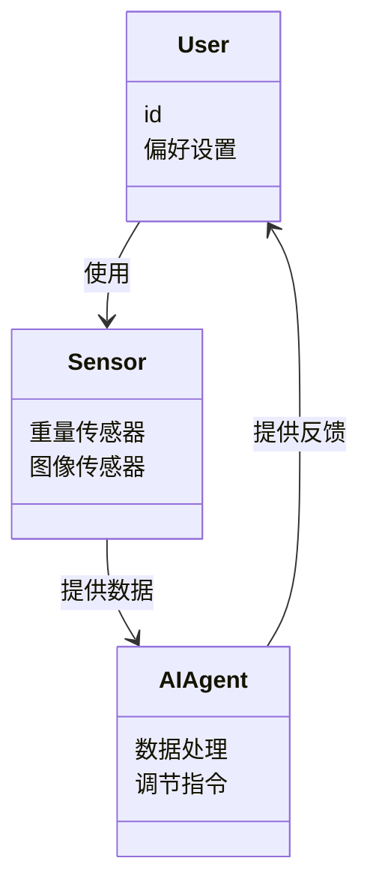
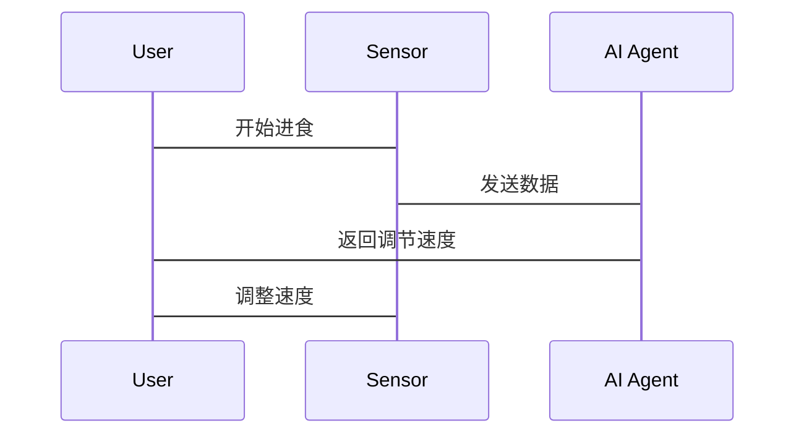

                 


# 智能餐盘：AI Agent的进食速度调节系统

> 关键词：AI Agent, 进食速度调节, 传感器技术, 数据分析, 智能健康

> 摘要：本文介绍了一种基于AI Agent的智能餐盘系统，该系统通过传感器和数据分析技术，实时监测用户的进食速度，并根据个体需求进行调节，以促进健康饮食。文章详细探讨了系统的背景、核心概念、算法原理、架构设计、项目实现及最佳实践。

---

## 第1章 智能餐盘的背景与概念

### 1.1 问题背景与目标
#### 1.1.1 传统进食方式的局限性
传统进食方式往往忽视个体差异，可能导致过快或过慢的进食速度，影响消化吸收和健康。

#### 1.1.2 进食速度对健康的影响
进食速度过快可能导致肥胖、消化不良等问题，而过慢可能影响营养吸收效率。

#### 1.1.3 AI技术在饮食健康中的应用潜力
AI技术可以通过数据分析和实时反馈优化进食速度，提供个性化的饮食建议。

### 1.2 智能餐盘的核心目标
#### 1.2.1 调节进食速度以促进健康
通过AI Agent实时监测并调整进食速度，帮助用户养成健康饮食习惯。

#### 1.2.2 提供个性化的饮食建议
基于用户的数据，提供定制化的饮食计划和建议。

#### 1.2.3 实现智能化的饮食管理
整合传感器和AI算法，实现智能化的饮食监控和管理。

### 1.3 问题解决路径
#### 1.3.1 AI Agent在进食速度调节中的作用
AI Agent通过实时数据处理和决策，实现进食速度的动态调整。

#### 1.3.2 传感器技术的应用
使用重量传感器、图像识别技术实时监测进食状态。

#### 1.3.3 数据分析与个性化建议
通过数据分析和机器学习模型，提供个性化的饮食建议。

### 1.4 智能餐盘的边界与外延
#### 1.4.1 功能边界
仅关注进食速度调节，不涉及食物种类和烹饪方式。

#### 1.4.2 与相关系统的区别
与智能厨房设备的区别在于专注于进食速度调节。

#### 1.4.3 核心要素组成
AI Agent、传感器、数据处理模块、用户反馈模块。

---

## 第2章 核心概念与联系

### 2.1 AI Agent的核心原理
#### 2.1.1 AI Agent的定义与特点
AI Agent是一种能够感知环境、自主决策并执行任务的智能实体。

#### 2.1.2 AI Agent在智能餐盘中的应用
通过实时数据处理和反馈，调节进食速度。

#### 2.1.3 AI Agent与进食速度调节的关系
AI Agent作为控制中心，协调传感器和执行机构完成速度调节。

### 2.2 进食速度调节系统的构成
#### 2.2.1 传感器模块
用于实时监测用户的进食行为。

#### 2.2.2 数据处理模块
对传感器数据进行分析和处理。

#### 2.2.3 AI算法模块
基于数据处理结果，生成调节指令。

#### 2.2.4 用户反馈模块
向用户传递调整后的进食速度和建议。

### 2.3 核心概念属性对比表
| 概念       | 属性               | 描述                                         |
|------------|--------------------|--------------------------------------------|
| AI Agent   | 智能性             | 能够自主决策和学习                         |
| 进食速度   | 可调节性           | 根据用户需求调整进食速度                   |
| 传感器     | 实时监测能力       | 感知用户进食状态和环境条件                 |

### 2.4 ER实体关系图
```mermaid
er
  actor(AI Agent)
  actor(传感器)
  actor(用户)
  sensor_data
  user_feedback
  eating_speed
  relation: AI Agent - 操作 - sensor_data
  relation: 传感器 - 感测 - user_feedback
  relation: eating_speed - 反馈 - AI Agent
```

---

## 第3章 算法原理

### 3.1 进食速度调节算法
#### 3.1.1 算法选择
基于时间序列的预测模型，使用LSTM进行预测。

#### 3.1.2 算法流程
1. 传感器收集数据。
2. 数据预处理。
3. LSTM模型预测。
4. 调节速度。

#### 3.1.3 算法实现
```python
import tensorflow as tf
from tensorflow.keras.layers import LSTM, Dense

model = tf.keras.Sequential([
    LSTM(64, input_shape=(timesteps, features)),
    Dense(1, activation='sigmoid')
])
model.compile(optimizer='adam', loss='binary_crossentropy')
```

### 3.2 数学模型
#### 3.2.1 LSTM模型
$$
f(t) = \text{LSTM}(x_t)
$$

#### 3.2.2 预测公式
$$
y_t = f(t)
$$

---

## 第4章 系统分析与架构设计

### 4.1 系统功能设计
#### 4.1.1 领域模型


### 4.2 系统架构设计


### 4.3 接口设计
#### 4.3.1 API接口
```json
{
  "api": "/api/v1/adjust_speed",
  "method": "POST",
  "params": {
    "user_id": "int",
    "speed": "float"
  }
}
```

#### 4.3.2 数据接口
```json
{
  "sensor_data": {
    "timestamp": "int",
    "weight": "float",
    "speed": "float"
  }
}
```

### 4.4 系统交互流程


---

## 第5章 项目实战

### 5.1 环境安装
#### 5.1.1 安装Python
```bash
python --version
```

#### 5.1.2 安装依赖
```bash
pip install numpy pandas tensorflow
```

### 5.2 核心代码实现
#### 5.2.1 传感器数据采集
```python
import serial

ser = serial.Serial('COM3', 9600)
data = ser.readline().decode()
```

#### 5.2.2 AI算法实现
```python
model.fit(X_train, y_train, epochs=10, batch_size=32)
```

### 5.3 案例分析
#### 5.3.1 数据分析
用户A的进食速度过快，模型预测并调整为适中速度。

#### 5.3.2 系统反馈
用户收到反馈，调整后的速度更健康。

---

## 第6章 最佳实践

### 6.1 小结
智能餐盘通过AI Agent和传感器技术，实现个性化进食速度调节，促进健康饮食。

### 6.2 注意事项
- 数据隐私保护
- 系统实时性保障
- 用户体验优化

### 6.3 拓展阅读
- 《深度学习实战》
- 《传感器原理与应用》

---

# 结语

通过本文的详细讲解，读者可以全面了解智能餐盘的设计与实现，从背景概念到算法架构，再到项目实战，逐步掌握相关技术要点。

