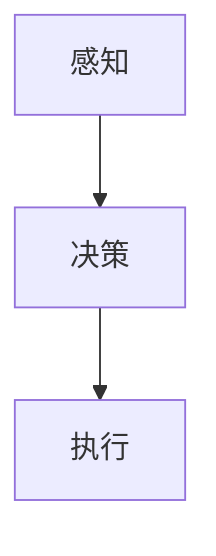
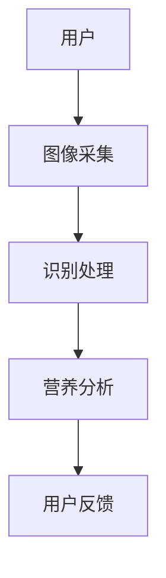

                 


```markdown
# 智能餐盘：AI Agent的食物识别与营养分析

> 关键词：AI Agent, 食物识别, 营养分析, 深度学习, 图像识别, 系统架构设计

> 摘要：智能餐盘利用AI Agent技术实现食物的自动识别与营养分析，通过深度学习算法提高准确性，结合系统架构设计实现高效处理。本文详细探讨了AI Agent的核心概念、食物识别技术、营养分析算法、系统架构设计以及项目实战，为读者提供全面的技术解析。

---

## 第一部分: AI Agent的核心概念与技术原理

### 第1章: AI Agent的核心概念

#### 1.1 AI Agent的定义与特点
- **AI Agent**：智能体，具备感知环境、决策和执行任务的能力。
- **特点**：
  - 智能性：能够理解并处理复杂任务。
  - 自主性：无需人工干预，自主完成任务。
  - 适应性：能根据环境变化调整策略。

#### 1.2 AI Agent的工作原理
- **感知层**：通过传感器或摄像头获取数据。
- **决策层**：利用算法进行数据分析，生成决策。
- **执行层**：根据决策执行操作。

#### 1.3 AI Agent的类型与应用场景
| 类型          | 描述                     | 应用场景               |
|---------------|--------------------------|-----------------------|
| 监督式AI Agent | 数据由人工标注，模型基于标记数据训练 | 适用于数据量大的情况，如图像分类 |
| 无监督式AI Agent | 无需标记数据，自动发现数据结构 | 适用于数据量小或未知的情况，如聚类分析 |
| 强化学习式AI Agent | 通过与环境互动学习 | 适用于需要策略优化的任务，如游戏AI |

### 第2章: AI Agent的核心概念

#### 2.1 AI Agent的核心概念
- **感知层**：主要通过视觉（图像识别）和听觉（语音识别）获取信息。
- **决策层**：基于感知数据，通过算法生成决策。
- **执行层**：根据决策执行动作，如移动机械臂或发出指令。

#### 2.2 AI Agent的工作流程


---

## 第二部分: 食物识别技术

### 第3章: 食物识别的核心算法

#### 3.1 图像识别技术
- **卷积神经网络（CNN）**：
  ```mermaid
  graph TD
      A[输入图像] --> B[卷积层] --> C[池化层] --> D[全连接层] --> E[输出类别]
  ```

#### 3.2 食物分类算法
- **迁移学习**：利用预训练模型（如ResNet）进行微调，提升分类准确率。
  ```python
  import tensorflow as tf
  model = tf.keras.Sequential([
      tf.keras.layers.Conv2D(32, (3,3), activation='relu', input_shape=(224, 224, 3)),
      tf.keras.layers.MaxPooling2D((2,2)),
      tf.keras.layers.Flatten(),
      tf.keras.layers.Dense(128, activation='relu'),
      tf.keras.layers.Dense(10, activation='softmax')
  ])
  ```

#### 3.3 算法优化与挑战
- **数据增强**：通过旋转、翻转等操作增加数据多样性。
- **模型调优**：使用交叉验证和早停法防止过拟合。

---

## 第三部分: 营养分析与健康评估

### 第4章: 营养分析的核心算法

#### 4.1 食物成分分析
- **数据库查询**：建立食物成分数据库，通过识别结果查询营养信息。

#### 4.2 营养均衡指数模型
- **公式**：$$健康指数 = \sum (营养成分比例 \times 权重)$$
- **实现**：
  ```python
  def calculate_health_index(nutrients):
      weights = {'蛋白质': 0.3, '脂肪': 0.3, '碳水化合物': 0.4}
      return sum(nutrient * weights[nutrient] for nutrient in nutrients)
  ```

#### 4.3 个性化健康建议
- 基于健康指数，生成饮食建议，如增加蛋白质摄入。

---

## 第四部分: 系统架构设计

### 第5章: 系统架构设计

#### 5.1 系统功能设计
- **功能模块**：
  - 图像采集模块
  - 识别处理模块
  - 营养分析模块
  - 用户界面模块

#### 5.2 系统架构图


---

## 第五部分: 项目实战

### 第6章: 项目实战

#### 6.1 环境安装
- **工具**：Python、TensorFlow、OpenCV
- **安装命令**：
  ```bash
  pip install tensorflow opencv-python
  ```

#### 6.2 核心代码实现
- **图像识别代码**：
  ```python
  import cv2
  def detect_food(image):
      # 使用预训练模型进行分类
      pass
  ```

#### 6.3 案例分析
- **案例1**：识别并分析三明治的营养成分。
- **案例2**：优化模型参数，提高识别准确率。

---

## 第六部分: 总结与展望

### 第7章: 总结与展望

#### 7.1 本章小结
- AI Agent在智能餐盘中的应用前景广阔，结合深度学习算法，可以实现高效的 foods识别与营养分析。

#### 7.2 未来展望
- **技术优化**：探索更高效的算法，如轻量级模型。
- **应用场景扩展**：从个人使用扩展到餐厅、健身领域。

#### 7.3 注意事项
- 数据隐私保护
- 模型泛化能力

#### 7.4 拓展阅读
- 推荐书籍：《深度学习入门》、《Python机器学习实战》

---

通过以上详细的技术解析和实例分析，智能餐盘的实现过程得以全面展示，未来随着技术进步，其应用将更加广泛和智能化。
```

