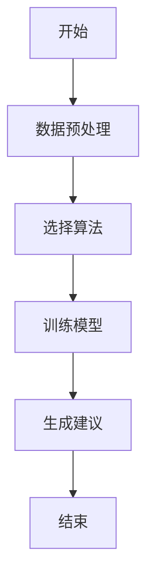
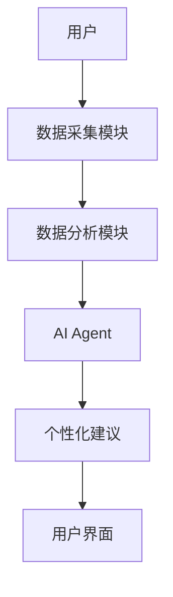

                 


# 智能餐盘：AI Agent的饮食均衡建议系统

> 关键词：智能餐盘、AI Agent、饮食均衡、推荐系统、算法原理、系统架构、项目实战

> 摘要：本文将介绍智能餐盘系统的设计与实现，通过AI Agent提供个性化的饮食均衡建议。文章将从背景介绍、核心概念、算法原理、系统架构设计、项目实战等多个方面进行详细阐述，帮助读者全面理解该系统的实现过程和应用价值。

---

# 第一部分: 智能餐盘系统背景与核心概念

# 第1章: 背景介绍

## 1.1 问题背景

### 1.1.1 当前饮食问题的现状
现代人生活节奏快，饮食习惯不规律，导致营养摄入不均衡。很多人因为忙碌而忽视了饮食的健康性，长期下去可能引发多种健康问题。

### 1.1.2 饮食不均衡带来的健康问题
饮食不均衡可能导致肥胖、糖尿病、高血压等慢性疾病。这些问题不仅影响个人健康，还给社会医疗系统带来巨大压力。

### 1.1.3 AI技术在饮食健康领域的应用潜力
AI技术可以分析用户的饮食习惯，提供个性化的建议，帮助用户实现饮食均衡。AI Agent可以通过学习用户的饮食数据，推荐合适的餐点和营养搭配。

## 1.2 问题描述

### 1.2.1 饮食建议系统的需求分析
用户需要一个能够实时监测饮食习惯、提供科学建议的系统。系统需要考虑用户的饮食偏好、营养需求和健康状况。

### 1.2.2 用户饮食习惯的多样性
每个人的饮食习惯和营养需求不同，系统需要具备个性化推荐的能力。例如，运动员和普通办公人员的饮食建议会有所不同。

### 1.2.3 系统目标与功能定位
系统的目标是帮助用户实现饮食均衡，预防慢性疾病。主要功能包括数据采集、分析、个性化建议和实时反馈。

## 1.3 问题解决

### 1.3.1 AI Agent在饮食建议中的作用
AI Agent可以通过分析用户的饮食数据，提供个性化的建议。它可以学习用户的饮食偏好，推荐合适的餐点和营养搭配。

### 1.3.2 智能餐盘的设计思路
智能餐盘可以通过内置传感器监测用户的饮食习惯，结合AI算法提供科学的饮食建议。系统需要整合用户的饮食数据，分析营养摄入情况，并推荐合理的饮食计划。

### 1.3.3 系统实现的关键技术
- 数据采集技术：通过传感器采集用户的饮食数据。
- AI算法：利用机器学习模型分析数据，提供个性化建议。
- 交互设计：设计友好的用户界面，方便用户使用。

## 1.4 系统的边界与外延

### 1.4.1 系统功能的边界
系统的主要功能包括数据采集、分析、建议生成和反馈。系统不涉及实际烹饪或配送功能。

### 1.4.2 系统的外延与扩展性
系统可以通过扩展功能支持更多健康指标，例如结合运动数据提供更全面的健康建议。

### 1.4.3 系统与其他系统的交互
系统可以与其他健康管理系统（如智能手表、健康app）集成，提供更全面的健康监测服务。

## 1.5 核心概念与组成

### 1.5.1 AI Agent的基本概念
AI Agent是一种能够感知环境、自主决策的智能体。在智能餐盘系统中，AI Agent负责分析用户的饮食数据，提供个性化建议。

### 1.5.2 饮食均衡的核心要素
饮食均衡需要考虑热量、蛋白质、碳水化合物、脂肪、维生素和矿物质的摄入量。不同人群的饮食建议会有所不同。

### 1.5.3 系统的整体架构
系统包括数据采集模块、AI算法模块、用户界面模块和反馈模块。各模块协同工作，为用户提供个性化的饮食建议。

# 第2章: 核心概念与联系

## 2.1 AI Agent的核心原理

### 2.1.1 AI Agent的定义与分类
AI Agent可以分为简单反射型、基于模型的反应型和完全自主型。在智能餐盘系统中，AI Agent主要负责数据分析和建议生成。

### 2.1.2 AI Agent的基本工作原理
AI Agent通过感知环境、分析数据、制定决策并执行操作。在饮食建议系统中，AI Agent通过分析用户的饮食数据，生成个性化的建议。

### 2.1.3 AI Agent在饮食建议中的具体应用
AI Agent可以分析用户的饮食记录，识别营养摄入不足或过剩的情况，并推荐合适的餐点和营养搭配。

## 2.2 饮食均衡的核心要素

### 2.2.1 饮食均衡的定义与标准
饮食均衡是指摄入的各种营养素比例合理，满足身体需求。不同人群的饮食标准有所不同。

### 2.2.2 营养学的基本原理
人体需要六大营养素：碳水化合物、蛋白质、脂肪、维生素、矿物质和水。AI Agent需要根据这些营养素的摄入情况，提供饮食建议。

### 2.2.3 饮食习惯与健康的关系
良好的饮食习惯可以预防疾病，提高生活质量。AI Agent可以帮助用户养成良好的饮食习惯。

## 2.3 AI Agent与饮食均衡的关系

### 2.3.1 AI Agent如何帮助实现饮食均衡
AI Agent通过分析用户的饮食数据，识别营养摄入问题，并推荐合适的餐点和营养搭配。

### 2.3.2 系统的输入与输出
输入：用户的饮食数据（如食物种类、摄入量）。
输出：个性化的饮食建议（如推荐的餐点、营养补充建议）。

### 2.3.3 系统的核心算法与模型
系统使用机器学习算法，如协同过滤和聚类分析，分析用户的饮食数据，生成个性化建议。

## 2.4 核心概念对比分析

### 2.4.1 AI Agent与传统算法的对比
AI Agent具有自主决策能力，能够根据环境变化调整策略。传统算法则需要手动调整参数。

### 2.4.2 饮食均衡建议系统与其他健康管理系统的关系
饮食均衡建议系统可以与智能手表、健康app等系统集成，提供更全面的健康监测服务。

### 2.4.3 系统的核心优势与不足
优势：个性化建议、实时反馈。
不足：需要依赖用户准确的饮食记录，系统初期需要大量数据进行训练。

## 2.5 ER实体关系图

```mermaid
er
  actor: 用户
  agent: AI Agent
  meal: 餐饮数据
  nutrition: 营养信息
  rule: 均衡规则
  actor --> agent: 提供输入
  agent --> meal: 分析餐饮数据
  meal --> nutrition: 提供营养信息
  nutrition --> rule: 应用均衡规则
  rule --> agent: 生成建议
  agent --> actor: 提供饮食建议
```

---

# 第3章: 算法原理

## 3.1 推荐算法的原理与实现

### 3.1.1 协同过滤算法
协同过滤算法通过分析用户的饮食偏好，找到相似的用户群体，推荐他们常选择的餐点。

### 3.1.2 聚类分析算法
聚类分析算法将用户的饮食数据分成不同的类别，帮助系统更好地理解用户的饮食习惯。

### 3.1.3 深度学习算法
深度学习算法可以分析用户的饮食数据，提取深层次的特征，生成个性化的建议。

## 3.2 算法的流程图



## 3.3 算法的数学模型

### 3.3.1 协同过滤算法的数学模型

$$相似度计算：sim(i,j) = \frac{\sum_{k} r_{ik} r_{jk}}{\sqrt{\sum_{k} r_{ik}^2} \sqrt{\sum_{k} r_{jk}^2}}$$

### 3.3.2 聚类分析算法的数学模型

$$K-均值聚类：距离计算公式：d(x,y) = \sqrt{\sum_{i}(x_i - y_i)^2}$$

---

# 第4章: 系统分析与架构设计

## 4.1 系统功能设计

### 4.1.1 数据采集模块
数据采集模块负责收集用户的饮食数据，包括食物种类、摄入量等。

### 4.1.2 数据分析模块
数据分析模块使用机器学习算法，分析用户的饮食数据，生成个性化的建议。

## 4.2 系统架构设计



## 4.3 系统接口设计

### 4.3.1 数据采集接口
接口用于收集用户的饮食数据，格式为JSON。

### 4.3.2 数据分析接口
接口用于调用机器学习算法，分析数据并生成建议。

## 4.4 系统交互流程图

```mermaid
sequenceDiagram
    actor 用户
    agent AI Agent
    用户-> 数据采集模块: 提供饮食数据
    数据采集模块-> 数据分析模块: 分析数据
    数据分析模块-> AI Agent: 生成建议
    AI Agent-> 用户: 提供饮食建议
```

---

# 第5章: 项目实战

## 5.1 环境安装

### 5.1.1 Python环境安装
安装Python 3.8及以上版本，安装必要的库，如numpy、pandas、scikit-learn。

### 5.1.2 数据库安装
使用MySQL或MongoDB存储用户的饮食数据。

## 5.2 系统核心实现

### 5.2.1 数据预处理
读取用户饮食数据，清洗和归一化处理。

### 5.2.2 模型训练
使用协同过滤算法训练模型，生成用户的饮食偏好。

### 5.2.3 个性化建议生成
根据模型预测结果，生成个性化的饮食建议。

## 5.3 代码示例

```python
import numpy as np
from sklearn.metrics.pairwise import cosine_similarity

# 示例数据
users = ['用户1', '用户2', '用户3']
meals = ['早餐', '午餐', '晚餐']

# 计算相似度矩阵
def compute_similarity(matrix):
    return cosine_similarity(matrix)

# 示例计算
matrix = np.array([[1, 2, 3], [4, 5, 6], [7, 8, 9]])
similarity_matrix = compute_similarity(matrix)
print(similarity_matrix)
```

---

# 第6章: 总结与展望

## 6.1 总结
智能餐盘系统通过AI Agent提供个性化的饮食建议，帮助用户实现饮食均衡。系统的核心算法包括协同过滤和聚类分析，能够根据用户的饮食数据生成科学的建议。

## 6.2 展望
未来，系统可以扩展更多功能，例如结合运动数据提供更全面的健康建议。同时，系统可以通过优化算法提高推荐的准确性。

---

通过以上目录，您可以逐步展开每一章的内容，撰写一篇详细的技术博客文章。希望这篇博客能够帮助读者全面理解智能餐盘系统的实现过程和应用价值。

