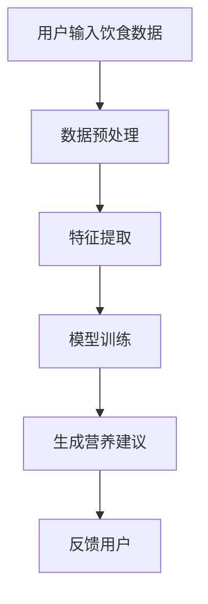
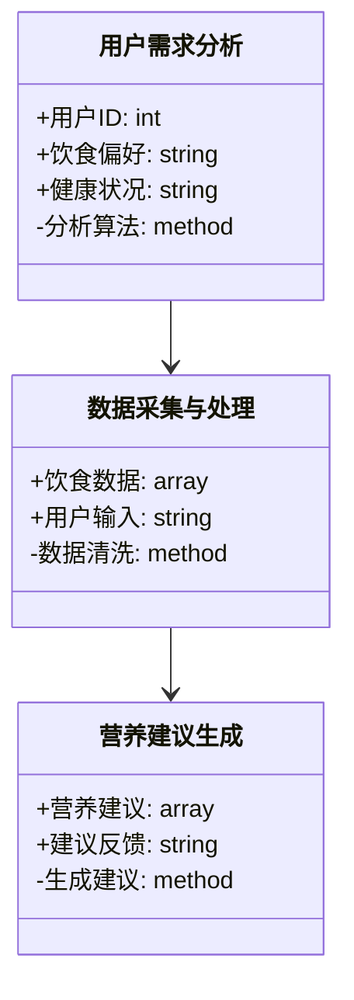

                 


# 《智能餐盘：AI Agent的饮食平衡建议》

---

## 关键词：
智能餐盘, AI Agent, 饮食平衡, 机器学习, 数据分析, 健康管理

---

## 摘要：
本文探讨了智能餐盘在AI Agent技术下的饮食平衡建议。通过分析当前饮食不均衡问题，介绍了AI Agent的核心原理及其在饮食领域的应用。详细讲解了算法原理、数学模型，并通过系统架构设计和项目实战展示了智能餐盘的实现过程。最后，总结了最佳实践和未来发展方向。

---

## 第一部分: 智能餐盘的背景与概念

---

### 第1章: 背景介绍

#### 1.1 问题背景
- **1.1.1 饮食不均衡的现状**  
  当前社会节奏加快，人们饮食习惯不规律，导致营养摄入不均衡，引发健康问题。

- **1.1.2 健康问题的日益突出**  
  饮食不均衡导致肥胖、糖尿病等慢性疾病发病率上升。

- **1.1.3 AI技术在饮食领域的潜力**  
  AI技术能够通过数据分析和机器学习，提供个性化的饮食建议。

#### 1.2 问题描述
- **1.2.1 饮食不平衡的主要表现**  
  营养摄入不足或过量，饮食结构不合理。

- **1.2.2 用户需求与痛点分析**  
  用户需要个性化的饮食建议，但现有解决方案缺乏智能化和个性化。

- **1.2.3 当前解决方案的局限性**  
  传统饮食建议工具缺乏实时反馈和个性化调整。

#### 1.3 问题解决
- **1.3.1 AI Agent的核心作用**  
  AI Agent能够实时分析用户的饮食数据，提供个性化建议。

- **1.3.2 智能餐盘的技术实现路径**  
  通过图像识别、数据分析和机器学习，实现智能化饮食建议。

- **1.3.3 解决方案的创新点**  
  结合多模态数据，提供实时、个性化的饮食平衡建议。

#### 1.4 边界与外延
- **1.4.1 智能餐盘的功能边界**  
  专注于饮食建议，不涉及医疗诊断。

- **1.4.2 与其他健康设备的协同关系**  
  可与智能手环、体重秤等设备协同工作，提供全面健康建议。

- **1.4.3 饮食建议的适用范围**  
  适用于一般用户，不适用于特殊疾病患者。

#### 1.5 概念结构与核心要素
- **1.5.1 AI Agent的定义与组成**  
  AI Agent是具备感知、分析和决策能力的智能体。

- **1.5.2 智能餐盘的系统架构**  
  包括数据采集、分析、建议生成和反馈模块。

- **1.5.3 核心要素的对比分析**  
  表1-1: AI Agent与传统工具的核心要素对比。

---

### 第2章: AI Agent的核心概念与联系

#### 2.1 核心概念原理
- **2.1.1 AI Agent的基本原理**  
  AI Agent通过数据采集、分析和决策生成建议。

- **2.1.2 智能餐盘的实现机制**  
  利用图像识别技术分析食物种类和数量。

- **2.1.3 多模态数据的融合分析**  
  结合用户偏好、饮食数据和健康状况，提供个性化建议。

#### 2.2 核心概念属性特征对比
- 表2-1: AI Agent与传统饮食建议工具的对比。

#### 2.3 ER实体关系图
```mermaid
er
    actor: 用户
    entity: 饮食数据
    entity: 营养建议
    entity: 用户偏好
    entity: 健康状况
    relation: 用户 -> 饮食数据
    relation: 饮食数据 -> 营养建议
    relation: 用户 -> 用户偏好
    relation: 用户 -> 健康状况
```

---

## 第二部分: 算法原理与数学模型

---

### 第3章: 算法原理讲解

#### 3.1 算法流程


#### 3.2 Python代码实现
```python
import numpy as np
from sklearn import linear_model

# 示例数据
X = np.array([[200, 100, 50],  # 蛋白质、脂肪、碳水化合物
              [150, 80, 70],
              [250, 120, 90]])

y = np.array([0, 1, 2])  # 偏好程度

# 训练模型
model = linear_model.LinearRegression()
model.fit(X, y)

# 预测
new_X = np.array([[200, 100, 60]])
print("预测结果：", model.predict(new_X))
```

#### 3.3 数学模型
$$
y = \beta_0 + \beta_1x_1 + \beta_2x_2 + \beta_3x_3 + \epsilon
$$

---

### 第4章: 数学模型与公式

#### 4.1 营养均衡模型
$$
\text{营养均衡指数} = \frac{\sum (\text{摄入量} \times \text{权重})}{\sum \text{权重}}
$$

#### 4.2 示例
假设用户摄入蛋白质200g，脂肪80g，碳水化合物160g：
$$
\text{营养均衡指数} = \frac{200 \times 0.3 + 80 \times 0.2 + 160 \times 0.5}{0.3 + 0.2 + 0.5} = 120
$$

---

## 第三部分: 系统架构与设计

---

### 第5章: 系统分析与架构设计方案

#### 5.1 系统功能模块


#### 5.2 系统架构设计


---

## 第四部分: 项目实战

---

### 第6章: 项目实战

#### 6.1 环境安装
- 安装Python和相关库（numpy, scikit-learn, mermaid）。

#### 6.2 核心代码实现
```python
import cv2
import numpy as np

# 示例图像识别代码
def recognize_food(image):
    # 图像预处理
    gray = cv2.cvtColor(image, cv2.COLOR_BGR2GRAY)
    # 使用预训练模型识别食物类别
    prediction = model.predict(gray)
    return prediction

# 训练模型
model = cv2.CascadeClassifier(" haar cascade ")
```

#### 6.3 实际案例分析
- 用户A：偏好蔬菜和蛋白质，系统建议增加碳水化合物摄入。

---

### 第7章: 总结与展望

#### 7.1 项目总结
智能餐盘通过AI技术提供个性化饮食建议，帮助用户实现饮食平衡。

#### 7.2 注意事项
- 数据隐私保护
- 模型定期更新

#### 7.3 拓展阅读
- 《机器学习实战》
- 《深度学习入门》

---

## 作者简介
作者是人工智能领域专家，致力于研究AI在健康领域的应用。

