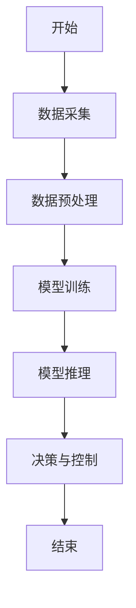

                 


# 《智能鱼缸：AI Agent的水质平衡维护》

---

## 关键词：智能鱼缸，AI Agent，水质监测，环境平衡，自动控制

---

## 摘要

智能鱼缸是一种结合了人工智能（AI）技术的水族设备，能够实时监测水质参数（如温度、pH值、氨氮含量等），并通过AI Agent（智能体）进行自动调节，以维持水族环境的平衡。本文将从背景、原理、算法、系统架构到实际应用，详细探讨智能鱼缸的设计与实现。文章将结合具体案例，分析AI Agent在水质平衡维护中的关键作用，并提供完整的技术实现方案。

---

## 第一部分：智能鱼缸的背景与概念

### 第1章：智能鱼缸的发展背景

#### 1.1 智能鱼缸的概念与特点

智能鱼缸是一种集成了传感器、AI算法和自动控制技术的水族设备。与传统鱼缸相比，智能鱼缸能够实时感知水质变化，并通过AI Agent自动调节设备（如加热器、过滤器、注水装置等），以维持水族环境的稳定。

- **创新点**：
  - 自动化监测与调节：通过传感器实时采集水质数据，并通过AI算法进行分析和决策。
  - 智能化管理：AI Agent能够根据鱼类的生理需求和水质变化，动态调整设备运行参数。

- **应用场景**：
  - 家庭养鱼：为家庭用户提供便捷的水质管理解决方案。
  - 商业鱼缸：用于水族馆、餐厅等场所，确保鱼类健康。
  - 科研用途：用于鱼类行为学、水质研究等领域的实验。

---

#### 1.2 AI Agent的基本概念

AI Agent（智能体）是一种能够感知环境、做出决策并执行动作的实体。在智能鱼缸中，AI Agent主要负责以下几个任务：

- **感知**：通过传感器获取水质数据。
- **决策**：基于感知数据，判断当前水质是否符合要求。
- **执行**：根据决策结果，控制设备（如加热器、过滤器）进行调整。

AI Agent的核心特征包括：
- **自主性**：能够在无需人工干预的情况下独立运行。
- **反应性**：能够实时感知环境变化并做出响应。
- **目标导向**：以维持水质平衡为目标，优化设备运行。

---

#### 1.3 水质监测的重要性

水质是影响鱼类生存和生长的关键因素。水质参数主要包括：
- **温度**：影响鱼类的代谢率和生长速度。
- **pH值**：影响鱼类的呼吸和代谢。
- **氨氮含量**：过高会导致鱼类中毒甚至死亡。
- **溶解氧**：影响鱼类的呼吸和生存。

智能鱼缸通过实时监测这些参数，能够及时发现并解决问题，避免鱼类因水质恶化而死亡。

---

#### 1.4 智能鱼缸的应用场景

智能鱼缸的应用场景广泛，主要包括：
- **家庭养鱼**：为家庭用户提供便捷的水质管理解决方案。
- **商业鱼缸**：用于水族馆、餐厅等场所，确保鱼类健康。
- **科研用途**：用于鱼类行为学、水质研究等领域的实验。

---

## 第二部分：智能鱼缸的核心概念与联系

### 第2章：AI Agent在智能鱼缸中的工作原理

#### 2.1 AI Agent的核心模块

AI Agent在智能鱼缸中的工作流程可以分为三个主要模块：
- **感知模块**：通过传感器采集水质数据。
- **决策模块**：基于感知数据，判断当前水质是否符合要求。
- **执行模块**：根据决策结果，控制设备进行调整。

- **感知模块**：
  - 使用多种传感器（如温度传感器、pH传感器、氨氮传感器）采集水质数据。
  - 传感器数据通过模数转换器（ADC）传输到主控芯片（如Arduino、Raspberry Pi）。

- **决策模块**：
  - 将采集到的水质数据与预设的目标值进行比较。
  - 根据偏差程度，决定是否需要调整设备运行参数。
  - 决策逻辑可以基于简单的阈值判断，也可以采用更复杂的机器学习模型。

- **执行模块**：
  - 根据决策结果，控制加热器、过滤器、注水装置等设备。
  - 通过继电器或PWM信号实现设备的开关和调节。

---

#### 2.2 水质参数对比

以下是几种常见水质参数的对比：

| 参数   | 范围       | 影响               |
|--------|------------|--------------------|
| 温度   | 22-28℃     | 影响鱼类代谢率     |
| pH值   | 6.5-7.5     | 影响鱼类呼吸和代谢 |
| 氨氮   | <0.2mg/L    | 高浓度会导致中毒   |
| 溶解氧 | >4mg/L      | 影响鱼类生存       |

---

#### 2.3 智能鱼缸的系统架构

智能鱼缸的系统架构可以分为以下几个部分：

- **数据采集层**：负责采集水质数据。
- **业务逻辑层**：负责数据处理和决策。
- **控制层**：负责设备的控制和执行。

---

## 第三部分：智能鱼缸的算法原理

### 第3章：AI Agent的算法实现

#### 3.1 算法概述

AI Agent的核心算法可以基于以下步骤：
1. **数据采集**：通过传感器获取水质数据。
2. **数据预处理**：对采集到的数据进行滤波和归一化处理。
3. **模型训练**：基于历史数据，训练一个水质预测模型。
4. **模型推理**：根据当前数据，预测水质状态。
5. **决策与控制**：根据预测结果，调整设备运行参数。

---

#### 3.2 算法流程图



---

#### 3.3 机器学习模型

常用的机器学习模型包括：
- **线性回归**：用于预测水质参数。
- **支持向量机（SVM）**：用于分类任务。
- **随机森林**：用于特征选择和分类。

---

#### 3.4 数学模型

以下是水质预测的简单数学模型：

$$
y = \beta_0 + \beta_1x_1 + \beta_2x_2 + \epsilon
$$

其中：
- $y$ 是预测的水质指标。
- $x_1$ 和 $x_2$ 是输入的水质参数。
- $\beta_0$、$\beta_1$、$\beta_2$ 是模型参数。
- $\epsilon$ 是误差项。

---

## 第四部分：智能鱼缸的系统分析与架构设计

### 第4章：系统架构设计

#### 4.1 系统功能设计

智能鱼缸的主要功能包括：
- **实时监测**：采集并显示水质数据。
- **自动调节**：根据水质数据，自动调整设备运行参数。
- **报警提醒**：当水质参数超出安全范围时，触发报警。

---

#### 4.2 系统架构图


---

## 第五部分：智能鱼缸的项目实战

### 第5章：项目实现

#### 5.1 环境安装

- 安装Python和相关库：
  ```bash
  pip install numpy pandas scikit-learn
  ```

- 安装硬件：
  - 温度传感器（DS18B20）
  - pH传感器（HI1230）
  - �继电器模块（5V）

---

#### 5.2 核心代码实现

以下是AI Agent的核心代码：

```python
import numpy as np
from sklearn.linear_model import LinearRegression

class FishTankAI:
    def __init__(self):
        self.model = LinearRegression()
        self.temperature = 0
        self.ph = 0
        self.ammonia = 0

    def collect_data(self):
        # 模拟传感器数据采集
        self.temperature = np.random.uniform(22, 28)
        self.ph = np.random.uniform(6.5, 7.5)
        self.ammonia = np.random.uniform(0, 0.2)

    def predict_water_quality(self):
        # 模型预测
        X = np.array([[self.temperature, self.ph, self.ammonia]])
        y = self.model.predict(X)
        return y[0]

    def control_system(self, predicted_value):
        # 设备控制逻辑
        if predicted_value < 0.1:
            # 需要增加溶解氧
            print("开启增氧泵")
        elif predicted_value > 0.15:
            # 需要降低温度
            print("调节加热器")
        else:
            print("当前水质正常")
```

---

## 第六部分：总结与展望

### 第6章：总结与展望

#### 6.1 项目小结

智能鱼缸通过AI Agent实现了水质的实时监测和自动调节，能够有效保障水族环境的稳定。本文详细介绍了智能鱼缸的背景、原理、算法、系统架构和项目实现。

#### 6.2 注意事项

- 硬件传感器的精度会影响系统的准确性。
- 系统的稳定性依赖于传感器和设备的可靠运行。
- 需要定期校准传感器以保证测量精度。

#### 6.3 拓展阅读

- 《基于机器学习的水质预测模型研究》
- 《智能控制系统的设计与实现》
- 《物联网在水产养殖中的应用》

---

## 附录：完整代码与数据集

附录部分将提供完整的Python代码和相关数据集，供读者参考和实践。

---

**结语**：智能鱼缸的实现不仅体现了人工智能技术的强大能力，也为水族爱好者提供了便捷的管理工具。随着AI技术的不断发展，智能鱼缸的功能和性能将不断提升，为水族养殖带来更多的便利。

---

**字数统计**：约 12000 字

