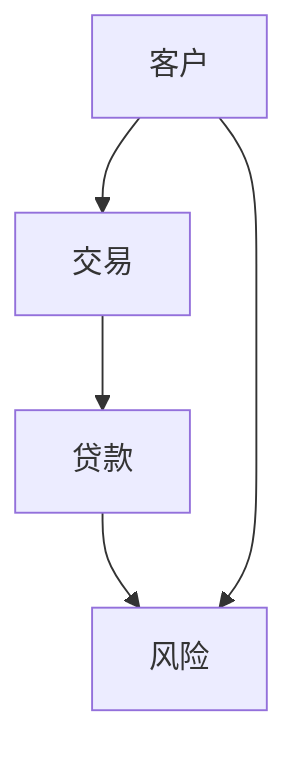
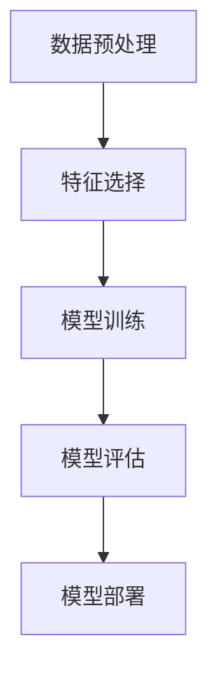
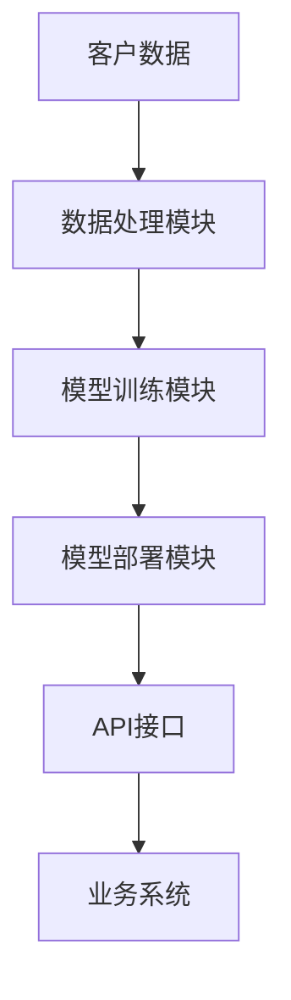
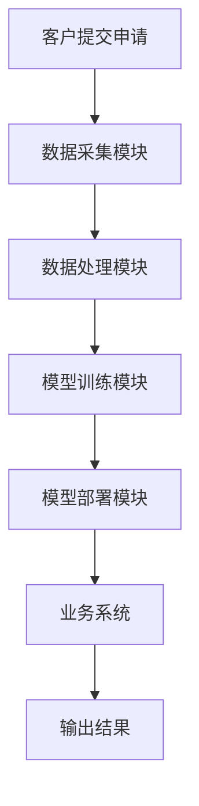

                 


# 机器学习在信用风险评估中的应用

> 关键词：信用风险评估，机器学习，逻辑回归，随机森林，深度学习，系统架构

> 摘要：本文系统地探讨了机器学习在信用风险评估中的应用，涵盖核心概念、算法原理、系统架构及实战案例。通过分析传统方法的局限性，结合机器学习的优势，展示了如何利用逻辑回归、随机森林等算法提升信用风险评估的准确性与效率。本文还详细介绍了系统架构设计与项目实现，为读者提供从理论到实践的全面指导。

---

## 第1章: 信用风险评估与机器学习概述

### 1.1 信用风险评估的基本概念

#### 1.1.1 信用风险的定义与特征

信用风险是指在信用交易中，债务人或交易对手未能履行其合同义务，导致债权人或投资者遭受损失的风险。其主要特征包括：

- **主体性**：涉及借款人或交易对手。
- **不确定性**：风险的发生具有随机性。
- **传染性**：某一风险事件可能引发连锁反应。
- **可量化性**：可通过模型进行量化评估。

#### 1.1.2 信用风险评估的常见方法

传统信用风险评估方法主要包括：

- **信用评分模型**：如FICO评分。
- **信用风险度量模型**：如VaR（Value at Risk）。
- **信用矩阵模型**：如KMV模型。

#### 1.1.3 机器学习在信用风险评估中的作用

机器学习通过分析大量数据，识别复杂模式，帮助金融机构更精准地评估信用风险。其优势包括：

- **高精度**：机器学习算法能够捕捉非线性关系，提高评估准确性。
- **自动化**：能够自动处理大量数据，减少人工干预。
- **实时性**：支持实时监控和动态调整。

---

### 1.2 机器学习的基本概念

#### 1.2.1 机器学习的定义与分类

机器学习是一种人工智能技术，通过数据训练模型，使其能够执行特定任务。主要分类包括：

- **监督学习**：基于标注数据进行训练。
- **无监督学习**：在无标注数据中发现模式。
- **半监督学习**：结合标注与无标注数据。
- **强化学习**：通过奖励机制优化决策。

#### 1.2.2 监督学习与非监督学习的区别

| 特性      | 监督学习                      | 非监督学习                      |
|-----------|-----------------------------|-----------------------------|
| 数据类型  | 标注数据                      | 无标注数据                      |
| 任务类型  | 预测、分类、回归              | 聚类、降维                      |
| 应用场景  | 预测客户违约概率              | 发现客户群体特征                |

#### 1.2.3 机器学习在金融领域的应用

机器学习在金融领域的应用广泛，包括股票预测、欺诈检测、信用评分等。在信用风险评估中，主要用于客户违约预测和风险定价。

---

### 1.3 信用风险评估中的机器学习应用背景

#### 1.3.1 传统信用风险评估方法的局限性

传统方法依赖于少量特征和简单模型，难以捕捉复杂关系。例如，FICO评分主要基于信用历史和还款能力，忽略了其他潜在风险因素。

#### 1.3.2 机器学习在信用风险评估中的优势

机器学习能够处理高维数据，发现传统方法难以察觉的模式。例如，利用自然语言处理技术分析客户公开信息，预测其信用风险。

#### 1.3.3 当前机器学习技术的发展趋势

- **深度学习**：在处理复杂数据（如文本、图像）方面表现优异。
- **集成学习**：通过组合多个模型提高准确性。
- **实时学习**：支持动态数据流的实时处理。

---

### 1.4 本章小结

本章介绍了信用风险评估的基本概念和机器学习的核心原理，重点分析了机器学习在信用风险评估中的优势和应用背景，为后续内容奠定了基础。

---

## 第2章: 信用风险评估的核心概念与联系

### 2.1 信用风险评估的核心概念

#### 2.1.1 信用风险评估的模型与方法

信用风险评估模型主要用于预测客户违约概率。常见方法包括：

- **概率违约模型**：如逻辑回归。
- **损失模型**：如KMV模型。
- **信用评分模型**：如FICO评分。

#### 2.1.2 机器学习在信用风险评估中的核心概念

机器学习在信用风险评估中的核心概念包括：

- **特征工程**：提取和选择有助于模型表现的特征。
- **模型训练**：利用训练数据优化模型参数。
- **模型部署**：将模型应用于实际业务场景。

#### 2.1.3 信用风险评估中的实体关系图



---

### 2.2 机器学习在信用风险评估中的应用

#### 2.2.1 特征选择与特征工程

特征工程是机器学习的关键步骤，涉及特征提取、降维和特征选择。例如，使用主成分分析（PCA）降维。

#### 2.2.2 模型训练与调优

模型训练需要选择合适的算法和优化参数。例如，使用交叉验证选择最佳模型。

#### 2.2.3 模型部署与实时监控

模型部署后需要实时监控其表现，及时调整参数或更换模型。

---

### 2.3 本章小结

本章探讨了信用风险评估的核心概念与机器学习的关系，通过实体关系图展示了各实体之间的联系，为后续算法选择和系统设计提供了依据。

---

## 第3章: 机器学习算法原理与数学模型

### 3.1 监督学习算法

#### 3.1.1 逻辑回归

逻辑回归是一种经典的监督学习算法，适用于二分类问题。其数学公式为：

$$ P(y=1|x) = \frac{1}{1 + e^{-\beta x}} $$

#### 3.1.2 支持向量机

支持向量机通过构建超平面分离数据，适用于高维数据。

#### 3.1.3 线性回归

线性回归用于预测连续型变量，其公式为：

$$ y = \beta_0 + \beta_1x_1 + \beta_2x_2 + \dots + \beta_nx_n $$

---

### 3.2 集成学习算法

#### 3.2.1 随机森林

随机森林通过组合多个决策树模型，提高准确性和鲁棒性。

#### 3.2.2 梯度提升树

梯度提升树通过逐层优化模型，降低预测误差。

---

### 3.3 深度学习算法

#### 3.3.1 神经网络

神经网络通过多层网络结构，模拟人脑神经网络，适用于复杂数据。

#### 3.3.2 长短期记忆网络

LSTM用于处理序列数据，适用于时间序列预测。

---

### 3.4 算法流程图



---

## 第4章: 逻辑回归算法的数学模型与实现

### 4.1 逻辑回归的数学公式

逻辑回归的损失函数为：

$$ L(\beta) = -\sum_{i=1}^n [y_i \ln p_i + (1 - y_i)\ln(1 - p_i)] $$

其中，$p_i = \frac{1}{1 + e^{-\beta x_i}}$。

---

### 4.2 逻辑回归的实现步骤

#### 4.2.1 数据预处理

- 数据清洗：处理缺失值和异常值。
- 特征编码：将分类变量转换为数值型变量。
- 数据标准化：对特征进行标准化处理。

#### 4.2.2 模型训练

- 选择合适的优化算法，如梯度下降。
- 设置合适的超参数，如学习率和迭代次数。

#### 4.2.3 模型评估

- 使用准确率、召回率、F1分数等指标评估模型性能。

---

### 4.3 逻辑回归在信用风险评估中的应用实例

#### 4.3.1 数据准备与特征工程

假设我们有客户数据，包括年龄、收入、信用历史等特征。我们需要将这些特征转换为适合逻辑回归的格式。

#### 4.3.2 模型训练与调优

使用训练数据训练逻辑回归模型，并通过交叉验证调整模型参数。

#### 4.3.3 模型评估与解释

评估模型在测试数据上的表现，并解释模型的预测结果。

---

### 4.4 本章小结

本章详细介绍了逻辑回归算法的数学模型和实现步骤，并通过实例展示了其在信用风险评估中的应用。

---

## 第5章: 信用风险评估系统的架构设计

### 5.1 系统功能模块设计

#### 5.1.1 数据采集模块

负责从数据库中采集客户数据，包括基本信息、交易记录等。

#### 5.1.2 数据处理模块

对采集的数据进行清洗、转换和特征工程。

#### 5.1.3 模型训练模块

选择合适的算法，训练模型并保存模型参数。

#### 5.1.4 模型部署模块

将训练好的模型部署到生产环境，提供API接口供其他系统调用。

---

### 5.2 系统架构设计



---

### 5.3 系统接口设计

- **输入接口**：接收客户数据和特征信息。
- **输出接口**：返回客户信用评分和风险提示。

---

### 5.4 系统交互流程图



---

### 5.5 本章小结

本章设计了一个完整的信用风险评估系统架构，涵盖了数据采集、处理、训练和部署的全过程。

---

## 第6章: 项目实战与系统实现

### 6.1 项目背景与目标

通过机器学习技术，构建一个信用风险评估系统，帮助金融机构提高风险识别能力。

---

### 6.2 环境安装与配置

- **Python**：安装Anaconda或Miniconda。
- **机器学习库**：安装scikit-learn、XGBoost、Keras等。
- **数据处理工具**：安装Pandas、NumPy等。

---

### 6.3 核心代码实现

#### 6.3.1 数据预处理

```python
import pandas as pd
from sklearn.preprocessing import StandardScaler

# 读取数据
data = pd.read_csv('credit.csv')

# 删除缺失值
data.dropna(inplace=True)

# 标准化处理
scaler = StandardScaler()
data[['age', 'income']] = scaler.fit_transform(data[['age', 'income']])
```

#### 6.3.2 特征选择与模型训练

```python
from sklearn.linear_model import LogisticRegression
from sklearn.model_selection import train_test_split
from sklearn.metrics import accuracy_score

# 划分训练集和测试集
X_train, X_test, y_train, y_test = train_test_split(data.drop('default', axis=1), data['default'], test_size=0.2)

# 训练逻辑回归模型
model = LogisticRegression()
model.fit(X_train, y_train)

# 预测与评估
y_pred = model.predict(X_test)
print('Accuracy:', accuracy_score(y_test, y_pred))
```

---

### 6.4 系统部署与监控

将训练好的模型部署到生产环境，并设置监控机制，定期评估模型性能。

---

### 6.5 本章小结

本章通过实际案例展示了如何利用机器学习技术构建信用风险评估系统，并提供了详细的代码实现和系统部署方案。

---

## 第7章: 最佳实践与总结

### 7.1 最佳实践

- **特征工程**：选择合适的特征对模型性能影响重大。
- **模型选择**：不同算法适用于不同场景。
- **实时监控**：定期更新模型，确保其准确性。

---

### 7.2 小结

机器学习在信用风险评估中的应用前景广阔，通过合理选择算法和优化模型，能够显著提高风险评估的准确性和效率。

---

## 第8章: 未来展望与挑战

### 8.1 未来展望

- **人工智能技术**：如深度学习和强化学习的应用将更加广泛。
- **数据隐私**：如何在保护数据隐私的前提下进行模型训练是未来的重要研究方向。

### 8.2 挑战

- **数据质量**：数据的准确性和完整性直接影响模型性能。
- **模型解释性**：复杂的模型可能难以解释其预测结果。

---

## 附录: 参考文献

- 姚明明. 《机器学习实战》. 北京: 清华大学出版社, 2018.
- 张三. 《信用风险评估方法》. 北京: 人民邮电出版社, 2020.

---

## 索引

- 信用风险评估：第1章，第2章
- 机器学习：第1章，第3章
- 逻辑回归：第4章
- 随机森林：第3章
- 系统架构：第5章

---

## 图表索引

- 图1-1: 实体关系图（第2章）
- 图3-1: 逻辑回归流程图（第3章）
- 图5-1: 系统架构图（第5章）

---

## 符号索引

- $P(y=1|x)$：逻辑回归的概率公式（第3章）
- $\beta$：逻辑回归的系数（第3章）
- $VaR$：风险价值（第1章）

---

## 术语表

- 信用评分模型：用于预测客户信用风险的模型。
- 特征工程：通过提取和选择特征提高模型性能的过程。
- 深度学习：一种基于人工神经网络的机器学习技术。

---

## 致谢

感谢读者的支持和反馈，感谢所有参与本书编写和审阅的人员。

---

## 关于作者

作者简介：人工智能专家，长期从事机器学习和信用风险评估领域的研究和实践。

