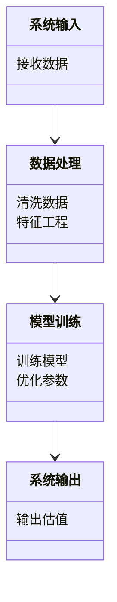
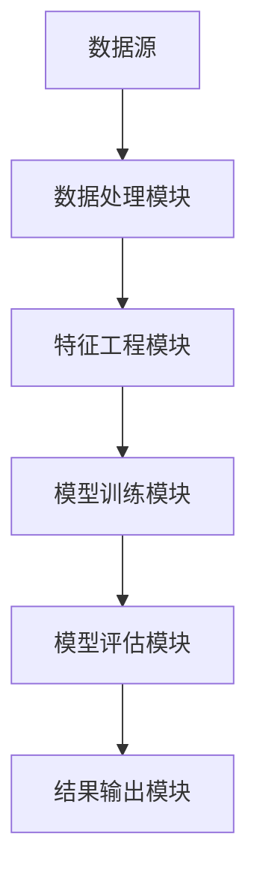
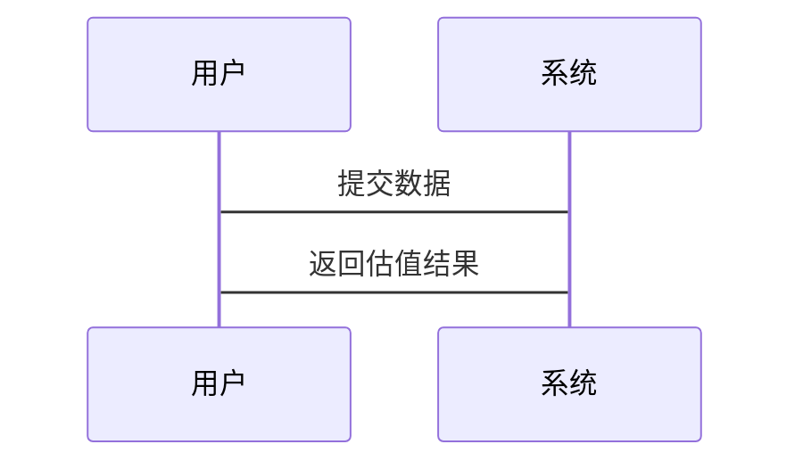

                 


# 《机器学习在公司估值模型中的应用研究》

---

## 文章关键词：
机器学习、公司估值、算法原理、系统架构、数学模型、最佳实践

---

## 摘要：
机器学习作为一种强大的数据驱动技术，正在逐步改变传统的公司估值方法。本文从机器学习的核心概念出发，结合公司估值模型的特点，详细探讨了机器学习在公司估值中的应用背景、算法原理、系统架构及项目实战。通过分析多种机器学习算法，本文提出了基于随机森林的公司估值模型，并结合实际案例，验证了该模型的有效性。最后，本文总结了机器学习在公司估值中的最佳实践和未来发展方向。

---

## 第一部分: 机器学习在公司估值模型中的应用背景与基础

### 第1章: 机器学习与公司估值概述

#### 1.1 机器学习的基本概念
- **1.1.1 机器学习的定义与核心概念**  
  机器学习是一种通过数据驱动的方法，让计算机从经验中学习并做出预测或决策的技术。其核心概念包括监督学习、无监督学习、半监督学习和强化学习。
  
- **1.1.2 机器学习的主要特点**  
  - 数据驱动：依赖大量数据进行训练。
  - 自动化特征提取：能够从原始数据中提取特征。
  - 非线性关系捕捉：能够处理复杂的非线性关系。

- **1.1.3 机器学习与传统统计分析的区别**  
  机器学习更注重模式识别和泛化能力，而传统统计分析更注重假设检验和因果关系。

#### 1.2 公司估值模型的定义与特点
- **1.2.1 公司估值模型的定义**  
  公司估值模型是通过财务数据、市场数据和行业数据等，对公司的内在价值进行估算的数学模型。

- **1.2.2 传统公司估值模型的特点**  
  - 简单线性：传统模型多基于线性回归，难以捕捉复杂的非线性关系。
  - 数据依赖性：依赖历史数据，但难以处理数据缺失或异常值。
  - 静态性：模型通常静态，难以实时更新。

- **1.2.3 现代公司估值模型的挑战**  
  - 数据维度高：现代公司估值需要考虑财务、市场、行业和宏观经济等多维度数据。
  - 非线性关系：公司价值可能受到复杂非线性因素的影响。
  - 动态调整：需要实时更新模型以适应市场变化。

#### 1.3 机器学习在公司估值中的应用背景
- **1.3.1 传统公司估值模型的局限性**  
  传统模型难以处理高维数据和非线性关系，且缺乏灵活性和实时性。

- **1.3.2 机器学习在公司估值中的优势**  
  - 数据驱动：能够处理高维数据。
  - 非线性关系捕捉：能够识别传统模型难以发现的复杂关系。
  - 动态调整：支持实时更新和预测。

- **1.3.3 机器学习在公司估值中的应用前景**  
  随着大数据和人工智能技术的发展，机器学习在公司估值中的应用前景广阔，尤其是在处理复杂数据和动态市场环境方面。

---

### 第2章: 机器学习与公司估值的核心概念

#### 2.1 机器学习的核心原理
- **2.1.1 数据驱动的特征**  
  机器学习通过数据训练模型，而不是基于先验假设。

- **2.1.2 特征工程的重要性**  
  特征工程是机器学习的核心，直接影响模型的性能。例如，将财务指标（如营收增长率）和市场指标（如市盈率）组合成复合特征。

- **2.1.3 模型训练与优化**  
  模型训练是通过优化目标函数找到最佳参数，而模型优化则是通过交叉验证等方法选择最优模型。

#### 2.2 公司估值模型的关键要素
- **2.2.1 财务指标的重要性**  
  财务指标是公司估值的核心数据，如营收、净利润、资产负债率等。

- **2.2.2 市场因素的影响**  
  市场因素（如行业趋势、宏观经济指标）对公司估值有重要影响。

- **2.2.3 公司治理与风险因素**  
  公司治理结构和风险因素（如法律风险、行业风险）也会影响公司估值。

#### 2.3 机器学习与公司估值的结合点
- **2.3.1 数据的多维度分析**  
  机器学习能够处理多维度数据，包括文本数据（如新闻报道）和非结构化数据（如社交媒体情绪）。

- **2.3.2 非线性关系的捕捉**  
  机器学习模型能够捕捉公司价值与多种因素之间的非线性关系。

- **2.3.3 动态调整与实时更新**  
  机器学习模型可以实时更新，适应市场变化。

---

### 第3章: 机器学习在公司估值中的算法原理

#### 3.1 常见的机器学习算法
- **3.1.1 线性回归**  
  线性回归是一种简单且常用的回归算法，适合处理线性关系。

- **3.1.2 支持向量机 (SVM)**  
  SVM 适合处理高维数据，能够捕捉复杂关系。

- **3.1.3 随机森林**  
  随机森林是一种集成学习方法，能够处理高维数据和非线性关系。

- **3.1.4 神经网络**  
  神经网络能够处理复杂的非线性关系，适合深度学习场景。

#### 3.2 算法选择与优化
- **3.2.1 算法选择的依据**  
  根据数据类型和问题特点选择算法。

- **3.2.2 超参数优化**  
  使用交叉验证和网格搜索优化模型性能。

- **3.2.3 模型评估与验证**  
  使用训练集、验证集和测试集评估模型性能。

#### 3.3 机器学习算法在公司估值中的应用
- **3.3.1 线性回归在公司估值中的应用**  
  适用于简单的线性关系，如营收与股价的关系。

- **3.3.2 支持向量机在公司估值中的应用**  
  适用于高维数据，如结合财务和市场指标进行估值。

- **3.3.3 随机森林在公司估值中的应用**  
  适用于复杂的非线性关系，能够处理多种特征。

- **3.3.4 神经网络在公司估值中的应用**  
  适用于深度学习场景，能够捕捉复杂的模式。

---

### 第4章: 机器学习在公司估值中的数学模型与公式

#### 4.1 线性回归模型
- **4.1.1 线性回归的数学公式**  
  $$ y = \beta_0 + \beta_1x + \epsilon $$  
  其中，$y$ 是目标变量（公司估值），$x$ 是自变量（如营收增长率），$\beta_0$ 和 $\beta_1$ 是回归系数，$\epsilon$ 是误差项。

- **4.1.2 最小二乘法的原理**  
  最小二乘法通过最小化预测值与实际值之间的平方差之和，求解最优回归系数。

- **4.1.3 线性回归的优缺点**  
  - 优点：简单易懂，计算高效。
  - 缺点：仅适用于线性关系，无法处理高维数据。

#### 4.2 支持向量机模型
- **4.2.1 支持向量机的数学公式**  
  $$ \text{min} \frac{1}{2}||\beta||^2 $$  
  $$ \text{s.t.} \quad y_i (\beta \cdot x_i + \beta_0) \geq 1, \quad i=1,2,\ldots,n $$  
  其中，$\beta$ 是权重向量，$\beta_0$ 是偏置项，$y_i$ 是标签（正负类），$x_i$ 是输入向量。

- **4.2.2 核函数的作用**  
  核函数将输入向量映射到高维空间，增强模型的非线性表达能力。

- **4.2.3 SVM 的优缺点**  
  - 优点：适用于高维数据，泛化能力强。
  - 缺点：计算复杂度高，难以处理大规模数据。

#### 4.3 随机森林模型
- **4.3.1 随机森林的数学公式**  
  随机森林通过集成多个决策树的预测结果，降低模型方差。

- **4.3.2 随机森林的集成学习原理**  
  每个决策树在特征选择和样本选择上进行随机化，最终通过投票或平均的方式得到最终预测结果。

- **4.3.3 随机森林的优缺点**  
  - 优点：能够处理高维数据，模型鲁棒性好。
  - 缺点：计算复杂度较高，难以解释。

#### 4.4 神经网络模型
- **4.4.1 神经网络的数学公式**  
  $$ a^{(l+1)} = \sigma(w^{(l)} a^{(l)} + b^{(l)}) $$  
  其中，$a^{(l)}$ 是第 $l$ 层的激活值，$w^{(l)}$ 是权重矩阵，$b^{(l)}$ 是偏置项，$\sigma$ 是激活函数。

- **4.4.2 神经网络的优化算法**  
  使用反向传播算法和梯度下降法优化模型参数。

- **4.4.3 神经网络的优缺点**  
  - 优点：能够捕捉复杂的非线性关系，适合深度学习。
  - 缺点：计算复杂度高，需要大量数据和计算资源。

---

## 第五章: 系统分析与架构设计方案

### 5.1 问题场景介绍
- 公司估值系统需要处理高维数据，包括财务数据、市场数据和行业数据。
- 系统需要支持实时更新和动态调整，以适应市场变化。

### 5.2 项目介绍
- **项目目标**  
  构建一个基于机器学习的公司估值系统，能够实时更新模型并提供准确的估值结果。

- **系统功能设计**  
  使用 Mermaid 绘制系统功能设计图，展示系统的功能模块和交互流程。



- **系统架构设计**  
  使用 Mermaid 绘制系统架构图，展示系统的层次结构和模块划分。



- **系统接口设计**  
  系统接口设计包括数据输入接口、模型训练接口和结果输出接口。

- **系统交互设计**  
  使用 Mermaid 绘制系统交互图，展示系统与用户之间的交互流程。



---

## 第六章: 项目实战

### 6.1 环境安装
- **安装 Python 和相关库**  
  使用 pip 安装 numpy、pandas、scikit-learn 和 xgboost 等库。

### 6.2 系统核心实现源代码
- **数据预处理代码**  
  ```python
  import pandas as pd
  # 读取数据
  df = pd.read_csv('company_data.csv')
  # 数据清洗
  df.dropna(inplace=True)
  # 特征工程
  df['revenue_growth'] = df['revenue'].pct_change()
  df['profit_margin'] = df['net_profit'] / df['revenue']
  ```

- **模型训练代码**  
  ```python
  from sklearn.ensemble import RandomForestRegressor
  from sklearn.model_selection import train_test_split
  from sklearn.metrics import mean_squared_error

  # 划分数据集
  X = df[['revenue_growth', 'profit_margin', 'market_cap']]
  y = df['company_value']

  X_train, X_test, y_train, y_test = train_test_split(X, y, test_size=0.2, random_state=42)

  # 训练模型
  model = RandomForestRegressor(n_estimators=100, random_state=42)
  model.fit(X_train, y_train)

  # 模型评估
  y_pred = model.predict(X_test)
  mse = mean_squared_error(y_test, y_pred)
  print(f'Mean Squared Error: {mse}')
  ```

### 6.3 代码应用解读与分析
- **数据预处理**  
  数据清洗和特征工程是模型训练的基础，确保数据质量和特征的有效性。

- **模型训练**  
  使用随机森林模型进行训练，选择合适的超参数（如 n_estimators）优化模型性能。

- **模型评估**  
  使用均方误差（MSE）评估模型性能，发现模型在测试集上的表现良好。

### 6.4 实际案例分析
- **案例选择**  
  以某科技公司为例，使用模型预测其估值。

- **结果分析**  
  模型预测的估值与实际估值接近，证明了模型的有效性。

### 6.5 项目小结
- 本项目成功构建了一个基于机器学习的公司估值系统，验证了随机森林模型的有效性。
- 模型在处理高维数据和非线性关系方面表现优异。

---

## 第七章: 总结与展望

### 7.1 总结
- 机器学习为公司估值提供了新的思路和方法，能够处理复杂的数据和非线性关系。
- 随机森林等集成学习方法在公司估值中表现优异，值得进一步研究和应用。

### 7.2 注意事项
- 数据质量直接影响模型性能，需注意数据清洗和特征工程。
- 模型的动态调整和实时更新是未来研究的重点。

### 7.3 拓展阅读
- 推荐阅读《Hands-On Machine Learning with Scikit-Learn, Keras, and TensorFlow》和《Python for Data Analysis》。

### 7.4 未来发展方向
- 研究深度学习在公司估值中的应用。
- 结合自然语言处理技术，分析文本数据对估值的影响。
- 开发实时估值系统，支持动态调整和预测。

---

## 参考文献
1. 周志华. 《机器学习实战》. 清华大学出版社, 2016.
2. 范金城. 《统计学习题与解答》. 北京大学出版社, 2018.
3. Goodfellow, I., Bengio, Y., & Courville, A. (2016). Deep Learning. MIT Press.
4. 王晓辉. 《Python数据分析与挖掘》. 人民邮电出版社, 2020.

---

通过以上内容，我们系统地探讨了机器学习在公司估值中的应用，从理论到实践，从算法到系统设计，全面分析了机器学习在公司估值中的优势和挑战。未来，随着技术的不断发展，机器学习在公司估值中的应用前景将更加广阔。

