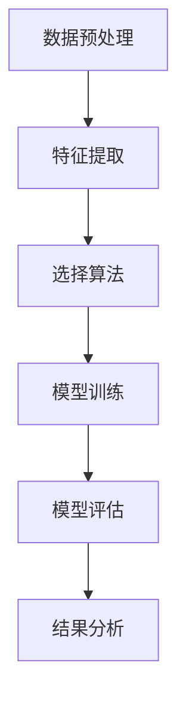
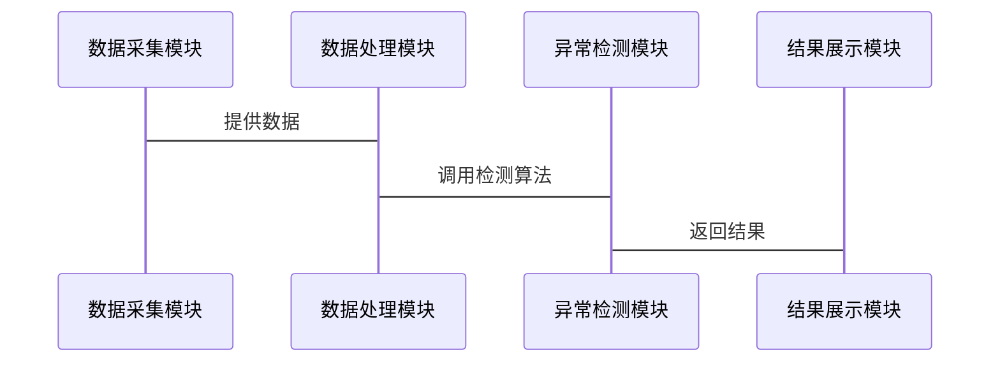

                 


# 《机器学习在公司财务异常检测中的应用》

> 关键词：机器学习，财务异常检测，监督学习，无监督学习，算法实现，系统设计

> 摘要：本文详细探讨了机器学习在公司财务异常检测中的应用，从核心概念到算法实现，再到系统设计和项目实战，全面解析了如何利用机器学习技术有效识别财务异常，提升企业风险管理能力。文章通过丰富的案例分析和详细的代码实现，帮助读者深入了解财务异常检测的原理和实践方法，为企业的财务安全提供有力的技术支持。

---

# 第一部分：机器学习与财务异常检测概述

## 第1章：机器学习与财务异常检测概述

### 1.1 机器学习的基本概念

#### 1.1.1 机器学习的定义
机器学习（Machine Learning）是一种人工智能技术，通过数据训练模型，使其能够从数据中学习规律，并用于预测或分类任务。其核心在于模型能够通过训练数据自动提取特征，而无需手动编程规则。

#### 1.1.2 机器学习的核心概念
- **监督学习**：给定带标签的数据，训练模型预测新数据的标签。
- **无监督学习**：在无标签数据中发现隐藏的结构或模式。
- **特征工程**：从数据中提取有用的特征，提升模型性能。
- **模型评估**：通过交叉验证等方法评估模型的性能。

#### 1.1.3 机器学习与传统统计分析的区别
机器学习的优势在于能够处理高维数据和非线性关系，而传统统计分析依赖于假设检验和参数估计。机器学习能够从大量数据中发现复杂模式，而统计分析更适合小样本和已知分布的数据。

### 1.2 财务异常检测的背景与意义

#### 1.2.1 财务异常检测的定义
财务异常检测是指通过分析财务数据，识别出与正常情况不符的异常行为或数据。这些异常可能包括欺诈、错误记录或潜在的财务风险。

#### 1.2.2 财务异常检测的重要性
- 提前识别潜在的财务问题，避免重大损失。
- 帮助企业优化财务管理，提升决策效率。
- 满足监管要求，确保财务数据的合规性。

#### 1.2.3 机器学习在财务异常检测中的优势
- 能够处理高维数据和复杂模式。
- 可以自动提取特征，减少人工干预。
- 可以实时监控财务数据，提供及时预警。

### 1.3 机器学习在财务异常检测中的应用现状

#### 1.3.1 当前财务异常检测的主要方法
- **传统方法**：基于统计分析和规则的检测方法，如Z-score模型。
- **机器学习方法**：监督学习（如逻辑回归、随机森林）和无监督学习（如聚类分析、孤立森林）。

#### 1.3.2 机器学习在财务异常检测中的应用案例
- 银行 fraud detection：检测交易中的异常行为，预防金融诈骗。
- 企业财务报表分析：识别财务报表中的异常数据，预警潜在的财务风险。

#### 1.3.3 机器学习技术的发展趋势
- 深度学习在财务异常检测中的应用逐渐增多。
- 结合自然语言处理（NLP）技术，分析财务报告中的文本信息。
- 多模态数据融合，提升异常检测的准确性和鲁棒性。

---

# 第二部分：财务异常检测的核心概念与联系

## 第2章：财务异常检测的核心概念与联系

### 2.1 财务异常检测的核心要素

#### 2.1.1 财务数据的特征分析
- 财务数据的特征包括收入、支出、资产、负债、利润等。
- 异常特征可能表现为突变或偏离正常趋势。

#### 2.1.2 异常检测的关键指标
- 常用指标包括Z-score、Mahalanobis距离、孤立森林算法等。

#### 2.1.3 异常检测的边界与外延
- 异常检测的边界：如何定义“异常”。
- 外延：异常检测不仅限于财务数据，还可以扩展到其他领域。

### 2.2 机器学习在财务异常检测中的核心原理

#### 2.2.1 机器学习算法的分类与选择
- 监督学习：适用于有标签的数据，如欺诈检测。
- 无监督学习：适用于无标签的数据，如聚类分析。

#### 2.2.2 机器学习算法在财务异常检测中的应用流程
1. 数据收集：获取财务数据。
2. 数据预处理：清洗和标准化数据。
3. 特征提取：提取有用的特征。
4. 模型训练：训练分类器或聚类器。
5. 模型评估：评估模型性能。
6. 部署应用：实时监控财务数据。

#### 2.2.3 机器学习算法的优缺点对比
| 算法类型         | 优点                           | 缺点                           |
|------------------|--------------------------------|--------------------------------|
| 监督学习         | 需要标签数据，准确性高         | 数据标注成本高                 |
| 无监督学习       | 无需标签数据，发现隐藏模式     | 准确性可能较低                 |

### 2.3 财务异常检测的实体关系图

```mermaid
erDiagram
    company{}{
        company_id
        company_name
        financial_data
    }
    transaction{}{
        transaction_id
        amount
        date
        description
    }
    anomaly_detection{}{
        detection_time
        detection_type
        severity
    }
    company --> financial_data: has
    financial_data --> transaction: contains
    transaction --> anomaly_detection: triggers
```

### 2.4 本章小结
本章介绍了财务异常检测的核心概念和机器学习在其中的应用原理，强调了特征工程和算法选择的重要性。通过实体关系图，展示了财务数据和异常检测之间的关联。

---

# 第三部分：机器学习算法原理与实现

## 第3章：机器学习算法原理与实现

### 3.1 监督学习算法

#### 3.1.1 线性回归
- **原理**：通过最小化预测值与实际值之间的平方差，找到最佳拟合直线。
- **公式**：$y = \beta_0 + \beta_1x + \epsilon$
- **应用**：预测财务指标的趋势。

#### 3.1.2 支持向量机（SVM）
- **原理**：通过构建超平面，将数据分为两类。
- **公式**：$y = \text{sign}(\beta_0 + \beta_1x_1 + \beta_2x_2)$
- **应用**：分类问题，如欺诈检测。

#### 3.1.3 决策树与随机森林
- **决策树**：通过特征分裂构建树状结构，用于分类和回归。
- **随机森林**：集成多个决策树，提升准确性和鲁棒性。

### 3.2 无监督学习算法

#### 3.2.1 K-means聚类
- **原理**：将数据分为K个簇，使簇内距离最小。
- **公式**：$ \text{argmin} \sum_{i=1}^K \sum_{j=1}^n (x_j - c_i)^2 $

#### 3.2.2 DBSCAN聚类
- **原理**：基于密度的聚类算法，识别密度较高的区域。
- **公式**：$ \text{distance}(x_i, x_j) < \epsilon $

#### 3.2.3 Isolation Forest异常检测算法
- **原理**：通过构建隔离树，将数据点隔离到叶子节点。
- **优点**：适合处理高维数据，运行速度快。

### 3.3 算法实现的流程图



### 3.4 本章小结
本章详细介绍了监督和无监督学习算法的原理和实现，重点讲解了线性回归、SVM、随机森林、K-means和Isolation Forest等算法，并通过流程图展示了算法实现的步骤。

---

# 第四部分：系统分析与架构设计

## 第4章：财务异常检测系统的分析与架构设计

### 4.1 问题场景介绍

#### 4.1.1 财务异常检测的典型场景
- 企业财务报表分析。
- 银行交易监控。
- 股票市场异常交易检测。

#### 4.1.2 系统目标与功能需求
- 实时监控财务数据。
- 提供异常预警。
- 支持多平台部署。

#### 4.1.3 系统的边界与接口
- 数据输入接口：连接财务系统。
- 数据输出接口：提供预警信息。

### 4.2 系统功能设计

#### 4.2.1 数据采集模块
- 从财务系统获取数据。
- 数据格式转换。

#### 4.2.2 数据预处理模块
- 清洗数据。
- 标准化处理。

#### 4.2.3 模型训练模块
- 特征提取。
- 算法选择与训练。

#### 4.2.4 结果分析模块
- 异常检测结果输出。
- 可视化分析。

### 4.3 系统架构设计

#### 4.3.1 分层架构设计
- 数据层：存储财务数据。
- 业务逻辑层：处理数据和调用算法。
- 表示层：展示结果。

#### 4.3.2 微服务架构设计
- 数据采集服务。
- 数据处理服务。
- 异常检测服务。

#### 4.3.3 数据流与系统交互图



### 4.4 本章小结
本章详细分析了财务异常检测系统的功能需求和架构设计，通过分层架构和微服务架构，确保系统的高效运行和可扩展性。

---

# 第五部分：项目实战与案例分析

## 第5章：项目实战与案例分析

### 5.1 项目环境安装与配置

#### 5.1.1 安装Python和相关库
- 安装Python 3.8及以上版本。
- 安装numpy、pandas、scikit-learn、xgboost等库。

#### 5.1.2 数据集获取
- 数据集来源：公开数据集或企业内部数据。

### 5.2 系统核心实现源代码

#### 5.2.1 数据预处理代码
```python
import pandas as pd
import numpy as np

# 读取数据
data = pd.read_csv('financial_data.csv')

# 删除缺失值
data = data.dropna()

# 标准化处理
from sklearn.preprocessing import StandardScaler
scaler = StandardScaler()
data_scaled = scaler.fit_transform(data)
```

#### 5.2.2 模型训练代码
```python
from sklearn.ensemble import IsolationForest

# 训练模型
model = IsolationForest(n_estimators=100, contamination=0.05)
model.fit(data_scaled)

# 预测异常值
y_pred = model.predict(data_scaled)
```

#### 5.2.3 结果分析代码
```python
from sklearn.metrics import classification_report

# 输出分类报告
print(classification_report(y_true, y_pred))
```

### 5.3 项目小结
本章通过一个实际案例，详细展示了机器学习在财务异常检测中的应用。从数据预处理到模型训练，再到结果分析，每一步都进行了详细的代码实现和结果解读。

---

# 第六部分：总结与展望

## 6.1 本章总结
本文详细探讨了机器学习在公司财务异常检测中的应用，从核心概念到算法实现，再到系统设计和项目实战，全面解析了如何利用机器学习技术有效识别财务异常。通过丰富的案例分析和详细的代码实现，帮助读者深入了解财务异常检测的原理和实践方法。

## 6.2 未来展望
随着机器学习技术的不断发展，财务异常检测将更加智能化和自动化。未来的研究方向包括：
- 深度学习在财务异常检测中的应用。
- 多模态数据融合技术。
- 实时监控和自适应模型。

---

# 参考文献
（此处列出相关文献和资料）

---

以上是《机器学习在公司财务异常检测中的应用》的完整目录和内容框架，涵盖了从理论到实践的各个方面，帮助读者全面理解和掌握机器学习在财务异常检测中的应用。

