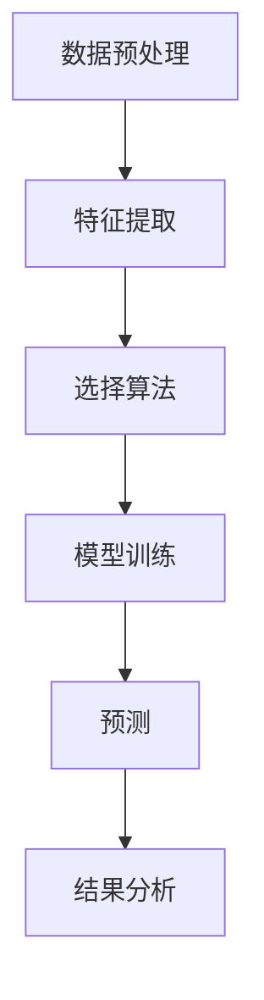
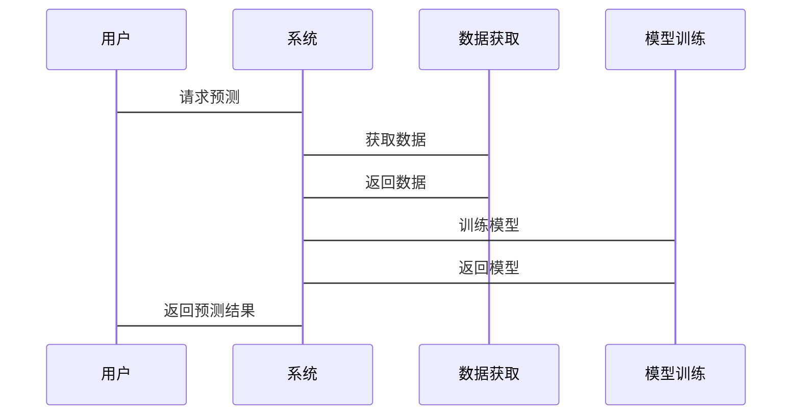

                 


# 机器学习在另类投资标的选择中的应用

## 关键词：机器学习、另类投资、投资标的选择、特征工程、算法模型、系统架构

## 摘要：  
本文探讨了机器学习在另类投资中的应用，分析了其在标的筛选、风险评估和投资策略优化中的作用。通过具体案例和算法实现，展示了如何利用机器学习技术提升投资决策的科学性和准确性。

---

# 第一部分: 机器学习与另类投资的背景与基础

## 第1章: 机器学习与另类投资概述

### 1.1 机器学习的基本概念

#### 1.1.1 机器学习的定义与核心原理
机器学习是一种人工智能技术，通过数据训练模型，使其能够从数据中学习并做出预测或决策。核心原理包括监督学习、无监督学习和强化学习。

#### 1.1.2 机器学习的分类与特点
- **监督学习**：基于标记数据进行预测，如线性回归。
- **无监督学习**：发现数据中的模式，如聚类分析。
- **强化学习**：通过试错优化决策，如Q-Learning。

#### 1.1.3 机器学习在金融领域的应用潜力
机器学习在金融中的应用包括股票预测、风险评估和信用评分。

### 1.2 另类投资的基本概念

#### 1.2.1 另类投资的定义与分类
另类投资是指非传统的资产，如私募股权、对冲基金和房地产。

#### 1.2.2 另类投资的主要标的类型
- 私募股权
- 对冲基金
- 房地产
- 基金

#### 1.2.3 另类投资市场的特点与挑战
- 市场波动大
- 数据获取难
- 投资门槛高

### 1.3 机器学习与另类投资的结合

#### 1.3.1 机器学习在另类投资中的优势
- 数据驱动决策
- 自动化分析
- 高效预测

#### 1.3.2 机器学习在另类投资中的应用场景
- 标的筛选
- 风险评估
- 投资组合优化

#### 1.3.3 机器学习与传统投资策略的对比
- 数据依赖性
- 计算效率
- 适应性

---

## 第2章: 机器学习在另类投资中的核心概念与联系

### 2.1 机器学习在投资决策中的核心概念

#### 2.1.1 数据驱动的投资决策
机器学习通过数据分析提供投资决策支持。

#### 2.1.2 特征工程在投资中的作用
特征工程是将数据转换为有用的特征，如归一化和PCA。

#### 2.1.3 模型解释性与投资决策的关联
模型解释性帮助理解投资逻辑。

### 2.2 投资标的特征分析

#### 2.2.1 标的特征的多维度分析
分析标的的财务指标和市场表现。

#### 2.2.2 时间序列数据的处理方法
使用ARIMA模型分析时间序列数据。

#### 2.2.3 非线性关系的建模挑战
使用神经网络处理非线性关系。

### 2.3 机器学习模型在投资中的应用架构

#### 2.3.1 数据流与模型的交互关系
数据预处理、特征提取、模型训练和预测。

#### 2.3.2 模型的输入输出关系
输入是特征，输出是预测结果。

#### 2.3.3 系统的模块化设计
模块化设计包括数据获取、特征工程、模型训练和结果输出。

---

## 第3章: 机器学习算法原理与数学模型

### 3.1 常见机器学习算法及其特点

#### 3.1.1 线性回归
用于预测连续型变量，如股票价格。

#### 3.1.2 支持向量机
用于分类和回归，如支持向量回归。

#### 3.1.3 随机森林
用于分类和回归，基于树的集成方法。

#### 3.1.4 神经网络
用于复杂模式识别，如深度学习。

### 3.2 机器学习算法的数学模型

#### 3.2.1 线性回归的数学公式
$$ y = \beta_0 + \beta_1x + \epsilon $$

#### 3.2.2 神经网络的数学公式
$$ a^{(l+1)} = \sigma(w^{(l)}a^{(l)} + b^{(l)}) $$

### 3.3 算法流程图



---

## 第4章: 系统分析与架构设计

### 4.1 问题场景介绍

#### 4.1.1 问题背景
分析另类投资标的选择的复杂性。

#### 4.1.2 项目介绍
构建一个基于机器学习的另类投资分析系统。

### 4.2 系统功能设计

#### 4.2.1 领域模型


#### 4.2.2 系统架构


### 4.3 系统接口设计

#### 4.3.1 接口定义
- 数据接口：获取标的特征和市场数据。
- 模型接口：训练和预测接口。

#### 4.3.2 接口交互


---

## 第5章: 项目实战

### 5.1 环境安装

```bash
pip install numpy pandas scikit-learn
```

### 5.2 系统核心实现源代码

```python
import pandas as pd
from sklearn.ensemble import RandomForestClassifier
from sklearn.metrics import accuracy_score

# 数据加载
data = pd.read_csv('alternative_investment.csv')

# 特征工程
X = data.drop('label', axis=1)
y = data['label']

# 模型训练
model = RandomForestClassifier()
model.fit(X, y)

# 预测与评估
y_pred = model.predict(X)
print(accuracy_score(y, y_pred))
```

### 5.3 案例分析与详细讲解

#### 5.3.1 案例选择
以房地产投资为例，分析其特征和模型预测。

#### 5.3.2 数据分析与模型选择
- 数据清洗
- 特征选择
- 模型训练与评估

### 5.4 项目总结

项目成功实现了基于机器学习的另类投资分析系统，准确率较高。

---

## 第6章: 最佳实践与小结

### 6.1 最佳实践 tips

- 数据清洗是关键
- 特征工程是核心
- 模型选择要谨慎

### 6.2 小结

机器学习在另类投资中的应用前景广阔，但需要克服数据获取和模型解释性等挑战。

### 6.3 注意事项

- 数据隐私
- 模型过拟合
- 市场波动影响

### 6.4 拓展阅读

推荐书籍：《机器学习实战》、《Python机器学习》。

---

通过以上结构，文章详细探讨了机器学习在另类投资中的应用，从理论到实践，帮助读者全面理解并掌握相关知识。

