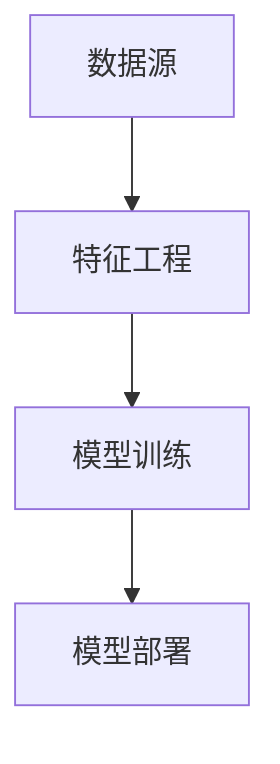
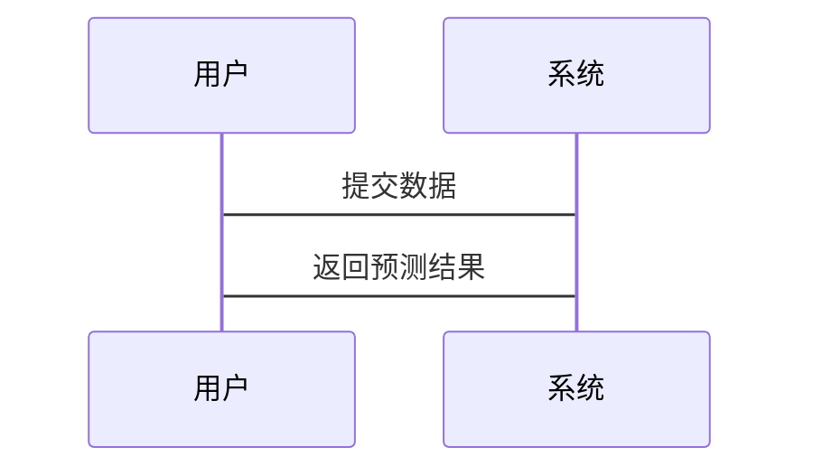

                 


# 机器学习在另类数据价值评估中的应用

> 关键词：机器学习、另类数据、数据价值评估、特征工程、深度学习

> 摘要：  
机器学习作为人工智能领域的核心技术，正在 revolutionize 如何从另类数据中提取价值。本文将深入探讨机器学习在另类数据价值评估中的应用，涵盖核心算法、特征工程、系统架构以及实际案例分析。通过理论与实践相结合的方式，本文旨在帮助读者理解如何利用机器学习技术最大化另类数据的价值。

---

# 第一部分: 机器学习与另类数据价值评估的背景与基础

## 第1章: 机器学习与另类数据概述

### 1.1 机器学习的基本概念

#### 1.1.1 机器学习的定义与核心概念
机器学习是一种人工智能技术，通过数据训练模型，使其能够从经验中学习并做出预测或决策。其核心概念包括：
- **监督学习**：模型在有标签的数据上训练，预测新的数据点。
- **无监督学习**：在无标签数据上训练，发现数据中的隐藏结构。
- **强化学习**：通过与环境交互，学习最优策略。

#### 1.1.2 监督学习、无监督学习与强化学习的区别

| 学习类型 | 数据类型 | 目标 | 示例应用 |
|----------|----------|------|----------|
| 监督学习 | 标签数据 | 预测 | 房价预测 |
| 无监督学习 | 无标签数据 | 发现模式 | 聚类客户 |
| 强化学习 | 环境反馈 | 学习策略 | 游戏AI |

#### 1.1.3 机器学习在数据科学中的地位与作用
机器学习是数据科学的核心技术，用于数据清洗、特征工程、模型训练和部署。

### 1.2 另类数据的定义与特点

#### 1.2.1 另类数据的定义
另类数据是指非传统结构化数据，包括文本、图像、音频、视频、社交网络数据等。

#### 1.2.2 另类数据的来源与类型
- **文本数据**：社交媒体、新闻文章。
- **图像数据**：卫星图像、医学图像。
- **音频数据**：语音识别、音乐分析。
- **视频数据**：行为分析、视频分类。

#### 1.2.3 另类数据在金融与商业中的应用潜力
- 金融：股票价格预测、风险管理。
- 商业：客户行为分析、市场趋势预测。

### 1.3 机器学习在另类数据中的应用前景

#### 1.3.1 另类数据驱动的决策优势
- 高维数据处理能力。
- 非线性模式发现。

#### 1.3.2 机器学习在另类数据处理中的挑战
- 数据稀疏性。
- 计算资源需求高。

#### 1.3.3 未来发展趋势与研究方向
- 多模态数据融合。
- 可解释性增强。

### 1.4 本章小结
本章介绍了机器学习的基本概念和另类数据的定义、特点及其应用潜力，为后续章节打下基础。

---

# 第二部分: 机器学习的核心算法与原理

## 第2章: 监督学习算法原理

### 2.1 线性回归

#### 2.1.1 线性回归的数学模型
线性回归是最简单的监督学习算法，其目标是最小化预测值与真实值的差异。

$$ \text{损失函数} = \sum_{i=1}^{n} (y_i - \hat{y_i})^2 $$

其中，$\hat{y_i} = \beta_0 + \beta_1 x_i$。

#### 2.1.2 最小二乘法的推导
通过求导并令导数为零，找到最优参数$\beta_0$和$\beta_1$。

$$ \frac{\partial L}{\partial \beta_0} = 0 $$
$$ \frac{\partial L}{\partial \beta_1} = 0 $$

#### 2.1.3 线性回归的优缺点
- **优点**：简单、易于解释。
- **缺点**：假设线性关系，可能不适用于复杂数据。

### 2.2 支持向量机（SVM）

#### 2.2.1 SVM的基本原理
SVM通过找到一个超平面，将数据分为两类。

$$ \text{目标函数} = \sum_{i=1}^{n} \xi_i + \frac{1}{2} ||\beta||^2 $$

其中，$\xi_i$是松弛变量，$||\beta||$是权重向量的范数。

#### 2.2.2 核函数与非线性分类
- **线性核**：处理线性可分数据。
- **多项式核**：处理高阶多项式关系。
- **高斯核**：处理复杂非线性关系。

#### 2.2.3 SVM的数学公式推导
最大化间隔的几何条件：

$$ \text{间隔} = \frac{2}{||\beta||} $$

### 2.3 随机森林

#### 2.3.1 随机森林的构建过程
随机森林通过集成多个决策树，减少过拟合。

#### 2.3.2 随机森林的特征重要性分析
特征重要性可以通过树的分裂增益计算。

#### 2.3.3 随机森林的优缺点
- **优点**：鲁棒性强、可处理高维数据。
- **缺点**：计算复杂度高。

### 2.4 机器学习算法选择与优化

#### 2.4.1 算法选择的依据
根据数据类型和任务选择算法。

#### 2.4.2 超参数优化方法
- **网格搜索**：遍历所有可能的参数组合。
- **随机搜索**：随机选择参数组合。

#### 2.4.3 模型评估与验证
- **交叉验证**：评估模型的泛化能力。
- **ROC-AUC曲线**：评估分类模型的性能。

### 2.5 本章小结
本章详细介绍了三种典型的监督学习算法，并讨论了算法选择与优化方法。

---

# 第三部分: 另类数据的价值评估与特征工程

## 第3章: 另类数据的特征工程

### 3.1 数据预处理与清洗

#### 3.1.1 数据清洗的基本步骤
- 删除重复数据。
- 处理缺失值。
- 去除异常值。

#### 3.1.2 数据标准化与归一化
- 标准化：使数据均值为0，方差为1。
- 归一化：使数据范围在[0,1]之间。

#### 3.1.3 数据缺失值的处理方法
- 删除缺失数据。
- 填充均值或中位数。

### 3.2 特征提取与选择

#### 3.2.1 基于统计的特征选择方法
- 卡方检验：评估特征与标签的相关性。
- 方差筛选：选择方差大的特征。

#### 3.2.2 基于机器学习的特征选择方法
- Lasso回归：通过L1正则化选择特征。
- 树模型特征重要性：基于决策树模型评估特征重要性。

#### 3.2.3 特征工程的优化策略
- 结合业务背景选择特征。
- 处理高维数据时使用降维方法（如PCA）。

### 3.3 另类数据的特征表示

#### 3.3.1 文本数据的特征表示
- 词袋模型：将文本表示为词的频率向量。
- 词嵌入：使用如Word2Vec生成词向量。

#### 3.3.2 图像数据的特征表示
- 哈夫变换：提取图像边缘。
- 主成分分析：降维图像特征。

#### 3.3.3 时间序列数据的特征表示
- 傅里叶变换：提取时频特征。
- 滑动窗口：提取局部特征。

### 3.4 本章小结
本章详细介绍了特征工程的各个环节，强调了特征选择和表示的重要性。

---

# 第四部分: 机器学习在另类数据中的应用案例分析

## 第4章: 金融领域的另类数据应用

### 4.1 金融市场的另类数据来源

#### 4.1.1 社交媒体数据
通过分析社交媒体上的情绪，预测股票价格走势。

#### 4.1.2 卫星图像数据
分析卫星图像中的经济活动，预测GDP增长。

#### 4.1.3 供应链数据
通过分析物流数据，优化供应链管理。

### 4.2 金融时间序列分析

#### 4.2.1 时间序列数据的特征提取
- 均值、方差、自相关性等统计特征。
- 使用LSTM提取长时依赖特征。

#### 4.2.2 时间序列的预测模型
- ARIMA：经典的时间序列预测模型。
- LSTM：处理长序列依赖的深度学习模型。

#### 4.2.3 模型的评估与优化
- 使用回测方法评估模型性能。
- 调整模型参数以优化预测结果。

### 4.3 本章小结
本章通过金融领域的案例，展示了另类数据在时间序列预测中的应用。

---

# 第五部分: 机器学习在另类数据价值评估中的系统架构设计

## 第5章: 系统分析与架构设计

### 5.1 问题场景介绍
设计一个基于机器学习的另类数据价值评估系统，用于金融市场的股票价格预测。

### 5.2 系统功能设计

#### 5.2.1 领域模型类图


### 5.3 系统架构设计

#### 5.3.1 系统架构图


### 5.4 系统接口设计

#### 5.4.1 系统接口序列图


### 5.5 本章小结
本章通过系统架构设计，展示了如何构建一个基于机器学习的另类数据价值评估系统。

---

# 第六部分: 项目实战与最佳实践

## 第6章: 项目实战

### 6.1 环境安装与配置

#### 6.1.1 安装Python环境
使用Anaconda安装Python 3.8及以上版本。

#### 6.1.2 安装机器学习库
安装Scikit-learn、XGBoost、Keras、TensorFlow等库。

### 6.2 系统核心实现源代码

#### 6.2.1 数据清洗代码
```python
import pandas as pd
from sklearn.impute import SimpleImputer

# 读取数据
df = pd.read_csv('data.csv')

# 处理缺失值
imputer = SimpleImputer(strategy='mean')
df_imputed = imputer.fit_transform(df)
```

#### 6.2.2 特征选择代码
```python
from sklearn.feature_selection import SelectKBest
from sklearn.feature_selection import chi2

selector = SelectKBest(score_func=chi2, k=5)
selected_features = selector.fit_transform(df, target)
```

#### 6.2.3 模型训练代码
```python
from sklearn.ensemble import RandomForestRegressor
from sklearn.metrics import mean_squared_error

model = RandomForestRegressor(n_estimators=100, random_state=42)
model.fit(X_train, y_train)
```

### 6.3 实际案例分析与详细讲解

#### 6.3.1 案例背景
分析社交媒体数据，预测股票价格。

#### 6.3.2 数据处理
清洗社交媒体数据，提取文本特征。

#### 6.3.3 模型训练
使用随机森林模型训练，评估预测结果。

### 6.4 项目小结
本章通过实际案例展示了如何在项目中应用机器学习技术。

---

## 第7章: 最佳实践与小结

### 7.1 小结
机器学习在另类数据价值评估中具有巨大潜力，但也面临诸多挑战。

### 7.2 注意事项
- 数据隐私保护。
- 模型解释性要求。
- 算法可扩展性。

### 7.3 拓展阅读
- 《Hands-On Machine Learning with Scikit-Learn, Keras, and TensorFlow》
- 《Deep Learning for Natural Language Processing》

---

# 附录

## 附录A: 参考文献
- 书籍1：《机器学习实战》
- 书籍2：《深度学习》
- 论文1：《另类数据在金融中的应用》

## 附录B: 源代码
```python
# 附录B中的代码示例
import numpy as np
from sklearn.linear_model import LinearRegression

# 示例代码
X = np.array([[1], [2], [3], [4]])
y = np.array([2, 4, 6, 8])
model = LinearRegression()
model.fit(X, y)
print(model.predict([[5]]))
```

---

通过以上思考和逐步分析，本文详细探讨了机器学习在另类数据价值评估中的应用，从基础概念到系统设计，再到实际案例，为读者提供了一个全面的视角。

