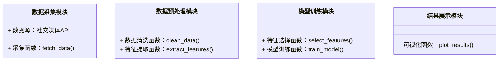

                 


# 《机器学习在另类数据信号提取中的应用》

> 关键词：机器学习，信号处理，另类数据，特征提取，数学模型

> 摘要：本文将深入探讨机器学习在另类数据信号提取中的应用，从基础概念到算法原理，再到实际案例，系统性地分析如何利用机器学习技术提取隐藏在非传统数据中的有价值信号。文章将涵盖背景介绍、核心概念、算法原理、数学模型、系统设计、项目实战以及最佳实践等内容，帮助读者全面掌握机器学习在信号提取中的应用。

---

# 第一部分: 机器学习与另类数据信号提取的基础

## 第1章: 背景介绍

### 1.1 问题背景

#### 1.1.1 另类数据的定义与特点
- **另类数据**：指非传统结构化数据，如文本、图像、音频、视频、社交媒体数据、传感器数据等。
- **特点**：
  - 非结构化：难以直接用于传统数据分析。
  - 高维性：数据量大、维度高。
  - 隐含性：包含有价值的信息，但不易直接提取。

#### 1.1.2 机器学习在数据处理中的作用
- 机器学习擅长从大量数据中提取模式和特征。
- 能够处理非线性关系，适用于复杂数据的分析。

#### 1.1.3 信号提取的必要性与挑战
- 信号提取是将隐含信息转化为可利用形式的关键步骤。
- 挑战：噪声干扰、数据稀疏性、计算复杂性。

### 1.2 问题描述

#### 1.2.1 另类数据的复杂性
- 数据类型多样，处理难度大。
- 数据量大，处理效率要求高。

#### 1.2.2 信号提取的目标与意义
- 目标：从非结构化数据中提取有用的信号。
- 意义：提升数据分析能力，支持决策。

#### 1.2.3 机器学习在其中的核心地位
- 机器学习是连接数据与信号的桥梁。
- 通过特征提取和模式识别，实现信号的有效提取。

### 1.3 问题解决

#### 1.3.1 数据预处理的重要性
- 清洗数据：去除噪声。
- 标准化：统一数据格式。

#### 1.3.2 特征工程的关键性
- 特征选择：提取重要特征。
- 特征构建：通过算法生成新特征。

### 1.4 边界与外延

#### 1.4.1 信号提取的边界
- 数据范围：限定于特定领域。
- 方法限制：基于现有算法。

#### 1.4.2 机器学习的外延
- 应用场景扩展：从单一领域到多领域。
- 算法优化：不断改进提取精度。

---

## 第2章: 核心概念与联系

### 2.1 机器学习与信号处理的关系

#### 2.1.1 机器学习的基本概念
- 机器学习：通过数据训练模型，实现预测或分类。
- 监督学习、无监督学习、半监督学习。

#### 2.1.2 信号处理的基本原理
- 信号处理：对信号进行分析、变换和增强。
- 时间序列分析、频域分析。

#### 2.1.3 两者的结合与应用
- 信号处理为机器学习提供数据。
- 机器学习为信号处理提供自动化分析工具。

### 2.2 核心概念原理

#### 2.2.1 信号提取的数学模型
- 信号可以表示为函数：$s(t) = f(x)$。
- 机器学习模型通过训练学习函数$f$。

#### 2.2.2 机器学习的特征提取能力
- 特征提取是机器学习的核心任务。
- 提取低维特征，降低计算复杂度。

#### 2.2.3 信号与数据的关系
- 数据是信号的载体。
- 信号是数据中的有用信息。

### 2.3 概念属性特征对比

#### 2.3.1 信号处理的特征分析
- 时间依赖性：信号通常与时间相关。
- 频率特性：信号在不同频率下的表现。

#### 2.3.2 机器学习的特征分析
- 特征重要性：不同特征对模型的影响。
- 非线性关系：模型能处理复杂关系。

#### 2.3.3 两者的对比与联系
- 都需要处理数据，但侧重点不同。
- 信号处理注重物理意义，机器学习注重模式识别。

### 2.4 ER实体关系图架构

```mermaid
er
actor: 信号提取系统
entity1: 数据源
entity2: 特征
entity3: 信号
```

---

## 第3章: 算法原理讲解

### 3.1 特征提取算法

#### 3.1.1 主成分分析（PCA）

##### 3.1.1.1 PCA的流程
```mermaid
graph TD
A[原始数据] -> B[计算协方差矩阵]
B -> C[求特征值和特征向量]
C -> D[选择前k个特征向量]
D -> E[数据降维]
```

##### 3.1.1.2 PCA的数学模型
- 协方差矩阵：$\frac{1}{n-1}X^T X$
- 特征值分解：$X^T X = V D V^T$
- 降维：$Y = X V_k D_k^{1/2}$

#### 3.1.2 独立成分分析（ICA）

##### 3.1.2.1 ICA的流程
```mermaid
graph TD
A[混合数据] -> B[估计概率密度函数]
B -> C[计算独立成分]
C -> D[输出独立信号]
```

##### 3.1.2.2 ICA的数学模型
- 混合模型：$x = A s + \epsilon$
- 分解过程：$s = W^T x$

#### 3.1.3 其他特征提取方法
- 线性判别分析（LDA）
- 流形学习（Manifold Learning）

### 3.2 降维算法

#### 3.2.1 线性判别分析（LDA）

##### 3.2.1.1 LDA的流程
```mermaid
graph TD
A[数据预处理] -> B[计算类内协方差和类间协方差]
B -> C[求特征向量]
C -> D[降维]
```

##### 3.2.1.2 LDA的数学模型
- 类内协方差：$S_w = \sum_{i=1}^{k} \sum_{x_i \in W_j} (x_i - \mu_j)(x_i - \mu_j)^T$
- 类间协方差：$S_b = \sum_{j=1}^{k} n_j (\mu_j - \mu)(\mu_j - \mu)^T$
- 特征向量：解$S_w^{-1} S_b v = \lambda v$

### 3.3 分类与回归算法

#### 3.3.1 支持向量机（SVM）

##### 3.3.1.1 SVM的流程
```mermaid
graph TD
A[训练数据] -> B[构建超平面]
B -> C[支持向量选择]
C -> D[分类]
```

##### 3.3.1.2 SVM的数学模型
- 分类函数：$f(x) = \text{sign}(w \cdot x + b)$
- 软间隔：$\sum_{i=1}^{n} \xi_i + \frac{1}{2} ||w||^2 \rightarrow \text{最小化}$

---

## 第4章: 数学模型与公式

### 4.1 线性回归模型

#### 4.1.1 线性回归的数学表达
- 普通最小二乘法：$\hat{y} = \beta_0 + \beta_1 x + \epsilon$
- 正则化：$Lasso: \sum \beta_i$，$Ridge: \sum \beta_i^2$

### 4.2 支持向量机（SVM）

#### 4.2.1 SVM的几何解释
- 超平面：$w \cdot x + b = 0$
- 支持向量：离超平面最近的点

#### 4.2.2 核函数的数学表达
- 线性核：$K(x_1, x_2) = x_1 \cdot x_2$
- 高斯核：$K(x_1, x_2) = \exp(-\gamma ||x_1 - x_2||^2)$

### 4.3 神经网络模型

#### 4.3.1 神经网络的结构与参数
- 层：输入层、隐藏层、输出层
- 参数：权重$W$、偏置$b$

#### 4.3.2 网络训练的数学模型
- 损失函数：交叉熵损失
- 优化算法：随机梯度下降（SGD）

---

## 第5章: 系统分析与架构设计方案

### 5.1 问题场景介绍

#### 5.1.1 项目背景
- 从社交媒体文本中提取情感信号，用于预测股票价格。

### 5.2 系统功能设计

#### 5.2.1 领域模型


#### 5.2.2 系统架构设计


---

## 第6章: 项目实战

### 6.1 环境安装

#### 6.1.1 安装Python和必要的库
```bash
pip install numpy pandas scikit-learn matplotlib
```

### 6.2 系统核心实现源代码

#### 6.2.1 数据采集模块
```python
import requests
import json

def fetch_data(api_key):
    url = f"https://api.twitter.com/...{api_key}"
    response = requests.get(url)
    return json.loads(response.text)
```

#### 6.2.2 数据预处理模块
```python
import pandas as pd

def clean_data(data):
    df = pd.DataFrame(data)
    df.dropna(inplace=True)
    return df
```

#### 6.2.3 模型训练模块
```python
from sklearn.svm import SVC
from sklearn.metrics import accuracy_score

def train_model(X, y):
    model = SVC()
    model.fit(X, y)
    return model

def evaluate_model(model, X_test, y_test):
    y_pred = model.predict(X_test)
    print("Accuracy:", accuracy_score(y_test, y_pred))
```

### 6.3 代码应用解读与分析

#### 6.3.1 数据采集与清洗
- 使用API获取社交媒体数据。
- 清洗数据，去除缺失值。

#### 6.3.2 特征提取与建模
- 提取文本特征，如TF-IDF。
- 使用SVM进行分类。

### 6.4 实际案例分析

#### 6.4.1 案例背景
- 使用Twitter数据预测股票价格。

#### 6.4.2 数据分析与结果展示
- 可视化情感分布。
- 模型预测结果展示。

### 6.5 项目小结

#### 6.5.1 成功经验
- 特征提取是关键。
- 模型选择影响结果。

#### 6.5.2 经验教训
- 数据质量影响模型性能。
- 需要不断调优参数。

---

## 第7章: 最佳实践

### 7.1 小结

#### 7.1.1 核心内容回顾
- 机器学习在另类数据中的应用。
- 信号提取的关键步骤。

#### 7.1.2 经验总结
- 特征工程是关键。
- 算法选择影响结果。

### 7.2 注意事项

#### 7.2.1 数据处理注意事项
- 确保数据清洗干净。
- 处理高维数据时注意计算效率。

#### 7.2.2 模型调优注意事项
- 交叉验证选择最优参数。
- 避免过拟合。

### 7.3 拓展阅读

#### 7.3.1 推荐书籍
- 《机器学习实战》
- 《信号处理与机器学习结合》

#### 7.3.2 推荐博客和资源
- TensorFlow官方博客
- Keras官方文档

---

## 作者简介

---

## 致谢

---

## 参考文献

---

通过以上大纲和内容，您可以开始撰写完整的博客文章。每个部分都需要按照上述结构进行详细展开，确保逻辑清晰、内容丰富且易于理解。

