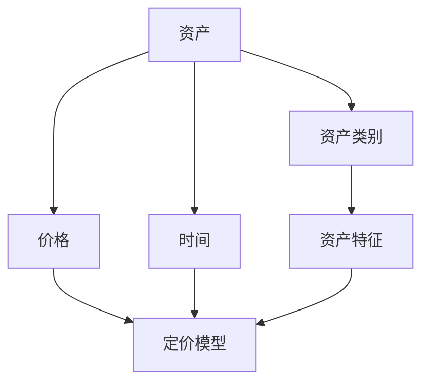

                 


# 机器学习在另类资产定价中的应用研究

## 关键词：  
机器学习, 资产定价, 另类资产, 金融模型, 算法实现

## 摘要：  
本文深入探讨了机器学习在另类资产定价中的应用，结合实际案例和算法实现，详细分析了如何利用机器学习技术解决传统金融模型在另类资产定价中的局限性。通过监督学习和非监督学习算法的对比，构建了一个完整的系统架构，从数据采集到模型部署的全过程进行了详细阐述，为读者提供了一套实用的解决方案。

---

## 第一部分: 背景介绍与问题背景

### 第1章: 问题背景

#### 1.1 问题背景
- **另类资产的定义与特点**: 另类资产是指传统股票、债券等传统金融资产之外的资产类别，如房地产、私募股权、艺术品等。这些资产具有非流动性高、价格波动大、数据获取难等特点。
- **传统资产定价模型的局限性**: 传统金融模型如CAPM和APT在处理非标准化、低流动性资产时表现不佳，难以捕捉复杂市场关系。
- **机器学习在金融领域的潜力**: 机器学习能够处理非结构化数据，发现复杂模式，提高预测精度，为另类资产定价提供了新的可能性。

#### 1.2 问题描述
- **另类资产定价的核心问题**: 如何利用数据驱动的方法，准确预测资产价格，降低定价偏差。
- **数据特征与挑战**: 数据稀疏性、噪声干扰、非线性关系等问题增加了模型构建的难度。
- **机器学习在定价中的应用目标**: 利用机器学习算法，构建高精度的定价模型，优化传统定价方法的不足。

---

## 第二部分: 核心概念与联系

### 第2章: 核心概念与联系

#### 2.1 核心概念原理
- **机器学习的基本原理**: 通过数据训练模型，学习数据中的模式和特征，实现预测或分类。
- **另类资产定价的关键要素**: 包括资产的基本面分析、市场情绪、宏观经济指标等。
- **机器学习与金融定价的结合点**: 利用机器学习处理非结构化数据，捕捉市场情绪，预测价格走势。

#### 2.2 核心概念属性特征对比
| 比较维度 | 传统定价模型 | 机器学习模型 |
|----------|--------------|--------------|
| 数据需求 | 高结构化数据 | 支持结构化与非结构化数据 |
| 模型复杂度 | 线性假设 | 非线性复杂模型支持 |
| 适用场景 | 标准化资产 | 另类资产与复杂场景 |

#### 2.3 ER实体关系图架构


---

## 第三部分: 算法原理讲解

### 第3章: 算法原理讲解

#### 3.1 监督学习算法
- **线性回归**: 用于预测连续型变量，如房价预测。
  $$ y = \beta_0 + \beta_1x + \epsilon $$
- **支持向量回归**: 通过寻找最大边距，实现非线性回归。
- **随机森林回归**: 通过集成学习，提高模型鲁棒性。

#### 3.2 非监督学习算法
- **K均值聚类**: 将资产分为若干类别，分析其价格走势。
- **层次聚类**: 通过层次结构展示资产之间的相似性。
- **DBSCAN聚类**: 基于密度的聚类算法，发现数据中的簇。

#### 3.3 算法实现
- **线性回归的数学模型**: $$ y = \beta_0 + \beta_1x + \epsilon $$
- **随机森林的投票机制**: 集成多个决策树的结果，取多数预测值。
- **聚类算法的评估指标**: 如 silhouette score 和 davies-bouldin score。

---

## 第四部分: 系统分析与架构设计方案

### 第4章: 系统分析与架构设计方案

#### 4.1 问题场景介绍
- **另类资产定价的典型场景**: 如房地产价格预测、私募股权估值。
- **机器学习系统的应用需求**: 高效的数据处理能力，精准的模型预测。

#### 4.2 系统功能设计
- **数据采集模块**: 获取资产数据，包括价格、交易量、市场指数等。
- **特征工程模块**: 构建特征，如技术指标、宏观经济指标。
- **模型训练模块**: 训练机器学习模型，评估模型性能。
- **模型部署模块**: 部署模型，提供实时定价服务。

#### 4.3 系统架构设计


#### 4.4 系统接口设计
- **数据接口**: 数据采集模块与存储模块的接口。
- **模型接口**: 模型训练模块与部署模块的接口。
- **用户接口**: 用户与定价系统的交互界面。

---

## 第五部分: 项目实战

### 第5章: 项目实战

#### 5.1 环境安装
- **安装Python**: 使用Anaconda或虚拟环境。
- **安装机器学习库**: 如scikit-learn、xgboost、pandas。
- **安装数据处理工具**: 如pandas、numpy、matplotlib。

#### 5.2 核心实现
- **数据清洗与预处理**: 去除缺失值，标准化数据。
- **特征工程实现**: 构建技术指标，如移动平均线、相对强弱指数。
- **模型训练与优化**: 使用交叉验证优化模型参数。
- **模型部署与测试**: 部署模型，测试其预测能力。

#### 5.3 代码应用解读
- **数据处理代码**: 
  ```python
  import pandas as pd
  data = pd.read_csv('asset_data.csv')
  data.dropna(inplace=True)
  ```
- **模型训练代码**:
  ```python
  from sklearn.ensemble import RandomForestRegressor
  model = RandomForestRegressor(n_estimators=100, random_state=42)
  model.fit(X_train, y_train)
  ```

#### 5.4 实际案例分析
- **案例分析**: 以房地产价格预测为例，展示模型的应用。
- **结果解读**: 解释模型预测结果，分析误差来源。

---

## 第六部分: 总结与展望

### 第6章: 总结与展望

#### 6.1 总结
- **核心成果**: 机器学习在另类资产定价中的应用显著提高了定价精度。
- **关键经验**: 数据预处理和特征工程是模型性能的关键因素。
- **改进建议**: 进一步研究深度学习算法，优化模型性能。

#### 6.2 展望
- **未来发展方向**: 探索深度学习在另类资产定价中的应用。
- **注意事项**: 注意模型的可解释性，避免过拟合。
- **最佳实践 tips**: 数据清洗是关键，特征工程要结合业务知识。

---

通过以上步骤，我们构建了一个完整的机器学习定价系统，从理论到实践，全面展示了机器学习在另类资产定价中的应用。未来，随着技术的进步，机器学习将继续推动金融领域的创新，为另类资产定价提供更高效、更精准的解决方案。

