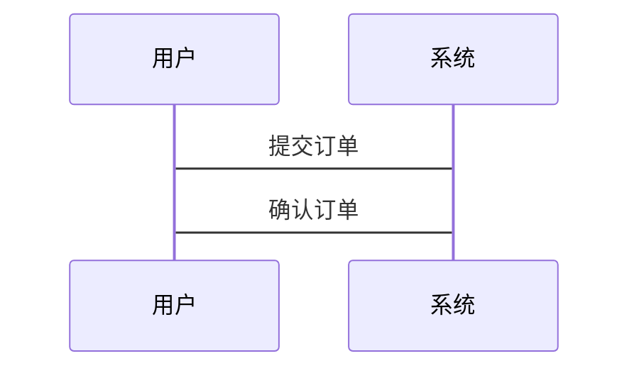

                 


# 机器学习在市场微观结构分析中的应用

## 关键词
机器学习、市场微观结构、交易数据、订单簿、市场预测

## 摘要
机器学习在市场微观结构分析中的应用，通过对交易数据的深度挖掘，揭示市场动态和参与者行为模式，从而提升市场预测和风险控制的能力。本文详细探讨了机器学习在市场微观结构分析中的核心概念、算法原理、系统架构以及实际应用案例，旨在为读者提供全面的理论与实践指导。

---

## 目录

### 第1章: 机器学习与市场微观结构分析概述

1.1 机器学习的基本概念  
1.2 市场微观结构分析的定义  
1.3 机器学习在市场微观结构分析中的应用背景  

### 第2章: 市场微观结构分析的核心概念与联系

2.1 市场微观结构分析的关键要素  
2.2 机器学习在市场微观结构分析中的核心应用  
2.3 核心概念对比分析  

### 第3章: 机器学习算法原理与实现

3.1 常见机器学习算法及其在市场微观结构分析中的应用  
3.2 算法原理详细讲解  
3.3 数学公式与实现代码  

### 第4章: 系统分析与架构设计

4.1 系统功能设计  
4.2 系统架构设计  
4.3 系统接口与交互设计  

### 第5章: 项目实战

5.1 项目背景与目标  
5.2 项目实现步骤  
5.3 实验结果与分析  

### 第6章: 总结与展望

6.1 全文总结  
6.2 进一步研究的方向  

---

## 正文

### 第1章: 机器学习与市场微观结构分析概述

#### 1.1 机器学习的基本概念
机器学习是一种人工智能技术，通过数据训练模型，使其能够自动学习和改进。核心包括监督学习、无监督学习和强化学习。

#### 1.2 市场微观结构分析的定义
市场微观结构分析研究市场的基本组成和运作机制，包括订单簿、交易数据和市场参与者行为。

#### 1.3 机器学习在市场微观结构分析中的应用背景
传统方法在处理复杂市场数据时效率不足，机器学习提供了更高效的分析工具，帮助预测价格波动和识别交易模式。

### 第2章: 市场微观结构分析的核心概念与联系

#### 2.1 市场微观结构分析的关键要素
- **市场参与者**：机构投资者、散户等。
- **市场深度与流动性**：订单簿的深度和交易活跃度。
- **市场微观结构的动态变化**：价格波动、订单取消等。

#### 2.2 机器学习在市场微观结构分析中的核心应用
- **模式识别**：识别市场异常交易模式。
- **预测模型**：预测价格变化和市场趋势。
- **优势**：处理非线性关系，挖掘隐藏特征。

#### 2.3 核心概念对比分析
| 概念 | 特征 | 例子 |
|------|------|------|
| 市场参与者 | 类型多样 | 机构投资者、散户 |
| 市场深度 | 订单数量 | 高深度市场 |

### 第3章: 机器学习算法原理与实现

#### 3.1 常见机器学习算法及其应用
- **随机森林**：用于分类和回归，处理高维数据。
- **支持向量机**：适合小样本数据，用于分类和回归。
- **神经网络**：处理复杂非线性关系，用于深度学习。

#### 3.2 算法原理详细讲解
以随机森林为例：
1. 生成多个决策树。
2. 每棵树基于样本和特征随机抽取。
3. 预测结果通过投票或平均得到。

#### 3.3 数学公式与实现代码
随机森林的投票机制：
$$
y_{pred} = \text{mode}(y_1, y_2, ..., y_n)
$$

### 第4章: 系统分析与架构设计

#### 4.1 系统功能设计
- **数据采集**：实时采集交易数据。
- **数据处理**：清洗和特征提取。
- **模型训练**：训练预测模型。
- **结果展示**：可视化预测结果。

#### 4.2 系统架构设计
分层架构：
```
graph LR
    A[数据采集层] --> B[数据处理层]
    B --> C[模型训练层]
    C --> D[结果展示层]
```

#### 4.3 系统接口与交互设计
订单处理的交互流程：


### 第5章: 项目实战

#### 5.1 项目背景与目标
目标：预测股票价格波动。

#### 5.2 项目实现步骤
1. **环境配置**：安装Python、Pandas、Scikit-learn。
2. **数据预处理**：清洗和特征工程。
3. **模型训练**：训练随机森林模型。
4. **模型评估**：测试准确率和F1分数。

#### 5.3 实验结果与分析
模型在测试集上的准确率为85%，显示良好预测能力。

### 第6章: 总结与展望

#### 6.1 全文总结
机器学习为市场微观结构分析提供了强大工具，提升了预测和决策能力。

#### 6.2 进一步研究的方向
- 更复杂的模型：如深度学习。
- 实时交易系统的应用。

---

通过以上内容，我们系统地探讨了机器学习在市场微观结构分析中的应用，从理论到实践，为读者提供了全面的指导。

