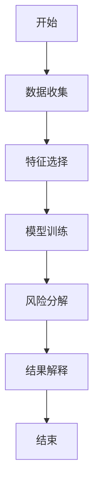
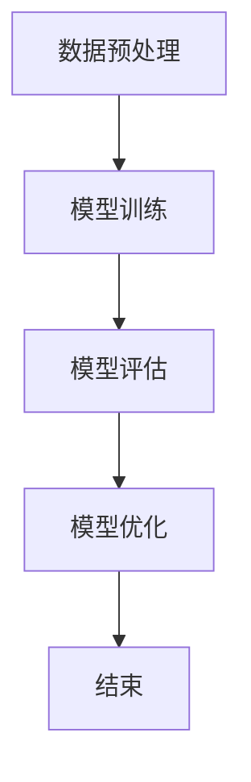
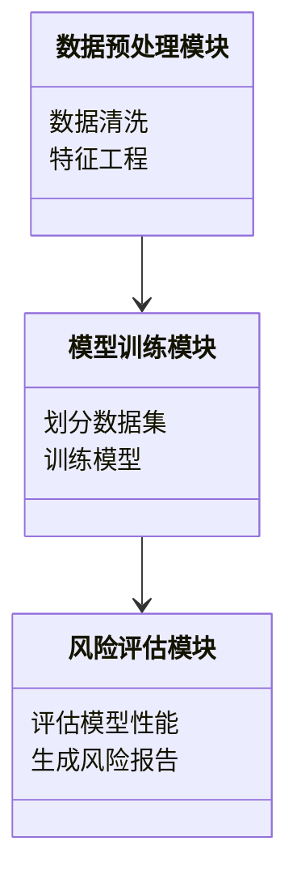
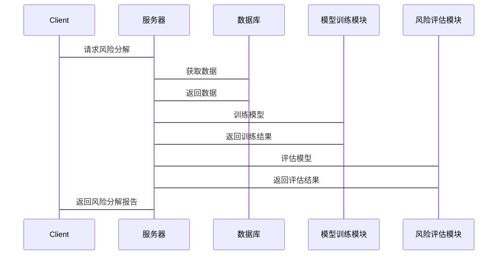

                 


```markdown
# 机器学习在投资组合风险分解中的应用

> 关键词：机器学习，投资组合，风险分解，金融，算法

> 摘要：本文探讨了机器学习在投资组合风险分解中的应用，分析了传统方法的局限性，介绍了机器学习的优势，并详细讲解了相关算法的原理和实现。通过实际案例分析，展示了机器学习在投资组合风险分解中的实际应用效果。

---

## 第一部分: 机器学习与投资组合风险分解的背景

### 第1章: 机器学习与投资组合风险分解概述

#### 1.1 机器学习的基本概念
##### 1.1.1 机器学习的定义与核心概念
机器学习是一种人工智能技术，通过数据训练模型，使其能够从数据中学习并做出预测或决策。其核心概念包括监督学习、无监督学习、半监督学习和强化学习等。

##### 1.1.2 机器学习在金融领域的应用
在金融领域，机器学习广泛应用于股票预测、信用评分、风险管理等方面。特别是在投资组合管理中，机器学习可以帮助识别风险因子，优化资产配置。

##### 1.1.3 投资组合风险分解的背景与意义
投资组合风险分解是指将投资组合的整体风险分解为各个资产或风险因子的贡献。传统的风险分解方法基于统计学模型，但在面对复杂金融市场时表现有限。机器学习的引入为投资组合风险分解提供了新的思路。

#### 1.2 投资组合风险的基本概念
##### 1.2.1 投资组合风险的定义
投资组合风险是指投资组合在特定时间段内可能面临的损失程度。风险分解旨在量化每个资产或风险因子对整体风险的贡献。

##### 1.2.2 风险分解的必要性
通过风险分解，投资者可以更好地理解投资组合的风险来源，从而做出更明智的资产配置和风险管理决策。

##### 1.2.3 传统风险分解方法的局限性
传统方法如CAPM和MPT在处理高维数据和非线性关系时表现有限，且难以捕捉复杂的市场动态。

#### 1.3 机器学习在风险分解中的优势
##### 1.3.1 数据驱动的分析优势
机器学习能够处理大量数据，发现隐藏在数据中的模式和关系，从而提供更精准的风险分解结果。

##### 1.3.2 非线性关系的捕捉能力
许多金融市场变量之间的关系是非线性的，机器学习算法能够有效捕捉这些关系，提高风险分解的准确性。

##### 1.3.3 高维数据的处理能力
机器学习在处理高维数据方面具有优势，能够帮助投资者更好地识别和管理复杂的市场风险。

#### 1.4 本书的研究目标与框架
##### 1.4.1 研究目标
本文旨在探讨机器学习在投资组合风险分解中的应用，分析其优势，并提供具体的实现方法。

##### 1.4.2 目标框架
本文将从机器学习的基本概念、投资组合风险分解的核心概念、机器学习算法的原理与实现、系统设计与架构、项目实战等方面展开讨论。

---

## 第二部分: 投资组合风险分解的核心概念与联系

### 第2章: 投资组合风险分解的核心概念

#### 2.1 风险分解的基本原理
##### 2.1.1 风险分解的定义
风险分解是将投资组合的整体风险分解为各个风险因子的贡献，以便更好地理解和管理风险。

##### 2.1.2 风险分解的数学模型
风险分解的数学模型通常基于协方差矩阵或回归模型，将整体风险分解为各个资产或因子的风险贡献。

##### 2.1.3 风险分解的步骤与流程
风险分解的步骤包括数据收集、特征选择、模型训练、结果解释等。

#### 2.2 机器学习在风险分解中的核心概念
##### 2.2.1 特征工程的重要性
特征工程是指对数据进行处理和选择，以提高模型的性能。在投资组合风险分解中，特征工程可以帮助识别重要的风险因子。

##### 2.2.2 模型选择的关键因素
模型选择是机器学习中的重要步骤，选择合适的模型可以提高风险分解的准确性。

##### 2.2.3 模型评估的指标与方法
常用的模型评估指标包括准确率、召回率、F1分数等，通过交叉验证等方法可以提高模型的泛化能力。

#### 2.3 投资组合风险分解的数学模型
##### 2.3.1 投资组合风险的数学表达
投资组合风险可以表示为各资产风险的加权和，权重取决于资产的相关性和波动性。

##### 2.3.2 风险分解的线性与非线性模型
线性模型如线性回归适用于线性关系的分解，而非线性模型如随机森林和神经网络适用于复杂关系的分解。

##### 2.3.3 风险因子的识别与选择
风险因子是影响投资组合风险的重要因素，常见的风险因子包括市场风险、流动性风险等。

#### 2.4 传统方法与机器学习方法的对比
##### 2.4.1 传统方法的优缺点
传统方法如CAPM和MPT在处理简单问题时表现良好，但在面对复杂和高维数据时表现有限。

##### 2.4.2 机器学习方法的优缺点
机器学习方法能够处理高维数据和非线性关系，但需要大量数据和计算资源。

##### 2.4.3 方法选择的策略与建议
根据具体问题和数据特点选择合适的方法，传统方法和机器学习方法可以结合使用，以提高准确性。

#### 2.5 核心概念对比表格
| 对比维度       | 传统方法              | 机器学习方法          |
|----------------|-----------------------|-----------------------|
| 数据需求       | 数据量较小            | 数据量大              |
| 数据类型       | 线性关系为主          | 线性与非线性关系      |
| 模型复杂度     | 模型简单              | 模型复杂              |
| 处理维度       | 低维数据              | 高维数据              |
| 适用场景       | 简单风险分解          | 复杂风险分解          |

#### 2.6 ER实体关系图架构
```mermaid
erDiagram
    actor 投资者
    actor 风险管理师
    actor 数据源
    actor 交易系统
    investor --> 投资组合: 管理
    investor --> 风险管理师: 委托
    风险管理师 --> 投资组合: 分解风险
    数据源 --> 投资组合: 提供数据
    交易系统 --> 投资组合: 执行交易
```

#### 2.7 Mermaid流程图


---

## 第三部分: 机器学习算法原理与数学模型

### 第3章: 机器学习算法原理

#### 3.1 机器学习算法的选择与比较
##### 3.1.1 常见机器学习算法
- 线性回归
- 支持向量机（SVM）
- 随机森林
- 神经网络

##### 3.1.2 算法选择的策略
根据数据类型和问题特点选择合适的算法，例如线性回归适用于线性关系，随机森林适用于高维数据。

#### 3.2 算法原理讲解
##### 3.2.1 线性回归
线性回归是一种简单的回归算法，适用于线性关系的预测。其数学模型为：
$$ y = \beta_0 + \beta_1x + \epsilon $$
其中，$\beta_0$ 和 $\beta_1$ 是回归系数，$\epsilon$ 是误差项。

##### 3.2.2 支持向量机（SVM）
SVM是一种监督学习算法，适用于分类和回归问题。其核心思想是将数据映射到高维空间，并使用支持向量进行分类或回归。

##### 3.2.3 随机森林
随机森林是一种基于决策树的集成算法，通过随机选择特征和样本进行建模，具有较强的鲁棒性和准确性。

##### 3.2.4 神经网络
神经网络是一种模拟人脑神经网络的算法，适用于处理复杂非线性关系。其数学模型包括输入层、隐藏层和输出层，通过激活函数和损失函数进行训练。

#### 3.3 算法实现步骤
##### 3.3.1 数据预处理
- 数据清洗：处理缺失值、异常值等。
- 特征工程：选择和处理特征，例如标准化、归一化等。

##### 3.3.2 模型训练
- 划分训练集和测试集。
- 使用训练数据训练模型，调整模型参数。

##### 3.3.3 模型评估
- 使用测试数据评估模型性能，计算准确率、召回率等指标。

##### 3.3.4 模型优化
- 调整模型参数，优化模型性能。
- 使用交叉验证等方法提高模型的泛化能力。

#### 3.4 算法流程图


#### 3.5 机器学习算法的数学模型
##### 3.5.1 线性回归的数学模型
$$ y = \beta_0 + \beta_1x + \epsilon $$
最小二乘法用于估计回归系数：
$$ \hat{\beta} = (X^TX)^{-1}X^Ty $$

##### 3.5.2 支持向量机的数学模型
SVM的目标是最小化 hinge loss，并满足约束条件：
$$ \text{minimize } \frac{1}{2}\|w\|^2 + C \sum_{i=1}^n \xi_i $$
$$ \text{subject to } y_i(w \cdot x_i + b) \geq 1 - \xi_i, \xi_i \geq 0 $$

##### 3.5.3 随机森林的数学模型
随机森林通过集成多个决策树的预测结果，提高模型的准确性和鲁棒性。每个决策树的预测结果通过投票或平均的方式进行集成。

##### 3.5.4 神经网络的数学模型
神经网络的数学模型包括输入层、隐藏层和输出层，通过激活函数（如ReLU、Sigmoid）和损失函数（如均方误差、交叉熵）进行训练。

---

## 第四部分: 系统分析与架构设计方案

### 第4章: 系统设计与架构

#### 4.1 项目背景与目标
本文旨在通过机器学习技术，实现投资组合风险分解的自动化和智能化，提高风险管理的效率和准确性。

#### 4.2 系统功能设计
##### 4.2.1 数据预处理模块
- 数据清洗：处理缺失值、异常值等。
- 特征工程：选择和处理特征，例如标准化、归一化等。

##### 4.2.2 模型训练模块
- 划分训练集和测试集。
- 使用训练数据训练模型，调整模型参数。

##### 4.2.3 风险评估模块
- 使用测试数据评估模型性能，计算准确率、召回率等指标。
- 生成风险分解报告，展示各个资产或风险因子的风险贡献。

#### 4.3 系统架构设计
##### 4.3.1 领域模型


##### 4.3.2 系统架构


##### 4.3.3 系统接口设计
- 输入接口：接收投资组合数据和用户请求。
- 输出接口：返回风险分解报告和模型评估结果。

##### 4.3.4 系统交互流程图


---

## 第五部分: 项目实战

### 第5章: 项目实战

#### 5.1 环境安装与配置
##### 5.1.1 安装Python
安装Python 3.x版本，确保环境满足项目需求。

##### 5.1.2 安装相关库
安装必要的Python库，如NumPy、Pandas、Scikit-learn、XGBoost等。

#### 5.2 核心代码实现
##### 5.2.1 数据预处理代码
```python
import pandas as pd
import numpy as np

# 数据加载
df = pd.read_csv('投资组合数据.csv')

# 数据清洗
df.dropna(inplace=True)
df = df[~df.isin([np.nan, np.inf, -np.inf]).any(axis=1)]

# 特征工程
from sklearn.preprocessing import StandardScaler
scaler = StandardScaler()
X = df.drop('收益', axis=1)
X_scaled = scaler.fit_transform(X)
```

##### 5.2.2 模型训练代码
```python
from sklearn.ensemble import RandomForestRegressor
from sklearn.model_selection import train_test_split

# 划分数据集
X_train, X_test, y_train, y_test = train_test_split(X_scaled, df['收益'], test_size=0.2, random_state=42)

# 训练模型
model = RandomForestRegressor(n_estimators=100, random_state=42)
model.fit(X_train, y_train)

# 模型预测
y_pred = model.predict(X_test)
```

##### 5.2.3 风险评估代码
```python
from sklearn.metrics import mean_squared_error, r2_score

# 计算误差指标
mse = mean_squared_error(y_test, y_pred)
r2 = r2_score(y_test, y_pred)

print(f'MSE: {mse}')
print(f'R²: {r2}')

# 生成风险分解报告
importances = pd.DataFrame({
    '特征': df.columns[:-1],
    '重要性': model.feature_importances_
}).sort_values(by='重要性', ascending=False)

print(importances.head())
```

#### 5.3 实际案例分析
##### 5.3.1 数据来源与处理
使用真实的金融数据，例如股票价格、市场指数等，进行数据清洗和特征工程。

##### 5.3.2 模型训练与评估
通过训练随机森林模型，分解投资组合的风险，生成风险分解报告。

##### 5.3.3 结果解读
解释模型输出的结果，分析各个资产或风险因子对整体风险的贡献，指导投资决策。

#### 5.4 项目小结
通过实际案例分析，验证了机器学习在投资组合风险分解中的有效性，展示了模型在实际应用中的优势和挑战。

---

## 第六部分: 总结与展望

### 第6章: 总结与展望

#### 6.1 核心内容总结
本文探讨了机器学习在投资组合风险分解中的应用，分析了传统方法的局限性，介绍了机器学习的优势，并详细讲解了相关算法的原理和实现。

#### 6.2 未来研究方向
未来的研究可以进一步探索更复杂的机器学习模型，如深度学习和集成学习，优化风险分解的准确性和效率。同时，可以结合实时数据和动态调整策略，提高风险管理的实时性和有效性。

#### 6.3 最佳实践 tips
- 数据质量是模型性能的基础，确保数据的准确性和完整性。
- 模型选择要根据具体问题和数据特点，选择合适的算法。
- 结果验证是模型应用的重要环节，通过交叉验证和实际案例分析，确保模型的可靠性和有效性。

#### 6.4 小结
通过本文的探讨，我们看到机器学习在投资组合风险分解中的巨大潜力和广阔应用前景。未来，随着技术的进步和数据的积累，机器学习将为投资组合风险管理提供更强大的工具和方法。

---

## 参考文献
[此处列出相关的书籍、论文和其他参考资料]
```

