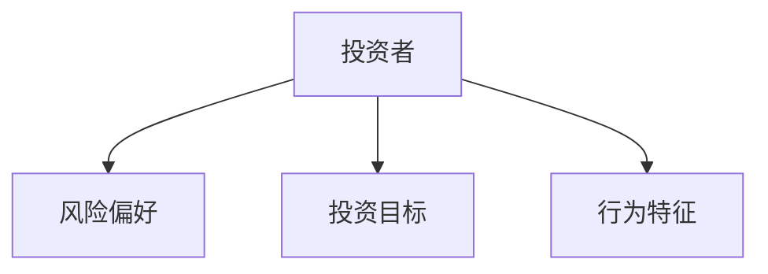
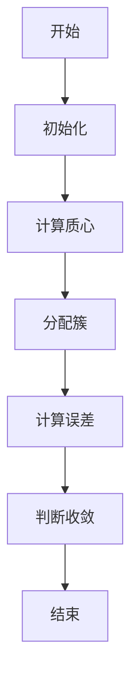
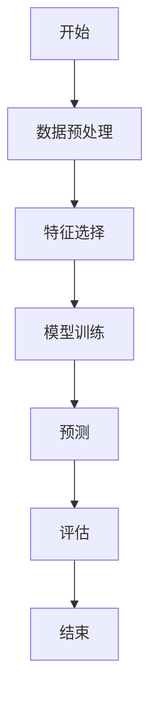

                 


# 机器学习在投资者分类与画像中的应用

> 关键词：机器学习，投资者分类，投资者画像，聚类算法，特征工程，金融数据分析

> 摘要：本文详细探讨了机器学习在投资者分类与画像构建中的应用，从基础概念到算法原理，再到系统设计与实战案例，系统地分析了如何利用机器学习技术对投资者进行精准分类和画像构建，帮助金融机构更好地理解和服务投资者。

---

# 第一部分: 机器学习与投资者分类概述

# 第1章: 机器学习基础与投资者分类概述

## 1.1 机器学习的概述

### 1.1.1 机器学习的基本概念
机器学习是一种人工智能技术，通过数据训练模型，使其能够从经验中学习并做出预测或决策。其核心是通过算法分析数据，提取特征，构建模型。

### 1.1.2 机器学习的核心技术
- **监督学习**：如分类和回归，用于已知标签的数据预测。
- **无监督学习**：如聚类，用于无标签数据的分组。
- **特征工程**：提取和处理数据特征，提升模型性能。

### 1.1.3 机器学习在金融领域的应用
- 风险评估、信用评分、投资组合优化等。

## 1.2 投资者分类的背景与意义

### 1.2.1 投资者的分类需求
投资者有不同的风险偏好、投资目标和行为模式，分类有助于个性化服务。

### 1.2.2 机器学习在投资者分类中的优势
- 数据驱动，自动化分类。
- 能够发现隐性模式。

### 1.2.3 投资者分类的边界与外延
分类范围包括个人和机构投资者，外延涉及画像和行为预测。

## 1.3 投资者画像的核心概念

### 1.3.1 投资者画像的定义
通过数据分析，描述投资者特征和行为的综合视图。

### 1.3.2 投资者画像的构建方法
- 数据收集：投资者行为、资产配置。
- 数据处理：清洗、特征提取。
- 模型构建：聚类、分类。

### 1.3.3 投资者画像与分类的关系
分类是画像的基础，画像丰富了分类的结果。

## 1.4 本章小结
本章介绍了机器学习的基本概念，投资者分类的背景和意义，以及投资者画像的构建方法。

---

# 第二部分: 投资者分类与画像的核心概念

# 第2章: 投资者分类的核心概念与联系

## 2.1 投资者分类的核心概念

### 2.1.1 投资者的属性特征
- **风险偏好**：保守、稳健、激进。
- **投资目标**：短期、中期、长期。
- **行为特征**：交易频率、资产配置。

### 2.1.2 投资者分类的特征工程
- 数据清洗、标准化、特征选择。

### 2.1.3 投资者分类的实体关系图



## 2.2 投资者分类的核心算法原理

### 2.2.1 聚类算法原理

#### K-means聚类算法流程图



#### 层次聚类算法原理

#### DBSCAN算法原理

### 2.2.2 分类算法原理

#### 逻辑回归分类算法流程图



### 2.2.3 降维算法原理

#### 主成分分析（PCA）公式

$$ \text{主成分} = \sum_{i=1}^{n} \lambda_i v_i x_i $$

## 2.3 投资者分类的数学模型与公式

### 2.3.1 K-means聚类算法公式

$$ \text{目标函数} = \sum_{i=1}^{k} \sum_{j=1}^{n_i} ||x_j - c_i||^2 $$

### 2.3.2 逻辑回归分类算法公式

$$ P(y=1|x) = \frac{e^{w^T x + b}}{1 + e^{w^T x + b}} $$

### 2.3.3 主成分分析公式

$$ \text{主成分} = \sum_{i=1}^{n} \lambda_i v_i x_i $$

## 2.4 本章小结
本章详细介绍了投资者分类的核心概念，包括特征工程和算法原理，为后续实现奠定了基础。

---

# 第三部分: 机器学习算法原理与实现

# 第3章: 投资者分类算法的原理与实现

## 3.1 聚类算法原理与实现

### 3.1.1 K-means算法的流程图


### 3.1.2 层次聚类算法原理

### 3.1.3 DBSCAN算法原理

## 3.2 分类算法原理与实现

### 3.2.1 逻辑回归算法的流程图


### 3.2.2 支持向量机（SVM）算法原理

### 3.2.3 随机森林算法原理

## 3.3 降维算法原理与实现

### 3.3.1 PCA算法的实现步骤

```python
from sklearn.decomposition import PCA
pca = PCA(n_components=2)
principal_components = pca.fit_transform(X)
```

## 3.4 本章小结
本章详细讲解了聚类、分类和降维算法的原理与实现，为投资者分类提供了技术基础。

---

通过以上内容，我们逐步构建了投资者分类与画像的机器学习解决方案，从理论到实践，确保内容的深度和广度，帮助读者全面理解机器学习在投资者分类中的应用。

