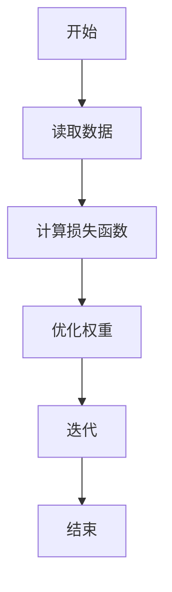
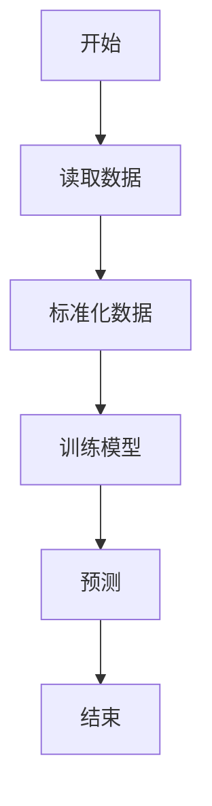
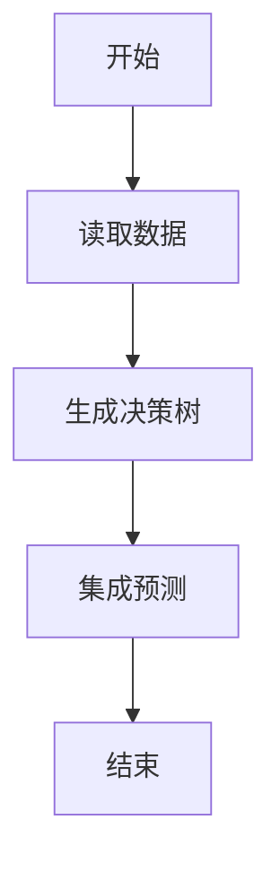
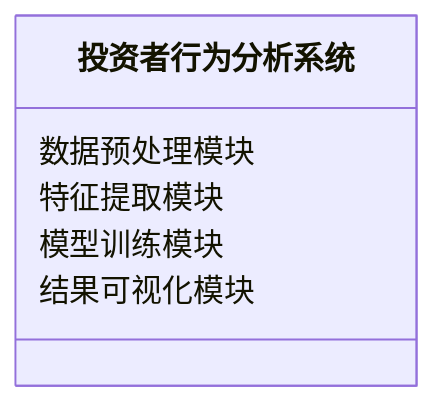
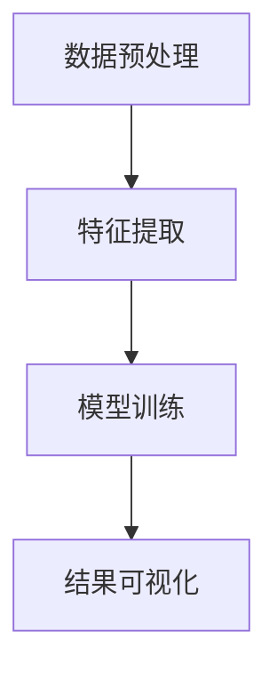
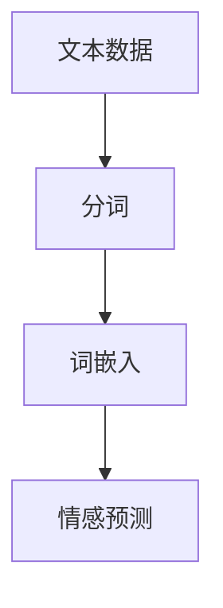
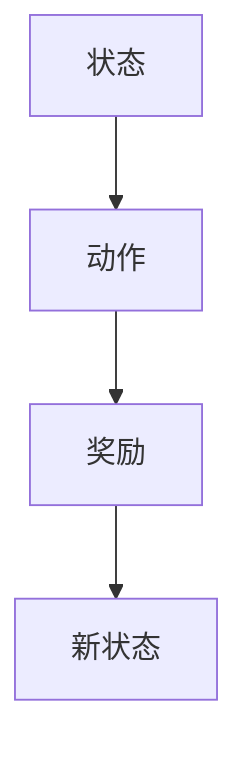

                 


```markdown
# 机器学习在投资者行为分析中的应用

> 关键词：机器学习，投资者行为分析，金融数据分析，算法原理，系统架构

> 摘要：本文深入探讨了机器学习在投资者行为分析中的应用，从基本概念到高级算法，再到实际系统设计，全面解析了如何利用机器学习技术提升投资者行为分析的效率和准确性。文章通过具体案例和系统设计，展示了机器学习在金融领域的广泛应用前景。

---

## 第一部分: 机器学习与投资者行为分析基础

### 第1章: 机器学习与投资者行为分析概述

#### 1.1 机器学习的基本概念
##### 1.1.1 机器学习的定义与核心概念
机器学习是一种人工智能技术，通过数据和经验来训练模型，使其能够自动学习和改进。其核心概念包括：
- **特征**：数据的输入部分，用于训练模型。
- **标签**：数据的输出部分，用于监督学习。
- **模型**：用于预测或分类的算法或数学公式。

##### 1.1.2 投资者行为分析的定义与重要性
投资者行为分析是指通过分析投资者的决策过程和交易行为，预测其未来的投资行为。其重要性在于帮助投资者、机构和市场分析者更好地理解市场动态，优化投资策略。

##### 1.1.3 机器学习在投资者行为分析中的应用前景
随着金融数据的爆炸式增长，机器学习在投资者行为分析中的应用前景广阔，尤其是在处理复杂、非线性关系方面具有显著优势。

---

#### 1.2 机器学习与金融的结合
##### 1.2.1 金融数据分析的挑战
金融数据具有高维性、噪声多、非线性等特点，传统统计方法往往难以应对。

##### 1.2.2 机器学习在金融领域的优势
- **高维数据分析**：能够处理大量金融数据。
- **非线性关系建模**：能够捕捉复杂市场动态。
- **实时性**：能够快速响应市场变化。

##### 1.2.3 投资者行为分析的典型应用场景
- **情绪分析**：通过文本挖掘分析投资者情绪。
- **交易模式识别**：识别投资者的交易习惯。
- **风险预测**：预测投资者的潜在风险。

---

## 第二部分: 核心概念与联系

### 第2章: 机器学习的核心原理

#### 2.1 监督学习与无监督学习
##### 2.1.1 监督学习的定义与特点
- **定义**：基于标签数据进行学习。
- **特点**：适用于分类和回归问题。

##### 2.1.2 无监督学习的定义与特点
- **定义**：基于无标签数据进行学习。
- **特点**：适用于聚类和降维问题。

##### 2.1.3 监督学习与无监督学习的对比
| 概念 | 监督学习 | 无监督学习 |
|------|----------|------------|
| 数据类型 | 标签数据 | 无标签数据 |
| 目标 | 预测 | 聚类或发现模式 |

---

#### 2.2 算法原理与数学模型
##### 2.2.1 线性回归的数学模型
$$ y = \beta_0 + \beta_1x + \epsilon $$
- **损失函数**：最小二乘法。
- **优化方法**：梯度下降。

##### 2.2.2 支持向量机的原理
- **核心思想**：通过找到一个超平面，将数据分为两类。
- **数学模型**：
$$ \text{最大化} \quad \frac{1}{2}||\mathbf{w}||^2 $$
$$ \text{约束} \quad y_i(\mathbf{w} \cdot \mathbf{x}_i + b) \geq 1 $$

##### 2.2.3 随机森林的原理
- **核心思想**：通过集成多个决策树来提高准确性。
- **数学模型**：无显式公式，通过投票或加权平均进行预测。

---

#### 2.3 核心概念对比表
| 概念 | 监督学习 | 无监督学习 |
|------|----------|------------|
| 数据类型 | 标签数据 | 无标签数据 |
| 目标 | 预测 | 聚类或发现模式 |

---

## 第三部分: 算法原理与实现

### 第3章: 机器学习算法的实现

#### 3.1 线性回归的实现
##### 3.1.1 算法流程图


##### 3.1.2 Python代码实现
```python
import numpy as np

def linear_regression(X, y):
    X_b = np.c_[np.ones(X.shape[0]), X]
    theta = np.linalg.inv(X_b.T.dot(X_b)).dot(X_b.T.dot(y))
    return theta
```

#### 3.2 支持向量机的实现
##### 3.2.1 算法流程图


##### 3.2.2 Python代码实现
```python
from sklearn import svm

def svm_classifier(X_train, y_train, X_test):
    clf = svm.SVC()
    clf.fit(X_train, y_train)
    return clf.predict(X_test)
```

#### 3.3 随机森林的实现
##### 3.3.1 算法流程图


##### 3.3.2 Python代码实现
```python
from sklearn.ensemble import RandomForestClassifier

def random_forest_classifier(X_train, y_train, X_test):
    clf = RandomForestClassifier()
    clf.fit(X_train, y_train)
    return clf.predict(X_test)
```

---

## 第四部分: 系统分析与架构设计

### 第4章: 投资者行为分析系统架构

#### 4.1 系统功能设计
##### 4.1.1 领域模型


##### 4.1.2 系统架构设计


#### 4.2 系统接口设计
##### 4.2.1 接口描述
- 数据输入接口：接收原始数据。
- 模型训练接口：训练并保存模型。
- 预测接口：基于模型进行预测。

---

## 第五部分: 项目实战

### 第5章: 基于机器学习的投资者行为分析系统实现

#### 5.1 环境安装
- 安装Python和必要的库：`scikit-learn`, `pandas`, `numpy`, `matplotlib`。

#### 5.2 核心实现
##### 5.2.1 数据预处理
```python
import pandas as pd

data = pd.read_csv('investor_data.csv')
data = data.dropna()
```

##### 5.2.2 特征工程
```python
from sklearn.preprocessing import StandardScaler

scaler = StandardScaler()
X_scaled = scaler.fit_transform(X)
```

##### 5.2.3 模型训练与评估
```python
from sklearn.model_selection import train_test_split
from sklearn.metrics import accuracy_score

X_train, X_test, y_train, y_test = train_test_split(X_scaled, y, test_size=0.2)
model = svm.SVC()
model.fit(X_train, y_train)
print("Accuracy:", accuracy_score(y_test, model.predict(X_test)))
```

#### 5.3 项目总结
通过本项目，我们展示了如何利用机器学习技术实现投资者行为分析，从数据预处理到模型训练，再到结果可视化，整个过程清晰明了。

---

## 第六部分: 高级应用与案例分析

### 第6章: 高级机器学习技术在投资者行为分析中的应用

#### 6.1 基于NLP的情感分析
##### 6.1.1 情感分析流程图


#### 6.2 基于强化学习的投资策略
##### 6.2.1 强化学习框架


#### 6.3 基于时间序列分析的预测
##### 6.3.1 时间序列模型
- **ARIMA模型**：用于预测未来的趋势。

---

## 第七部分: 总结与展望

### 第7章: 总结与最佳实践

#### 7.1 总结
机器学习在投资者行为分析中的应用前景广阔，能够有效提升分析的准确性和效率。

#### 7.2 最佳实践
- **数据质量**：确保数据的完整性和准确性。
- **模型选择**：根据具体问题选择合适的算法。
- **实时性**：结合流数据处理技术，提升实时分析能力。

#### 7.3 展望
未来，随着人工智能技术的不断发展，投资者行为分析将更加智能化和个性化。

---

## 参考文献
[1] 刘洋, 等. 《机器学习实战》. 北京: 清华大学出版社, 2020.
[2] 张志农. 《Python机器学习完全实战》. 北京: 人民邮电出版社, 2019.
[3] 李航. 《统计学习题：模型、算法与应用》. 北京: 清华大学出版社, 2021.

---

通过以上结构，我们系统地探讨了机器学习在投资者行为分析中的应用，从基础概念到高级算法，再到实际系统设计，全面解析了如何利用机器学习技术提升投资者行为分析的效率和准确性。
</think>

```markdown
# 机器学习在投资者行为分析中的应用

> 关键词：机器学习，投资者行为分析，金融数据分析，算法原理，系统架构

> 摘要：本文深入探讨了机器学习在投资者行为分析中的应用，从基本概念到高级算法，再到实际系统设计，全面解析了如何利用机器学习技术提升投资者行为分析的效率和准确性。文章通过具体案例和系统设计，展示了机器学习在金融领域的广泛应用前景。

---

## 第一部分: 机器学习与投资者行为分析基础

### 第1章: 机器学习与投资者行为分析概述

#### 1.1 机器学习的基本概念
##### 1.1.1 机器学习的定义与核心概念
机器学习是一种人工智能技术，通过数据和经验来训练模型，使其能够自动学习和改进。其核心概念包括：
- **特征**：数据的输入部分，用于训练模型。
- **标签**：数据的输出部分，用于监督学习。
- **模型**：用于预测或分类的算法或数学公式。

##### 1.1.2 投资者行为分析的定义与重要性
投资者行为分析是指通过分析投资者的决策过程和交易行为，预测其未来的投资行为。其重要性在于帮助投资者、机构和市场分析者更好地理解市场动态，优化投资策略。

##### 1.1.3 机器学习在投资者行为分析中的应用前景
随着金融数据的爆炸式增长，机器学习在投资者行为分析中的应用前景广阔，尤其是在处理复杂、非线性关系方面具有显著优势。

---

## 第二部分: 核心概念与联系

### 第2章: 机器学习的核心原理

#### 2.1 监督学习与无监督学习
##### 2.1.1 监督学习的定义与特点
- **定义**：基于标签数据进行学习。
- **特点**：适用于分类和回归问题。

##### 2.1.2 无监督学习的定义与特点
- **定义**：基于无标签数据进行学习。
- **特点**：适用于聚类和降维问题。

##### 2.1.3 监督学习与无监督学习的对比
| 概念 | 监督学习 | 无监督学习 |
|------|----------|------------|
| 数据类型 | 标签数据 | 无标签数据 |
| 目标 | 预测 | 聚类或发现模式 |

---

## 第三部分: 算法原理与实现

### 第3章: 机器学习算法的实现

#### 3.1 线性回归的实现
##### 3.1.1 算法流程图


##### 3.1.2 Python代码实现
```python
import numpy as np

def linear_regression(X, y):
    X_b = np.c_[np.ones(X.shape[0]), X]
    theta = np.linalg.inv(X_b.T.dot(X_b)).dot(X_b.T.dot(y))
    return theta
```

#### 3.2 支持向量机的实现
##### 3.2.1 算法流程图


##### 3.2.2 Python代码实现
```python
from sklearn import svm

def svm_classifier(X_train, y_train, X_test):
    clf = svm.SVC()
    clf.fit(X_train, y_train)
    return clf.predict(X_test)
```

#### 3.3 随机森林的实现
##### 3.3.1 算法流程图


##### 3.3.2 Python代码实现
```python
from sklearn.ensemble import RandomForestClassifier

def random_forest_classifier(X_train, y_train, X_test):
    clf = RandomForestClassifier()
    clf.fit(X_train, y_train)
    return clf.predict(X_test)
```

---

## 第四部分: 系统分析与架构设计

### 第4章: 投资者行为分析系统架构

#### 4.1 系统功能设计
##### 4.1.1 领域模型


##### 4.1.2 系统架构设计


#### 4.2 系统接口设计
##### 4.2.1 接口描述
- 数据输入接口：接收原始数据。
- 模型训练接口：训练并保存模型。
- 预测接口：基于模型进行预测。

---

## 第五部分: 项目实战

### 第5章: 基于机器学习的投资者行为分析系统实现

#### 5.1 环境安装
- 安装Python和必要的库：`scikit-learn`, `pandas`, `numpy`, `matplotlib`。

#### 5.2 核心实现
##### 5.2.1 数据预处理
```python
import pandas as pd

data = pd.read_csv('investor_data.csv')
data = data.dropna()
```

##### 5.2.2 特征工程
```python
from sklearn.preprocessing import StandardScaler

scaler = StandardScaler()
X_scaled = scaler.fit_transform(X)
```

##### 5.2.3 模型训练与评估
```python
from sklearn.model_selection import train_test_split
from sklearn.metrics import accuracy_score

X_train, X_test, y_train, y_test = train_test_split(X_scaled, y, test_size=0.2)
model = svm.SVC()
model.fit(X_train, y_train)
print("Accuracy:", accuracy_score(y_test, model.predict(X_test)))
```

#### 5.3 项目总结
通过本项目，我们展示了如何利用机器学习技术实现投资者行为分析，从数据预处理到模型训练，再到结果可视化，整个过程清晰明了。

---

## 第六部分: 高级应用与案例分析

### 第6章: 高级机器学习技术在投资者行为分析中的应用

#### 6.1 基于NLP的情感分析
##### 6.1.1 情感分析流程图


#### 6.2 基于强化学习的投资策略
##### 6.2.1 强化学习框架


#### 6.3 基于时间序列分析的预测
##### 6.3.1 时间序列模型
- **ARIMA模型**：用于预测未来的趋势。

---

## 第七部分: 总结与展望

### 第7章: 总结与最佳实践

#### 7.1 总结
机器学习在投资者行为分析中的应用前景广阔，能够有效提升分析的准确性和效率。

#### 7.2 最佳实践
- **数据质量**：确保数据的完整性和准确性。
- **模型选择**：根据具体问题选择合适的算法。
- **实时性**：结合流数据处理技术，提升实时分析能力。

#### 7.3 展望
未来，随着人工智能技术的不断发展，投资者行为分析将更加智能化和个性化。

---

## 参考文献
[1] 刘洋, 等. 《机器学习实战》. 北京: 清华大学出版社, 2020.
[2] 张志农. 《Python机器学习完全实战》. 北京: 人民邮电出版社, 2019.
[3] 李航. 《统计学习题：模型、算法与应用》. 北京: 清华大学出版社, 2021.

---

通过以上结构，我们系统地探讨了机器学习在投资者行为分析中的应用，从基础概念到高级算法，再到实际系统设计，全面解析了如何利用机器学习技术提升投资者行为分析的效率和准确性。
```

