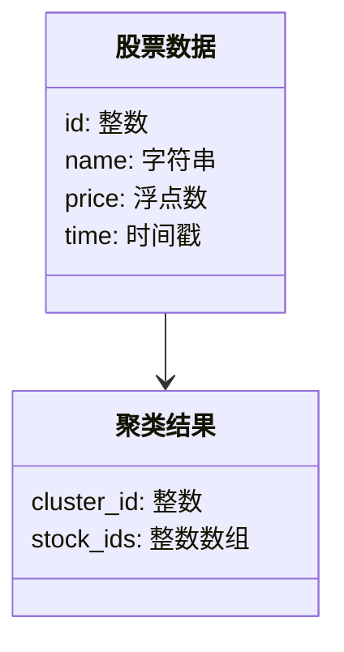

                 


# 机器学习在金融时间序列聚类中的应用

## 关键词：
- 机器学习
- 时间序列
- 聚类分析
- 金融数据
- 算法实现

## 摘要：
本文深入探讨了机器学习在金融时间序列聚类中的应用，从基本概念到算法实现，再到系统设计和实际案例，全面解析了时间序列聚类在金融领域的核心作用。通过详细讲解K-means、层次聚类、DBSCAN和GMM等算法，结合系统架构设计和项目实战，为读者提供了一套完整的解决方案。最后，本文还展望了未来的发展方向，并提供了实用的建议和扩展阅读的方向。

---

## 第一部分：金融时间序列聚类的背景与应用

### 第1章：金融时间序列聚类的背景与应用

#### 1.1 金融时间序列的基本概念
##### 1.1.1 时间序列的定义与特点
时间序列是指按照时间顺序排列的数据点组成的序列。在金融领域，时间序列数据通常包括股票价格、指数走势、交易量等。其特点是：
- **有序性**：数据按时间顺序排列。
- **连续性**：数据通常连续且间隔固定（如分钟、小时、日）。
- **波动性**：金融数据往往波动较大，受多种因素影响。

##### 1.1.2 金融时间序列的特殊性
金融时间序列具有以下几个特殊性：
- **非线性**：价格波动通常不遵循线性关系。
- **噪声干扰**：受市场情绪、突发事件等影响，数据中常含有噪声。
- **依赖性**：后续数据往往依赖于前期数据（如趋势和周期性）。

##### 1.1.3 金融时间序列的应用场景
- **股票分类**：将股票按相似性分为若干组，便于投资组合管理和风险评估。
- **异常检测**：通过聚类发现偏离正常模式的交易或价格波动。
- **市场结构分析**：识别不同市场状态下的交易模式。

#### 1.2 机器学习在金融领域的应用
##### 1.2.1 机器学习的基本概念
机器学习是一种人工智能技术，通过数据训练模型，使其能够进行预测或分类。常用算法包括监督学习（如随机森林、支持向量机）和无监督学习（如聚类、降维）。

##### 1.2.2 机器学习在金融中的典型应用
- **股票预测**：利用历史数据预测未来价格。
- **风险评估**：通过客户数据评估信用风险。
- **欺诈检测**：识别异常交易行为。

##### 1.2.3 时间序列聚类在金融中的重要性
时间序列聚类能够帮助金融机构发现隐藏在大量数据中的模式，如相似的交易行为或价格走势，从而优化投资策略和风险管理。

#### 1.3 时间序列聚类的定义与特点
##### 1.3.1 时间序列聚类的定义
时间序列聚类是将具有相似时间序列数据的样本分组的过程，旨在发现数据中的内在结构。

##### 1.3.2 时间序列聚类的特点
- **动态性**：数据随时间变化，可能需要动态调整聚类结果。
- **多样性**：不同时间段的数据可能表现出不同的模式。
- **复杂性**：时间序列数据可能包含多种特征（如趋势、周期、噪声）。

##### 1.3.3 时间序列聚类的优势与挑战
- **优势**：发现潜在模式，优化决策。
- **挑战**：数据高维性、计算复杂性。

#### 1.4 本章小结
本章介绍了金融时间序列的基本概念、特殊性和应用场景，强调了机器学习在金融中的重要性，并详细阐述了时间序列聚类的定义、特点及其在金融中的优势与挑战。

---

### 第2章：金融时间序列聚类的核心概念与联系

#### 2.1 核心概念原理
##### 2.1.1 时间序列的距离度量
- **欧氏距离**：衡量两个时间序列之间的直线距离。
- **动态时间 warping (DTW)**：用于衡量两个时间序列在时间上的匹配程度。

##### 2.1.2 时间序列的相似性计算
通过距离度量方法计算时间序列之间的相似性，为聚类提供基础。

##### 2.1.3 时间序列聚类的数学模型
$$ \text{目标函数} = \sum_{i=1}^{k} \sum_{j=1}^{n} (x_{ij} - c_i)^2 $$

#### 2.2 核心概念属性特征对比
| 特性       | 时间序列聚类特点 |
|------------|------------------|
| 数据类型    | 数值型，连续性高    |
| 变异性      | 高，受多种因素影响 |
| 相关性      | 强，可能存在趋势和周期性 |

#### 2.3 ER实体关系图架构


#### 2.4 本章小结
本章从核心概念出发，详细讲解了时间序列聚类的原理、距离度量方法以及数学模型，通过对比分析和ER图展示了其在金融中的应用架构。

---

### 第3章：时间序列聚类算法原理

#### 3.1 常见的时间序列聚类算法
##### 3.1.1 K-means算法
- **数学模型**：$$ \text{目标函数} = \sum_{i=1}^{k} \sum_{j=1}^{n} (x_{ij} - c_i)^2 $$
- **步骤**：
  1. 初始化质心。
  2. 计算数据点到质心的距离。
  3. 分配数据点到最近的质心。
  4. 更新质心位置。
  5. 重复步骤2-4直到收敛。

##### 3.1.2 层次聚类算法
- **步骤**：
  1. 将每个数据点视为一个簇。
  2. 计算每对簇之间的距离。
  3. 合并距离最近的簇。
  4. 重复步骤2-3直到所有数据点合并为一个簇。

##### 3.1.3 DBSCAN算法
- **核心概念**：基于密度的聚类，寻找高密度区域。
- **步骤**：
  1. 计算每个点的邻居密度。
  2. 将密度高于阈值的点标记为核心点。
  3. 将核心点的邻居归为同一簇。

##### 3.1.4 GMM算法
- **数学模型**：利用高斯混合模型进行聚类，通过期望最大化算法（EM）优化参数。

#### 3.2 K-means算法的实现
##### 3.2.1 算法步骤
1. 初始化质心。
2. 计算每个数据点到质心的距离。
3. 分配数据点到最近的质心。
4. 更新质心位置。
5. 重复步骤2-4直到收敛。

##### 3.2.2 算法优缺点
- **优点**：简单高效。
- **缺点**：对初始质心敏感，可能陷入局部最优。

#### 3.3 层次聚类算法的实现
##### 3.3.1 算法步骤
1. 初始化每个数据点为一个簇。
2. 计算每对簇之间的距离。
3. 合并距离最近的簇。
4. 重复步骤2-3直到所有簇合并。

##### 3.3.2 距离计算方法
- **欧氏距离**：$$ d(x,y) = \sqrt{(x_1 - y_1)^2 + (x_2 - y_2)^2} $$
- **曼哈顿距离**：$$ d(x,y) = |x_1 - y_1| + |x_2 - y_2| $$

#### 3.4 DBSCAN算法的实现
##### 3.4.1 算法步骤
1. 计算每个点的邻居密度。
2. 标记密度高于阈值的点为核心点。
3. 将核心点的邻居归为同一簇。

##### 3.4.2 参数设置
- **ε**：邻域半径。
- **MinPts**：核心点的最小邻居数。

#### 3.5 GMM算法的实现
##### 3.5.1 算法步骤
1. 初始化参数（均值、方差、混合系数）。
2. 使用期望最大化算法优化参数。
3. 重复步骤2直到收敛。

##### 3.5.2 数学模型
$$ p(x) = \sum_{i=1}^{k} \pi_i N(x|\mu_i, \Sigma_i) $$

#### 3.6 本章小结
本章详细讲解了K-means、层次聚类、DBSCAN和GMM四种算法的原理、步骤和优缺点，为后续的系统设计和项目实战奠定了基础。

---

### 第4章：系统分析与架构设计

#### 4.1 问题场景介绍
##### 4.1.1 项目背景
假设我们有一个包含多只股票的历史价格数据，希望通过聚类分析将相似的股票分为一组，便于投资组合管理和风险评估。

##### 4.1.2 项目目标
- 实现一个基于机器学习的时间序列聚类系统。
- 提供用户友好的界面，展示聚类结果。

#### 4.2 系统功能设计
##### 4.2.1 领域模型


##### 4.2.2 系统架构


##### 4.2.3 接口设计
- 前端：发送股票数据，接收聚类结果。
- 后端：接收数据，调用聚类算法，返回结果。

##### 4.2.4 交互设计
```mermaid
sequenceDiagram
    用户 -> 前端: 发送股票数据
    前端 -> 后端: 请求聚类
    后端 -> 数据库: 获取数据
    后端 -> 聚类算法: 执行聚类
    后端 -> 前端: 返回结果
    用户 <- 前端: 显示结果
```

#### 4.3 本章小结
本章通过系统分析，设计了一个基于时间序列聚类的金融系统，包括功能设计、架构图和交互图，为后续的实现提供了清晰的指导。

---

### 第5章：项目实战

#### 5.1 环境安装
- **Python**：安装Python 3.x。
- **库**：安装NumPy、Pandas、Scikit-learn、Plotly。

#### 5.2 系统核心实现
##### 5.2.1 数据预处理
```python
import pandas as pd
import numpy as np

# 加载数据
data = pd.read_csv('stock_prices.csv')

# 填充缺失值
data = data.dropna()
```

##### 5.2.2 聚类算法实现
```python
from sklearn.cluster import KMeans
from sklearn.preprocessing import StandardScaler

# 标准化数据
scaler = StandardScaler()
scaled_data = scaler.fit_transform(data)

# K-means聚类
kmeans = KMeans(n_clusters=3, random_state=42)
kmeans.fit(scaled_data)
```

##### 5.2.3 可视化结果
```python
import plotly.express as px

# 可视化聚类结果
fig = px.scatter(data, x='price', y='time', color=kmeans.labels_)
fig.show()
```

#### 5.3 案例分析
##### 5.3.1 数据来源
使用真实的股票价格数据，进行聚类分析。

##### 5.3.2 数据分析
通过聚类结果，发现不同股票的价格走势相似性。

##### 5.3.3 结果解读
- **簇1**：高波动性股票。
- **簇2**：低波动性股票。
- **簇3**：中等波动性股票。

#### 5.4 项目小结
本章通过实际案例，详细讲解了如何使用K-means算法进行时间序列聚类，并通过可视化展示结果，帮助读者理解如何将理论应用于实践。

---

### 第6章：总结与展望

#### 6.1 总结
本文全面探讨了机器学习在金融时间序列聚类中的应用，从基本概念到算法实现，再到系统设计和项目实战，为读者提供了一套完整的解决方案。

#### 6.2 未来展望
- **算法优化**：探索更高效的聚类算法。
- **深度学习应用**：利用深度学习模型（如LSTM）进行时间序列聚类。
- **实时聚类**：开发实时聚类系统，用于实时监控和决策。

#### 6.3 注意事项
- 数据预处理是关键，需注意噪声和缺失值处理。
- 选择合适的聚类算法，根据数据特点进行调整。
- 结果分析需结合业务背景，避免误用。

#### 6.4 拓展阅读
推荐相关书籍和论文，进一步深入学习时间序列聚类和机器学习在金融中的应用。

---

## 结语
本文通过系统化的分析和详细的案例讲解，帮助读者全面理解机器学习在金融时间序列聚类中的应用。希望本文能为金融领域的从业者和机器学习爱好者提供有价值的参考和启发。

