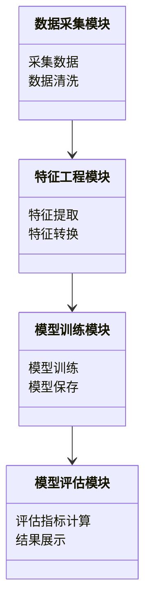
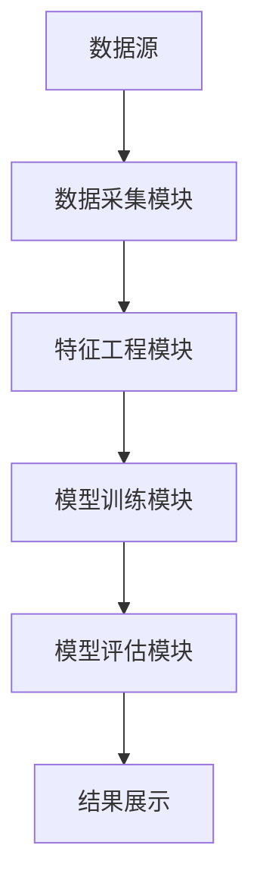
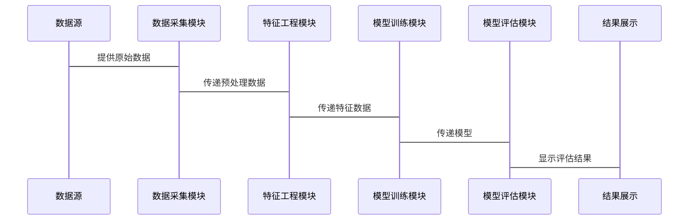

                 


# 机器学习算法在市场预测中的效果评估

> 关键词：机器学习算法、市场预测、效果评估、监督学习、无监督学习、数学模型、系统架构

> 摘要：本文系统地探讨了机器学习算法在市场预测中的效果评估方法。首先，介绍了市场预测的基本概念和机器学习算法的作用。接着，详细讲解了监督学习和无监督学习的核心原理及其在市场预测中的应用。然后，深入分析了常见机器学习算法的数学模型和效果评估指标。最后，通过实际案例展示了如何设计系统架构、实现模型训练和优化，以达到最佳的预测效果。

---

## 第一部分: 机器学习算法在市场预测中的效果评估基础

### 第1章: 市场预测与机器学习算法概述

#### 1.1 市场预测的背景与意义

##### 1.1.1 市场预测的核心概念
市场预测是指通过分析历史数据和当前市场趋势，预测未来市场行为和结果的过程。它是企业制定战略决策的重要依据。市场预测的核心在于数据的分析和模型的构建，而机器学习算法的引入极大地提升了预测的准确性和效率。

##### 1.1.2 机器学习在市场预测中的作用
机器学习通过从大量数据中提取模式和特征，能够有效地预测市场趋势。与传统的统计方法相比，机器学习算法能够处理高维数据和复杂关系，适用于金融市场、销售预测等领域。

##### 1.1.3 机器学习算法的基本分类
机器学习算法主要分为监督学习、无监督学习和强化学习三大类。在市场预测中，监督学习是最常用的，因为它适用于有标签的数据，如股票价格预测。

#### 1.2 机器学习算法的适用场景

##### 1.2.1 监督学习与无监督学习的区别
监督学习需要有标签的训练数据，适合回归和分类任务。无监督学习则适用于无标签数据的聚类分析。例如，监督学习可用于预测股票价格，而无监督学习可用于发现市场趋势的潜在模式。

##### 1.2.2 常见机器学习算法在市场预测中的应用
- **线性回归**：用于预测连续变量，如股票价格。
- **支持向量机（SVM）**：适用于分类和回归，可用于预测市场涨跌。
- **随机森林**：基于树的集成方法，适合处理高维数据。

##### 1.2.3 机器学习算法的优缺点对比
| 算法类型 | 优点 | 缺点 |
|----------|------|------|
| 线性回归 | 简单、易于解释 | 无法处理非线性关系 |
| 支持向量机 | 高维数据表现好 | 对参数敏感，计算复杂 |
| 随机森林 | 抗过拟合、鲁棒性好 | 计算资源消耗大 |

#### 1.3 机器学习算法的效果评估

##### 1.3.1 评估指标的基本概念
评估指标是衡量模型性能的关键。常见的指标包括准确率、召回率、F1值、ROC-AUC等。

##### 1.3.2 常见评估指标的计算方法
- **准确率**：正确预测的样本数占总样本数的比例。
- **召回率**：真实正类中被正确预测的比例。
- **F1值**：准确率和召回率的调和平均值。
- **ROC-AUC**：评估分类器在不同概率阈值下的性能。

##### 1.3.3 评估指标的选择与应用
选择评估指标应根据具体任务。例如，分类任务中使用F1值和ROC-AUC，回归任务中使用均方误差（MSE）和均方根误差（RMSE）。

### 第2章: 机器学习算法的数学模型与公式

#### 2.1 监督学习算法的数学基础

##### 2.1.1 线性回归的数学模型
线性回归是最简单的监督学习算法，其数学模型为：
$$ y = \beta_0 + \beta_1 x + \epsilon $$
其中，$\beta_0$是截距，$\beta_1$是斜率，$\epsilon$是误差项。

##### 2.1.2 支持向量机的数学原理
SVM通过找到一个超平面，将数据点分成两类。其目标是最小化经验损失和结构风险的组合：
$$ \min_{\beta, \beta_0} \frac{1}{2}||\beta||^2 + C \sum_{i=1}^n \xi_i $$
其中，$C$是惩罚参数，$\xi_i$是松弛变量。

##### 2.1.3 随机森林的数学基础
随机森林通过集成多个决策树的预测结果来提高准确率。其预测结果是各树投票的结果。

#### 2.2 无监督学习算法的数学基础

##### 2.2.1 K-means聚类的数学模型
K-means算法的目标是最小化簇内平方误差之和：
$$ \min \sum_{i=1}^k \sum_{j=1}^{n_i} (x_{ij} - \mu_i)^2 $$
其中，$\mu_i$是第$i$个簇的中心点，$n_i$是簇中样本数。

##### 2.2.2 主成分分析的数学原理
PCA通过正交变换将原始数据转换为新的坐标系，其目标是最大化方差：
$$ \max \text{Tr}(P^T X^T X P) $$
其中，$P$是变换矩阵，$X$是数据矩阵。

##### 2.2.3 矩阵分解与降维技术
矩阵分解技术如奇异值分解（SVD）常用于降维和特征提取。

#### 2.3 算法效果评估的数学公式

##### 2.3.1 准确率、召回率与F1值的计算公式
- 准确率：$P = \frac{TP}{TP + FP}$
- 召回率：$R = \frac{TP}{TP + FN}$
- F1值：$F1 = \frac{2PR}{P + R}$

##### 2.3.2 ROC曲线与AUC值的数学定义
AUC值是ROC曲线下面积的积分，衡量分类器区分正负样本的能力。

##### 2.3.3 均方误差与均方根误差的公式推导
- 均方误差：$MSE = \frac{1}{n}\sum_{i=1}^n (y_i - \hat{y}_i)^2$
- 均方根误差：$RMSE = \sqrt{MSE}$

### 第3章: 机器学习算法在市场预测中的应用

#### 3.1 市场预测的特征工程

##### 3.1.1 数据清洗与预处理
- 删除缺失值或填充缺失值
- 标准化或归一化数据

##### 3.1.2 特征选择与特征提取
- 使用主成分分析（PCA）提取特征
- 使用Lasso回归进行特征选择

##### 3.1.3 特征工程对模型效果的影响
特征工程能够显著提高模型的准确性和稳定性。

#### 3.2 常见机器学习算法在市场预测中的实现

##### 3.2.1 线性回归模型的实现
```python
from sklearn.linear_model import LinearRegression
model = LinearRegression()
model.fit(X_train, y_train)
```

##### 3.2.2 支持向量机模型的实现
```python
from sklearn.svm import SVC
model = SVC()
model.fit(X_train, y_train)
```

##### 3.2.3 随机森林模型的实现
```python
from sklearn.ensemble import RandomForestClassifier
model = RandomForestClassifier()
model.fit(X_train, y_train)
```

#### 3.3 算法效果的对比分析

##### 3.3.1 不同算法在市场预测中的表现
- 线性回归适用于线性趋势
- 支持向量机适用于非线性关系
- 随机森林适用于高维数据

##### 3.3.2 算法效果与数据特征的关系
数据特征的工程化处理能够显著提高模型的预测能力。

##### 3.3.3 算法调优对效果的影响
通过参数调优和交叉验证，可以进一步优化模型的性能。

### 第4章: 机器学习算法效果评估的系统架构设计

#### 4.1 系统功能设计

##### 4.1.1 数据采集与预处理模块
- 数据清洗
- 数据转换

##### 4.1.2 特征工程与模型训练模块
- 特征提取
- 模型训练

##### 4.1.3 模型评估与结果展示模块
- 评估指标计算
- 结果可视化

#### 4.2 系统架构设计

##### 4.2.1 领域模型类图


##### 4.2.2 系统架构图


##### 4.2.3 系统交互序列图


---

## 第二部分: 机器学习算法在市场预测中的实战应用

### 第5章: 项目实战

#### 5.1 环境安装与配置

##### 5.1.1 安装Python与相关库
```bash
pip install numpy pandas scikit-learn matplotlib
```

#### 5.2 系统核心实现源代码

##### 5.2.1 数据预处理代码
```python
import pandas as pd
import numpy as np

# 数据加载
data = pd.read_csv('market_data.csv')

# 数据清洗
data = data.dropna()
data = data.drop_duplicates()

# 特征工程
from sklearn.preprocessing import StandardScaler
scaler = StandardScaler()
X_scaled = scaler.fit_transform(data.drop('target', axis=1))
y = data['target'].values
```

##### 5.2.2 模型训练代码
```python
from sklearn.model_selection import train_test_split
from sklearn.ensemble import RandomForestRegressor
from sklearn.metrics import mean_squared_error

# 数据划分
X_train, X_test, y_train, y_test = train_test_split(X_scaled, y, test_size=0.2, random_state=42)

# 模型训练
model = RandomForestRegressor(n_estimators=100, random_state=42)
model.fit(X_train, y_train)

# 模型预测
y_pred = model.predict(X_test)

# 模型评估
mse = mean_squared_error(y_test, y_pred)
rmse = np.sqrt(mse)
print(f'MSE: {mse}, RMSE: {rmse}')
```

##### 5.2.3 模型评估与优化代码
```python
from sklearn.model_selection import GridSearchCV

# 参数调优
param_grid = {
    'n_estimators': [100, 200],
    'max_depth': [None, 10, 20],
    'min_samples_split': [2, 5]
}

grid_search = GridSearchCV(RandomForestRegressor(), param_grid, cv=5)
grid_search.fit(X_train, y_train)

# 最佳参数
best_params = grid_search.best_params_
print(f'Best Parameters: {best_params}')
```

#### 5.3 实际案例分析与解读

##### 5.3.1 案例背景
以股票价格预测为例，使用随机森林回归模型。

##### 5.3.2 代码应用解读
- 数据预处理：清洗和标准化数据。
- 模型训练：使用随机森林进行回归预测。
- 模型评估：计算MSE和RMSE，评估模型性能。
- 模型优化：通过网格搜索调优模型参数，提升预测精度。

#### 5.4 项目小结

##### 5.4.1 项目总结
- 数据预处理是关键，特征工程影响模型效果。
- 网格搜索能够有效优化模型参数。
- 随机森林在回归任务中表现优秀。

##### 5.4.2 经验总结
- 数据质量直接影响预测结果。
- 模型选择应结合实际业务需求。
- 模型解释性是实际应用中的重要考量。

---

## 第三部分: 最佳实践与注意事项

### 第6章: 最佳实践 tips

#### 6.1 数据处理注意事项
- 确保数据的完整性和一致性。
- 处理异常值和缺失值。

#### 6.2 模型选择与调优
- 根据任务选择合适的算法。
- 使用交叉验证评估模型性能。

#### 6.3 结果解释与可视化
- 使用可视化工具展示预测结果。
- 解释模型预测结果的实际意义。

#### 6.4 模型部署与维护
- 将模型部署到生产环境。
- 定期更新模型，适应数据变化。

### 第7章: 总结与展望

#### 7.1 本文总结
本文系统地探讨了机器学习算法在市场预测中的效果评估方法，从算法原理到实际应用进行了详细阐述。

#### 7.2 未来展望
未来，随着深度学习和强化学习的发展，市场预测的效果将更加精准和实时。

---

## 附录: 扩展阅读

- 《机器学习实战》
- 《深入浅出机器学习》
- 《Python机器学习》
- 《统计学习习题集》

---

通过以上详细的内容，读者可以系统地了解机器学习算法在市场预测中的效果评估方法，并能够在实际项目中应用这些知识。

