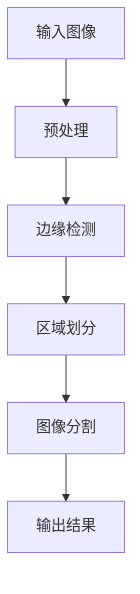
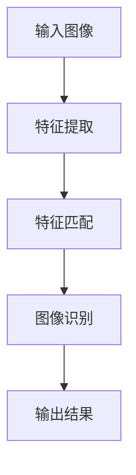
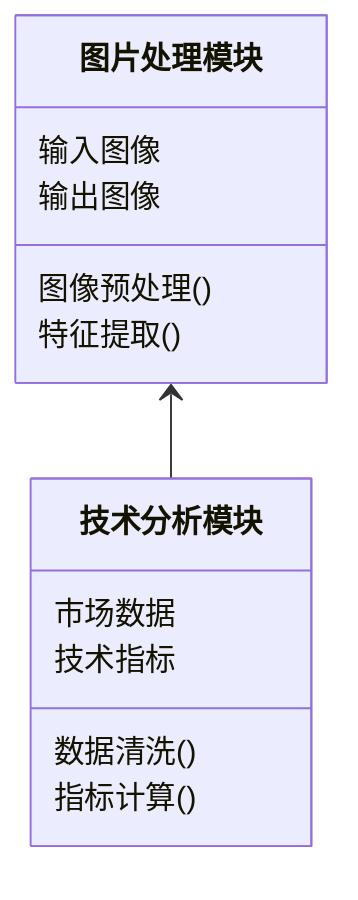
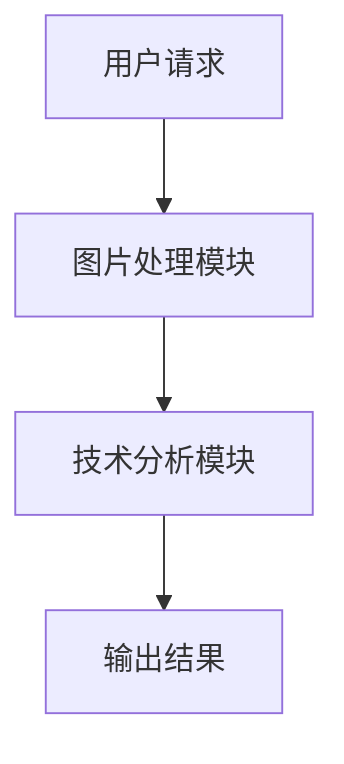
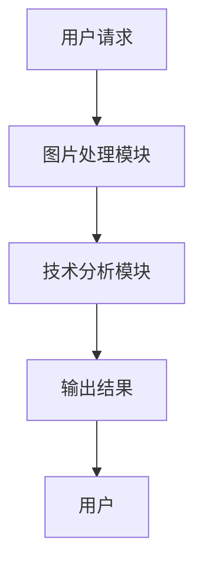

                 


# 机器视觉技术在市场技术分析中的运用

## 关键词：机器视觉，市场分析，技术分析，图像识别，深度学习

## 摘要：本文探讨了机器视觉技术在市场技术分析中的应用，结合实际案例和算法原理，详细讲解了如何利用机器视觉技术提升市场分析的效率和准确性。通过分析图像识别、模式识别等技术，本文展示了机器视觉在金融数据可视化、技术指标预测等方面的优势，并提出了相应的系统架构和实现方案。

---

## 第一部分: 机器视觉技术在市场技术分析中的应用基础

### 第1章: 机器视觉技术概述

#### 1.1 机器视觉技术的定义与特点
##### 1.1.1 机器视觉的定义
机器视觉（Machine Vision）是一种通过计算机模拟人类视觉系统的技术，用于获取、处理和理解图像信息。它结合了图像处理、模式识别、深度学习等技术，能够从图像中提取有用的信息，用于决策和自动化任务。

##### 1.1.2 机器视觉的核心特点
- **自动化**：能够自动处理大量图像数据。
- **高精度**：通过算法优化，可以达到较高的识别准确率。
- **实时性**：能够在短时间内完成图像处理和分析。

##### 1.1.3 机器视觉与传统图像处理的区别
| 特性 | 机器视觉 | 传统图像处理 |
|------|----------|---------------|
| 目标 | 自动识别和分类 | 数据处理和分析 |
| 技术 | 深度学习、神经网络 | 基于规则的算法 |
| 应用 | 工业检测、自动驾驶 | 医疗图像分析 |

#### 1.2 市场技术分析的定义与方法
##### 1.2.1 市场技术分析的定义
市场技术分析（Technical Analysis）是通过对历史市场数据（如价格、成交量等）进行分析，预测未来市场走势的一种方法。它依赖于技术指标、图表模式和市场心理分析。

##### 1.2.2 市场技术分析的主要方法
- **技术指标分析**：如MACD、RSI等指标。
- **形态分析**：如头肩顶、双底等形态。
- **成交量分析**：通过成交量变化预测价格趋势。

##### 1.2.3 机器视觉与市场技术分析的结合
机器视觉可以通过图像识别技术，自动分析K线图、技术指标图表，提取有用的信息，辅助交易决策。

#### 1.3 机器视觉技术在市场分析中的应用背景
##### 1.3.1 金融市场中的数据可视化需求
金融市场数据复杂，通过图像化呈现可以帮助交易者更直观地理解市场动态。

##### 1.3.2 机器视觉技术的优势
- **高效性**：快速处理大量图像数据。
- **准确性**：通过算法优化，提高分析结果的准确性。
- **实时性**：能够实时监控市场动态。

##### 1.3.3 机器视觉在市场分析中的潜力
随着深度学习技术的发展，机器视觉在市场分析中的应用前景广阔，特别是在图像识别和模式识别方面。

#### 1.4 本章小结
本章介绍了机器视觉技术的基本概念和特点，以及市场技术分析的主要方法和应用背景。机器视觉技术在市场分析中的应用潜力巨大，尤其是在数据可视化和图像识别方面。

---

### 第2章: 机器视觉技术的核心概念与联系

#### 2.1 机器视觉技术的核心原理
##### 2.1.1 图像采集与预处理
图像采集是机器视觉的第一步，通常使用摄像头或API获取图像数据。预处理包括去噪、增强和归一化等步骤。

##### 2.1.2 特征提取与图像识别
特征提取是通过算法（如SIFT、HOG）从图像中提取关键特征，图像识别则是基于这些特征进行分类或识别。

##### 2.1.3 图像分割与目标检测
图像分割是将图像分成多个区域，目标检测则是识别图像中的特定目标（如物体、人脸等）。

#### 2.2 市场技术分析的核心原理
##### 2.2.1 数据采集与预处理
市场数据采集包括价格、成交量等，预处理包括数据清洗和标准化。

##### 2.2.2 技术指标与模式识别
技术指标是市场分析的重要工具，模式识别则是通过算法识别这些指标中的模式和趋势。

##### 2.2.3 数据分析与预测模型
通过数据分析构建预测模型（如ARIMA、LSTM）预测未来市场走势。

#### 2.3 机器视觉与市场技术分析的联系
##### 2.3.1 数据可视化的需求
市场分析需要大量的数据可视化，机器视觉可以通过图像识别技术帮助交易者快速理解市场动态。

##### 2.3.2 图像识别在技术分析中的应用
图像识别可以用于识别K线图中的形态、趋势线等技术指标，辅助交易决策。

##### 2.3.3 机器学习在市场预测中的作用
机器学习可以通过历史数据训练模型，预测未来市场走势。

#### 2.4 核心概念对比与ER实体关系图
##### 2.4.1 核心概念对比表
| 特性 | 机器视觉 | 市场技术分析 |
|------|----------|---------------|
| 数据来源 | 图像数据 | 市场数据 |
| 数据处理 | 图像处理 | 数据清洗 |
| 分析目标 | 图像识别 | 市场预测 |
| 输出结果 | 图像分类 | 技术指标 |
| 应用场景 | 工业检测 | 金融交易 |

##### 2.4.2 ER实体关系图
```mermaid
erd
  图片表
    图片ID(PK)
    图片路径
    图片类型
  市场数据表
    数据ID(PK)
    时间戳
    价格
  关系：图片表 <-- 关联 --> 市场数据表
```

---

### 第3章: 机器视觉技术的算法原理

#### 3.1 常见的机器视觉算法
##### 3.1.1 基于边缘检测的图像分割
边缘检测是图像分割的基础，常用算法包括Canny、Sobel等。

##### 3.1.2 基于特征匹配的图像识别
特征匹配是通过提取图像特征进行图像匹配，常用算法包括SIFT、SURF等。

##### 3.1.3 基于深度学习的目标检测
目标检测是通过深度学习模型（如YOLO、Faster R-CNN）实现图像中目标的检测和识别。

#### 3.2 算法原理与流程图
##### 3.2.1 图像分割算法流程图


##### 3.2.2 图像识别算法流程图


##### 3.2.3 Python实现示例
```python
import cv2

def canny_edge_detection(image):
    gray = cv2.cvtColor(image, cv2.COLOR_BGR2GRAY)
    blurred = cv2.GaussianBlur(gray, (5, 5), 0)
    edges = cv2.Canny(blurred, 50, 150)
    return edges

# 示例图像处理
image = cv2.imread('input.jpg')
edges = canny_edge_detection(image)
cv2.imwrite('output.jpg', edges)
```

#### 3.3 算法的数学模型
##### 3.3.1 边缘检测的高斯滤波器
高斯滤波器用于消除图像噪声，其数学模型为：
$$
G(x, y) = \frac{1}{2\pi\sigma^2} e^{ -\frac{(x - x_0)^2 + (y - y_0)^2}{2\sigma^2} }
$$

##### 3.3.2 边缘检测的Canny算子
Canny算子通过计算图像的梯度来检测边缘，其数学模型为：
$$
\frac{\partial I}{\partial x} \quad \text{和} \quad \frac{\partial I}{\partial y}
$$

---

## 第二部分: 系统分析与架构设计

### 第4章: 机器视觉技术在市场分析中的系统架构

#### 4.1 问题场景介绍
市场技术分析需要实时处理大量图像数据，传统的手工分析效率低，容易出错。

#### 4.2 系统功能设计
##### 4.2.1 领域模型类图


##### 4.2.2 系统架构图


#### 4.3 接口设计与交互流程图
##### 4.3.1 接口设计
- **输入接口**：接收图像数据和市场数据。
- **输出接口**：输出图像识别结果和市场预测结果。

##### 4.3.2 交互流程图


---

### 第5章: 项目实战

#### 5.1 项目介绍
本项目旨在利用机器视觉技术分析股票K线图，预测未来价格走势。

#### 5.2 核心代码实现
##### 5.2.1 环境安装
需要安装Python、OpenCV、TensorFlow等库。

##### 5.2.2 核心代码
```python
import cv2
import numpy as np
from tensorflow.keras.models import load_model

def process_image(image_path):
    image = cv2.imread(image_path)
    # 图像预处理
    processed_image = cv2.resize(image, (224, 224))
    processed_image = processed_image / 255.0
    return processed_image[np.newaxis, :, :, :]

def predict_stock(image_path, model_path):
    model = load_model(model_path)
    processed_image = process_image(image_path)
    prediction = model.predict(processed_image)
    return prediction[0][0]  # 假设输出是概率

# 示例
image_path = 'stock_chart.jpg'
model_path = 'model.h5'
result = predict_stock(image_path, model_path)
print(f'预测结果: {result}')
```

##### 5.2.3 代码解读
- **process_image**：图像预处理函数，将图像 resize 并归一化。
- **predict_stock**：加载模型并进行预测。

#### 5.3 案例分析
通过实际案例分析，展示机器视觉技术在股票价格预测中的应用效果。

#### 5.4 项目总结
项目实现了股票K线图的图像识别和价格预测，验证了机器视觉技术在市场分析中的有效性。

---

## 第三部分: 最佳实践

### 第6章: 小结与注意事项

#### 6.1 本章小结
本文详细介绍了机器视觉技术在市场分析中的应用，包括算法原理、系统架构和项目实战。

#### 6.2 注意事项
- 数据质量对结果影响很大，需确保数据准确性和完整性。
- 模型选择和调参是关键，需根据实际需求选择合适的算法。
- 系统设计需考虑可扩展性和可维护性。

#### 6.3 拓展阅读
建议阅读相关书籍和论文，深入学习机器视觉和市场分析的结合应用。

---

## 结语
通过本文的探讨，我们可以看到机器视觉技术在市场技术分析中的巨大潜力。未来，随着技术的不断发展，机器视觉在金融领域的应用将更加广泛和深入。

