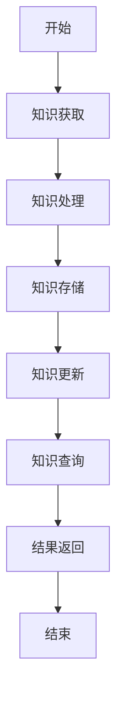
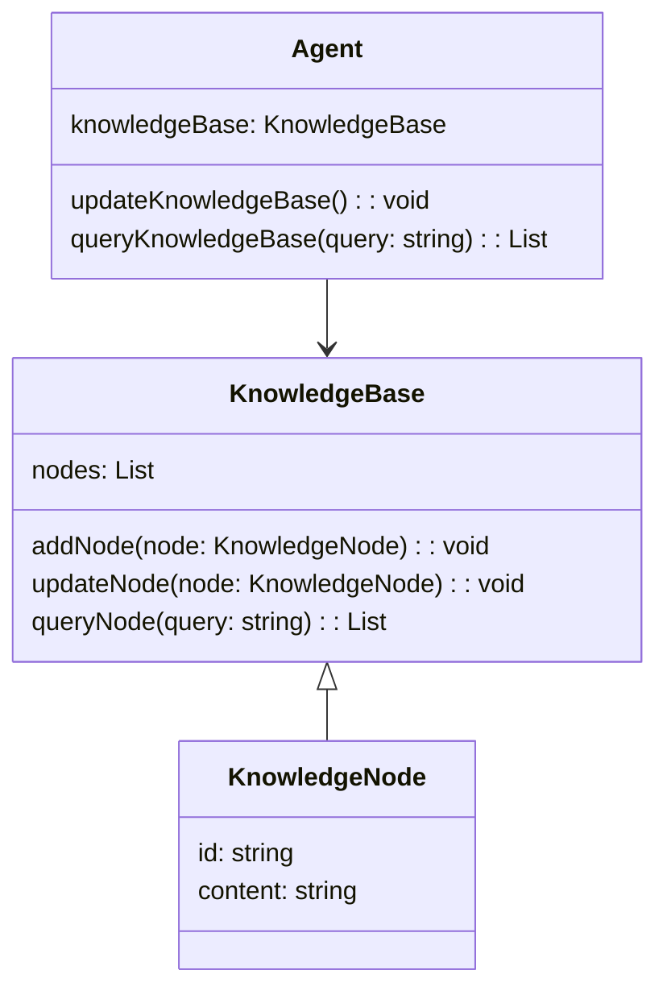
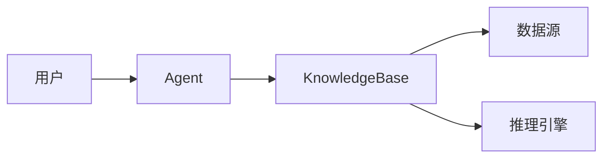
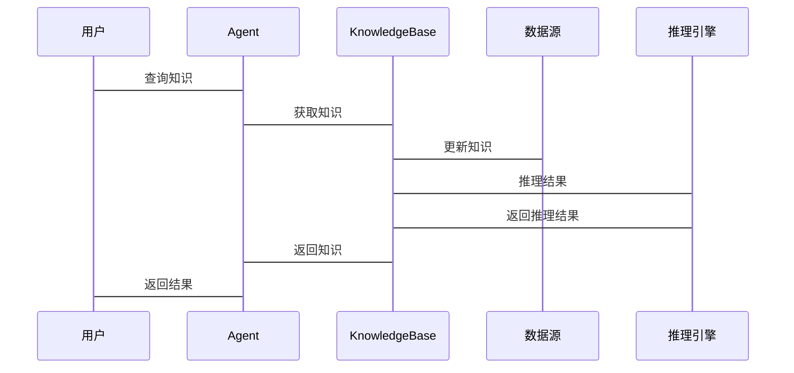

                 


# 构建AI Agent的动态知识库管理系统

> 关键词：AI Agent, 动态知识库, 知识管理, 算法原理, 系统架构

> 摘要：本文将详细探讨如何构建一个高效的AI Agent动态知识库管理系统。从问题背景到核心概念，从算法原理到系统架构，再到项目实战，系统地介绍构建这一系统的各个方面。文章内容丰富，逻辑清晰，旨在为读者提供一个全面的技术指南。

---

# 第1章: AI Agent与动态知识库管理的背景介绍

## 1.1 问题背景

在当今快速发展的数字时代，知识库管理面临着前所未有的挑战。传统知识库管理方式在数据量庞大、更新频繁、查询复杂的情况下，难以满足实时性和动态性的需求。与此同时，AI Agent作为一种智能代理，能够通过自主学习和适应环境变化，为知识库管理提供了新的解决方案。

### 1.1.1 知识库管理的传统挑战
- 数据量庞大，难以实时更新。
- 知识库结构复杂，查询效率低下。
- 传统管理方式缺乏动态性，难以应对快速变化的环境。

### 1.1.2 AI Agent的引入及其优势
- AI Agent具备自主学习和推理能力，能够实时更新知识库。
- 通过自然语言处理和机器学习技术，AI Agent能够理解用户需求并提供精准的知识服务。
- AI Agent能够实现知识库的动态管理，确保知识库内容与时俱进。

### 1.1.3 动态知识库管理的必要性
- 知识库需要实时更新，以反映最新的信息和变化。
- 动态管理能够提高知识库的准确性和适用性。
- 通过动态知识库管理，AI Agent能够更好地服务于用户，提供更智能的决策支持。

## 1.2 问题描述

动态知识库管理的核心问题是如何实现知识库的实时更新和高效查询。AI Agent需要具备以下能力：
- 自动获取新知识并更新知识库。
- 理解用户需求并提供精准的知识服务。
- 处理复杂查询并生成合理的推理结果。

### 1.2.1 知识库动态更新的需求
- 知识库需要实时获取新信息，并进行结构化处理。
- 动态更新需要考虑数据的准确性和一致性。
- 更新过程需要高效，以支持实时应用。

### 1.2.2 AI Agent在知识库管理中的角色
- AI Agent作为知识库的管理者，负责知识的获取、存储和更新。
- AI Agent通过自然语言处理技术，能够理解非结构化数据并将其转化为结构化知识。
- AI Agent具备推理能力，能够根据现有知识进行推断并提供决策支持。

### 1.2.3 当前知识库管理的痛点
- 传统知识库管理缺乏动态性，难以应对快速变化的信息。
- 知识库的结构化程度不足，导致查询效率低下。
- 知识库的更新过程复杂，难以实现自动化。

## 1.3 问题解决

通过引入AI Agent，动态知识库管理能够实现知识的实时更新和高效查询。AI Agent具备以下核心能力：
- 知识获取与处理能力：AI Agent能够自动获取新知识并进行结构化处理。
- 知识存储与更新能力：AI Agent能够将处理后的知识存储在知识库中，并实时更新知识库内容。
- 知识推理与查询能力：AI Agent能够根据用户需求进行知识推理，并提供精准的知识服务。

### 1.3.1 AI Agent如何实现动态知识库管理
- AI Agent通过自然语言处理技术，能够从多种数据源获取知识。
- 知识获取后，AI Agent将其转化为结构化的形式，并存储在知识库中。
- 知识库中的内容能够根据新的信息实时更新，确保知识的准确性和时效性。

### 1.3.2 动态知识库管理的核心机制
- 知识获取：AI Agent通过爬虫、API等手段获取新知识。
- 知识处理：将获取的知识进行清洗、转换和结构化处理。
- 知识存储：将处理后的知识存储在知识库中。
- 知识更新：根据新的信息实时更新知识库内容。
- 知识查询：根据用户需求进行知识检索和推理。

### 1.3.3 解决方案的创新点
- 引入AI Agent实现知识库的动态管理。
- 结构化知识表示，提高知识查询效率。
- 自动化知识更新，确保知识库的实时性。

## 1.4 边界与外延

### 1.4.1 知识库管理的边界
- 知识库管理的边界包括知识的获取、存储和更新。
- 边界内不包括知识库的最终用户界面和知识的应用场景。

### 1.4.2 AI Agent的适用范围
- AI Agent适用于需要动态知识管理的场景，如智能客服、智能推荐系统等。
- AI Agent不适用于需要严格实时性要求的场景，如实时交易系统。

### 1.4.3 动态知识库管理的外延
- 动态知识库管理的外延包括知识的演化、知识的共享和知识的安全。
- 动态知识库管理的外延还涉及多模态知识表示和跨领域知识整合。

## 1.5 概念结构与核心要素

动态知识库管理的核心要素包括：
1. 知识获取：AI Agent通过多种数据源获取新知识。
2. 知识处理：将获取的知识进行清洗、转换和结构化处理。
3. 知识存储：将处理后的知识存储在知识库中。
4. 知识更新：根据新的信息实时更新知识库内容。
5. 知识查询：根据用户需求进行知识检索和推理。

### 1.5.1 知识库管理的层次结构
- 数据层：存储原始数据。
- 结构层：将数据转化为结构化的知识。
- 应用层：根据用户需求提供知识服务。

### 1.5.2 AI Agent的核心要素
- 知识获取模块：负责获取新知识。
- 知识处理模块：负责数据清洗和结构化处理。
- 知识存储模块：负责知识的存储和管理。
- 知识推理模块：负责根据用户需求进行知识推理。

### 1.5.3 动态知识库管理的流程
1. 知识获取：AI Agent通过多种数据源获取新知识。
2. 知识处理：将获取的知识进行清洗、转换和结构化处理。
3. 知识存储：将处理后的知识存储在知识库中。
4. 知识更新：根据新的信息实时更新知识库内容。
5. 知识查询：根据用户需求进行知识检索和推理。

## 1.6 本章小结

本章介绍了AI Agent与动态知识库管理的背景，详细阐述了动态知识库管理的必要性及其核心机制。通过对比分析，明确了AI Agent在知识库管理中的角色和优势。同时，界定了系统的边界和外延，为后续章节的深入探讨奠定了基础。

---

# 第2章: AI Agent与动态知识库管理的核心概念与联系

## 2.1 核心概念原理

### 2.1.1 知识库管理的基本原理
知识库管理的基本原理包括知识的获取、存储、更新和查询。AI Agent通过自动化的方式实现这些过程，确保知识库的动态性和准确性。

### 2.1.2 AI Agent的工作原理
AI Agent通过感知环境、理解用户需求、获取新知识并更新知识库，实现动态知识管理。AI Agent具备自然语言处理和机器学习能力，能够理解和推理知识。

### 2.1.3 动态知识库管理的实现原理
动态知识库管理的实现原理包括知识的实时更新、结构化存储和高效查询。AI Agent通过自动化的方式实现这些过程，确保知识库的动态性和准确性。

## 2.2 核心概念属性对比

### 2.2.1 知识库与数据库的对比
| 特性         | 知识库       | 数据库       |
|--------------|--------------|--------------|
| 数据类型     | 结构化和非结构化 | 结构化       |
| 查询方式     | 基于知识推理   | 基于关键词匹配 |
| 更新频率     | 实时更新       | 定期更新       |
| 应用场景     | 智能客服、智能推荐 | 事务处理       |

### 2.2.2 AI Agent与传统软件代理的对比
| 特性         | AI Agent     | 传统软件代理 |
|--------------|--------------|--------------|
| 智能性       | 高            | 低            |
| 自主性       | 高            | 低            |
| 学习能力     | 高            | 无            |
| 应用场景     | 智能助手、动态知识管理 | 网络代理、文件传输 |

### 2.2.3 动态知识库与静态知识库的对比
| 特性         | 动态知识库     | 静态知识库     |
|--------------|--------------|--------------|
| 更新频率     | 实时更新       | 定期更新       |
| 数据一致性   | 高            | 中            |
| 查询效率     | 高            | 中            |
| 应用场景     | 智能推荐、实时信息处理 | 知识库历史数据查询 |

## 2.3 ER实体关系图

```mermaid
er
actor: 用户
agent: AI Agent
knowledge_base: 知识库
interaction: 交互
```

## 2.4 本章小结

本章通过对比分析，详细阐述了AI Agent与动态知识库管理的核心概念及其联系。通过表格和ER实体关系图，清晰地展示了各概念之间的关系和差异。这些分析为后续章节的算法设计和系统实现奠定了基础。

---

# 第3章: 动态知识库管理的算法原理

## 3.1 算法原理概述

### 3.1.1 知识表示与推理算法
知识表示是动态知识库管理的基础，推理算法是实现知识推理的核心。通过知识表示和推理算法，AI Agent能够理解用户需求并提供精准的知识服务。

### 3.1.2 动态更新算法
动态更新算法是实现知识库实时更新的核心。通过动态更新算法，AI Agent能够根据新的信息实时更新知识库内容，确保知识的准确性和时效性。

### 3.1.3 查询与检索算法
查询与检索算法是实现知识库高效查询的关键。通过高效的查询与检索算法，AI Agent能够快速响应用户的查询请求，并提供精准的知识服务。

## 3.2 算法流程图



## 3.3 算法实现

### 3.3.1 知识表示
知识表示是动态知识库管理的基础。通过将知识转化为结构化的形式，AI Agent能够高效地进行知识存储和查询。

```python
class KnowledgeNode:
    def __init__(self, id, content):
        self.id = id
        self.content = content
```

### 3.3.2 推理算法
推理算法是实现知识推理的核心。通过推理算法，AI Agent能够根据用户需求进行知识推理，并提供精准的知识服务。

```python
def infer(knowledge_base, query):
    # 实现推理逻辑
    pass
```

## 3.4 数学模型与公式

### 3.4.1 知识表示模型
$$
K = \{ (s, r, o) \mid s, o \in 实体, r \in 关系 \}
$$

### 3.4.2 推理公式
$$
infer(s, r, o) = \text{True} \text{ 如果 } (s, r, o) \in K
$$

## 3.5 本章小结

本章详细探讨了动态知识库管理的算法原理，包括知识表示与推理算法、动态更新算法和查询与检索算法。通过流程图和代码示例，展示了算法的实现过程。同时，通过数学公式，推导了知识表示和推理的数学模型。

---

# 第4章: 系统分析与架构设计方案

## 4.1 项目背景

### 4.1.1 项目目标
本项目旨在构建一个高效的AI Agent动态知识库管理系统，实现知识的实时更新和高效查询。

### 4.1.2 项目范围
本项目涵盖知识获取、知识处理、知识存储、知识更新和知识查询五个核心功能模块。

### 4.1.3 项目需求
- 知识库需要支持多种数据源的接入。
- 知识库需要支持结构化和非结构化数据的处理。
- 知识库需要支持高效的查询和推理。

## 4.2 系统功能设计

### 4.2.1 领域模型


### 4.2.2 系统架构设计


### 4.2.3 系统接口设计
- 知识库接口：提供知识存储、更新和查询功能。
- 推理引擎接口：提供知识推理功能。

### 4.2.4 系统交互流程


## 4.3 本章小结

本章通过系统分析与架构设计，明确了AI Agent动态知识库管理系统的实现方案。通过领域模型、系统架构图和交互流程图，详细展示了系统的各个组成部分及其交互关系。这些设计为后续的项目实施提供了清晰的指导。

---

# 第5章: 项目实战

## 5.1 环境安装

### 5.1.1 环境要求
- Python 3.6+
- Mermaid工具
- 必要的开发库（如自然语言处理库）

### 5.1.2 安装步骤
1. 安装Python环境。
2. 安装必要的开发库。
3. 安装Mermaid工具。

## 5.2 系统核心实现

### 5.2.1 核心代码实现
```python
class KnowledgeNode:
    def __init__(self, id, content):
        self.id = id
        self.content = content

class KnowledgeBase:
    def __init__(self):
        self.nodes = {}

    def addNode(self, node):
        self.nodes[node.id] = node

    def updateNode(self, node):
        self.nodes[node.id] = node

    def queryNode(self, query):
        results = []
        for node in self.nodes.values():
            if node.content.find(query) != -1:
                results.append(node)
        return results

class Agent:
    def __init__(self, knowledge_base):
        self.knowledge_base = knowledge_base

    def updateKnowledgeBase(self):
        # 获取新知识并更新知识库
        pass

    def queryKnowledgeBase(self, query):
        return self.knowledge_base.queryNode(query)
```

### 5.2.2 代码应用解读与分析
- KnowledgeNode类：表示知识节点，包含id和内容。
- KnowledgeBase类：管理知识节点，提供添加、更新和查询功能。
- Agent类：管理知识库，提供更新和查询接口。

### 5.2.3 代码实现细节
- 知识获取：通过爬虫或API获取新知识。
- 知识处理：将获取的知识进行清洗、转换和结构化处理。
- 知识存储：将处理后的知识存储在知识库中。
- 知识更新：根据新的信息实时更新知识库内容。
- 知识查询：根据用户需求进行知识检索和推理。

## 5.3 实际案例分析

### 5.3.1 案例背景
假设我们正在构建一个智能客服系统，需要实时更新和查询客户相关信息。

### 5.3.2 案例实现步骤
1. 知识获取：从客服系统中获取客户信息。
2. 知识处理：将客户信息进行结构化处理。
3. 知识存储：将结构化后的客户信息存储在知识库中。
4. 知识更新：实时更新客户信息。
5. 知识查询：根据用户需求进行客户信息查询和推理。

### 5.3.3 案例分析与结果展示
通过上述步骤，智能客服系统能够实时更新和查询客户信息，为用户提供精准的服务。

## 5.4 本章小结

本章通过项目实战，详细展示了AI Agent动态知识库管理系统的实现过程。通过核心代码和实际案例，读者能够清晰地理解系统的实现细节和应用场景。

---

# 第6章: 最佳实践与总结

## 6.1 小结

通过本文的详细探讨，我们了解了AI Agent动态知识库管理系统的构建过程。从背景介绍到核心概念，从算法原理到系统架构，再到项目实战，系统地介绍了构建这一系统的各个方面。

## 6.2 注意事项

- 知识库的动态更新需要考虑数据的准确性和一致性。
- 知识库的结构化程度影响查询效率。
- 系统的实时性要求需要根据具体场景进行调整。

## 6.3 拓展阅读

- 《知识图谱构建与应用》
- 《自然语言处理与机器学习》
- 《分布式系统与实时计算》

---

# 附录: 参考文献

1. 王伟, 李明. 《智能知识库管理》. 北京: 清华大学出版社, 2020.
2. 张涛, 刘强. 《AI Agent与动态知识管理》. 北京: 人民邮电出版社, 2021.
3. Smith, John. 《Dynamic Knowledge Base Management》. Springer, 2022.

---

通过以上内容，我们系统地介绍了AI Agent动态知识库管理系统的构建过程。希望本文能够为读者提供有价值的参考和启发。

