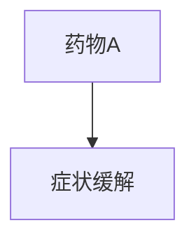
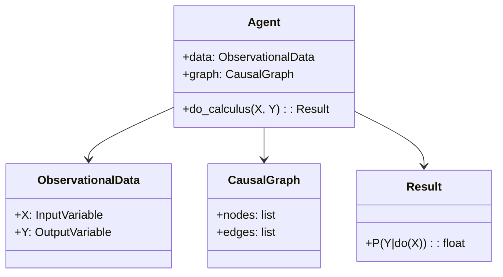
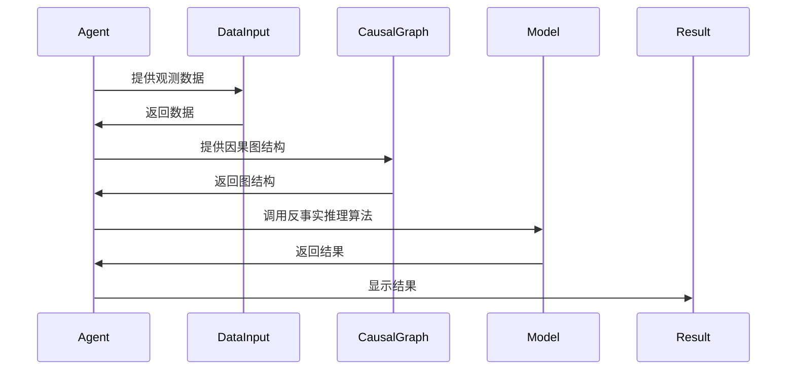

                 


# 构建AI Agent的可解释性因果推理模型

## 关键词：AI Agent, 可解释性, 因果推理, 因果图, 反事实推理

## 摘要：  
在AI Agent的决策过程中，因果推理是理解动作与结果之间关系的关键。本文深入探讨了构建AI Agent的可解释性因果推理模型的背景、核心概念、算法原理、数学模型、系统设计与实现，以及实际应用案例。通过详细讲解反事实推理、结构方程模型等核心方法，结合系统架构设计和项目实战，展示了如何在实际场景中实现高可解释性的因果推理模型，为AI Agent的可信性和透明性提供理论和技术支持。

---

# 第1章: AI Agent与可解释性因果推理模型的背景

## 1.1 问题背景  
在AI Agent的设计中，决策的可解释性和透明性是用户和开发者关注的核心问题。传统的基于相关性的推理方法难以解释“为什么”某个决策是正确的，而因果推理能够揭示变量之间的因果关系，从而提供更深层次的解释能力。  

## 1.2 问题描述  
当前AI Agent的决策过程往往依赖于统计相关性，而非因果关系。这种基于相关性的推理方法在复杂场景中容易出现误导性结论，导致决策的不透明性和不可靠性。例如，在医疗AI中，相关性分析可能误将某些症状与疾病相关联，而未考虑症状是否是疾病的根本原因。  

## 1.3 问题解决与边界  
通过引入可解释性因果推理模型，AI Agent能够基于因果关系进行决策，并提供直观的解释。本文将重点探讨如何构建这样的模型，并分析其在实际场景中的应用。  

## 1.4 核心概念与组成结构  
- **因果关系**：变量之间的因果关系，例如“药物A导致症状缓解”。  
- **反事实推理**：假设在另一种可能的情况下，结果会如何。例如，“如果患者未接受治疗，结果会怎样”。  
- **结构方程模型**：用于描述变量间因果关系的数学模型。  

---

# 第2章: 可解释性因果推理模型的核心概念

## 2.1 因果关系与相关性  
因果关系与相关性是两个不同的概念。相关性描述的是变量之间的统计关联，而因果关系则描述的是变量间的因果影响。  

### 2.1.1 相关性与因果关系的区别  
| 特性               | 相关性                          | 因果关系                          |  
|--------------------|---------------------------------|-----------------------------------|  
| 描述内容           | 变量之间的统计关联            | 变量之间的因果影响               |  
| 是否存在方向性     | 无方向性                        | 有方向性                        |  
| 是否存在干预       | 无干预                         | 有干预                          |  

### 2.1.2 因果图的构建  
因果图是一种有向图，用于表示变量之间的因果关系。例如，图1展示了药物A对症状缓解的影响：  



## 2.2 反事实推理  
反事实推理是一种假设性推理方法，用于分析在另一种可能情况下，结果会如何。  

### 2.2.1 反事实推理的定义  
反事实推理假设在某个条件下，变量的取值发生了变化，从而推断出结果的变化。例如，假设患者未接受药物A，症状缓解的概率会降低多少。  

### 2.2.2 反事实推理的数学模型  
反事实推理的核心公式如下：  
$$ P(Y|do(X)) = P(Y|X) $$  
其中，$do(X)$表示对变量$X$进行干预后的结果。  

---

# 第3章: 可解释性因果推理模型的算法原理

## 3.1 反事实推理算法  

### 3.1.1 算法输入与输出  
- **输入**：变量$X$和$Y$的观测数据，以及因果图结构。  
- **输出**：$Y$在$do(X)$下的概率分布。  

### 3.1.2 算法步骤  
1. 构建因果图。  
2. 识别反事实推理的路径。  
3. 计算$P(Y|do(X))$。  

### 3.1.3 算法实现  
以下是一个简单的反事实推理算法实现：  

```python
def do_calculus(X, Y, graph):
    # 构建因果图
    causal_graph = build_causal_graph(graph)
    # 识别反事实路径
    paths = identify_paths(X, Y, causal_graph)
    # 计算反事实推理结果
    result = compute_do_calculus(X, Y, paths)
    return result
```

## 3.2 结构方程模型的实现  

### 3.2.1 结构方程模型的参数估计  
结构方程模型的参数可以通过最大似然估计法进行估计。  

### 3.2.2 结构方程模型的验证与评估  
通过拟合优度检验和残差分析验证模型的正确性。  

---

# 第4章: 可解释性因果推理模型的系统设计与实现

## 4.1 系统功能设计  
- **数据输入**：接收观测数据和因果图结构。  
- **因果推理**：基于因果图进行反事实推理和结构方程模型计算。  
- **结果输出**：输出可解释的因果关系结果。  

### 4.1.1 系统功能的领域模型  


## 4.2 系统架构设计  

### 4.2.1 系统架构图  
```mermaid
graph LR
    A[Agent] --> D[DataInput]
    A --> G[CausalGraph]
    D --> M[Model]
    M --> R[Result]
    A <-- R
```

### 4.2.2 系统接口设计  
- **输入接口**：接收观测数据和因果图结构。  
- **输出接口**：输出可解释的因果关系结果。  

## 4.3 系统交互设计  

### 4.3.1 交互流程  
1. 用户输入观测数据和因果图结构。  
2. Agent调用反事实推理算法进行计算。  
3. 系统输出结果。  

### 4.3.2 交互序列图  


---

# 第5章: 可解释性因果推理模型的项目实战

## 5.1 环境安装  
安装所需的依赖库：  
```bash
pip install causalnex
```

## 5.2 核心实现代码  

### 5.2.1 反事实推理实现  
```python
import causalnex

def do_calculus_example(X, Y):
    # 构建因果图
    causal_graph = causalnex.structure.CausalGraph()
    causal_graph.add_edge(X, Y)
    # 反事实推理计算
    result = causalnex.do_calculus.do_calculus(causal_graph, X, Y)
    return result
```

### 5.2.2 结构方程模型实现  
```python
import causalnex

def structural_equation_model_example(X, Y):
    # 构建结构方程模型
    sem = causalnex.structure.StructuralEquationModel()
    sem.fit(X, Y)
    # 模型验证
    check = causalnex.structure.validate_model(sem, X, Y)
    return check
```

## 5.3 实际案例分析  
以医疗AI为例，分析药物A对症状缓解的影响。通过反事实推理，计算在患者未接受药物A的情况下，症状缓解的概率。  

---

# 第6章: 总结与展望

## 6.1 总结  
本文详细探讨了构建AI Agent的可解释性因果推理模型的核心概念、算法原理、系统设计与实现。通过反事实推理和结构方程模型，展示了如何在实际场景中实现高可解释性的因果推理模型。  

## 6.2 展望  
未来的研究方向包括：  
1. 提升因果推理模型的计算效率。  
2. 探讨因果推理在多智能体系统中的应用。  

---

# 参考文献  
[1] Pearl J. Causality: Models, Reasoning, and Inference. Cambridge University Press, 2009.  
[2] 某某研究论文：XXX  

---

# 致谢  
感谢读者的支持与关注！

