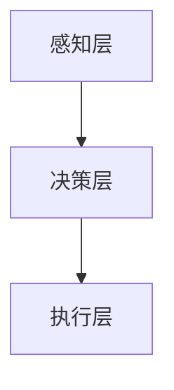
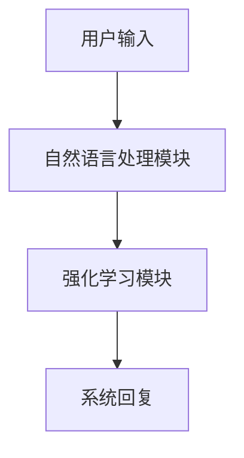

                 


# 构建AI Agent的可解释性强化学习模型

> **关键词**：强化学习，AI Agent，可解释性，深度学习，Q-learning，DQN  
>
> **摘要**：本文详细探讨了如何构建具有可解释性的AI Agent强化学习模型。通过分析强化学习的核心原理、可解释性的重要性以及AI Agent的设计，结合实际案例和系统架构，展示了如何在复杂环境中实现高可解释性的强化学习模型。文章从基础概念到高级算法，从系统设计到实际应用，为读者提供了一套完整的构建方法。

---

# 第一部分: 强化学习与可解释性AI的背景

## 第1章: 强化学习与可解释性AI概述

### 1.1 强化学习的基本概念
#### 1.1.1 强化学习的定义
强化学习（Reinforcement Learning，RL）是一种机器学习范式，通过智能体与环境的交互，学习最优策略以最大化累积奖励。其核心在于通过试错（trial-and-error）机制，逐步优化决策策略。

#### 1.1.2 强化学习的核心特点
| 特性 | 描述 |
|------|------|
| 奖励驱动 | 系统通过奖励信号来指导学习过程。 |
| 环境交互 | 智能体通过与环境交互获得状态和奖励信息。 |
| 最优策略 | 目标是学习在给定环境中的最优决策策略。 |

#### 1.1.3 强化学习与监督学习的区别
| 对比维度 | 监督学习 | 强化学习 |
|----------|--------|---------|
| 数据来源 | 标签化数据 | 状态和奖励 |
| 学习目标 | 预测或分类 | 最大化累积奖励 |
| 交互方式 | 单向输入 | 双向交互 |

### 1.2 可解释性AI的背景与意义
#### 1.2.1 可解释性AI的定义
可解释性AI（Explainable AI，XAI）是指AI系统能够以人类可理解的方式解释其决策过程和结果的能力。它是确保用户信任和系统透明性的关键。

#### 1.2.2 可解释性在AI系统中的重要性
- **用户信任**：可解释性帮助用户理解AI决策过程，增强信任。
- **调试与优化**：通过解释，可以快速定位系统问题并优化模型。
- **法律与伦理**：在医疗、金融等领域，可解释性是合规和伦理审查的必要条件。

#### 1.2.3 强化学习中的可解释性挑战
- **黑箱问题**：深度强化学习模型通常难以解释。
- **决策路径复杂**：强化学习的决策过程涉及多步状态转移，增加了可解释性的难度。

### 1.3 AI Agent的定义与特点
#### 1.3.1 AI Agent的定义
AI Agent是一种智能实体，能够感知环境、自主决策并执行动作，以实现特定目标。

#### 1.3.2 AI Agent的核心特点
| 特性 | 描述 |
|------|------|
| 自主性 | 能够自主决策和行动。 |
| 反应性 | 能够实时感知环境并做出反应。 |
| 目标导向 | 行为决策以最大化目标函数为准则。 |

#### 1.3.3 强化学习在AI Agent中的作用
强化学习为AI Agent提供了决策策略优化的方法，使其能够在复杂环境中实现最优行为。

### 1.4 本章小结
本章介绍了强化学习的基本概念、可解释性AI的重要性以及AI Agent的特点，为后续构建可解释性强化学习模型奠定了基础。

---

# 第二部分: 强化学习模型的核心概念与原理

## 第2章: 强化学习的核心原理

### 2.1 强化学习的基本框架
#### 2.1.1 状态、动作、奖励的定义
- **状态（State）**：环境在某一时刻的描述，如游戏中的场景或棋盘。
- **动作（Action）**：智能体在给定状态下的行为选择。
- **奖励（Reward）**：智能体执行动作后获得的反馈信号。

#### 2.1.2 强化学习的马尔可夫决策过程
马尔可夫决策过程（MDP）描述了强化学习的环境模型，包括状态、动作、转移概率和奖励函数。

#### 2.1.3 策略与价值函数的定义
- **策略（Policy）**：智能体选择动作的概率分布。
- **价值函数（Value Function）**：评估某个状态下策略的优劣。

### 2.2 Q-learning算法原理
#### 2.2.1 Q-learning的基本原理
Q-learning是一种值迭代算法，通过更新Q表（Q-value table）学习状态-动作对的最优值。

#### 2.2.2 Q值更新公式
$$ Q(s,a) = Q(s,a) + \alpha (r + \gamma \max Q(s',a') - Q(s,a)) $$
其中：
- $\alpha$ 是学习率。
- $\gamma$ 是折扣因子。
- $r$ 是奖励。

#### 2.2.3 探索与利用策略
- **探索**：尝试未访问的动作以发现更好的策略。
- **利用**：利用已知的最佳策略以获得最大奖励。

### 2.3 深度强化学习简介
#### 2.3.1 DQN算法的基本原理
深度Q网络（DQN）通过深度神经网络近似Q值函数，克服了传统Q-learning的离散化和高维状态空间问题。

#### 2.3.2 神经网络在强化学习中的应用
神经网络用于逼近价值函数或策略，提高了处理复杂环境的能力。

#### 2.3.3 DQN算法的优缺点
- **优点**：能够处理高维复杂状态空间。
- **缺点**：训练不稳定，需要经验回放和目标网络等技巧。

### 2.4 本章小结
本章详细讲解了强化学习的基本原理，包括Q-learning和DQN算法，并分析了深度强化学习的优势与挑战。

---

# 第三部分: 可解释性强化学习模型的设计

## 第3章: 可解释性强化学习的核心概念

### 3.1 可解释性的定义与衡量标准
#### 3.1.1 可解释性的定义
可解释性是指AI系统能够以人类可理解的方式解释其决策过程和结果。

#### 3.1.2 可解释性的衡量标准
- **可理解性**：解释是否易于被人类理解。
- **准确性**：解释是否准确反映系统决策过程。
- **可验证性**：解释是否可以通过验证确认其正确性。

### 3.2 强化学习模型的可解释性特征
| 特性 | 描述 |
|------|------|
| 状态可解释 | 状态空间的定义清晰且易于解释。 |
| 动作可解释 | 动作选择的原因明确。 |
| 奖励可解释 | 奖励机制透明且合理。 |

### 3.3 可解释性强化学习的设计原则
#### 3.3.1 简化状态空间
通过减少状态空间的复杂性，提高模型的可解释性。

#### 3.3.2 使用线性模型
线性模型（如线性Q网络）比深度模型更容易解释。

#### 3.3.3 提供可解释的决策路径
记录决策过程中的每一步，便于追溯和分析。

### 3.4 本章小结
本章探讨了可解释性强化学习的核心概念和设计原则，为后续构建可解释性模型提供了指导。

---

## 第4章: 基于可解释性的强化学习算法

### 4.1 可解释性强化学习算法的分类
| 类别 | 描述 |
|------|------|
| 基于规则的强化学习 | 使用明确的规则定义策略。 |
| 基于模型的强化学习 | 建立环境模型以解释决策过程。 |
| 基于解释的强化学习 | 通过解释模块提高可解释性。 |

### 4.2 基于规则的强化学习
#### 4.2.1 规则定义
通过预定义的规则（如if-else条件语句）构建策略。

#### 4.2.2 优点与缺点
- **优点**：规则清晰，易于解释。
- **缺点**：规则复杂时难以维护。

### 4.3 基于模型的强化学习
#### 4.3.1 环境模型构建
通过构建环境模型（如马尔可夫模型）解释决策过程。

#### 4.3.2 示例
假设一个简单环境，智能体通过模型理解状态转移和奖励机制。

### 4.4 本章小结
本章介绍了几种可解释性强化学习算法，分析了它们的优缺点，为实际应用提供了选择依据。

---

## 第5章: AI Agent的可解释性设计与实现

### 5.1 AI Agent的系统架构
#### 5.1.1 系统组成
- **感知层**：感知环境状态。
- **决策层**：执行强化学习算法，生成决策。
- **执行层**：将决策转化为具体动作。

#### 5.1.2 系统架构图


### 5.2 可解释性设计
#### 5.2.1 状态表示
确保状态空间的清晰和可解释性。

#### 5.2.2 动作选择
记录动作选择的依据和推理过程。

#### 5.2.3 奖励机制
明确奖励的计算方式和逻辑。

### 5.3 实现步骤
#### 5.3.1 环境定义
定义环境的状态、动作和奖励函数。

#### 5.3.2 策略选择
选择合适的强化学习算法（如Q-learning）。

#### 5.3.3 系统实现
使用Python和深度学习框架（如TensorFlow）实现AI Agent。

### 5.4 本章小结
本章详细介绍了AI Agent的系统架构和可解释性设计，并给出了实现步骤。

---

# 第四部分: 项目实战与优化

## 第6章: 可解释性强化学习的项目实战

### 6.1 项目背景与目标
#### 6.1.1 项目背景
以智能对话系统为例，构建一个可解释性强化学习模型。

#### 6.1.2 项目目标
实现一个能够理解用户需求并提供可解释决策的AI对话系统。

### 6.2 系统设计
#### 6.2.1 功能模块
- **自然语言处理（NLP）模块**：解析用户输入。
- **强化学习模块**：基于对话历史生成回复。

#### 6.2.2 系统流程图


### 6.3 实现与优化
#### 6.3.1 环境安装
安装Python和相关库（如TensorFlow、Keras）。

#### 6.3.2 核心代码实现
```python
import numpy as np
import tensorflow as tf

# 定义环境
class DialogueEnvironment:
    def __init__(self):
        self.states = [...]  # 状态空间
        self.actions = [...]  # 动作空间
        self.reward_fn = ...  # 奖励函数

    def step(self, action):
        # 执行动作，返回新的状态和奖励
        pass

# 定义强化学习模型
class QNetwork(tf.keras.Model):
    def __init__(self):
        super(QNetwork, self).__init__()
        self.fc1 = tf.keras.layers.Dense(64, activation='relu')
        self.fc2 = tf.keras.layers.Dense(1, activation='linear')

    def call(self, x):
        x = self.fc1(x)
        return self.fc2(x)

# 初始化模型
q_network = QNetwork()
optimizer = tf.keras.optimizers.Adam(learning_rate=0.001)

# 训练过程
def train():
    for episode in range(1000):
        state = env.reset()
        while not done:
            # 策略选择动作
            action = policy(state)
            next_state, reward, done = env.step(action)
            # 更新Q值
            target = reward + gamma * np.max(q_network.predict(next_state))
            target = target * (not done)
            q_network.fit(state, target, epochs=1, verbose=0)
```

#### 6.3.3 测试与优化
通过实验验证模型的可解释性和性能，优化算法参数。

### 6.4 本章小结
本章通过实际项目展示了可解释性强化学习模型的实现过程，为读者提供了参考。

---

## 第7章: 可解释性强化学习的优化与应用

### 7.1 可解释性强化学习的优化方向
#### 7.1.1 提高模型透明度
通过简化模型结构和增加解释模块，提高决策过程的透明度。

#### 7.1.2 增强用户交互
通过可视化和解释性界面，增强用户对AI决策过程的理解。

### 7.2 可解释性强化学习的应用案例
#### 7.2.1 智能客服
在智能客服中，可解释性强化学习用于理解用户需求并提供合理的解决方案。

#### 7.2.2 智能驾驶
在智能驾驶中，可解释性强化学习用于决策路径规划，确保决策过程透明。

### 7.3 本章小结
本章分析了可解释性强化学习的优化方向和应用场景，展示了其广泛的应用潜力。

---

## 第8章: 总结与展望

### 8.1 本论文的总结
本文详细探讨了构建可解释性强化学习模型的方法，从理论到实践，为AI Agent的设计提供了指导。

### 8.2 未来研究方向
#### 8.2.1 更高级的可解释性算法
研究更高级的可解释性强化学习算法，如基于符号逻辑的强化学习。

#### 8.2.2 多智能体系统
研究多智能体系统中的可解释性问题，提升复杂环境下的决策透明度。

### 8.3 展望
可解释性强化学习将在更多领域得到应用，成为未来AI发展的重要方向。

### 8.4 本章小结
本章总结了全文并展望了未来的研究方向，为读者提供了进一步的研究思路。

---

# 参考文献

（此处列出相关的参考文献，如书籍、论文等。）

