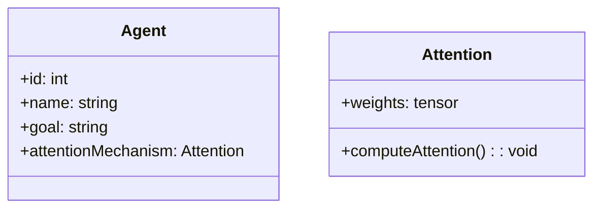
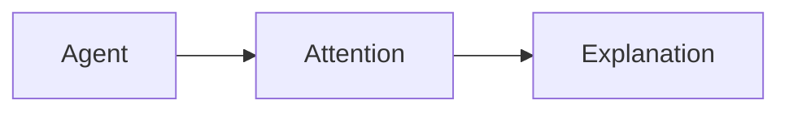

                 


# 构建AI Agent的可解释性注意力机制

**关键词：** AI Agent, 可解释性注意力机制, 人工智能, 系统架构, 算法原理, 项目实战, 最佳实践

**摘要：** 本文旨在探讨如何构建具备可解释性的AI Agent注意力机制。通过分析背景、核心概念、算法原理、系统架构、项目实战和最佳实践，深入解析可解释性注意力机制的设计与实现，帮助读者理解其技术细节和应用价值。

---

# 1. AI Agent与可解释性注意力机制的背景介绍

## 1.1 AI Agent的基本概念

### 1.1.1 什么是AI Agent
AI Agent（人工智能代理）是指能够感知环境、自主决策并采取行动以实现目标的智能系统。Agent可以是软件程序、机器人或其他具备智能行为的实体。

### 1.1.2 AI Agent的核心特点
- **自主性：** Agent能够自主决策，无需外部干预。
- **反应性：** 能够实时感知环境变化并做出反应。
- **目标导向：** 以实现特定目标为导向。
- **社交能力：** 能够与其他Agent或人类进行交互。

### 1.1.3 AI Agent的应用场景
- **智能家居：** 调节温度、照明等设备。
- **自动驾驶：** 处理交通状况和驾驶决策。
- **智能助手：** 如Siri、Alexa等，提供信息查询和任务执行。

## 1.2 可解释性的重要性

### 1.2.1 可解释性在AI系统中的作用
AI系统的决策过程往往难以被人类理解，这限制了其在医疗、法律等领域的应用。可解释性使得AI的决策过程透明，增强用户信任。

### 1.2.2 可解释性与AI Agent的关系
通过可解释性注意力机制，AI Agent的决策过程变得透明，用户可以理解AI如何做出决策，从而增强系统的可信度。

### 1.2.3 可解释性注意力机制的背景与意义
随着AI技术的广泛应用，对AI决策过程的可解释性需求日益增加。注意力机制作为关键组件，需要具备可解释性以满足实际应用需求。

## 1.3 注意力机制的背景与演进

### 1.3.1 注意力机制的基本概念
注意力机制是一种模仿人类注意力的机制，用于在处理信息时聚焦重要部分，提升模型性能。

### 1.3.2 注意力机制的演进历程
从早期的局部注意力到全局注意力，再到自注意力机制，注意力机制不断演进，应用范围逐渐扩大。

### 1.3.3 可解释性注意力机制的提出
为了满足实际应用的可解释性需求，研究者提出了可解释性注意力机制，使其在保持性能的同时，具备透明性和可解释性。

---

# 2. 可解释性注意力机制的核心概念与联系

## 2.1 注意力机制的原理

### 2.1.1 注意力机制的数学模型
注意力机制通过计算输入序列中各元素的权重，生成加权和作为输出。公式如下：
$$\text{Attention}(Q, K, V) = \text{softmax}\left(\frac{QK^T}{\sqrt{d_k}}\right)V$$

### 2.1.2 注意力机制的计算流程
1. **查询（Q）、键（K）、值（V）**：将输入序列映射到这三个向量。
2. **计算权重**：通过$QK^T$计算相似度，归一化得到权重。
3. **加权求和**：用权重对$V$进行加权求和，生成最终输出。

### 2.1.3 注意力机制的优缺点
- **优点**：提升模型性能，捕捉长距离依赖。
- **缺点**：计算复杂度高，缺乏可解释性。

## 2.2 可解释性注意力机制的实现方法

### 2.2.1 基于位置的注意力机制
在标准注意力机制的基础上，引入位置信息，增强模型的位置感知能力。

### 2.2.2 基于内容的注意力机制
通过分析输入内容，动态调整注意力权重，提升模型的语义理解能力。

### 2.2.3 混合型注意力机制
结合位置和内容信息，综合考虑多个因素，生成更精确的注意力权重。

## 2.3 核心概念的ER实体关系图

```mermaid
er
actor(Agent, Attention Mechanism, Explanation)
```

---

# 3. 可解释性注意力机制的算法原理与数学模型

## 3.1 注意力机制的数学模型

### 3.1.1 注意力权重的计算公式
注意力权重通过以下公式计算：
$$\text{softmax}\left(\frac{QK^T}{\sqrt{d_k}}\right)$$

### 3.1.2 注意力机制的计算流程
1. **输入序列**：$X = [x_1, x_2, ..., x_n]$
2. **生成查询、键、值**：$Q = W_qX$, $K = W_kX$, $V = W_vX$
3. **计算相似度**：$score_{i,j} = Q_i \cdot K_j^T$
4. **归一化权重**：$\alpha_{i,j} = \text{softmax}(score_{i,j})$
5. **加权求和**：$output_i = \sum_{j=1}^n \alpha_{i,j} V_j$

## 3.2 可解释性注意力机制的实现

### 3.2.1 基于位置的注意力机制
引入位置编码，增强位置信息的表达能力。

### 3.2.2 基于内容的注意力机制
通过分析输入内容，动态调整注意力权重。

### 3.2.3 混合型注意力机制
结合位置和内容信息，生成更精确的注意力权重。

---

# 4. 可解释性注意力机制的系统架构设计

## 4.1 系统功能设计

### 4.1.1 领域模型


### 4.1.2 系统架构


### 4.1.3 接口设计
- **Agent接口**：定义Agent的行为和交互方式。
- **Attention接口**：定义注意力机制的计算方法。
- **Explanation接口**：定义可解释性的输出格式。

### 4.1.4 交互设计
```mermaid
sequenceDiagram
    participant Agent
    participant Attention
    participant Explanation
    Agent -> Attention: computeAttention
    Attention -> Explanation: generateExplanation
    Agent <-- Explanation: returnExplanation
```

---

# 5. 可解释性注意力机制的项目实战

## 5.1 环境安装

### 5.1.1 安装Python
```bash
python --version
pip install --upgrade pip
```

### 5.1.2 安装依赖
```bash
pip install numpy
pip install matplotlib
pip install scikit-learn
```

## 5.2 核心代码实现

### 5.2.1 注意力机制实现
```python
import numpy as np

def compute_attention(Q, K, V):
    scores = np.dot(Q, K.T) / np.sqrt(K.shape[1])
    alpha = np.softmax(scores, axis=1)
    output = np.dot(alpha, V)
    return output, alpha
```

### 5.2.2 可解释性注意力机制实现
```python
def explainable_attention(Q, K, V, epsilon=1e-8):
    scores = np.dot(Q, K.T) / np.sqrt(K.shape[1])
    alpha = np.softmax(scores, axis=1)
    # 添加可解释性处理
    alpha += epsilon
    output = np.dot(alpha, V)
    return output, alpha
```

## 5.3 案例分析

### 5.3.1 简单案例
```python
Q = np.random.randn(1, d_k)
K = np.random.randn(n, d_k)
V = np.random.randn(n, d_v)

output, alpha = compute_attention(Q, K, V)
print("Output shape:", output.shape)
print("Attention weights:", alpha)
```

### 5.3.2 实际应用案例
在机器翻译任务中，使用可解释性注意力机制，分析每个单词对翻译结果的贡献。

---

# 6. 可解释性注意力机制的最佳实践与总结

## 6.1 最佳实践

### 6.1.1 简化模型复杂度
避免过度复杂的模型设计，确保可解释性。

### 6.1.2 提供可视化工具
通过可视化工具展示注意力权重分布，帮助理解决策过程。

### 6.1.3 定期模型审查
定期审查模型行为，确保其符合预期。

## 6.2 总结

本文详细探讨了可解释性注意力机制的背景、核心概念、算法原理、系统架构和项目实战。通过理论与实践相结合，为构建透明且可信的AI Agent提供了参考。

---

# 7. 拓展阅读

- **论文推荐**：关注最新可解释性AI研究成果。
- **工具推荐**：使用TensorFlow、PyTorch等框架实现可解释性注意力机制。
- **应用场景**：探索可解释性注意力机制在医疗、法律等领域的应用潜力。

---

通过以上目录，读者可以系统地学习可解释性注意力机制的各个方面，从基础理论到实际应用，逐步掌握相关技术。

