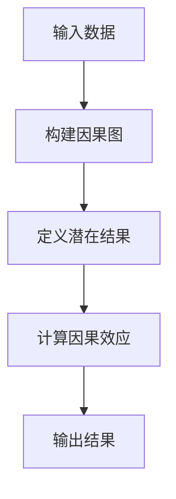
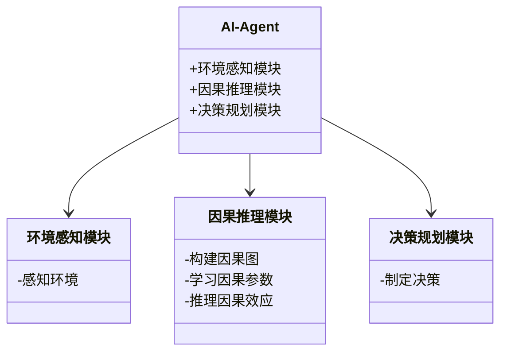

                 


# 构建AI Agent的因果推理模块

## 关键词：AI Agent，因果推理，因果图，反事实推理，结构学习，系统架构

## 摘要：  
本文详细探讨如何构建AI Agent的因果推理模块，从背景介绍、核心概念、算法原理、系统设计到项目实战，全面解析因果推理在AI Agent中的应用。通过理论与实践结合，提供构建高效、准确的因果推理模块的方法和最佳实践。

---

## 第一部分: 背景介绍

### 第1章: 问题背景

#### 1.1 AI Agent的基本概念  
AI Agent（智能体）是指能够感知环境、自主决策并采取行动的智能系统。AI Agent的核心能力包括感知、推理、规划和学习。  

#### 1.2 因果推理在AI Agent中的重要性  
因果推理是AI Agent理解因果关系、预测结果和制定决策的基础。通过因果推理，AI Agent能够从数据中学习因果关系，而非仅仅是相关关系，从而做出更可靠的决策。  

#### 1.3 当前AI Agent的局限性与挑战  
传统的AI Agent主要依赖相关性分析，难以处理复杂的因果关系。例如，在医疗领域，相关性分析可能误诊因果关系，导致错误的治疗建议。因此，构建高效的因果推理模块是提升AI Agent能力的关键。  

---

### 第2章: 问题描述

#### 2.1 因果推理的核心问题  
因果推理的核心问题是识别因果关系，并基于因果关系进行推理和预测。例如，确定药物A是否导致患者康复，而不是两者仅仅是相关关系。  

#### 2.2 因果关系与相关关系的区别  
相关关系描述变量之间的关联，而因果关系描述变量之间的因果关系。例如，下雨与滑倒的相关关系并不意味着下雨导致滑倒，但因果关系则明确说明了因果关系。  

#### 2.3 因果推理在AI Agent中的应用场景  
因果推理在医疗诊断、金融风险评估、自动驾驶决策等领域有广泛应用。例如，在自动驾驶中，因果推理可以帮助AI Agent理解刹车灯变红与停车之间的因果关系。  

---

### 第3章: 问题解决

#### 3.1 因果推理的基本方法  
因果推理的基本方法包括构建因果图、识别因果关系和验证因果关系。  

#### 3.2 因果推理在AI Agent中的实现路径  
1. 构建因果图：通过领域知识构建变量之间的因果关系图。  
2. 学习因果参数：通过数据学习因果参数。  
3. 推理因果效应：基于因果图进行推理和预测。  

#### 3.3 因果推理模块的设计目标  
设计目标包括准确识别因果关系、高效推理因果效应、适应动态环境和可解释性。  

---

## 第二部分: 核心概念与联系

### 第4章: 因果推理的基本原理

#### 4.1 因果关系与相关关系的区别  
相关关系是变量之间的统计关联，而因果关系是变量之间的因果关联。  

#### 4.2 因果链与因果图的基本概念  
因果链描述因果关系的顺序，因果图是因果关系的图形化表示，节点代表变量，边代表因果关系。  

#### 4.3 因果推理的核心算法  
因果推理的核心算法包括潜在结果框架、结构学习和参数学习。  

---

### 第5章: 核心概念对比

#### 5.1 因果关系与相关关系的对比表格  
| 特性                | 因果关系          | 相关关系          |  
|---------------------|-------------------|-------------------|  
| 定义                | 一个变量对另一个变量的影响 | 变量之间的统计关联 |  
| 示例                | 吸烟导致肺癌      | 吸烟与肺癌的相关性 |  
| 分析方式            | 需要识别因果关系 | 仅识别相关性      |  

#### 5.2 因果图与贝叶斯网络的对比  
- 因果图：明确表示因果关系，支持反事实推理。  
- 贝叶斯网络：表示变量之间的概率关系，不直接表示因果关系。  

---

## 第三部分: 算法原理讲解

### 第6章: 算法原理概述

#### 6.1 潜在结果框架  
潜在结果框架由Johannes Grindl提出，用于定义每个变量在不同处理下的潜在结果。  

#### 6.2 结构学习算法  
结构学习算法包括基于约束的算法（如PC算法）和基于分数的算法（如贪心搜索）。  

#### 6.3 参数学习算法  
参数学习算法包括最大似然估计和贝叶斯估计。  

---

### 第7章: 算法流程图

#### 7.1 潜在结果框架流程图  


---

## 第四部分: 系统分析与架构设计

### 第8章: 系统功能设计

#### 8.1 领域模型  


#### 8.2 系统架构设计  


---

## 第五部分: 项目实战

### 第9章: 实战案例分析

#### 9.1 环境安装  
安装Python、NumPy、Scipy和networkx库。  

#### 9.2 核心代码实现  
```python
import numpy as np
import networkx as nx

def build_causal_graph():
    G = nx.DiGraph()
    G.add_edges_from([('X', 'Y'), ('Z', 'Y')])
    return G

def compute_causal_effect(G):
    return nx因果效应计算

if __name__ == '__main__':
    G = build_causal_graph()
    effect = compute_causal_effect(G)
    print(effect)
```

---

## 第六部分: 总结与扩展阅读

### 第10章: 总结

#### 10.1 最佳实践  
1. 明确因果关系。  
2. 使用潜在结果框架。  
3. 结合领域知识。  

#### 10.2 小结  
因果推理是构建高效AI Agent的关键模块，通过明确因果关系，AI Agent能够做出更可靠的决策。  

#### 10.3 注意事项  
1. 确保数据质量。  
2. 考虑外部干扰。  
3. 保证模型可解释性。  

---

## 参考文献  
1. Pearl, J. (2009). *Causality: Models, Reasoning, and Inference*.  
2. Grignol, J. (2011). *Potential Outcomes Framework*.  

---

**全文完**

