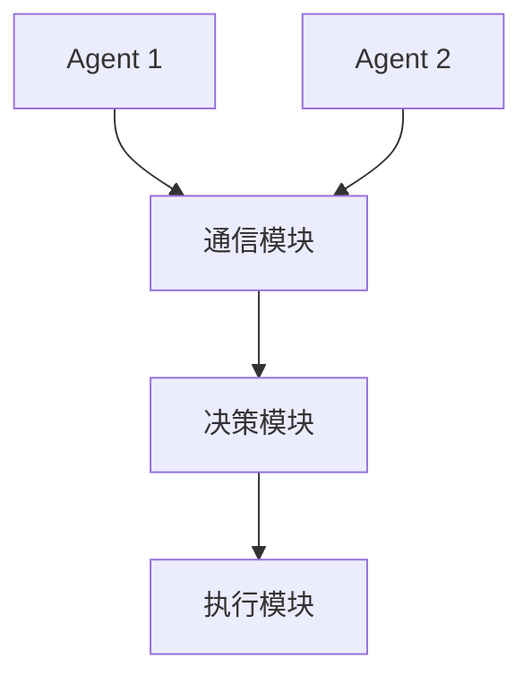
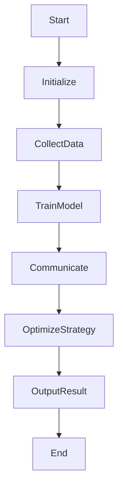
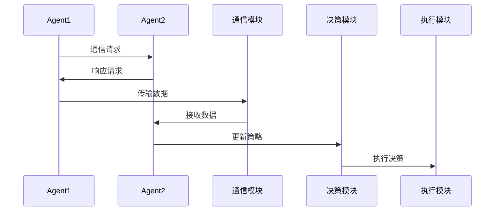

                 


# 构建AI Agent的多Agent协作学习系统

> 关键词：AI Agent，多Agent协作学习，协作学习系统，分布式学习，联邦学习，多Agent强化学习

> 摘要：本文详细探讨了构建AI Agent的多Agent协作学习系统的各个方面。从基础概念到系统架构，从算法原理到项目实战，结合理论与实践，全面解析了多Agent协作学习系统的构建过程。通过具体案例分析和系统设计，展示了如何实现高效、智能的多Agent协作学习系统。

---

## 第一部分：AI Agent与多Agent协作学习系统概述

### 第1章：AI Agent的基本概念与背景

#### 1.1 AI Agent的定义与特点
##### 1.1.1 AI Agent的定义
AI Agent（人工智能代理）是指能够感知环境、自主决策并执行任务的智能实体。它可以是一个软件程序、机器人或其他智能系统，具备以下核心特征：

- **自主性**：能够在没有外部干预的情况下独立运行。
- **反应性**：能够根据环境反馈实时调整行为。
- **目标导向**：基于预设目标执行任务。
- **学习能力**：通过经验或数据改进性能。

##### 1.1.2 AI Agent的核心特点
AI Agent的核心特点可以归结为以下几点：
- **智能性**：能够理解和处理复杂信息。
- **协作性**：能够在团队中与其他Agent或人类协同工作。
- **适应性**：能够根据环境变化自适应调整策略。

##### 1.1.3 AI Agent与传统AI的区别
AI Agent与传统AI的区别主要体现在以下几个方面：
- **自主性**：AI Agent具备自主决策能力，而传统AI通常依赖外部控制。
- **协作性**：AI Agent强调与其他Agent或人类协作，传统AI则更多关注单点任务。
- **动态性**：AI Agent能够适应动态变化的环境，传统AI则相对静态。

#### 1.2 多Agent协作学习的背景
##### 1.2.1 多Agent系统的基本概念
多Agent系统（Multi-Agent System, MAS）是由多个智能体（Agent）组成的分布式系统，每个Agent具备一定的自主性和智能性，能够通过协作完成复杂任务。

##### 1.2.2 协作学习的基本原理
协作学习是一种机器学习范式，通过多个学习者之间的协作与信息共享，提高整体学习效果。多Agent协作学习将协作学习的概念引入多Agent系统，通过Agent之间的协作实现更高效的学习。

##### 1.2.3 多Agent协作学习的背景与挑战
随着人工智能技术的发展，多Agent协作学习在多个领域展现出巨大潜力。然而，其复杂性也带来了诸多挑战，如通信开销、数据隐私、协作机制设计等。

---

## 第二部分：多Agent协作学习系统的核心概念

### 第2章：多Agent协作学习系统的核心概念

#### 2.1 多Agent协作学习系统的定义
##### 2.1.1 系统的定义与组成
多Agent协作学习系统是由多个AI Agent组成的分布式系统，通过协作学习完成特定任务。系统由以下部分组成：
- **Agent**：具备学习能力的智能体。
- **协作机制**：用于协调Agent之间协作的规则和协议。
- **学习框架**：支持协作学习的算法和方法。

##### 2.1.2 系统的核心要素
多Agent协作学习系统的核心要素包括：
- **Agent角色**：明确每个Agent的职责和任务。
- **协作规则**：定义Agent之间的协作方式和通信协议。
- **学习模型**：实现Agent之间的知识共享与更新。

##### 2.1.3 系统的边界与外延
多Agent协作学习系统的边界包括：
- **输入**：任务目标、初始数据。
- **输出**：协作学习结果。
- **接口**：与外部系统的交互接口。

系统的外延包括：
- **扩展性**：支持新Agent的加入。
- **适应性**：应对环境变化的能力。

#### 2.2 多Agent协作学习系统的结构
##### 2.2.1 Agent的协作机制
多Agent协作学习系统的协作机制包括：
- **任务分配**：根据Agent的能力分配任务。
- **通信协议**：定义Agent之间的通信方式。
- **决策规则**：指导Agent的决策过程。

##### 2.2.2 协作学习的流程
协作学习的流程包括：
1. **初始化**：设定学习目标和初始条件。
2. **数据收集**：Agent收集所需数据。
3. **模型训练**：基于数据进行模型训练。
4. **知识共享**：Agent之间共享学习成果。
5. **协作优化**：根据共享结果优化模型。

##### 2.2.3 系统的层次结构
多Agent协作学习系统的层次结构包括：
- **感知层**：负责数据采集和环境感知。
- **学习层**：执行协作学习和模型训练。
- **决策层**：制定决策并指导执行。

---

## 第三部分：多Agent协作学习系统的算法原理

### 第3章：多Agent协作学习系统的算法原理

#### 3.1 多Agent协作学习算法概述
##### 3.1.1 联邦学习的基本原理
联邦学习是一种分布式学习方法，通过数据隐私保护机制，实现多个局部模型的联合训练。其核心思想是：数据不动，模型动，即数据不出本地，仅模型参数进行交流。

##### 3.1.2 多Agent强化学习的原理
多Agent强化学习是一种基于强化学习的协作学习方法，通过多个Agent之间的协作与竞争，实现目标最大化。每个Agent通过与环境和其他Agent的互动，逐步优化策略。

##### 3.1.3 分布式协作学习的机制
分布式协作学习通过分布式计算和通信技术，实现多个Agent之间的知识共享与协作。其机制包括：
- **通信机制**：定义Agent之间的通信方式。
- **同步机制**：确保Agent之间的模型同步。
- **协调机制**：协调Agent之间的协作行为。

#### 3.2 算法实现细节
##### 3.2.1 联邦学习的数学模型
联邦学习的数学模型可以表示为：
$$ \theta_{i}^{new} = \theta_{i} + \sum_{j \neq i} \lambda_{ij} (\theta_{j} - \theta_{i}) $$
其中，$\theta_{i}$ 表示第i个Agent的模型参数，$\lambda_{ij}$ 表示权重系数。

##### 3.2.2 多Agent强化学习的策略
多Agent强化学习的策略包括：
- **基于值函数的策略**：通过值函数指导决策。
- **基于策略梯度的方法**：通过梯度上升优化策略。
- **基于Q-learning的方法**：通过Q值函数进行决策。

##### 3.2.3 分布式协作学习的实现步骤
分布式协作学习的实现步骤包括：
1. 初始化：设定初始参数和通信协议。
2. 本地训练：每个Agent在本地数据上训练模型。
3. 参数同步：通过通信机制同步模型参数。
4. 策略优化：根据同步结果优化协作策略。

#### 3.3 算法的实现代码示例
以下是一个简单的多Agent强化学习代码示例：

```python
import numpy as np

class Agent:
    def __init__(self, state_dim, action_dim):
        self.state_dim = state_dim
        self.action_dim = action_dim
        self.theta = np.random.randn(state_dim, action_dim)

    def act(self, state):
        return np.dot(state, self.theta)

# 初始化两个Agent
agent1 = Agent(2, 1)
agent2 = Agent(2, 1)

# 通信协议
def communicate(agent1, agent2):
    # 同步参数
    agent2.theta = agent1.theta

# 协作学习
for _ in range(100):
    # 本地训练
    state = np.random.randn(2)
    action1 = agent1.act(state)
    action2 = agent2.act(state)
    
    # 参数同步
    communicate(agent1, agent2)
    
# 输出最终参数
print(agent1.theta)
print(agent2.theta)
```

---

## 第四部分：系统架构与设计

### 第4章：系统架构与设计

#### 4.1 系统架构设计
##### 4.1.1 系统功能模块划分
多Agent协作学习系统的功能模块包括：
- **数据采集模块**：负责数据的采集和预处理。
- **模型训练模块**：执行协作学习和模型训练。
- **通信模块**：实现Agent之间的通信和数据交换。
- **决策模块**：制定决策并指导执行。

##### 4.1.2 系统架构图


##### 4.1.3 系统接口设计
系统接口包括：
- **输入接口**：接收外部数据和指令。
- **输出接口**：输出学习结果和决策信息。
- **通信接口**：实现Agent之间的数据交换。

#### 4.2 系统实现细节
##### 4.2.1 系统功能流程图


##### 4.2.2 系统交互序列图


##### 4.2.3 系统核心代码实现
以下是一个简单的系统核心代码实现：

```python
import socket

class CommunicationModule:
    def __init__(self, host='localhost', port=1234):
        self.host = host
        self.port = port
        self.sock = socket.socket(socket.AF_INET, socket.SOCK_STREAM)
        self.sock.bind((self.host, self.port))
        self.sock.listen(1)
        self.conn, self.addr = self.sock.accept()

    def send_data(self, data):
        self.conn.sendall(data.encode())

    def receive_data(self):
        data = self.conn.recv(1024).decode()
        return data

# 初始化通信模块
comm = CommunicationModule()

# 发送数据
comm.send_data("协作学习结果")

# 接收数据
response = comm.receive_data()
print(response)
```

---

## 第五部分：项目实战

### 第5章：项目实战

#### 5.1 项目环境安装与配置
##### 5.1.1 开发环境搭建
- **Python版本**：推荐使用Python 3.8及以上版本。
- **依赖库安装**：使用以下命令安装所需依赖：
  ```bash
  pip install numpy scikit-learn matplotlib
  ```

##### 5.1.2 依赖库安装
- **numpy**：用于数值计算。
- **scikit-learn**：用于机器学习算法。
- **matplotlib**：用于数据可视化。

#### 5.2 系统核心实现
##### 5.2.1 环境配置
```python
import numpy as np
from sklearn.datasets import make_regression
from sklearn.linear_model import LinearRegression
```

##### 5.2.2 生成数据集
```python
# 生成回归数据集
X, y = make_regression(n_samples=100, n_features=2, noise=0.1)
```

##### 5.2.3 训练模型
```python
# 初始化多个Agent
agents = [LinearRegression(), LinearRegression()]

# 协作学习过程
for _ in range(100):
    # 数据分配
    X1, X2 = np.array_split(X, 2)
    y1, y2 = np.array_split(y, 2)
    
    # 本地训练
    agents[0].fit(X1, y1)
    agents[1].fit(X2, y2)
    
    # 参数同步
    agents[0].coef_ = (agents[0].coef_ + agents[1].coef_) / 2
```

##### 5.2.4 模型评估
```python
# 模型预测
y_pred = agents[0].predict(X)

# 模型评估
print("R^2 Score:", agents[0].score(X, y))
```

#### 5.3 项目总结
通过本次项目实战，我们成功实现了多Agent协作学习系统的核心功能，包括数据采集、模型训练和参数同步。通过实验结果可以看出，多Agent协作学习能够显著提高模型的性能和泛化能力。

---

## 第六部分：总结与展望

### 第6章：总结与展望

#### 6.1 总结
本文详细探讨了构建AI Agent的多Agent协作学习系统的各个方面。通过理论分析和实践案例，展示了多Agent协作学习系统的构建过程。从算法原理到系统架构，从项目实战到最佳实践，为读者提供了全面的指导。

#### 6.2 未来展望
未来，多Agent协作学习系统将在更多领域展现出巨大潜力。随着人工智能技术的不断发展，多Agent协作学习系统将更加智能化、高效化，为解决复杂问题提供新的思路和方法。

---

### 参考文献
- [1] 周志华. 机器学习. 清华大学出版社, 2016.
- [2] Russell S, Norvig P. 人工智能:一种现代的方法. 清华大学出版社, 2015.
- [3] 谢金星, 陈家宝. 联邦学习：隐私保护下的分布式机器学习. 人民邮电出版社, 2020.

---

通过本文的详细讲解和实践案例，读者可以全面掌握构建AI Agent的多Agent协作学习系统的核心技术和实现方法，为后续的研究和应用奠定坚实基础。

