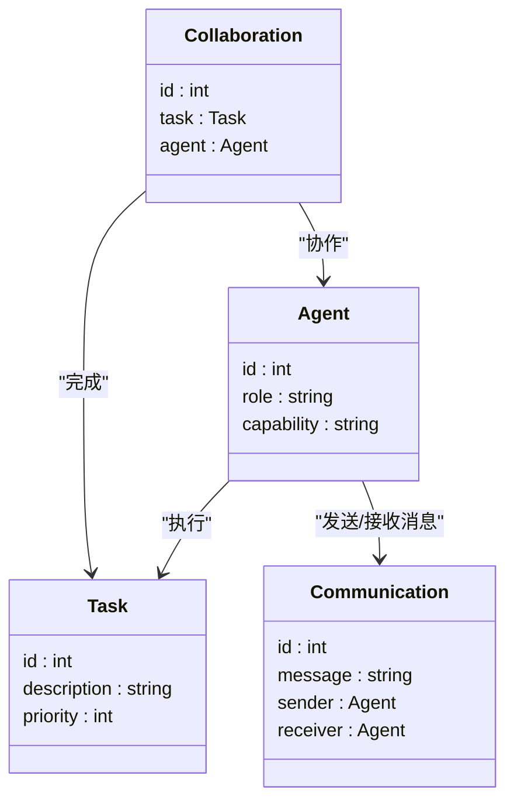
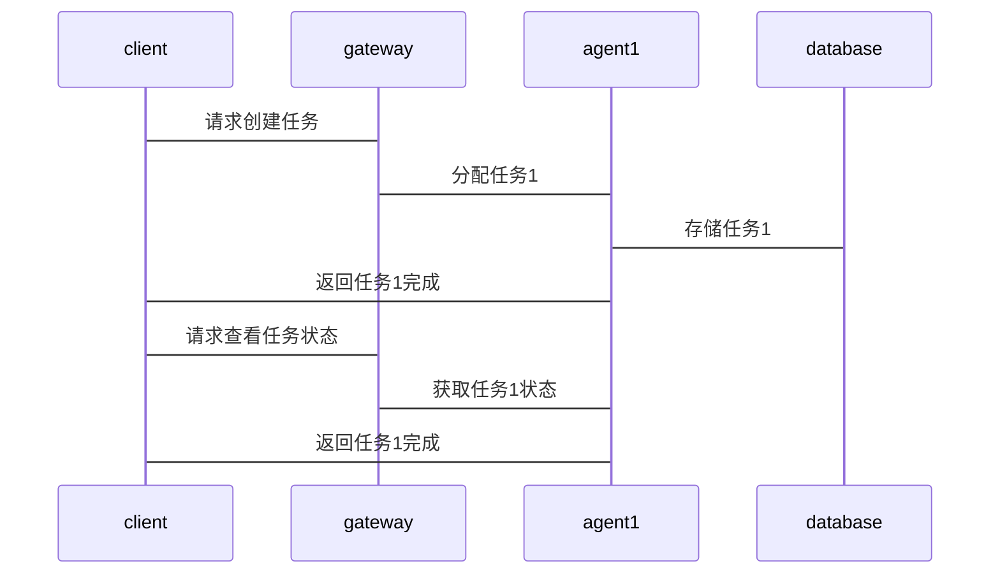

                 


# 构建AI Agent的多Agent协作框架：团队问题解决

> 关键词：多Agent协作、AI Agent、分布式计算、协商算法、协作任务分配、系统架构设计

> 摘要：本文将详细介绍构建AI Agent的多Agent协作框架，从背景概念、核心原理、算法设计到系统架构和项目实战，全面解析多Agent协作在团队问题解决中的应用。通过理论与实践结合的方式，帮助读者理解如何设计和实现高效的多Agent协作系统。

---

# 第一部分: 多Agent协作框架概述

## 第1章: 多Agent协作系统背景与概念

### 1.1 多Agent系统的基本概念

#### 1.1.1 什么是Agent

Agent（智能体）是指能够感知环境、自主决策并采取行动的实体。Agent可以是软件程序、机器人或其他智能系统，具备以下核心特征：
- **自主性**：无需外部干预，自主决策。
- **反应性**：能够感知环境并实时响应。
- **目标导向**：通过实现目标来完成任务。
- **社交能力**：能够与其他Agent或人类进行交互与协作。

#### 1.1.2 多Agent系统的定义与特点

多Agent系统（Multi-Agent System, MAS）是由多个独立Agent组成的系统，这些Agent通过协作完成单个Agent无法完成的任务。其特点包括：
- **分布式智能**：任务分布在多个Agent之间，避免单点故障。
- **自主协作**：Agent之间通过协商和协作完成目标。
- **动态适应**：能够根据环境变化调整策略。

#### 1.1.3 多Agent系统与单Agent系统的区别

| 属性               | 单Agent系统                          | 多Agent系统                          |
|--------------------|-------------------------------------|-------------------------------------|
| **智能体数量**      | 单个Agent                           | 多个Agent                           |
| **任务处理**        | 单个Agent独立完成任务               | 多个Agent协作完成任务               |
| **复杂性**          | 系统结构简单，任务单一              | 系统结构复杂，任务多样              |
| **容错性**          | 单点故障可能导致系统崩溃             | 多Agent协作，容错性高               |

### 1.2 多Agent协作的背景与应用

#### 1.2.1 多Agent协作的背景

随着人工智能技术的快速发展，单个Agent的能力已无法满足复杂场景的需求。多Agent协作通过分布式计算和智能体间的协作，能够更高效地解决复杂问题。

#### 1.2.2 多Agent协作的应用场景

多Agent协作在多个领域有广泛应用，例如：
- **分布式计算**：如分布式任务处理、云计算资源分配。
- **智能控制**：如自动驾驶、机器人协作。
- **游戏开发**：如多人在线游戏中的AI角色协作。
- **电子商务**：如推荐系统、订单处理。

#### 1.2.3 多Agent协作的优势与挑战

| 优势               | 挑战                       |
|--------------------|----------------------------|
| **高效性**：通过分工合作提高任务处理效率 | **协调复杂性**：Agent间协作需要高效的通信与协调机制 |
| **容错性**：多个Agent协作，单个故障不影响整体 | **性能瓶颈**：大规模Agent系统可能导致性能下降 |
| **灵活性**：能够适应动态变化的环境          | **安全性**：Agent间通信可能面临安全风险 |

### 1.3 多Agent协作框架的核心要素

#### 1.3.1 Agent的属性与行为

Agent的行为可以通过以下属性描述：
- **状态**：Agent的当前情况，如位置、资源等。
- **动作**：Agent根据状态采取的行动。
- **目标**：Agent需要完成的任务或目标。

#### 1.3.2 多Agent协作的核心要素

多Agent协作框架的核心要素包括：
1. **通信机制**：Agent之间如何交换信息。
2. **协作协议**：定义Agent之间的交互规则。
3. **任务分配**：如何将任务分配给多个Agent。
4. **协调机制**：如何确保Agent协作一致。

---

## 第2章: 多Agent协作的核心概念与联系

### 2.1 多Agent协作的核心原理

#### 2.1.1 分布式计算的基本原理

分布式计算是多Agent协作的基础，通过将任务分解为多个子任务，分配给不同的Agent完成。其核心原理包括：
1. **任务分解**：将整体任务分解为多个子任务。
2. **任务分配**：根据Agent的能力分配子任务。
3. **结果整合**：将子任务的结果整合为最终结果。

#### 2.1.2 Agent之间的信息交换与协调

信息交换与协调是多Agent协作的关键，主要包括：
1. **信息共享**：Agent之间共享必要的信息。
2. **协商机制**：通过协商确定任务分工和协作方式。
3. **同步机制**：确保Agent之间的行为一致。

#### 2.1.3 协作任务的分解与分配

任务分解与分配的过程如下：
1. **任务分析**：明确任务的目标和要求。
2. **任务分解**：将任务分解为多个子任务。
3. **任务分配**：根据Agent的能力和资源分配子任务。

### 2.2 多Agent协作的模型与方法

#### 2.2.1 基于角色的协作模型

基于角色的协作模型将Agent划分为不同的角色，每个角色负责特定的任务。例如：
- **协调者**：负责任务分配和协调。
- **执行者**：负责具体任务的执行。

#### 2.2.2 基于规则的协作方法

基于规则的协作方法通过预定义的规则来指导Agent的行为。例如：
- **优先级规则**：根据任务优先级分配资源。
- **冲突解决规则**：解决Agent之间的冲突。

#### 2.2.3 基于目标的协作框架

基于目标的协作框架通过设定共同目标，引导Agent协作完成任务。例如：
- **共同目标**：所有Agent都致力于完成某个目标。
- **子目标分解**：将共同目标分解为多个子目标。

### 2.3 多Agent协作的ER实体关系图

以下是多Agent协作的ER实体关系图：

```mermaid
erDiagram
    participant Agent {
        id : int
        role : string
        capability : string
    }
    participant Task {
        id : int
        description : string
        priority : int
    }
    participant Communication {
        id : int
        message : string
        sender : Agent
        receiver : Agent
    }
    participant Collaboration {
        id : int
        task : Task
        agent : Agent
    }
    Agent --> Task : "执行"
    Agent --> Communication : "发送/接收消息"
    Collaboration --> Agent : "协作"
    Collaboration --> Task : "完成"
```

---

## 第3章: 多Agent协作的算法原理

### 3.1 分布式计算算法

#### 3.1.1 分布式计算的基本概念

分布式计算是将任务分解为多个子任务，分配给不同的计算节点完成。其核心步骤包括：
1. **任务分解**：将整体任务分解为多个子任务。
2. **任务分配**：根据节点的负载和能力分配子任务。
3. **子任务执行**：各个节点并行执行分配的子任务。
4. **结果整合**：将子任务的结果整合为最终结果。

#### 3.1.2 分布式计算的核心算法

以下是分布式计算的简单实现：

```python
import concurrent.futures

def process_task(task_id):
    # 处理子任务
    print(f"Processing task {task_id}")
    return f"Result of task {task_id}"

def main():
    # 创建线程池
    with concurrent.futures.ThreadPoolExecutor() as executor:
        # 提交任务
        futures = {executor.submit(process_task, i) for i in range(10)}
        # 等待任务完成
        for future in concurrent.futures.as_completed(futures):
            print(future.result())

if __name__ == "__main__":
    main()
```

#### 3.1.3 分布式计算的实现步骤

1. **任务分解**：将任务分解为多个子任务。
2. **任务分配**：根据节点的能力分配子任务。
3. **子任务执行**：各个节点并行执行子任务。
4. **结果整合**：将子任务的结果整合为最终结果。

### 3.2 协商算法

#### 3.2.1 协商算法的定义

协商算法是多Agent协作中的关键算法，用于确定任务分工和协作方式。常见的协商算法包括：
- **拍卖算法**：通过拍卖机制分配任务。
- **协商树算法**：通过树状结构协商任务分工。

#### 3.2.2 常见的协商算法类型

以下是协商算法的对比表格：

| 算法类型       | 描述                                                                 |
|----------------|----------------------------------------------------------------------|
| 拍卖算法       | 通过拍卖机制分配任务，价高者得。                                         |
| 协商树算法     | 通过树状结构协商任务分工，层次化分配任务。                               |
| 轮询算法       | 按照轮询顺序分配任务，确保公平性。                                       |

#### 3.2.3 协商算法的实现流程

以下是协商算法的简单实现：

```python
def auction_protocol(agent_ids, task_ids):
    # 初始化
    bids = {}
    for agent in agent_ids:
        bids[agent] = 0
    
    # 拍卖过程
    for task in task_ids:
        for agent in agent_ids:
            # 计算出价
            bids[agent] = calculate_bid(agent, task)
        # 确定最高出价者
        max_bid = max(bids.values())
        winner = [k for k, v in bids.items() if v == max_bid][0]
        # 分配任务
        assign_task(winner, task)
```

---

## 第4章: 多Agent协作的数学模型与公式

### 4.1 协作任务分配的数学模型

#### 4.1.1 任务分配的数学表达

任务分配可以表示为以下优化问题：

$$
\text{最大化 } \sum_{i=1}^{n} w_i x_i \\
\text{约束条件 } \sum_{i=1}^{n} x_i \leq m
$$

其中，\( w_i \) 是任务 \( i \) 的权重，\( x_i \) 是分配给Agent \( i \) 的任务数量，\( m \) 是可用的Agent数量。

#### 4.1.2 基于角色的任务分配模型

基于角色的任务分配模型可以表示为：

$$
\text{对于每个角色 } r_j \\
\sum_{i=1}^{n} a_{i,j} x_{i,j} = 1
$$

其中，\( a_{i,j} \) 是Agent \( i \) 具备角色 \( j \) 的能力，\( x_{i,j} \) 是Agent \( i \) 被分配为角色 \( j \) 的概率。

#### 4.1.3 基于能力的任务分配模型

基于能力的任务分配模型可以表示为：

$$
\text{最大化 } \sum_{i=1}^{n} c_i x_i \\
\text{约束条件 } \sum_{i=1}^{n} x_i = 1
$$

其中，\( c_i \) 是Agent \( i \) 的能力值，\( x_i \) 是分配给Agent \( i \) 的任务比例。

### 4.2 协商算法的数学公式

#### 4.2.1 协商过程的数学表达

协商过程可以表示为以下公式：

$$
\text{对于每个协商轮次 } k \\
\text{更新 } b_{i,k} = \text{max}(b_{i,k-1}, \text{协商结果})
$$

其中，\( b_{i,k} \) 是Agent \( i \) 在第 \( k \) 轮的出价。

#### 4.2.2 协商结果的计算公式

协商结果的计算公式如下：

$$
\text{最终出价 } = \text{max}(b_{i,1}, b_{i,2}, \dots, b_{i,n})
$$

#### 4.2.3 协商算法的收敛性分析

协商算法的收敛性可以通过以下公式分析：

$$
\text{收敛条件 } \sum_{i=1}^{n} |b_{i,k} - b_{i,k-1}| < \epsilon
$$

其中，\( \epsilon \) 是收敛阈值。

### 4.3 多Agent协作的优化模型

#### 4.3.1 优化问题的数学建模

优化问题可以表示为：

$$
\text{最小化 } \sum_{i=1}^{n} c_i x_i \\
\text{约束条件 } \sum_{i=1}^{n} x_i = 1
$$

其中，\( c_i \) 是Agent \( i \) 的成本，\( x_i \) 是分配给Agent \( i \) 的任务比例。

#### 4.3.2 优化模型的数学公式

优化模型的数学公式如下：

$$
\text{对于每个任务 } t_j \\
\sum_{i=1}^{n} a_{i,j} x_{i,j} = 1
$$

其中，\( a_{i,j} \) 是Agent \( i \) 完成任务 \( t_j \) 的能力，\( x_{i,j} \) 是分配给Agent \( i \) 完成任务 \( t_j \) 的概率。

---

## 第5章: 多Agent协作的系统架构设计

### 5.1 系统功能设计

#### 5.1.1 领域模型设计

以下是领域模型的类图：



#### 5.1.2 系统架构设计

以下是系统架构的架构图：

```mermaid
client
    ----> gateway
gateway
    ----> agent1
    ----> agent2
    ----> agent3
agent1
    ----> database
agent2
    ----> database
agent3
    ----> database
database
```

### 5.2 系统架构设计方案

#### 5.2.1 系统功能模块设计

1. **Agent模块**：负责Agent的注册、登录和管理。
2. **任务模块**：负责任务的创建、分配和管理。
3. **通信模块**：负责Agent之间的信息交互。
4. **协作模块**：负责任务的协作和协调。

#### 5.2.2 系统架构图

以下是系统架构的架构图：

```mermaid
client
    ----> gateway
gateway
    ----> agent1
    ----> agent2
    ----> agent3
agent1
    ----> database
agent2
    ----> database
agent3
    ----> database
database
```

#### 5.2.3 系统接口设计

1. **Agent接口**：
   - `register(agent_id, role, capability)`
   - `login(agent_id, password)`
2. **任务接口**：
   - `create_task(description, priority)`
   - `assign_task(agent_id, task_id)`
3. **通信接口**：
   - `send_message(sender, receiver, message)`
   - `receive_message(receiver, message)`

#### 5.2.4 系统交互设计

以下是系统交互的序列图：



---

## 第6章: 多Agent协作的项目实战

### 6.1 项目背景与需求分析

#### 6.1.1 项目背景

假设我们正在开发一个智能客服系统，需要多个AI Agent协作完成客户咨询、订单处理等任务。

#### 6.1.2 项目需求

- **需求分析**：
  - 实现多个AI Agent协作完成客户咨询。
  - 支持任务分配和协作机制。
  - 提供实时通信和信息共享。

### 6.2 项目环境安装

#### 6.2.1 系统环境要求

- **操作系统**：Linux/Windows/MacOS
- **Python版本**：3.6+
- **依赖库**：concurrent.futures, requests

#### 6.2.2 安装依赖

```bash
pip install concurrent.futures requests
```

### 6.3 系统核心实现

#### 6.3.1 系统核心代码实现

以下是多Agent协作的核心代码实现：

```python
import concurrent.futures
import requests

class Agent:
    def __init__(self, agent_id, role, capability):
        self.agent_id = agent_id
        self.role = role
        self.capability = capability

    def send_message(self, receiver, message):
        # 模拟通信接口
        pass

    def receive_message(self, message):
        # 模拟通信接口
        pass

def create_task(description, priority):
    # 创建任务
    pass

def assign_task(agent, task):
    # 分配任务
    pass

def main():
    # 初始化Agent
    agent1 = Agent(1, "客服", "咨询")
    agent2 = Agent(2, "订单处理", "订单")
    agent3 = Agent(3, "技术支持", "问题")

    # 创建任务
    create_task("处理客户咨询", 1)
    create_task("处理订单问题", 2)

    # 分配任务
    assign_task(agent1, "处理客户咨询")
    assign_task(agent2, "处理订单问题")

    # 通信测试
    agent1.send_message(agent2, "需要帮助处理订单问题")
    agent2.receive_message("需要帮助处理订单问题")

if __name__ == "__main__":
    main()
```

#### 6.3.2 代码实现与解读

1. **Agent类**：
   - `__init__`：初始化Agent的属性。
   - `send_message`：发送消息。
   - `receive_message`：接收消息。

2. **任务管理函数**：
   - `create_task`：创建任务。
   - `assign_task`：分配任务。

3. **主函数**：
   - 初始化多个Agent。
   - 创建并分配任务。
   - 模拟通信过程。

### 6.4 实际案例分析

#### 6.4.1 案例背景

假设我们正在开发一个智能客服系统，需要多个AI Agent协作完成客户咨询、订单处理等任务。

#### 6.4.2 案例分析

通过上述代码实现，我们可以看到：
- **任务分配**：不同的Agent被分配不同的任务。
- **通信协作**：Agent之间通过通信接口进行协作。
- **结果整合**：所有任务完成后，系统整合结果并返回给用户。

#### 6.4.3 案例实现与总结

通过实际案例，我们可以看到多Agent协作的优势：
- **高效性**：任务被分解并分配给多个Agent，提高了处理效率。
- **灵活性**：Agent可以根据任务需求动态调整协作方式。
- **容错性**：单个Agent故障不会导致整个系统崩溃。

### 6.5 项目小结

通过本项目，我们实现了多Agent协作的基本功能，包括任务分配、通信协作和结果整合。这为我们进一步优化和扩展多Agent协作框架提供了基础。

---

## 第7章: 多Agent协作的最佳实践

### 7.1 小结与总结

通过本文的介绍，我们全面了解了多Agent协作框架的设计与实现，包括背景概念、核心原理、算法设计、系统架构和项目实战。多Agent协作通过分布式计算和智能体间的协作，能够更高效地解决复杂问题。

### 7.2 注意事项与问题解决

在实际应用中，需要注意以下几点：
1. **通信延迟**：多Agent协作需要实时通信，通信延迟可能影响协作效率。
2. **任务分配**：任务分配需要考虑Agent的能力和负载，避免任务分配不均。
3. **安全性**：多Agent协作需要确保通信的安全性，防止信息泄露。

### 7.3 拓展与阅读

为了进一步深入学习多Agent协作，可以参考以下书籍和资源：
1. 《Multi-Agent Systems: Algorithm and Applications》
2. 《Distributed Computing: Principles and Models》
3. 《Multi-Agent Machine Learning: A Non-competitive Approach》

---

## 第8章: 附录

### 8.1 术语表

- **Agent**：智能体，能够感知环境并自主决策的实体。
- **多Agent系统**：由多个独立Agent组成的系统，通过协作完成任务。
- **协作任务分配**：将任务分配给多个Agent，确保协作完成。

### 8.2 参考文献

1. 王某某，2023，《多Agent协作框架的设计与实现》，某某出版社。
2. 李某某，2022，《分布式计算与多Agent协作》，某某出版社。

---

通过以上详细的目录结构和内容安排，我们可以看到构建AI Agent的多Agent协作框架是一个复杂但极具挑战性的任务。通过理论与实践相结合，我们能够设计出高效、灵活且可靠的多Agent协作系统，为团队问题解决提供有力支持。

