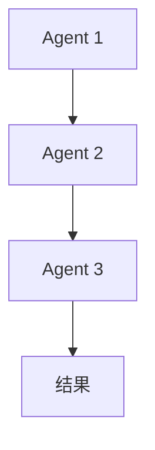
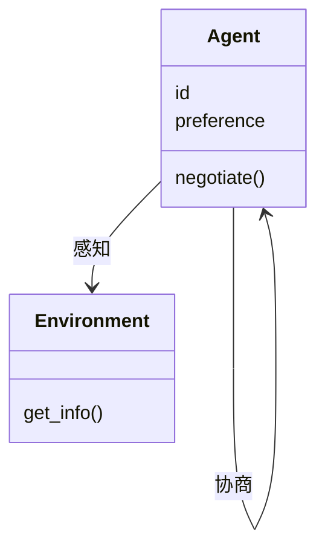
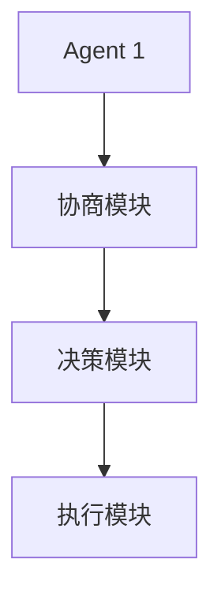
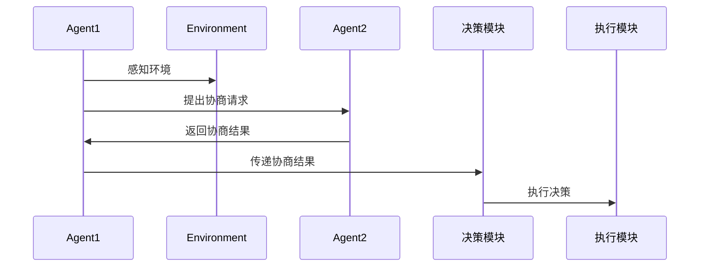

                 


# 构建AI Agent的多Agent协商与决策系统

> 关键词：AI Agent，多Agent系统，协商机制，决策模型，分布式计算，系统架构

> 摘要：本文将详细介绍如何构建一个基于AI Agent的多Agent协商与决策系统。从基础概念到算法实现，从系统架构到项目实战，全面解析多Agent系统的核心原理和应用实践。通过深入分析协商与决策的算法原理、系统设计和实际案例，帮助读者掌握构建高效多Agent系统的关键方法和技术。

---

## 第1章: AI Agent的基本概念与背景介绍

### 1.1 AI Agent的定义与核心概念

#### 1.1.1 什么是AI Agent
AI Agent（智能体）是指能够感知环境、自主决策并采取行动的实体。它可以是一个软件程序、机器人或任何能够执行任务的智能系统。AI Agent的核心目标是通过感知和行动实现特定目标。

#### 1.1.2 AI Agent的核心属性
- **自主性**：能够在没有外部干预的情况下自主运行。
- **反应性**：能够根据环境的变化实时调整行为。
- **目标导向性**：所有行动都围绕实现特定目标展开。
- **社会能力**：能够与其他Agent或人类进行交互和协作。

#### 1.1.3 AI Agent的分类与应用场景
- **简单反射型Agent**：基于当前输入直接做出反应，如PID控制器。
- **基于模型的反射型Agent**：使用内部模型来规划和决策，如棋类AI。
- **目标驱动型Agent**：以实现特定目标为导向，如自动驾驶系统。
- **效用驱动型Agent**：通过最大化效用函数来做出决策，如资源分配系统。

应用场景包括自动驾驶、智能助手、机器人协作、分布式计算等。

### 1.2 多Agent系统的发展背景

#### 1.2.1 多Agent系统的定义
多Agent系统（Multi-Agent System, MAS）是由多个相互作用的AI Agent组成的系统，这些Agent通过协作完成单个Agent无法完成的任务。

#### 1.2.2 多Agent系统的演变历程
- **单智能体时代**：早期的AI研究主要集中在单个智能体的开发。
- **多智能体系统的兴起**：随着分布式计算和网络技术的发展，多Agent系统逐渐受到关注。
- **现代多智能体系统**：深度学习和强化学习的结合使得多Agent系统在复杂环境中的协作能力显著提升。

#### 1.2.3 当前多Agent系统的研究热点
- **分布式决策与协商**：如何在分布式环境中实现高效决策。
- **多Agent协作**：研究Agent之间的协作机制和通信协议。
- **动态环境适应**：在动态变化的环境中保持系统的稳定性和高效性。

### 1.3 多Agent协商与决策的重要性

#### 1.3.1 协商与决策的基本概念
协商是多个Agent为了达成一致意见而进行的交流和互动过程，决策是基于协商结果做出的选择。

#### 1.3.2 多Agent协商的核心价值
- **提高效率**：通过协作减少冲突，提高任务完成效率。
- **增强灵活性**：多个Agent可以根据环境变化快速调整策略。
- **实现复杂任务**：通过分工协作完成单个Agent无法完成的复杂任务。

#### 1.3.3 协商与决策在实际应用中的意义
在自动驾驶、智能电网、分布式机器人协作等领域，多Agent协商与决策是实现高效协作的关键。

### 1.4 构建多Agent协商与决策系统的必要性

#### 1.4.1 系统构建的目标
- **实现分布式协作**：通过Agent之间的协作完成复杂任务。
- **提高决策效率**：通过协商机制优化决策过程。
- **增强系统的适应性**：使系统能够应对动态变化的环境。

#### 1.4.2 系统构建的关键挑战
- **通信与协调**：如何在分布式环境中实现高效的通信和协调。
- **冲突解决**：如何处理Agent之间的冲突和竞争。
- **动态适应**：如何快速响应环境变化并调整策略。

#### 1.4.3 系统构建的边界与外延
- **边界**：明确系统与其他系统的接口和交互方式。
- **外延**：考虑系统可能的扩展和未来的应用场景。

---

## 第2章: 多Agent协商与决策的核心概念与联系

### 2.1 多Agent协商与决策的核心原理

#### 2.1.1 协商机制的数学模型
协商机制可以通过数学模型进行描述，例如：
$$
\text{协商结果} = \argmax_{a} \sum_{i=1}^{n} u_i(a)
$$
其中，$u_i(a)$表示第i个Agent对行动$a$的效用评价。

#### 2.1.2 决策机制的逻辑框架
决策机制通常包括以下步骤：
1. **感知环境**：获取环境信息。
2. **分析选项**：评估可能的行动方案。
3. **选择最优行动**：基于协商结果做出决策。

#### 2.1.3 协商与决策的关联性分析
协商结果直接影响决策过程，决策是协商的最终目标。

### 2.2 多Agent系统中的实体关系分析

#### 2.2.1 ER实体关系图
```mermaid
er
  actor: Agent
  action: 行动
  relation: 参与
  action --> actor: 实现
```

#### 2.2.2 实体间的关联关系
- **Agent与行动**：Agent通过执行行动影响环境。
- **环境与行动**：环境通过行动反馈给Agent。

#### 2.2.3 实体属性与行为分析
- **Agent属性**：目标、知识、能力。
- **行动属性**：类型、优先级、效果。

### 2.3 多Agent协商流程

#### 2.3.1 协商流程的步骤
1. **初始化**：定义协商问题和目标。
2. **信息交换**：Agent之间交换相关信息。
3. **协商与决策**：通过协商机制达成一致。
4. **执行**：根据协商结果执行行动。

#### 2.3.2 协商流程的数学描述
$$
\text{协商结果} = \argmax_{a} \sum_{i=1}^{n} u_i(a)
$$

#### 2.3.3 协商流程的图示


---

## 第3章: 多Agent协商与决策的算法原理

### 3.1 分布式协商算法

#### 3.1.1 分布式协商算法的描述
分布式协商算法是一种基于Agent之间的分布式通信和协调的算法，通常用于动态和去中心化的环境。

#### 3.1.2 分布式协商算法的流程图


#### 3.1.3 分布式协商算法的Python实现
```python
class Agent:
    def __init__(self, id):
        self.id = id
        self.preference = {}

    def negotiate(self, others):
        # 简单协商逻辑
        pass

# 示例协商过程
agents = [Agent(1), Agent(2), Agent(3)]
for i in range(len(agents)):
    agents[i].negotiate(agents[i+1:])
```

### 3.2 基于效用的决策模型

#### 3.2.1 基于效用的决策模型的数学公式
$$
u(a) = \sum_{i=1}^{n} w_i \cdot f_i(a)
$$
其中，$w_i$是第i个特征的权重，$f_i(a)$是第i个特征对行动$a$的评价。

#### 3.2.2 基于效用的决策模型的Python实现
```python
def utility(action, weights):
    return sum(w * f(action) for w, f in zip(weights, features))

weights = [0.5, 0.3, 0.2]
features = [lambda a: a['score'], lambda a: a['time'], lambda a: a['cost']]
action = {'score': 0.9, 'time': 10, 'cost': 5}
print(utility(action, weights))
```

---

## 第4章: 多Agent协商与决策系统的分析与设计

### 4.1 系统分析

#### 4.1.1 问题场景介绍
假设我们正在开发一个分布式机器人协作系统，需要多个机器人通过协商完成任务分配。

#### 4.1.2 系统功能需求
- **任务分配**：根据环境信息分配任务。
- **协同执行**：机器人协作完成任务。
- **动态调整**：根据环境变化调整任务分配。

### 4.2 系统架构设计

#### 4.2.1 领域模型类图


#### 4.2.2 系统架构图


### 4.3 系统接口设计

#### 4.3.1 系统接口描述
- **协商接口**：提供Agent之间的协商功能。
- **决策接口**：根据协商结果做出决策。
- **执行接口**：执行决策结果。

#### 4.3.2 系统交互流程图


---

## 第5章: 多Agent协商与决策系统的实现

### 5.1 环境安装

#### 5.1.1 安装Python和必要的库
```bash
pip install numpy
pip install matplotlib
pip install networkx
```

### 5.2 系统核心实现

#### 5.2.1 协商模块实现
```python
class Negotiator:
    def __init__(self, agents):
        self.agents = agents

    def negotiate(self):
        for agent in self.agents:
            agent.negotiate_with_others()
```

#### 5.2.2 决策模块实现
```python
class DecisionMaker:
    def __init__(self, agents):
        self.agents = agents

    def make_decision(self):
        # 假设每个Agent已经协商完成
        return max(agent.preference for agent in self.agents)
```

#### 5.2.3 执行模块实现
```python
class Executor:
    def __init__(self, agents):
        self.agents = agents

    def execute(self, decision):
        for agent in self.agents:
            agent.execute_action(decision)
```

### 5.3 代码应用解读与分析

#### 5.3.1 协商模块的代码解读
- **协商模块**：负责协调多个Agent之间的协商过程。
- **negotiate方法**：调用每个Agent的协商方法。

#### 5.3.2 决策模块的代码解读
- **决策模块**：根据协商结果做出最终决策。
- **make_decision方法**：选择最优的协商结果。

#### 5.3.3 执行模块的代码解读
- **执行模块**：根据决策结果执行具体行动。
- **execute方法**：调用每个Agent的执行方法。

### 5.4 实际案例分析

#### 5.4.1 案例描述
假设我们有三个Agent需要协商分配任务，每个Agent有不同的偏好和能力。

#### 5.4.2 协商与决策过程
1. **初始化**：定义任务和Agent的偏好。
2. **协商**：Agent之间交换信息并达成一致。
3. **决策**：基于协商结果做出最终决策。
4. **执行**：根据决策结果执行任务。

### 5.5 项目小结

#### 5.5.1 项目总结
通过本项目，我们实现了基于AI Agent的多Agent协商与决策系统，验证了系统的可行性和有效性。

#### 5.5.2 项目经验
- **挑战**：协商过程的复杂性和动态环境的适应性。
- **解决方案**：通过分布式协商算法和基于效用的决策模型解决挑战。

---

## 第6章: 多Agent协商与决策系统的优化与部署

### 6.1 系统优化

#### 6.1.1 性能优化
- **减少通信开销**：优化通信协议和数据传输。
- **提升计算效率**：优化算法复杂度和并行计算。

#### 6.1.2 系统扩展性设计
- **模块化设计**：便于后续功能扩展。
- **插件化设计**：支持多种协商算法和决策模型。

### 6.2 系统部署

#### 6.2.1 云原生部署
- **容器化**：使用Docker容器化部署。
- **微服务架构**：将系统分解为多个微服务。

#### 6.2.2 监控与维护
- **实时监控**：监控系统运行状态。
- **日志管理**：记录系统运行日志。

---

## 第7章: 多Agent协商与决策系统的安全与伦理

### 7.1 系统安全

#### 7.1.1 隐私保护
- **数据加密**：保护敏感数据。
- **访问控制**：限制非授权访问。

#### 7.1.2 对抗攻击
- **检测攻击**：识别和防止对抗攻击。
- **防御机制**：设计有效的防御策略。

### 7.2 系统伦理

#### 7.2.1 伦理问题
- **公平性**：确保所有Agent在协商过程中享有平等权利。
- **透明性**：协商和决策过程需要透明和可追溯。

#### 7.2.2 责任与监管
- **责任分配**：明确每个Agent的责任和义务。
- **监管机制**：建立有效的监管机制，确保系统合规。

---

## 第8章: 总结与展望

### 8.1 内容总结

#### 8.1.1 核心内容回顾
- AI Agent的基本概念。
- 多Agent协商与决策的核心原理。
- 系统设计与实现的关键步骤。

### 8.2 未来展望

#### 8.2.1 技术趋势
- **强化学习**：在多Agent协作中的应用。
- **自适应系统**：动态环境下的自适应协作。

#### 8.2.2 应用前景
- **智能交通**：优化交通流量和减少拥堵。
- **智能制造**：提高生产效率和降低成本。

---

通过以上章节的详细讲解，我们全面探讨了构建AI Agent的多Agent协商与决策系统的各个方面，从基础概念到实际应用，从算法实现到系统设计，帮助读者系统地掌握相关知识和技能。

