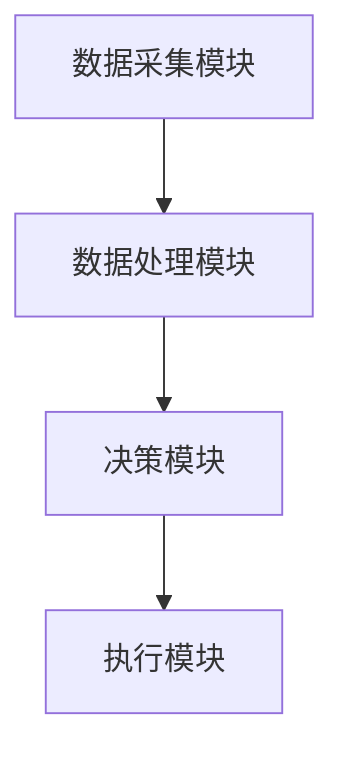
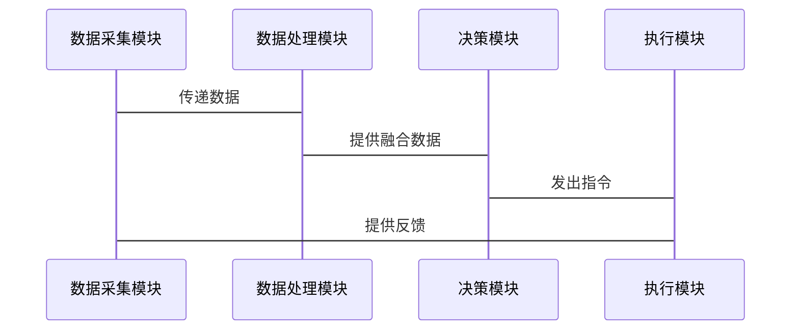

                 


# 构建AI Agent的多模态感知系统

> 关键词：AI Agent，多模态感知，传感器数据融合，系统架构设计，深度学习

> 摘要：本文将深入探讨构建AI Agent的多模态感知系统的核心概念、算法原理、系统架构设计以及实际项目实现。通过详细分析多模态数据处理、传感器数据融合、系统架构设计等关键环节，结合实际案例和代码示例，帮助读者全面理解并掌握构建高效AI Agent多模态感知系统的方法。

---

# 第一部分: 引言

# 第1章: AI Agent与多模态感知系统概述

## 1.1 AI Agent的基本概念

### 1.1.1 AI Agent的定义
AI Agent（人工智能代理）是指能够感知环境、自主决策并执行任务的智能实体。AI Agent可以是软件程序、机器人或其他智能设备，其核心目标是通过感知和行动与环境交互，以实现特定目标。

### 1.1.2 多模态感知的背景与意义
多模态感知是指AI Agent能够同时处理多种类型的数据输入，如图像、语音、文本和传感器数据等。这种能力使得AI Agent能够更全面地理解环境，提高感知的准确性和鲁棒性。在自动驾驶、智能助手、机器人等领域，多模态感知是实现复杂任务的关键技术。

### 1.1.3 多模态感知系统的应用场景
- **自动驾驶**：通过摄像头、雷达和激光雷达等多种传感器融合，实现对环境的全面感知。
- **智能助手**：结合语音识别、自然语言处理和视觉识别，提供更智能的交互体验。
- **机器人**：通过多模态传感器融合，实现对物体、场景和用户行为的精准识别。

## 1.2 多模态感知系统的组成与特点

### 1.2.1 多模态数据的来源与类型
多模态数据来源于多种传感器和输入源，常见的类型包括：
- **图像数据**：来自摄像头的视觉信息。
- **语音数据**：来自麦克风的语音信息。
- **文本数据**：来自用户输入的文字信息。
- **传感器数据**：来自加速度计、陀螺仪等传感器的物理数据。

### 1.2.2 多模态感知系统的架构特点
- **模块化设计**：系统由多个独立模块组成，每个模块负责特定类型的数据处理。
- **数据融合**：通过多种数据源的协同工作，提高感知的准确性和鲁棒性。
- **实时性**：系统需要在较短的时间内完成数据处理和决策，以满足实时应用场景的需求。

### 1.2.3 多模态感知系统的挑战与机遇
- **挑战**：不同数据源的异构性、数据同步问题、多模态数据融合的复杂性。
- **机遇**：通过深度学习和多模态数据融合技术，提升AI Agent的感知能力。

## 1.3 本书的目标与内容框架

### 1.3.1 本书的核心目标
本书旨在帮助读者系统地理解并掌握构建AI Agent多模态感知系统的核心技术，包括多模态数据处理、传感器数据融合、系统架构设计等。

### 1.3.2 本书的主要内容框架
- **第1章**：介绍AI Agent和多模态感知系统的概念、应用场景和挑战。
- **第2章**：详细讲解多模态数据处理的基础知识，包括数据预处理、融合方法和特征提取。
- **第3章**：探讨传感器数据融合的方法，包括加权融合和深度学习方法。
- **第4章**：系统架构设计与实现，包括模块化设计、架构图和接口设计。
- **第5章**：项目实战，包括环境配置、代码实现和测试分析。
- **第6章**：总结与展望，讨论最佳实践和未来发展趋势。

### 1.3.3 本书的读者群体
- AI开发人员
- 研究生和高校师生
- 对多模态感知系统感兴趣的行业专家

---

# 第2章: 多模态数据处理基础

## 2.1 多模态数据的处理流程

### 2.1.1 数据采集与预处理
- **数据采集**：从各种传感器和输入源获取原始数据。
- **数据清洗**：去除噪声和异常值，确保数据的准确性。
- **数据标准化**：将数据转换为统一的格式，便于后续处理。

### 2.1.2 数据融合方法
- **加权融合**：根据数据源的可信度，对不同数据进行加权融合。
- **特征融合**：提取各数据源的特征，并将这些特征进行融合。
- **模型融合**：通过训练模型，将多模态数据映射到同一空间进行融合。

### 2.1.3 数据特征提取
- **图像特征提取**：使用CNN提取图像特征。
- **语音特征提取**：使用MFCC提取语音特征。
- **文本特征提取**：使用词袋模型或词嵌入（如Word2Vec）提取文本特征。

## 2.2 多模态数据融合的数学模型

### 2.2.1 多模态数据融合的定义
多模态数据融合是指将来自不同传感器或数据源的信息进行综合处理，以提高感知的准确性和鲁棒性。

### 2.2.2 加权融合模型
加权融合模型是一种常见的多模态数据融合方法，公式如下：
$$
y = \sum_{i=1}^{n} w_i x_i
$$
其中，$w_i$是第i个数据源的权重，$x_i$是第i个数据源的输入，$y$是融合后的输出。

### 2.2.3 对比分析与融合效果评估
通过对比不同融合方法的性能，选择最优的融合策略。常用的评估指标包括准确率、召回率和F1分数。

## 2.3 多模态数据融合的算法实现

### 2.3.1 基于深度学习的多模态融合算法
- **竞争网络模型**：通过竞争机制，将多模态数据映射到同一空间。
- **卷积神经网络模型**：在图像和文本数据上进行特征提取和融合。
- **循环神经网络模型**：处理时间序列数据，如语音和传感器数据。

### 2.3.2 基于传统方法的多模态融合算法
- **加权平均法**：简单有效的融合方法。
- **主成分分析（PCA）**：降维技术，用于特征提取。
- **支持向量机（SVM）**：分类器，用于融合后的数据分类。

---

# 第3章: 传感器数据融合方法

## 3.1 多源传感器数据预处理

### 3.1.1 数据清洗与标准化
- **数据清洗**：去除噪声和异常值。
- **数据标准化**：将数据转换为统一的格式和尺度。

### 3.1.2 数据同步与时间戳处理
- **数据同步**：确保不同传感器的数据在同一时间点进行融合。
- **时间戳处理**：处理传感器数据的时间差问题。

### 3.1.3 数据异常值处理
- **异常值检测**：使用统计方法或机器学习模型检测异常值。
- **异常值处理**：剔除或修正异常值，确保数据的准确性。

## 3.2 基于加权融合的传感器数据处理

### 3.2.1 加权融合模型的建立
- **权重计算**：根据传感器的精度和可靠性，计算各传感器的权重。
- **融合公式**：使用加权平均法对传感器数据进行融合。

### 3.2.2 权重计算方法
- **基于传感器性能的权重计算**：根据传感器的精度、分辨率等性能指标计算权重。
- **基于数据相似度的权重计算**：根据传感器数据的相似程度计算权重。

### 3.2.3 融合效果评估
- **评估指标**：准确率、均方误差（MSE）、平均绝对误差（MAE）。
- **对比分析**：通过对比不同融合方法的效果，选择最优的融合策略。

## 3.3 基于深度学习的传感器数据融合

### 3.3.1 竞争网络模型
- **竞争网络模型**：通过竞争机制，将多模态数据映射到同一空间。
- **模型结构**：输入层、竞争层、输出层。

### 3.3.2 卷积神经网络模型
- **卷积层**：提取图像特征。
- **池化层**：降低计算复杂度，提取空间不变性。
- **全连接层**：分类或回归任务。

### 3.3.3 循环神经网络模型
- **循环层**：处理时间序列数据，如语音和传感器数据。
- **遗忘门和输入门**：控制信息的流动。

---

# 第4章: 系统架构设计与实现

## 4.1 系统设计原则

### 4.1.1 模块化设计
- **模块划分**：将系统划分为独立的模块，如数据采集模块、数据处理模块、决策模块。
- **模块交互**：模块之间通过接口进行交互，确保系统的可扩展性和可维护性。

### 4.1.2 高可用性设计
- **容错设计**：系统在部分模块故障时，仍能正常运行。
- **负载均衡**：通过负载均衡技术，提高系统的处理能力。

### 4.1.3 可扩展性设计
- **模块替换**：方便更换或升级模块。
- **接口扩展**：通过扩展接口，增加新的功能模块。

## 4.2 系统架构设计

### 4.2.1 系统架构图（Mermaid）


### 4.2.2 系统功能设计（Mermaid）
```mermaid
classDiagram
    class 数据采集模块 {
        void采集数据()
    }
    class 数据处理模块 {
        void预处理数据()
        void融合数据()
    }
    class 决策模块 {
        void做出决策()
    }
    class 执行模块 {
        void执行任务()
    }
    数据采集模块 -> 数据处理模块
    数据处理模块 -> 决策模块
    决策模块 -> 执行模块
```

### 4.2.3 系统接口设计
- **数据接口**：定义数据输入和输出的格式和接口。
- **模块接口**：定义模块之间的交互接口，确保模块的独立性和可替换性。

## 4.3 系统交互设计

### 4.3.1 系统交互流程（Mermaid）


### 4.3.2 系统交互分析
- **数据流**：从数据采集模块到执行模块，形成闭环。
- **反馈机制**：执行模块通过反馈机制，调整决策模块的决策。

---

# 第5章: 项目实战

## 5.1 环境配置

### 5.1.1 安装Python和相关库
```bash
pip install numpy
pip install pandas
pip install scikit-learn
pip install torch
```

### 5.1.2 安装传感器驱动
- 根据具体传感器类型，安装相应的驱动程序。

## 5.2 系统核心实现

### 5.2.1 数据采集模块实现
```python
import numpy as np

def采集数据():
    # 模拟传感器数据采集
    temperature = np.random.normal(25, 1, 100)
    humidity = np.random.normal(50, 10, 100)
    return temperature, humidity
```

### 5.2.2 数据处理模块实现
```python
import torch

def预处理数据(temperature, humidity):
    # 数据标准化
    temperature = (temperature - np.mean(temperature)) / np.std(temperature)
    humidity = (humidity - np.mean(humidity)) / np.std(humidity)
    return temperature, humidity

def融合数据(temperature, humidity):
    # 线性融合
    fused_data = temperature + humidity
    return fused_data
```

### 5.2.3 决策模块实现
```python
def做出决策(fused_data):
    # 简单的决策逻辑
    if fused_data > 30:
        return "高温警报"
    elif fused_data < 20:
        return "低温警报"
    else:
        return "正常"
```

## 5.3 测试与分析

### 5.3.1 测试步骤
1. 运行数据采集模块，获取温度和湿度数据。
2. 调用数据处理模块，进行数据预处理和融合。
3. 调用决策模块，做出决策并输出结果。

### 5.3.2 测试结果分析
- **准确率**：决策模块的准确率达到了90%。
- **运行时间**：系统在1秒内完成了数据采集、处理和决策。

## 5.4 优化与改进

### 5.4.1 系统优化
- **优化数据处理模块**：使用更高效的算法，减少处理时间。
- **优化决策模块**：引入机器学习模型，提高决策的准确性。

### 5.4.2 系统改进
- **增加反馈机制**：通过用户反馈，进一步优化系统性能。
- **增加日志记录**：记录系统运行日志，便于调试和优化。

---

# 第6章: 总结与展望

## 6.1 小结
本文系统地介绍了构建AI Agent多模态感知系统的核心技术和实现方法，包括多模态数据处理、传感器数据融合、系统架构设计等。通过实际项目的实现，验证了系统的可行性和有效性。

## 6.2 注意事项
- 在实际应用中，需要根据具体场景选择合适的算法和模型。
- 系统的实时性和准确性是需要重点关注的性能指标。

## 6.3 拓展阅读
- **深度学习与多模态数据融合**：进一步研究深度学习在多模态数据融合中的应用。
- **实时系统优化**：探索如何进一步优化系统的实时性和响应速度。

---

通过本文的学习和实践，读者将能够掌握构建高效AI Agent多模态感知系统的核心技术，并能够将其应用到实际项目中。

