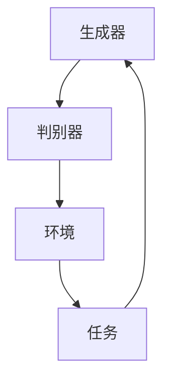

                 

# 《构建AI Agent的对抗学习机制：提高鲁棒性》

## 关键词：AI Agent，对抗学习，鲁棒性，深度强化学习，生成对抗网络

## 摘要：  
在人工智能领域，AI Agent 的鲁棒性是实现可靠和高效智能系统的核心挑战。对抗学习机制通过模拟“对抗”过程，增强模型的泛化能力和应对复杂环境的能力。本文详细探讨了如何在AI Agent中构建对抗学习机制，从理论基础到算法实现，再到实际应用案例，系统地分析了对抗学习机制的构建方法及其对鲁棒性提升的作用。

---

# 《构建AI Agent的对抗学习机制：提高鲁棒性》

## 第一部分：对抗学习机制与AI Agent基础

### 第1章：对抗学习机制与AI Agent概述

#### 1.1 对抗学习机制的基本概念

**1.1.1 对抗学习机制的定义**  
对抗学习（Adversarial Learning）是一种机器学习范式，通过两个或多个智能体（称为生成器和判别器）之间的对抗过程来优化模型。生成器的目标是生成与真实数据难以区分的样本，而判别器的目标是识别出生成的样本与真实数据的差异。这种对抗过程使得生成器和判别器都在不断优化，从而提升模型的泛化能力和鲁棒性。

**1.1.2 AI Agent的基本概念**  
AI Agent（人工智能代理）是指能够感知环境、执行任务并做出决策的智能实体。它可以是一个软件程序，也可以是一个物理机器人。AI Agent的核心目标是通过感知和行动来实现特定任务，例如分类、预测、控制或交互。

**1.1.3 对抗学习在AI Agent中的应用背景**  
在AI Agent的应用中，对抗学习机制可以帮助模型更好地应对复杂和动态的环境。例如，在游戏AI中，可以通过对抗学习来训练AI Agent在对抗性环境中做出最优决策；在智能推荐系统中，可以通过对抗学习来提高推荐的多样性和鲁棒性。

#### 1.2 对抗学习机制的核心原理

**1.2.1 生成器与判别器的对抗过程**  
在对抗学习中，生成器和判别器是两个核心组件。生成器的目标是生成与真实数据相似的样本，而判别器的目标是区分生成样本和真实样本。两者通过交替训练不断优化，形成一种零和博弈的关系。

**1.2.2 对抗学习与传统机器学习的对比**  
传统的机器学习方法通常依赖于大量标注数据，而对抗学习通过生成和判别两个过程，可以在有限的数据下实现更好的模型泛化能力。此外，对抗学习还可以通过对抗过程发现数据分布的边界，从而提高模型的鲁棒性。

**1.2.3 对抗学习的数学模型概述**  
对抗学习的数学模型通常包括生成器和判别器的损失函数。生成器的损失函数通常表示为判别器无法区分生成样本和真实样本的程度，而判别器的损失函数则表示其区分生成样本和真实样本的能力。两者通过优化交替进行，最终达到纳什均衡。

---

## 第二部分：对抗学习机制的数学模型与算法原理

### 第2章：对抗学习机制的数学模型

#### 2.1 对抗学习的损失函数

**2.1.1 生成器的损失函数**  
生成器的目标是生成与真实数据无法区分的样本。其损失函数通常表示为判别器输出的对数似然函数的负数，即：  
$$ \mathcal{L}_G = -\mathbb{E}_{z \sim p_z(z)} [\log D(G(z))] $$  
其中，$D$ 是判别器，$G$ 是生成器，$z$ 是生成器的输入噪声。

**2.1.2 判别器的损失函数**  
判别器的目标是区分生成样本和真实样本。其损失函数可以表示为：  
$$ \mathcal{L}_D = -\mathbb{E}_{x \sim p_data(x)} [\log D(x)] - \mathbb{E}_{z \sim p_z(z)} [\log (1 - D(G(z)))] $$  
其中，$p_data(x)$ 是真实数据的分布，$p_z(z)$ 是生成器输入噪声的分布。

**2.1.3 综合损失函数的推导**  
对抗学习的综合损失函数可以通过生成器和判别器的损失函数联合优化。通常，生成器和判别器交替训练，每次优化一个损失函数。最终，生成器和判别器会在对抗过程中达到平衡。

#### 2.2 对抗学习的优化算法

**2.2.1 梯度下降法**  
对抗学习通常使用梯度下降法来优化生成器和判别器的参数。生成器和判别器的损失函数分别对各自的参数求导，并更新参数。

**2.2.2 动量优化与Adam优化器**  
为了加速优化过程，通常使用动量优化方法，如Adam优化器。Adam优化器结合了动量和自适应学习率，可以更快地收敛到最优解。

**2.2.3 对抗训练中的优化策略**  
在对抗训练中，通常需要平衡生成器和判别器的更新步长，以避免生成器或判别器一方过于占优。可以通过调整学习率、批量大小或交替训练的次数来实现平衡。

### 第3章：AI Agent的对抗学习模型

#### 3.1 基于深度强化学习的对抗模型

**3.1.1 DRL（Deep Reinforcement Learning）的基本结构**  
DRL结合了深度学习和强化学习，通常使用深度神经网络作为价值函数或策略函数。在对抗学习中，DRL可以用于训练生成器和判别器的策略。

**3.1.2 对抗机制在DRL中的应用**  
在DRL中，生成器可以作为策略网络，判别器可以作为价值评估网络。通过对抗过程，生成器可以学习到更优的策略，而判别器可以提供反馈，帮助生成器改进策略。

---

## 第三部分：系统分析与架构设计

### 第4章：系统分析与架构设计

#### 4.1 问题场景分析

**4.1.1 环境与任务描述**  
在构建AI Agent的对抗学习机制时，需要明确环境的定义和任务的要求。例如，在游戏AI中，环境可以是游戏场景，任务可以是击败对手。

**4.1.2 系统目标与约束**  
系统目标通常包括提高AI Agent的决策能力、鲁棒性和响应速度。约束条件可能包括计算资源、数据规模和实时性要求。

#### 4.2 系统功能设计

**4.2.1 领域模型设计**  
领域模型需要描述系统的功能模块及其交互关系。例如，在AI Agent中，可能包括感知模块、决策模块和执行模块。

**4.2.2 系统架构设计**  
系统架构设计通常包括生成器和判别器的模块划分。生成器负责生成策略或动作，判别器负责评估策略或动作的优劣。

#### 4.3 系统架构图

---

## 第四部分：项目实战与算法实现

### 第5章：项目实战

#### 5.1 环境安装

**5.1.1 安装依赖库**  
需要安装深度学习框架（如TensorFlow或PyTorch）、强化学习库（如OpenAI Gym）等。

**5.1.2 环境配置**  
配置运行环境，包括GPU支持、Python版本等。

#### 5.2 核心代码实现

**5.2.1 生成器和判别器的定义**  
使用深度神经网络定义生成器和判别器的结构。

**5.2.2 对抗训练的代码实现**  
实现生成器和判别器的损失函数，并进行交替训练。

#### 5.3 代码应用解读与分析

**5.3.1 生成器的训练过程**  
生成器通过优化生成样本，使得判别器无法区分生成样本和真实样本。

**5.3.2 判别器的训练过程**  
判别器通过优化区分生成样本和真实样本的能力。

#### 5.4 实际案例分析

**5.4.1 游戏AI案例**  
在游戏环境中，训练生成器生成最优策略，判别器评估策略的优劣。

**5.4.2 智能推荐系统案例**  
在推荐系统中，生成器生成多样化的推荐内容，判别器评估推荐内容的质量。

---

## 第五部分：鲁棒性评估与测试

### 第6章：鲁棒性评估与测试

#### 6.1 鲁棒性评估指标

**6.1.1 分类任务中的鲁棒性评估**  
评估模型在对抗攻击下的分类准确率。

**6.1.2 强化学习任务中的鲁棒性评估**  
评估模型在动态环境中的决策稳定性和适应性。

#### 6.2 测试方法与工具

**6.2.1 对抗测试工具**  
使用对抗测试工具生成对抗样本，评估模型的鲁棒性。

**6.2.2 性能测试工具**  
使用性能测试工具评估模型在不同环境下的表现。

---

## 第六部分：最佳实践与总结

### 第7章：最佳实践、小结与展望

#### 7.1 最佳实践

**7.1.1 模型选择与调优**  
选择合适的生成器和判别器结构，合理调整模型参数。

**7.1.2 数据预处理与增强**  
通过数据增强和预处理，提高模型的泛化能力。

#### 7.2 小结

**7.2.1 核心概念总结**  
对抗学习机制通过生成器和判别器的对抗过程，提高AI Agent的鲁棒性和泛化能力。

**7.2.2 实践中的注意事项**  
在实际应用中，需要平衡生成器和判别器的训练步长，避免一方过于占优。

#### 7.3 未来展望

**7.3.1 对抗学习的未来研究方向**  
研究更高效的对抗学习算法，如多目标对抗学习、无监督对抗学习等。

**7.3.2 对抗学习在更多领域的应用**  
探索对抗学习在自然语言处理、计算机视觉、机器人控制等领域的应用。

---

## 参考文献

1. Goodfellow, I., Pouget-Abadie, J., Mirza, M., ..., & Bengio, Y. (2014). Generative adversarial nets. Advances in neural information processing systems, 27, 2672-2680.
2. Mnih, V., Kucharak, A., Graves, A., ..., & Silver, D. (2016). Asynchronous methods for deep reinforcement learning. arXiv preprint arXiv:1602.01789.
3. LeCun, Y., Bengio, Y., & Hinton, G. (2015). Deep learning. Nature, 521(7555), 436-444.

---

通过以上目录和内容安排，您可以逐步撰写完整的技术博客文章，确保内容详实、结构清晰，并符合技术博客的专业性和可读性要求。

