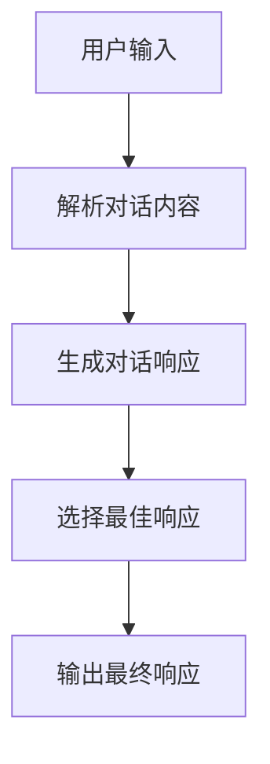
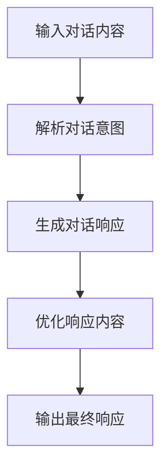
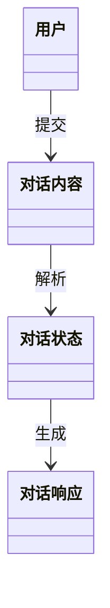
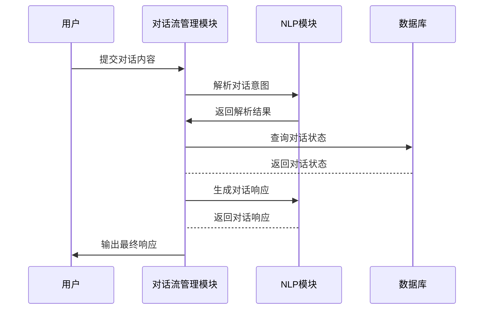

                 


# 构建AI Agent的对话流管理系统：提升交互流畅度

---

## 关键词：对话流管理，AI Agent，交互流畅度，系统架构，算法原理，实战案例，优化建议

---

## 摘要：  
随着AI技术的快速发展，AI Agent在各个领域的应用越来越广泛。然而，对话流管理作为AI Agent交互的核心环节，其流畅度直接影响用户体验。本文从对话流管理的背景与问题出发，深入探讨其核心概念、算法原理、系统架构，并通过实战案例分析，提出优化建议，帮助读者构建高效的对话流管理系统，提升交互流畅度。

---

# 第一章: 对话流管理系统的背景与问题描述

## 1.1 对话流管理的背景与重要性
### 1.1.1 AI Agent与对话交互的基本概念  
AI Agent是一种智能体，能够通过自然语言处理技术与用户进行交互。对话交互是AI Agent实现功能的重要方式，而对话流管理则是确保对话过程高效、流畅的关键技术。

### 1.1.2 对话流畅度对用户体验的影响  
对话流畅度直接影响用户的满意度和信任感。流畅的对话能够让用户感受到AI Agent的智能性和实用性，而流畅度不足则会导致用户体验下降，甚至影响产品的口碑。

### 1.1.3 当前对话流管理的主要挑战  
- 对话意图识别的准确性不足。  
- 对话上下文的理解不够深入。  
- 多轮对话中的状态管理复杂。  

## 1.2 对话流管理的核心问题  
### 1.2.1 对话过程中的问题背景  
在实际应用中，对话过程可能会遇到用户意图模糊、对话上下文丢失、多轮对话中的状态混乱等问题。这些问题会直接影响对话的流畅性。

### 1.2.2 对话流管理的目标与边界  
对话流管理的目标是通过合理的对话流程设计，确保AI Agent能够准确理解用户意图，并生成符合预期的对话响应。其边界包括对话的开始与结束，以及对话中的状态管理。

### 1.2.3 对话流管理的核心要素与组成  
对话流管理的核心要素包括：  
1. 对话意图识别：准确理解用户的输入内容。  
2. 对话上下文管理：维护对话过程中的上下文信息。  
3. 对话响应生成：根据意图和上下文生成合适的响应。  

## 1.3 对话流管理的现状与趋势  
### 1.3.1 当前对话流管理的技术发展  
近年来，基于规则的对话流管理逐渐被基于机器学习和深度学习的方法取代，后者在对话流畅度和适应性方面表现更优。

### 1.3.2 行业中的典型应用案例  
例如，在智能客服、智能助手等领域，对话流管理技术已经得到了广泛应用，显著提升了用户体验。

### 1.3.3 未来对话流管理的趋势与方向  
未来，对话流管理将更加智能化、个性化，并与多模态交互技术深度融合，进一步提升对话的流畅性和用户体验。

## 1.4 本章小结  
本章从背景与重要性、核心问题、现状与趋势三个方面，全面介绍了对话流管理的基本概念和关键问题，为后续章节的深入分析奠定了基础。

---

# 第二章: 对话流管理的核心概念与联系

## 2.1 对话流管理的核心概念  
### 2.1.1 对话流管理的基本原理  
对话流管理通过对对话过程的建模和控制，确保对话的流畅性和有效性。其基本原理包括对话意图识别、上下文管理、对话流程控制等。

### 2.1.2 对话流管理的关键属性与特征  
- **意图识别**：准确理解用户的输入内容。  
- **上下文管理**：维护对话过程中的上下文信息。  
- **流程控制**：根据对话状态选择合适的对话路径。  

## 2.2 对话流管理的概念对比与ER图  
### 2.2.1 对话流管理与传统对话系统的对比  
对话流管理相较于传统对话系统，更加注重对话过程的动态调整和个性化处理。

### 2.2.2 对话流管理的ER实体关系图  
以下是对话流管理的ER实体关系图：  
```mermaid
er
actor: 用户
action: 对话操作
message: 对话内容
state: 对话状态
```

## 2.3 对话流管理的流程图  
以下是对话流管理的流程图：  


## 2.4 本章小结  
本章通过对比和流程图的方式，详细讲解了对话流管理的核心概念及其联系，帮助读者更好地理解其工作原理。

---

# 第三章: 对话流管理系统的算法原理

## 3.1 对话流管理的算法概述  
### 3.1.1 基于规则的对话流管理  
基于规则的对话流管理通过预定义的规则来控制对话流程，适用于场景简单、规则明确的对话任务。

### 3.1.2 基于机器学习的对话流管理  
基于机器学习的对话流管理通过训练模型来学习对话的规律和模式，能够处理更加复杂的对话场景。

### 3.1.3 基于深度学习的对话流管理  
基于深度学习的对话流管理利用神经网络模型，能够实现更自然、更流畅的对话交互。

## 3.2 对话流管理的算法流程图  
以下是对话流管理的算法流程图：  


## 3.3 对话流管理的数学模型与公式  
### 对话意图识别的数学模型  
$$ P(y|x) = \frac{P(x|y)P(y)}{P(x)} $$  

其中：  
- \( P(y|x) \) 是在给定输入 \( x \) 的情况下，输出 \( y \) 的概率。  
- \( P(x|y) \) 是在给定输出 \( y \) 的情况下，输入 \( x \) 的概率。  
- \( P(y) \) 是输出 \( y \) 的先验概率。  
- \( P(x) \) 是输入 \( x \) 的边际概率。  

### 对话响应生成的数学模型  
$$ P(y|x) = \sum_{z} P(y|z, x)P(z|x) $$  

其中：  
- \( P(y|z, x) \) 是在输入 \( x \) 和隐含状态 \( z \) 的情况下，输出 \( y \) 的条件概率。  
- \( P(z|x) \) 是输入 \( x \) 的情况下，隐含状态 \( z \) 的概率。  

## 3.4 本章小结  
本章通过算法概述、流程图和数学模型的讲解，深入分析了对话流管理的实现原理，为后续的系统设计奠定了基础。

---

# 第四章: 对话流管理系统的系统分析与架构设计

## 4.1 系统分析  
### 4.1.1 问题场景介绍  
以智能客服系统为例，对话流管理需要处理用户的咨询、问题反馈等任务，确保对话的高效和流畅。

### 4.1.2 项目介绍  
本项目旨在设计一个高效的对话流管理系统，提升AI Agent的交互流畅度。

## 4.2 系统功能设计  
### 4.2.1 领域模型mermaid类图  
以下是对话流管理系统的领域模型类图：  


### 4.2.2 系统架构设计mermaid架构图  
以下是对话流管理系统的架构图：  


### 4.2.3 系统接口设计  
以下是系统接口设计的示例：  
- 用户输入接口：`POST /api/v1/dialog/input`  
- 对话状态查询接口：`GET /api/v1/dialog/state`  
- 对话响应生成接口：`POST /api/v1/dialog/response`  

### 4.2.4 系统交互mermaid序列图  
以下是系统交互的序列图：  


## 4.3 本章小结  
本章通过系统分析和架构设计，详细讲解了对话流管理系统的实现方案，为后续的实战提供了理论支持。

---

# 第五章: 对话流管理系统的项目实战

## 5.1 环境安装  
### 5.1.1 开发环境配置  
- 操作系统：建议使用Linux或MacOS。  
- 开发工具：建议使用PyCharm或VS Code。  
- 依赖管理工具：建议使用pip或conda。  

### 5.1.2 环境配置示例  
```bash
pip install python
pip install mermaid
pip install pyecharts
```

## 5.2 系统核心实现  
### 5.2.1 对话流管理模块的实现  
以下是对话流管理模块的核心代码：  
```python
class DialogFlowManager:
    def __init__(self):
        self.states = {}

    def process_input(self, input_text):
        # 解析对话内容
        intent = self.nlp_model.predict_intent(input_text)
        # 获取对话状态
        state = self.states.get(intent, "default")
        # 生成对话响应
        response = self.nlp_model.generate_response(intent, state)
        # 更新对话状态
        self.states[intent] = response.state
        return response
```

### 5.2.2 NLP模块的实现  
以下是NLP模块的核心代码：  
```python
class NLPModel:
    def __init__(self):
        self.model = self.load_model()

    def predict_intent(self, input_text):
        # 对话意图识别
        return self.model.predict(input_text)

    def generate_response(self, intent, state):
        # 对话响应生成
        return self.model.generate_response(intent, state)
```

## 5.3 代码应用解读与分析  
### 5.3.1 对话流管理模块的代码解读  
- `DialogFlowManager`类负责管理对话流程，包括解析输入、生成响应和更新状态。  
- `NLPModel`类负责实现自然语言处理功能，包括意图识别和响应生成。  

### 5.3.2 NLP模块的代码解读  
- `predict_intent`方法用于识别对话意图。  
- `generate_response`方法用于生成对话响应。  

## 5.4 实际案例分析  
### 5.4.1 案例背景  
以智能客服系统为例，用户咨询关于订单的问题。  
- 用户输入：我需要查询我的订单状态。  
- 对话意图识别：查询订单状态。  
- 对话响应生成：请提供订单号，我将为您查询。  

### 5.4.2 案例分析  
- 对话流程：用户输入 -> 解析意图 -> 生成响应 -> 更新状态。  
- 对话状态：从初始状态到订单查询状态。  

## 5.5 本章小结  
本章通过实战案例，详细讲解了对话流管理系统的实现过程，帮助读者更好地理解和应用相关技术。

---

# 第六章: 对话流管理系统的优化与建议

## 6.1 对话流管理系统的优化策略  
### 6.1.1 提升对话意图识别的准确性  
- 使用更先进的NLP模型，如BERT、GPT等。  
- 增加训练数据的多样性。  

### 6.1.2 优化对话上下文管理  
- 建立更完善的对话上下文模型。  
- 实现对话历史的持久化存储。  

### 6.1.3 改进对话响应生成算法  
- 引入强化学习，优化对话响应的质量。  
- 增加对话历史的权重，提升响应的相关性。  

## 6.2 对话流管理系统的注意事项  
### 6.2.1 系统设计中的常见问题  
- 对话状态的管理不当可能导致对话流程中断。  
- 对话意图识别的错误可能导致对话响应不准确。  

### 6.2.2 系统实现中的注意事项  
- 确保系统具有良好的可扩展性。  
- 定期更新和优化模型参数。  

## 6.3 对话流管理系统的未来发展方向  
### 6.3.1 多模态对话流管理  
结合视觉、听觉等多模态信息，提升对话的流畅性和自然性。  

### 6.3.2 自适应对话流管理  
根据用户的实时反馈，动态调整对话流程，实现个性化的对话体验。  

## 6.4 本章小结  
本章从优化策略、注意事项和未来发展方向三个方面，提出了对话流管理系统的改进建议，帮助读者进一步提升系统的性能和用户体验。

---

# 第七章: 总结与展望

## 7.1 本章总结  
本文从对话流管理的背景与问题出发，深入探讨了其核心概念、算法原理、系统架构，并通过实战案例分析，提出了优化建议。这些内容为构建高效的对话流管理系统提供了理论支持和实践指导。

## 7.2 对未来的展望  
随着AI技术的不断发展，对话流管理将更加智能化和个性化。未来，对话流管理将与多模态交互技术深度融合，进一步提升对话的流畅性和用户体验。

## 7.3 本章小结  
本章总结了全文的主要内容，并对未来的对话流管理技术发展进行了展望，为读者提供了进一步的研究方向。

---

# 结语  
通过本文的系统讲解和深入分析，读者可以全面了解对话流管理的核心概念和技术实现，掌握构建高效对话流管理系统的关键方法。希望本文能够为相关领域的研究和实践提供有价值的参考和指导。

--- 

**全文完**

