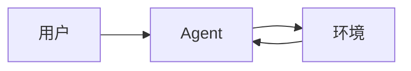
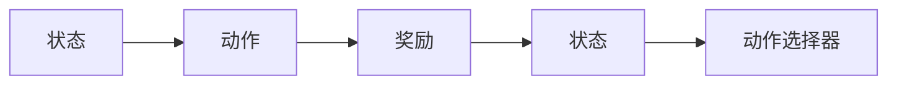
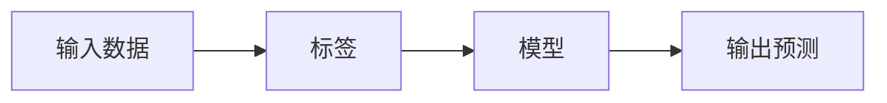
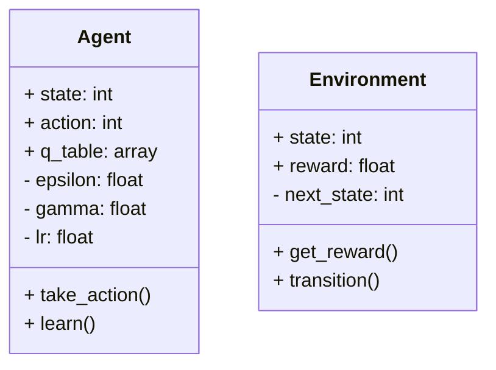
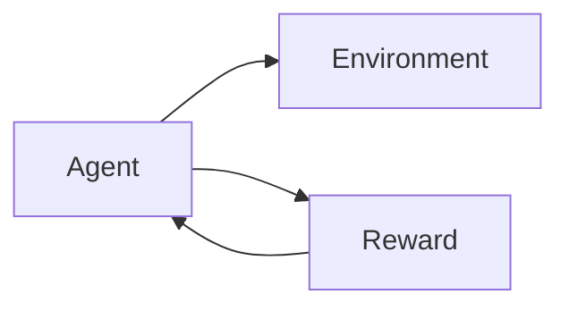

                 


# 《构建AI Agent的开源工具与框架》

## 关键词：AI Agent, 开源工具, 人工智能, 强化学习, 监督学习, 系统架构设计

## 摘要：  
构建AI Agent需要综合运用多种技术手段，包括感知、决策、执行等模块的设计与实现。本文将从AI Agent的核心概念出发，详细探讨其算法原理、系统架构设计，并通过实际案例展示如何利用开源工具与框架高效构建AI Agent。文章内容丰富，涵盖从理论到实践的全过程，帮助读者系统性地掌握AI Agent的构建方法。

---

# 第1章: AI Agent的基本概念与背景

## 1.1 AI Agent的定义与核心特征

### 1.1.1 什么是AI Agent？
AI Agent（人工智能代理）是指能够感知环境、自主决策并执行任务的智能实体。它通过与环境交互，利用传感器获取信息，并通过执行器采取行动，以实现特定目标。

### 1.1.2 AI Agent的核心特征
- **自主性**：能够在没有外部干预的情况下自主运行。
- **反应性**：能够实时感知环境并做出反应。
- **目标导向性**：以实现特定目标为导向。
- **学习能力**：通过经验或数据优化自身的决策能力。

## 1.2 AI Agent的类型

### 1.2.1 反应式AI Agent
反应式AI Agent基于当前环境状态做出实时反应，无需依赖环境的长期记忆。例如，实时避障的自动驾驶系统。

### 1.2.2 基于模型的AI Agent
基于模型的AI Agent依赖于对环境的建模，并根据模型预测未来状态，从而做出决策。例如，复杂的策略游戏AI。

### 1.2.3 混合型AI Agent
混合型AI Agent结合了反应式和基于模型的两种方法，能够根据任务需求灵活切换策略。

## 1.3 AI Agent的应用场景

### 1.3.1 个人助手
例如智能音箱、智能手机中的语音助手，能够根据用户的指令执行任务。

### 1.3.2 智能客服
通过自然语言处理技术，为用户提供自动化客服服务，解决用户问题。

### 1.3.3 自动驾驶
自动驾驶汽车通过感知环境（如摄像头、雷达）并实时做出驾驶决策。

---

# 第2章: AI Agent的核心概念与联系

## 2.1 AI Agent的构成模块

### 2.1.1 感知模块
感知模块负责获取环境中的信息，例如摄像头、麦克风等传感器输入的数据。

### 2.1.2 决策模块
决策模块基于感知模块提供的信息，利用算法（如强化学习、监督学习）进行推理和决策。

### 2.1.3 执行模块
执行模块根据决策模块的指令，通过执行器（如电机、扬声器）采取行动。

## 2.2 AI Agent的实体关系图



## 2.3 AI Agent的核心概念对比表

| 概念 | 反应式AI Agent | 基于模型的AI Agent |
|------|----------------|---------------------|
| 策略 | 基于当前状态做出反应 | 基于环境模型进行预测和规划 |
| 内存 | 无长期记忆 | 依赖长期记忆和模型 |
| 适用场景 | 实时反应、快速决策 | 复杂环境、需要规划和预测 |

---

# 第3章: AI Agent的算法原理

## 3.1 强化学习算法

### 3.1.1 强化学习的基本原理

#### 算法流程图


#### 数学模型
强化学习的目标是通过最大化累积奖励来优化策略。常用的数学模型包括：
- **Q-learning**：$$ Q(s, a) = Q(s, a) + \alpha (r + \max_{a'} Q(s', a') - Q(s, a)) $$
- **Deep Q-Networks (DQN)**：使用深度神经网络近似Q值函数。

#### 代码实现
```python
import numpy as np
import random

class Agent:
    def __init__(self, state_space, action_space):
        self.state_space = state_space
        self.action_space = action_space
        self.gamma = 0.99
        self.lr = 0.01
        self.epsilon = 0.1
        # 初始化Q表
        self.q_table = np.zeros((state_space, action_space))
    
    def take_action(self, state):
        if random.random() < self.epsilon:
            return random.randint(0, self.action_space - 1)
        else:
            return np.argmax(self.q_table[state])
    
    def learn(self, state, action, reward, next_state):
        target = reward + self.gamma * np.max(self.q_table[next_state])
        self.q_table[state, action] += self.lr * (target - self.q_table[state, action])
```

## 3.2 监督学习算法

### 3.2.1 监督学习的基本原理

#### 算法流程图


#### 数学模型
监督学习的目标是最小化预测与真实标签的误差。常用的数学模型包括：
- **线性回归**：$$ y = \theta x + \beta $$
- **支持向量机**：$$ \text{maximize} \quad \xi \geq 1 - \epsilon $$

#### 代码实现
```python
from sklearn import svm

# 训练监督学习模型
model = svm.SVC()
model.fit(X_train, y_train)

# 预测
y_pred = model.predict(X_test)
```

## 3.3 AI Agent的数学模型与公式

### 3.3.1 强化学习的数学模型
在强化学习中，Q值更新公式为：
$$ Q(s, a) = Q(s, a) + \alpha (r + \gamma \max Q(s', a') - Q(s, a)) $$

### 3.3.2 监督学习的数学模型
在监督学习中，损失函数通常为：
$$ L = \frac{1}{N} \sum_{i=1}^{N} (y_i - \hat{y}_i)^2 $$

---

# 第4章: AI Agent的系统分析与架构设计

## 4.1 系统架构设计

### 4.1.1 功能模块设计

#### 功能模块类图


### 4.1.2 系统架构图



### 4.1.3 接口设计

#### API接口
- `take_action(state)`：根据当前状态选择动作。
- `learn(state, action, reward, next_state)`：更新Q表。

---

# 第5章: 项目实战——构建一个智能客服助手

## 5.1 项目需求分析

### 5.1.1 项目目标
构建一个能够理解用户问题并提供解决方案的智能客服助手。

### 5.1.2 功能需求
- **自然语言理解（NLU）**：理解用户输入的问题。
- **对话管理**：根据上下文生成回复。
- **知识库查询**：从知识库中检索相关信息。

## 5.2 环境配置与工具安装

### 5.2.1 开发环境
- **Python 3.8+**
- **TensorFlow 2.0+**
- **Scikit-learn**
- **Spacy**

### 5.2.2 安装依赖
```bash
pip install numpy scikit-learn spacy tensorflow
```

## 5.3 核心代码实现

### 5.3.1 NLU模块

#### 代码实现
```python
import spacy

# 加载预训练模型
nlp = spacy.load("en_core_web_sm")

def process_query(query):
    doc = nlp(query)
    # 提取实体
    entities = [ent.text for ent in doc.ents]
    return entities
```

### 5.3.2 对话管理模块

#### 代码实现
```python
class DialogManager:
    def __init__(self):
        self.context = {}
    
    def generate_response(self, query):
        # 简单的对话逻辑
        if "hello" in query.lower():
            return "Hello! How can I assist you today?"
        else:
            return "I'm sorry, I don't understand your question."
```

### 5.3.3 知识库查询模块

#### 代码实现
```python
import sqlite3

def query_knowledge_base(query):
    conn = sqlite3.connect("knowledge.db")
    cursor = conn.cursor()
    cursor.execute("SELECT answer FROM knowledge WHERE question LIKE ?", (f"%{query}%",))
    result = cursor.fetchone()
    conn.close()
    return result[0] if result else "No answer found."
```

## 5.4 项目小结

### 5.4.1 项目实现的关键点
- **NLU模块**：使用Spacy进行自然语言理解。
- **对话管理**：基于简单的规则生成回复。
- **知识库查询**：使用SQLite数据库进行数据检索。

### 5.4.2 项目优化方向
- **模型优化**：引入更复杂的NLP模型（如BERT）。
- **对话历史记录**：增加对话历史记录以提高准确性。
- **知识库扩展**：增加更多数据以提高覆盖范围。

---

# 第6章: 最佳实践与小结

## 6.1 最佳实践

### 6.1.1 数据质量
确保训练数据的多样性和代表性，避免过拟合。

### 6.1.2 模型调优
定期评估模型性能，调整超参数以提高效果。

### 6.1.3 代码规范
遵循代码规范，保持代码的可读性和可维护性。

## 6.2 小结

通过本文的讲解，读者可以系统性地了解AI Agent的核心概念、算法原理和系统架构设计，并通过实际案例掌握如何利用开源工具与框架构建AI Agent。AI Agent的应用前景广阔，随着技术的不断发展，未来将会有更多创新性的应用出现。

## 6.3 注意事项

- **数据隐私**：在处理用户数据时，必须遵守相关法律法规，保护用户隐私。
- **模型鲁棒性**：确保模型在面对异常输入时能够稳定运行，避免崩溃或错误。
- **性能优化**：在实际应用中，需要对模型进行性能优化，减少响应时间。

## 6.4 拓展阅读

- **《Hands-On Machine Learning with Scikit-Learn, Keras, and TensorFlow》**
- **《Deep Reinforcement Learning》**
- **《Natural Language Processing with PyTorch》**

---

通过以上内容，您可以系统性地了解如何利用开源工具与框架构建AI Agent，并掌握从理论到实践的全过程。

