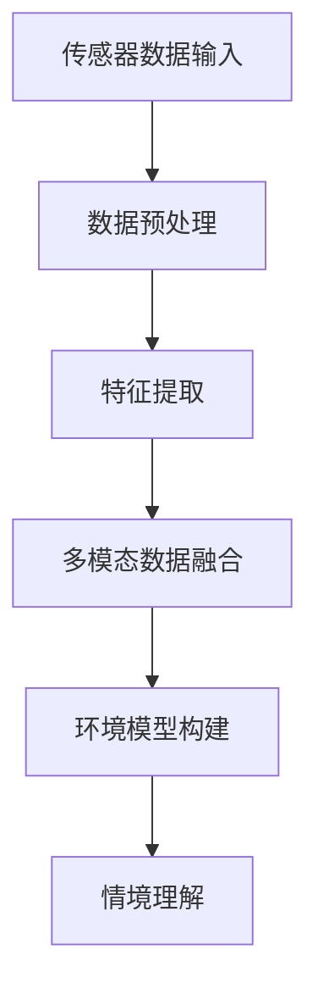
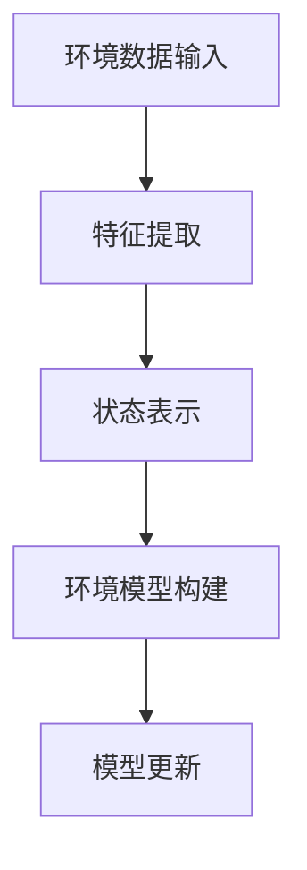
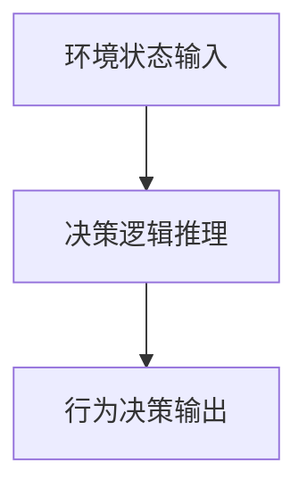
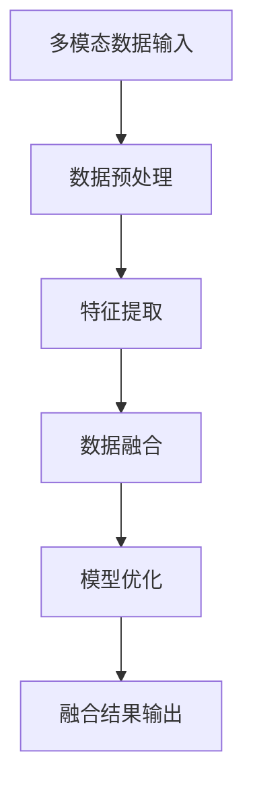
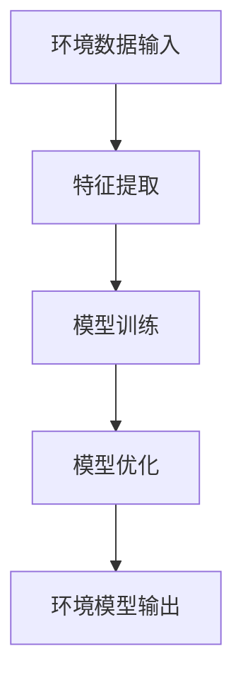
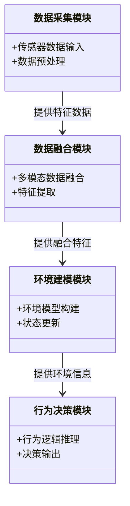
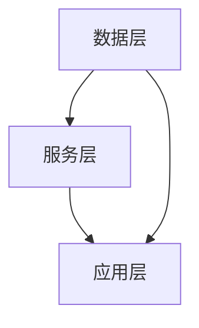
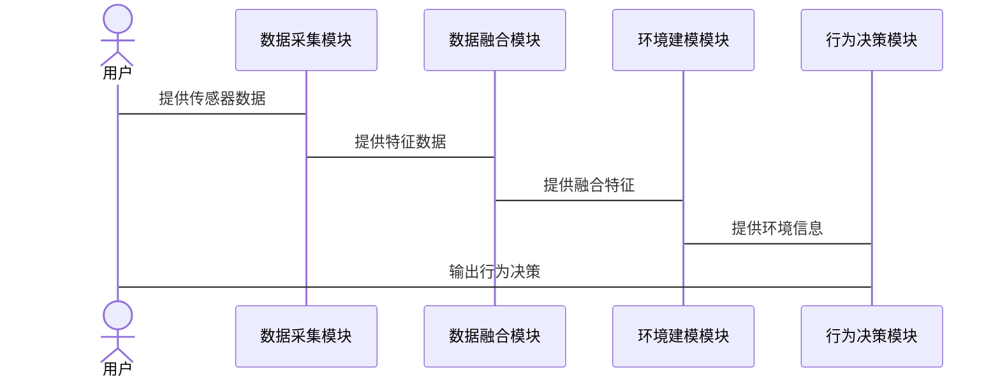

                 


# 构建AI Agent的情境感知能力：环境适应性

---

## 关键词：
- AI Agent
- 情境感知
- 环境适应性
- 多模态数据融合
- 动态环境
- 行为规划

---

## 摘要：
本文深入探讨了构建具备情境感知能力的AI Agent的核心原理与实现方法。通过分析情境感知的定义、原理、算法实现、系统架构设计以及实际案例，本文详细阐述了如何使AI Agent能够理解并适应复杂多变的环境。从多模态数据融合到动态环境下的决策规划，本文为读者提供了从理论到实践的全面指导，帮助AI Agent更好地实现环境适应性。

---

# 第一部分: 构建AI Agent的情境感知能力基础

---

# 第1章: 情境感知能力的背景与概念

## 1.1 情境感知能力的定义与核心概念

### 1.1.1 情境感知的定义
情境感知（Situation Awareness）是指AI Agent能够理解和感知其所处环境的状态、目标以及潜在威胁的能力。它不仅仅是对环境的简单感知，还包括对环境信息的综合分析与推理，从而为后续的决策提供支持。

### 1.1.2 情境感知的核心要素
情境感知的核心要素包括：
1. **环境信息的获取**：通过传感器、摄像头、数据输入等多种方式获取环境数据。
2. **信息的融合与处理**：将多源异构数据进行融合，提取有用的特征信息。
3. **环境模型的构建**：基于融合后的信息，建立环境的数学模型。
4. **情境理解与推理**：通过推理引擎对环境信息进行理解与预测。

### 1.1.3 情境感知与环境适应性的关系
情境感知是环境适应性的基础。通过情境感知，AI Agent能够理解当前环境的状态，并在此基础上做出适应性的行为决策。

---

## 1.2 问题背景与应用场景

### 1.2.1 情境感知能力的重要性
在动态复杂环境中，AI Agent需要具备情境感知能力才能做出正确的决策。例如，在自动驾驶中，AI Agent需要感知交通状况、车辆状态以及周围环境的变化。

### 1.2.2 情境感知在AI Agent中的作用
1. 提供决策依据：情境感知为AI Agent的决策提供基础信息。
2. 实现环境适应性：通过理解环境，AI Agent能够动态调整行为策略。
3. 提高系统鲁棒性：情境感知能力使AI Agent能够更好地应对不确定性。

### 1.2.3 情境感知的实际应用场景
1. **自动驾驶**：感知交通状况、道路标志、行人等。
2. **智能助手**：理解用户意图、环境条件（如天气、时间）等。
3. **机器人控制**：感知周围环境、物体位置、任务需求等。

---

## 1.3 问题解决与边界定义

### 1.3.1 情境感知能力的实现目标
1. 实现实时环境感知。
2. 提供高精度的环境信息。
3. 支持动态环境下的决策。

### 1.3.2 情境感知的边界与外延
1. **边界**：情境感知的范围不包括对未来的预测，仅限于当前环境的理解。
2. **外延**：基于情境感知的决策是后续行为规划的基础。

### 1.3.3 情境感知与其他AI能力的关联
1. **感知与决策**：情境感知为决策提供输入。
2. **学习与推理**：通过学习，AI Agent能够更好地理解和推理环境信息。

---

## 1.4 本章小结
本章从定义、核心要素、应用场景等方面介绍了情境感知能力的重要性，并明确了其在AI Agent中的作用。接下来的章节将深入探讨情境感知的核心原理与实现方法。

---

# 第二部分: 情境感知能力的核心概念与联系

---

# 第2章: 情境感知的核心原理

## 2.1 情境感知的感知模型

### 2.1.1 多模态数据的融合
多模态数据融合是情境感知的关键步骤。例如，在自动驾驶中，需要融合来自摄像头、激光雷达、GPS等多种传感器的数据。

#### 使用mermaid绘制多模态数据融合流程图



### 2.1.2 环境建模与状态表示
环境建模是情境感知的重要环节。通过建立环境的数学模型，AI Agent能够更好地理解环境状态。

#### 使用mermaid绘制环境建模流程图



### 2.1.3 感知数据的特征提取
特征提取是将原始数据转换为有意义的特征表示的过程。例如，使用CNN提取图像特征。

#### 使用Python代码实现特征提取

```python
import torch
import torch.nn as nn

# 定义特征提取网络
class FeatureExtractor(nn.Module):
    def __init__(self):
        super(FeatureExtractor, self).__init__()
        self.conv1 = nn.Conv2d(3, 64, kernel_size=3, padding=1)
        self.relu = nn.ReLU()
        self.pool = nn.MaxPool2d(2, 2)

    def forward(self, x):
        x = self.conv1(x)
        x = self.relu(x)
        x = self.pool(x)
        return x

# 初始化网络
model = FeatureExtractor()
# 假设输入一批图像数据
input = torch.randn(10, 3, 224, 224)
output = model(input)
print(output.size())
```

---

## 2.2 情境感知的决策机制

### 2.2.1 基于情境的决策逻辑
决策逻辑是基于情境理解的推理过程。例如，在自动驾驶中，AI Agent会根据当前的环境状态决定加速、减速或转向。

#### 使用mermaid绘制决策逻辑流程图



### 2.2.2 情境感知与行为规划的关系
情境感知为行为规划提供输入，行为规划则根据情境信息制定具体的行为策略。

#### 使用Python代码实现行为规划

```python
def behavior_planning(context):
    if context['traffic_light'] == 'red':
        return 'stop'
    elif context['speed_limit'] < current_speed:
        return 'decelerate'
    else:
        return 'proceed'

# 示例上下文
context = {
    'traffic_light': 'red',
    'speed_limit': 30,
    'current_speed': 25
}

action = behavior_planning(context)
print(action)  # 输出: stop
```

---

## 2.3 情境感知的核心概念对比

### 2.3.1 概念属性特征对比表

| 概念       | 输入数据类型   | 输出结果类型 | 是否动态适应 |
|------------|----------------|--------------|--------------|
| 环境感知    | 多源异构数据    | 环境特征      | 静态          |
| 情境感知    | 环境特征        | 上下文信息    | 动态          |

### 2.3.2 情境感知与传统感知的区别
1. **输入数据**：传统感知处理单一数据源，情境感知处理多源异构数据。
2. **输出结果**：传统感知输出局部信息，情境感知输出全局上下文。

### 2.3.3 情境感知的优劣势分析
1. **优势**：能够提供更全面的环境信息，支持复杂决策。
2. **劣势**：实现复杂，需要处理多源异构数据。

---

## 2.4 情境感知的ER实体关系图

```mermaid
erd
actor: 智能体
environment: 环境
sensors: 传感器
data: 数据
context: 上下文信息
behavior: 行为决策

actor --> environment: 与环境交互
environment --> sensors: 通过传感器获取数据
sensors --> data: 采集数据
data --> context: 融合生成上下文
context --> behavior: 支持行为决策
```

---

## 2.5 本章小结
本章详细介绍了情境感知的核心原理，包括感知模型、决策机制以及核心概念的对比分析。接下来的章节将探讨情境感知的算法实现与系统设计。

---

# 第三部分: 情境感知能力的算法原理

---

# 第3章: 情境感知算法的实现原理

## 3.1 多模态数据融合算法

### 3.1.1 多模态数据融合的流程
多模态数据融合的流程包括数据预处理、特征提取、数据融合、模型优化等步骤。

#### 使用mermaid绘制多模态数据融合流程图



### 3.1.2 基于注意力机制的融合方法
注意力机制是一种有效的数据融合方法，能够关注重要的特征信息。

#### 使用Python代码实现注意力机制

```python
import torch
import torch.nn as nn

# 定义注意力机制模块
class Attention(nn.Module):
    def __init__(self, input_size, hidden_size):
        super(Attention, self).__init__()
        self.W = nn.Linear(input_size, hidden_size)
        self.U = nn.Linear(hidden_size, 1)

    def forward(self, x):
        x = self.W(x)
        x = torch.tanh(x)
        x = self.U(x)
        x = torch.softmax(x, dim=1)
        return x

# 示例输入
input_size = 10
hidden_size = 5
attention = Attention(input_size, hidden_size)
input_data = torch.randn(3, input_size)
output = attention(input_data)
print(output.size())  # 输出: torch.Size([3, 1])
```

---

## 3.2 环境建模与状态表示

### 3.2.1 环境建模的步骤
环境建模的步骤包括数据采集、特征提取、模型训练与优化。

#### 使用mermaid绘制环境建模流程图



### 3.2.2 状态表示的向量化方法
状态表示是将环境信息转化为向量表示的过程。

#### 使用Python代码实现状态表示

```python
import torch
import torch.nn as nn

# 定义状态表示网络
class StateEncoder(nn.Module):
    def __init__(self, input_size, hidden_size):
        super(StateEncoder, self).__init__()
        self.fc1 = nn.Linear(input_size, hidden_size)
        self.fc2 = nn.Linear(hidden_size, hidden_size)

    def forward(self, x):
        x = self.fc1(x)
        x = torch.relu(x)
        x = self.fc2(x)
        return x

# 示例输入
input_size = 10
hidden_size = 5
encoder = StateEncoder(input_size, hidden_size)
input_data = torch.randn(3, input_size)
state = encoder(input_data)
print(state.size())  # 输出: torch.Size([3, 5])
```

---

## 3.3 感知数据的特征提取

### 3.3.1 基于CNN的特征提取
卷积神经网络（CNN）是一种有效的特征提取方法。

#### 使用Python代码实现CNN特征提取

```python
import torch
import torch.nn as nn

# 定义CNN网络
class CNNFeatureExtractor(nn.Module):
    def __init__(self):
        super(CNNFeatureExtractor, self).__init__()
        self.conv1 = nn.Conv2d(3, 64, kernel_size=3, padding=1)
        self.relu = nn.ReLU()
        self.pool = nn.MaxPool2d(2, 2)

    def forward(self, x):
        x = self.conv1(x)
        x = self.relu(x)
        x = self.pool(x)
        return x

# 示例输入
input = torch.randn(10, 3, 224, 224)
model = CNNFeatureExtractor()
output = model(input)
print(output.size())  # 输出: torch.Size([10, 64, 112, 112])
```

---

## 3.4 本章小结
本章详细介绍了情境感知的算法实现，包括多模态数据融合、环境建模与特征提取等。接下来的章节将探讨系统设计与实现。

---

# 第四部分: 情境感知能力的系统设计

---

# 第4章: 情境感知系统的分析与架构设计

## 4.1 问题场景介绍
本章以一个自动驾驶场景为例，介绍情境感知系统的分析与设计。

## 4.2 系统功能设计

### 4.2.1 系统功能模块
1. 数据采集模块：负责采集多源传感器数据。
2. 数据融合模块：对多模态数据进行融合。
3. 环境建模模块：构建环境模型。
4. 行为决策模块：基于情境信息制定行为策略。

#### 使用mermaid绘制系统功能类图



---

## 4.3 系统架构设计

### 4.3.1 系统架构设计
系统架构采用分层设计，包括数据层、服务层、应用层。

#### 使用mermaid绘制系统架构图



---

## 4.4 系统接口设计

### 4.4.1 系统接口描述
1. 数据采集接口：负责接收传感器数据。
2. 数据融合接口：负责融合多模态数据。
3. 环境建模接口：负责构建环境模型。
4. 行为决策接口：负责输出行为决策。

---

## 4.5 系统交互设计

### 4.5.1 系统交互流程
1. 数据采集模块接收传感器数据。
2. 数据融合模块对数据进行融合。
3. 环境建模模块构建环境模型。
4. 行为决策模块基于环境信息制定决策。

#### 使用mermaid绘制系统交互序列图



---

## 4.6 本章小结
本章详细介绍了情境感知系统的分析与设计，包括功能模块、系统架构、接口设计与交互流程。接下来的章节将通过实际案例展示系统实现。

---

# 第五部分: 项目实战

---

# 第5章: 情境感知能力的项目实现

## 5.1 环境安装与配置

### 5.1.1 安装依赖
1. 安装Python环境：Python 3.8+
2. 安装深度学习框架：TensorFlow/PyTorch
3. 安装可视化工具：graphviz、pymermaid

#### 使用Python代码实现环境安装

```bash
pip install numpy torch tensorflow matplotlib
```

---

## 5.2 系统核心实现

### 5.2.1 数据采集模块实现

#### 使用Python代码实现数据采集

```python
import numpy as np

def collect_data(sensor_type):
    # 模拟传感器数据采集
    if sensor_type == 'camera':
        return np.random.rand(224, 224, 3)
    elif sensor_type == 'lidar':
        return np.random.rand(100, 2)
    else:
        return None

# 示例调用
data = collect_data('camera')
print(data.shape)  # 输出: (224, 224, 3)
```

### 5.2.2 数据融合模块实现

#### 使用Python代码实现数据融合

```python
import torch
import torch.nn as nn

# 定义数据融合网络
class DataFusion(nn.Module):
    def __init__(self, input_size, hidden_size):
        super(DataFusion, self).__init__()
        self.W = nn.Linear(input_size, hidden_size)
        self.U = nn.Linear(hidden_size, hidden_size)

    def forward(self, x):
        x = self.W(x)
        x = torch.relu(x)
        x = self.U(x)
        return x

# 示例输入
input_size = 10
hidden_size = 5
fusion = DataFusion(input_size, hidden_size)
input_data = torch.randn(3, input_size)
output = fusion(input_data)
print(output.size())  # 输出: torch.Size([3, 5])
```

---

## 5.3 案例分析与实现

### 5.3.1 案例分析
以自动驾驶为例，展示如何基于情境感知能力实现行为决策。

### 5.3.2 代码实现与分析
1. 数据采集：从摄像头和激光雷达获取数据。
2. 数据融合：将图像和点云数据进行融合。
3. 环境建模：构建环境模型。
4. 行为决策：基于环境信息制定驾驶策略。

#### 使用Python代码实现行为决策

```python
def behavior_decision(context):
    if context['traffic_light'] == 'red':
        return 'stop'
    elif context['speed_limit'] < context['current_speed']:
        return 'decelerate'
    else:
        return 'proceed'

# 示例上下文
context = {
    'traffic_light': 'red',
    'speed_limit': 30,
    'current_speed': 25
}

action = behavior_decision(context)
print(action)  # 输出: stop
```

---

## 5.4 本章小结
本章通过实际案例展示了情境感知能力的实现过程，包括环境安装、核心代码实现与案例分析。接下来的章节将总结全书内容。

---

# 第六部分: 总结与展望

---

# 第6章: 总结与展望

## 6.1 最佳实践 tips
1. 数据融合是情境感知的核心，需要精心设计。
2. 环境建模是实现动态适应性的关键。
3. 行为决策需要结合具体应用场景。

## 6.2 小结
本文从理论到实践，全面探讨了构建具备情境感知能力的AI Agent的实现方法。通过多模态数据融合、环境建模与行为决策的详细讲解，为读者提供了从理论到实践的全面指导。

## 6.3 注意事项
1. 确保数据质量，避免噪声干扰。
2. 定期更新模型，适应环境变化。
3. 考虑安全问题，确保系统鲁棒性。

## 6.4 拓展阅读
1. **多模态数据融合**：深入学习多模态数据融合的方法。
2. **深度学习在情境感知中的应用**：研究基于深度学习的感知模型。
3. **强化学习与行为决策**：探索强化学习在行为决策中的应用。

---

## 6.5 本章小结
本文总结了情境感知能力的实现方法，并展望了未来的研究方向。希望通过本文的学习，读者能够更好地理解和实现具备环境适应性的AI Agent。

---

# 结束语
感谢您的阅读！希望本文能够为您提供有价值的见解和启发，帮助您更好地理解和实现具备情境感知能力的AI Agent。

