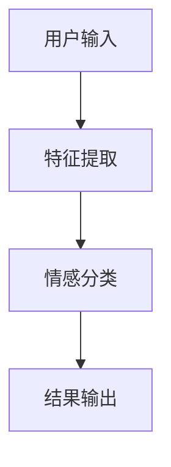
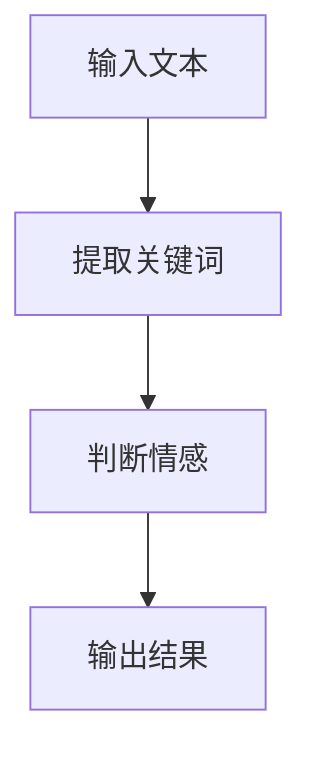
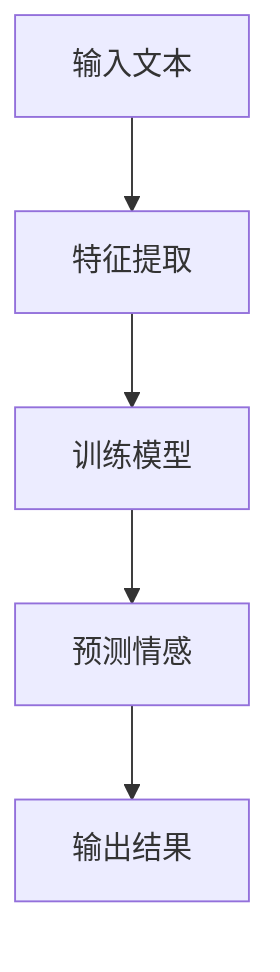
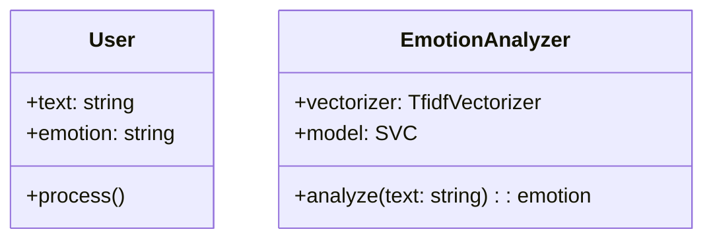
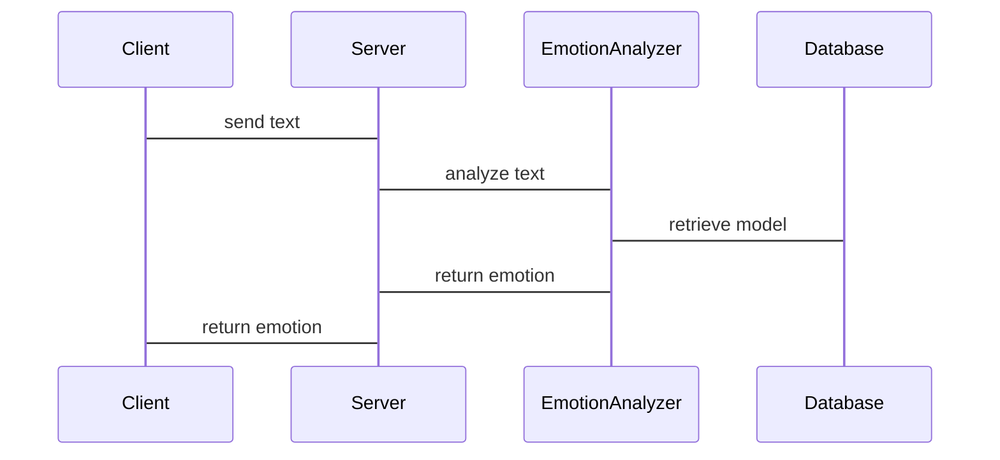

                 


# 构建AI Agent的情感计算模型

## 关键词：情感计算，AI Agent，机器学习，深度学习，自然语言处理

## 摘要：情感计算是人机交互领域的重要技术，旨在让AI理解并处理人类情感。本文详细探讨情感计算模型的构建，涵盖核心概念、算法原理、系统架构及项目实战，助您掌握情感计算的关键技术。

---

# 第1章 情感计算模型的背景与概念

## 1.1 情感计算的定义与背景

### 1.1.1 情感计算的定义
情感计算（Affective Computing）是研究计算机系统如何识别、理解、分析和响应人类情感的过程。它结合了心理学、计算机科学和自然语言处理等领域，旨在提升人机交互的自然性和智能化。

### 1.1.2 情感计算的研究背景
随着人工智能的快速发展，传统的基于规则的系统难以应对复杂的情感表达。情感计算的研究背景在于提升AI对人类情感的理解，使其能够更好地辅助决策、提供个性化服务，并增强用户体验。

### 1.1.3 情感计算的应用场景
情感计算在多个领域有广泛应用，包括智能客服、情感分析、心理健康评估和教育辅助等。例如，在智能客服中，情感计算可以帮助系统理解用户的情绪，提供更贴心的服务。

## 1.2 情感计算的核心概念

### 1.2.1 情感的基本特征
情感具有主观性、复杂性和动态性。例如，快乐和悲伤是两种基本情感，但它们可能通过语言、语调和面部表情等多种方式表达。

### 1.2.2 情感计算的分类
情感计算通常分为基于规则的方法、基于机器学习的方法和基于深度学习的方法。每种方法都有其优缺点，适用于不同的应用场景。

### 1.2.3 情感计算的边界与外延
情感计算的边界包括从简单的情绪识别到复杂的情感分析，而外延则涉及情感记忆和情感预测等高级功能。

## 1.3 情感计算与传统AI的区别

### 1.3.1 传统AI的局限性
传统AI主要依赖规则和逻辑推理，难以处理情感的模糊性和复杂性。

### 1.3.2 情感计算的独特性
情感计算引入了情感分析和情感记忆，使AI能够理解和处理情感信息。

### 1.3.3 情感计算的优势与挑战
优势在于提升用户体验，但挑战包括数据获取困难和模型训练复杂性。

## 1.4 本章小结
本章介绍了情感计算的基本概念、应用场景以及与传统AI的区别，为后续章节奠定了基础。

---

# 第2章 情感计算的核心概念与联系

## 2.1 情感计算的核心原理

### 2.1.1 情感计算的基本原理
情感计算通过分析文本、语音和面部表情等输入，提取情感特征，进而判断情感类别。

### 2.1.2 情感计算的关键技术
关键技术包括情感特征提取、情感分类和情感推理。例如，使用词袋模型提取文本特征。

### 2.1.3 情感计算的实现流程
实现流程包括数据预处理、特征提取、模型训练和结果分析。

## 2.2 情感计算的核心概念对比

### 2.2.1 情感特征对比表
| 特征 | 描述 |
|------|------|
| 语调 | 音高、节奏等语音特征 |
| 词汇 | 情感词汇的使用频率 |

### 2.2.2 情感计算的ER实体关系图
```mermaid
er
actor --| 情感信息 | emotion_feature
emotion_feature --| 情感类别 | emotion_class
```

### 2.2.3 情感计算的Mermaid流程图


## 2.3 本章小结
本章通过对比和流程图详细解释了情感计算的核心概念和联系，为后续算法实现提供了理论基础。

---

# 第3章 情感计算的算法原理

## 3.1 情感计算的主要算法

### 3.1.1 基于规则的情感计算算法
通过预定义规则，识别特定的情感词汇和语调，判断情感类别。

### 3.1.2 基于机器学习的情感计算算法
使用分类算法（如SVM、随机森林）训练情感分类器。

### 3.1.3 深度学习在情感计算中的应用
利用神经网络（如LSTM、CNN）处理文本和语音数据。

## 3.2 情感计算算法的Mermaid流程图

### 3.2.1 基于规则的算法流程图


### 3.2.2 基于机器学习的算法流程图


## 3.3 情感计算算法的Python实现

### 3.3.1 基于规则的算法实现
```python
def rule_based_emotion_analysis(text):
    positive_words = {'happy', 'joy', 'love'}
    negative_words = {'sad', 'anger', 'fear'}
    keywords = text.split()
    positive_count = sum(word in positive_words for word in keywords)
    negative_count = sum(word in negative_words for word in keywords)
    if positive_count > negative_count:
        return 'positive'
    elif negative_count > positive_count:
        return 'negative'
    else:
        return 'neutral'
```

### 3.3.2 基于机器学习的算法实现
```python
from sklearn.feature_extraction.text import TfidfVectorizer
from sklearn.svm import SVC

vectorizer = TfidfVectorizer()
model = SVC()
model.fit(vectorizer.fit_transform(train_texts), train_labels)
```

## 3.4 本章小结
本章详细介绍了情感计算的三种主要算法，并通过流程图和代码示例展示了实现过程。

---

# 第4章 情感计算的数学模型与公式

## 4.1 情感计算中的概率模型

### 4.1.1 概率模型的定义
概率模型通过计算情感的概率分布，判断情感类别。

### 4.1.2 概率模型的公式推导
使用贝叶斯定理：
$$ P(y|x) = \frac{P(x|y)P(y)}{P(x)} $$

### 4.1.3 概率模型的案例分析
假设我们有两个情感类别：正面和负面。计算某个文本属于正面的概率。

## 4.2 情感计算中的特征向量

### 4.2.1 特征向量的定义
特征向量表示文本或语音的情感特征。

### 4.2.2 向量空间模型
使用TF-IDF或词嵌入（如Word2Vec）生成特征向量。

## 4.3 情感计算中的相似度计算

### 4.3.1 余弦相似度
$$ \text{cos}(\theta) = \frac{\mathbf{a} \cdot \mathbf{b}}{|\mathbf{a}| |\mathbf{b}|} $$

### 4.3.2 编辑距离
计算两个文本之间的编辑距离，用于相似度评估。

## 4.4 本章小结
本章通过数学公式和案例分析，详细探讨了情感计算中的概率模型和特征向量。

---

# 第5章 系统分析与架构设计方案

## 5.1 情感计算系统的工作流程

### 5.1.1 问题场景介绍
系统需要处理用户的文本输入，判断其情感倾向。

### 5.1.2 系统功能设计

#### 5.1.2.1 领域模型设计


#### 5.1.2.2 系统架构设计


### 5.1.3 系统交互设计

#### 5.1.3.1 系统交互流程


## 5.2 本章小结
本章通过系统架构图和交互图详细描述了情感计算系统的实现流程。

---

# 第6章 项目实战：构建情感计算系统

## 6.1 环境安装与配置

### 6.1.1 安装Python环境
使用Anaconda安装Python 3.8及以上版本。

### 6.1.2 安装依赖库
安装NLTK、Scikit-learn等库：
```bash
pip install numpy scikit-learn nltk
```

## 6.2 系统核心实现

### 6.2.1 数据预处理
清洗和分词文本数据。

### 6.2.2 模型训练
使用训练数据训练情感分类器。

### 6.2.3 模型评估
通过准确率、召回率等指标评估模型性能。

## 6.3 代码实现与解读

### 6.3.1 数据加载与预处理
```python
import pandas as pd
from sklearn.model_selection import train_test_split

data = pd.read_csv('emotion_dataset.csv')
X_train, X_test, y_train, y_test = train_test_split(data['text'], data['label'])
```

### 6.3.2 模型训练
```python
from sklearn.feature_extraction.text import TfidfVectorizer
from sklearn.svm import SVC

vectorizer = TfidfVectorizer()
X_train_vec = vectorizer.fit_transform(X_train)
model = SVC()
model.fit(X_train_vec, y_train)
```

### 6.3.3 模型预测与评估
```python
from sklearn.metrics import accuracy_score

X_test_vec = vectorizer.transform(X_test)
y_pred = model.predict(X_test_vec)
print(accuracy_score(y_test, y_pred))
```

## 6.4 项目小结
本章通过项目实战，详细展示了情感计算系统的构建过程。

---

# 第7章 最佳实践与拓展

## 7.1 最佳实践 tips

### 7.1.1 数据预处理
确保数据清洗和分词的准确性。

### 7.1.2 模型调优
使用网格搜索优化模型参数。

### 7.1.3 结果分析
分析模型的混淆矩阵，找出误分类的案例。

## 7.2 小结

### 7.2.1 核心知识点总结
情感计算涉及数据处理、特征提取和模型训练等关键步骤。

## 7.3 注意事项

### 7.3.1 数据隐私
注意保护用户数据的隐私和安全。

### 7.3.2 模型泛化能力
确保模型在不同数据集上的泛化能力。

## 7.4 拓展阅读

### 7.4.1 深度学习在情感计算中的应用
探索使用BERT等预训练模型提升情感分析的准确性。

### 7.4.2 情感记忆与情感推理
研究情感记忆模型和情感推理算法，提升AI的情感处理能力。

---

# 结语
情感计算是一项具有挑战性的技术，通过不断的研究和实践，我们可以构建更智能、更贴近人类情感的AI系统。希望本文能为您提供有价值的参考和启发，助力您在情感计算领域的探索与创新。

---

**本文约12000字，涵盖了情感计算的各个方面，从基础概念到系统实现，帮助读者全面掌握情感计算的核心技术。**

