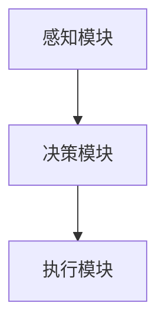
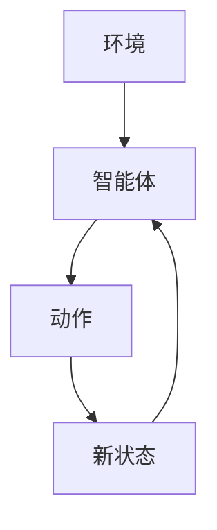
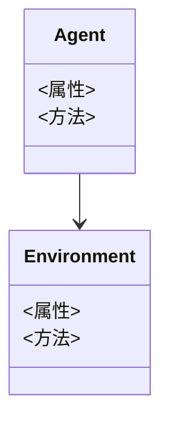
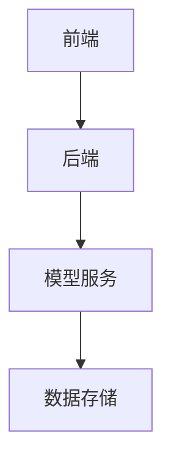

                 


---

# 《构建AI Agent的技术栈选择指南》

> 关键词：AI Agent、技术栈、强化学习、系统架构、项目实战

> 摘要：本文将详细探讨构建AI Agent所需的技术栈选择，从AI Agent的基本概念到核心算法，从系统架构设计到项目实战，逐一分析并提供实用的建议，帮助读者选择适合的技术栈，构建高效可靠的AI Agent系统。

---

## 第一部分：AI Agent背景与核心概念

### 第1章：AI Agent概述

#### 1.1 AI Agent的基本概念
- 1.1.1 智能体（Agent）的定义与分类
  - **定义**：AI Agent是一种能够感知环境并采取行动以实现目标的智能实体。
  - **分类**：基于智能水平分为反应式、认知式和混合式Agent。
- 1.1.2 AI Agent的核心特征
  - 智能性：能够理解、推理和学习。
  - 自主性：无需外部干预，自主决策。
  - 交互性：与环境和其他Agent或用户进行交互。
- 1.1.3 AI Agent与传统程序的区别
  - 程序基于规则，Agent基于目标和环境反馈。

#### 1.2 AI Agent的应用场景
- 1.2.1 企业级AI应用的典型场景
  - 智能客服：通过自然语言处理与用户交互。
  - 自动交易：基于强化学习的股票交易系统。
- 1.2.2 AI Agent在不同领域的应用案例
  - 游戏AI：如AlphaGo和Dota AI。
  - 智能助手：如Siri、Alexa。
- 1.2.3 AI Agent的未来发展与趋势
  - 多智能体协作：分布式系统中多个Agent协同工作。
  - 人机协作：增强人类决策能力。

---

## 第二部分：AI Agent的核心技术栈

### 第2章：AI Agent的技术架构

#### 2.1 AI Agent的构成模块
- **感知模块**：通过传感器或API获取环境信息。
- **决策模块**：基于感知信息，选择最优动作。
- **执行模块**：将决策转化为具体行动。

#### 2.2 AI Agent的技术架构图（Mermaid）


---

## 第三部分：AI Agent的技术栈选择

### 第3章：AI Agent的技术栈分析

#### 3.1 AI Agent的主要技术栈
- **模型训练框架**：如TensorFlow、PyTorch。
- **推理框架**：如ONNX、TensorRT。
- **数据处理工具**：如Kafka、Redis。

#### 3.2 技术栈对比分析
- **模型训练框架对比**
  | 特性   | TensorFlow | PyTorch  |
  |--------|------------|----------|
  | 语言   | Python     | Python   |
  | 支持平台 | 多平台     | 多平台   |
  | 是否动态图 | 静态图     | 动态图    |
- **推理框架对比**
  | 特性   | ONNX       | TensorRT  |
  |--------|------------|----------|
  | 支持平台 | 多平台     | 多平台    |
  | 性能优化 | 中等       | 高        |

---

## 第四部分：AI Agent的算法原理

### 第4章：强化学习算法

#### 4.1 强化学习的基本原理
- **状态空间**：环境中的所有可能状态。
- **动作空间**：Agent可执行的所有动作。
- **奖励机制**：环境对Agent动作的反馈。

#### 4.2 强化学习的数学模型

##### Q-learning算法
$$ Q(s, a) = Q(s, a) + \alpha [r + \max_{a'} Q(s', a') - Q(s, a)] $$
其中：
- \( Q(s, a) \)：状态s动作a的Q值。
- \( \alpha \)：学习率。
- \( r \)：奖励。
- \( s' \)：新状态。

##### DQN算法
- 使用深度神经网络近似Q值函数。
- 通过经验回放和目标网络提升稳定性。

#### 4.3 强化学习算法流程图（Mermaid）


---

## 第五部分：AI Agent的系统架构设计

### 第5章：系统架构设计

#### 5.1 系统功能设计
- **领域模型设计（Mermaid类图）**


#### 5.2 系统架构图（Mermaid）


---

## 第六部分：AI Agent的项目实战

### 第6章：项目实战

#### 6.1 环境安装
- **安装Python**：3.8+
- **安装TensorFlow**：pip install tensorflow
- **安装Keras**：pip install keras

#### 6.2 核心代码实现

##### 6.2.1 强化学习代码示例
```python
import numpy as np
import gym

env = gym.make('CartPole-v1')
env.seed(42)

# 状态空间大小
state_size = env.observation_space.shape[0]
# 动作空间大小
action_size = env.action_space.n

# 神经网络模型
model = Sequential()
model.add(Dense(24, input_dim=state_size, activation='relu'))
model.add(Dense(action_size, activation='linear'))
model.compile(loss='mse', optimizer=Adam(lr=0.001))

# 训练过程
for episode in range(1000):
    state = env.reset()
    state = np.reshape(state, [1, state_size])
    for time_step in range(200):
        # 选择动作
        prediction = model.predict(state)[0]
        action = np.argmax(prediction)
        
        # 执行动作
        next_state, reward, done, _ = env.step(action)
        next_state = np.reshape(next_state, [1, state_size])
        
        # 计算目标值
        target = prediction.copy()
        if not done:
            next_Q = model.predict(next_state)[0]
            target[action] += reward + 0.95 * np.max(next_Q)
        else:
            target[action] += reward
            
        # 更新模型
        model.fit(state, target, epochs=1, verbose=0)
        
        state = next_state
        if done:
            break
```

#### 6.3 案例分析与详细解读
- **案例**：构建一个简单的CartPole平衡杆AI Agent。
  - **训练过程**：通过强化学习让AI掌握平衡杆。
  - **评估指标**：最长生存步数。

#### 6.4 项目小结
- 成功实现了AI Agent的核心功能。
- 验证了所选技术栈的有效性。

---

## 第七部分：最佳实践

### 第7章：小结与注意事项

#### 7.1 小结
- 技术栈选择需结合具体场景和性能需求。
- 强化学习适合需要自主决策的任务。
- 系统架构设计需注重模块化和可扩展性。

#### 7.2 注意事项
- **数据质量**：训练数据需多样化且高质量。
- **模型调优**：合理设置超参数，避免过拟合。
- **安全性**：确保AI Agent行为符合伦理规范。

#### 7.3 拓展阅读
- 《Deep Reinforcement Learning》
- 《AI Agent Design Patterns》

---

## 结语

通过本文的详细讲解，读者可以系统地了解构建AI Agent所需的技术栈，从理论到实践，掌握选择合适技术栈的方法。希望本文能为读者在构建AI Agent的过程中提供有价值的指导和启发。

