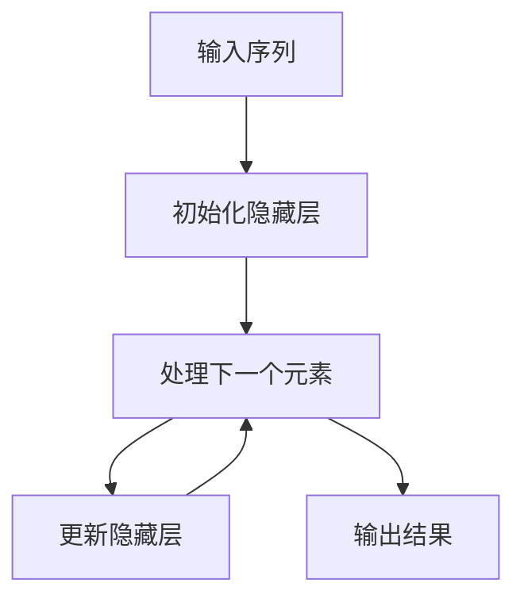
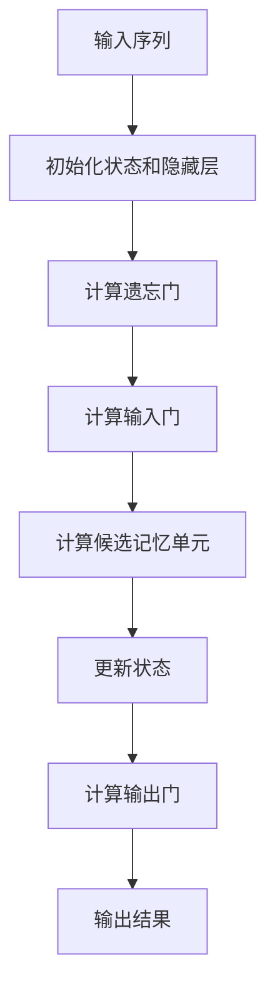
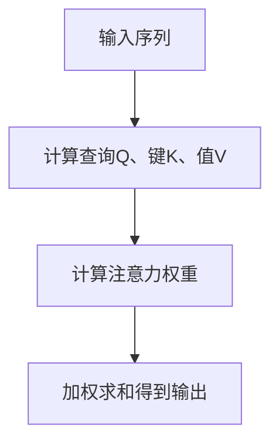
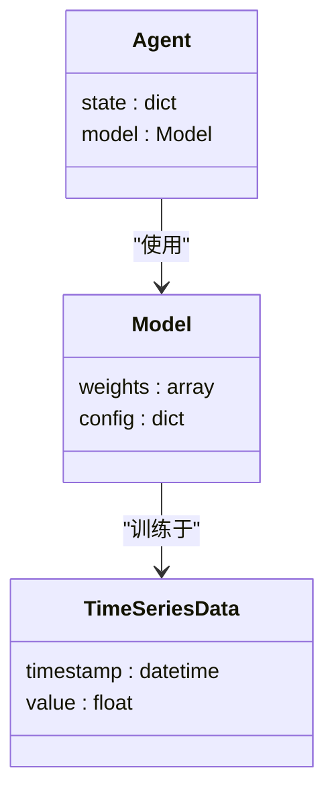
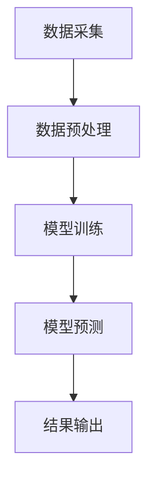
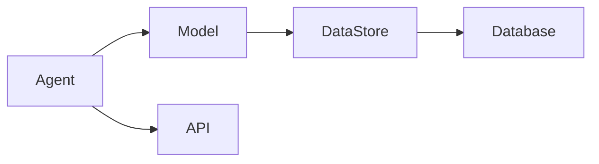
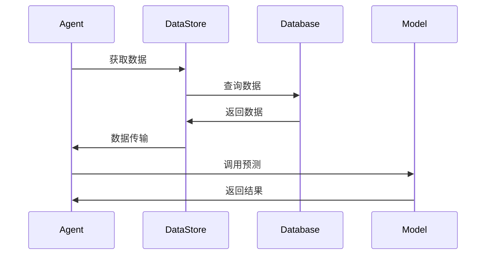

                 


# 构建AI Agent的时序学习与预测模型

> 关键词：AI Agent，时序学习，预测模型，递归神经网络，长短期记忆网络，Transformer

> 摘要：本文详细探讨了构建AI Agent时序学习与预测模型的各个方面，包括AI Agent的基本概念、时序学习的核心原理、常见算法的数学模型及其实现、系统架构设计、项目实战以及最佳实践。通过理论分析与实际案例相结合，帮助读者全面理解如何利用时序学习模型提升AI Agent的智能水平。

---

## 第1章：AI Agent与时序学习概述

### 1.1 AI Agent的基本概念

#### 1.1.1 AI Agent的定义
AI Agent（人工智能代理）是指能够感知环境、采取行动以实现目标的智能实体。它可以是一个软件程序或物理设备，通过与环境交互来完成特定任务。

#### 1.1.2 AI Agent的核心特征
- **自主性**：能够在没有外部干预的情况下独立运作。
- **反应性**：能够实时感知环境并做出反应。
- **目标导向性**：所有行为都围绕实现特定目标展开。
- **学习能力**：能够通过经验改进性能。

#### 1.1.3 AI Agent的分类与应用场景
AI Agent可以分为简单反射型、基于模型的反射型、目标驱动型和实用驱动型。应用场景包括自动驾驶、智能助手、智能推荐系统等。

### 1.2 时序学习的基本概念

#### 1.2.1 时序数据的定义与特点
时序数据是指按时间顺序排列的数据，具有时间依赖性和趋势性。例如股票价格、天气预报等。

#### 1.2.2 时序学习的基本原理
时序学习通过分析历史数据，预测未来的趋势或状态。常用模型包括RNN、LSTM和Transformer。

#### 1.2.3 时序学习的应用场景
时序学习广泛应用于股票预测、天气预报、医疗数据分析等领域。

### 1.3 AI Agent与时序学习的结合

#### 1.3.1 AI Agent中时序学习的作用
时序学习帮助AI Agent根据历史信息做出更准确的预测和决策。

#### 1.3.2 时序学习在AI Agent中的应用
例如，在自动驾驶中，AI Agent可以利用时序学习预测其他车辆的行驶路线。

#### 1.3.3 时序学习与AI Agent的未来发展趋势
随着深度学习技术的进步，时序学习在AI Agent中的应用将更加广泛和智能。

---

## 第2章：时序学习的核心概念与联系

### 2.1 时序模型的核心原理

#### 2.1.1 时序模型的输入输出结构
时序模型通常接收序列数据作为输入，并输出预测值或分类结果。

#### 2.1.2 时序模型的内部状态与转移
模型通过内部状态捕捉序列中的时间依赖性，状态之间通过转移矩阵进行更新。

#### 2.1.3 时序模型的预测机制
基于当前状态和输入，模型预测下一步的输出。

### 2.2 时序模型的关键属性特征对比

#### 2.2.1 不同时序模型的特征对比
| 模型 | 是否考虑长期依赖 | 是否需要训练序列长度 | 是否容易并行计算 |
|------|-----------------|---------------------|----------------|
| RNN  | 否              | 是                  | 否              |
| LSTM | 是              | 是                  | 部分支持         |
| Transformer | 是          | 是                  | 支持            |

#### 2.2.2 时序模型的性能指标
常用指标包括均方误差（MSE）、平均绝对误差（MAE）、准确率等。

#### 2.2.3 时序模型的适用场景
根据数据特性选择模型，例如LSTM适合处理长序列，Transformer适合并行计算。

### 2.3 时序模型的ER实体关系图

```mermaid
erDiagram
    class TimeSeries {
        id : int
        timestamp : datetime
        value : float
    }
    class Model {
        id : int
        name : string
        parameters : string
    }
    class Prediction {
        id : int
        model_id : int
        predicted_value : float
        timestamp : datetime
    }
    Model --> TimeSeries : "Trains on"
    Model --> Prediction : "Makes"
```

---

## 第3章：时序学习的算法原理

### 3.1 时序模型的数学模型

#### 3.1.1 递归神经网络（RNN）的数学模型
RNN通过递归公式更新隐藏状态：
$$ h_t = \tanh(W_{hh} h_{t-1} + W_{xh} x_t + b_h) $$
输出为：
$$ y_t = W_{hy} h_t + b_y $$

#### 3.1.2 长短期记忆网络（LSTM）的数学模型
LSTM引入记忆单元和遗忘门：
$$ f_t = \sigma(W_{hf} h_{t-1} + W_{xf} x_t + b_f) $$
$$ i_t = \sigma(W_{hi} h_{t-1} + W_{xi} x_t + b_i) $$
$$ g_t = \tanh(W_{hg} h_{t-1} + W_{xg} x_t + b_g) $$
$$ h_t = f_t \cdot g_t + i_t \cdot h_{t-1} $$

#### 3.1.3 循环因果网络（Transformer）的数学模型
Transformer通过自注意力机制：
$$ \text{Attention}(Q, K, V) = \text{softmax}\left(\frac{QK^T}{\sqrt{d_k}}\right)V $$

### 3.2 时序模型的算法流程图

#### 3.2.1 RNN的算法流程图


#### 3.2.2 LSTM的算法流程图


#### 3.2.3 Transformer的算法流程图


### 3.3 时序模型的代码实现

#### 3.3.1 RNN的Python实现
```python
import numpy as np

def rnn_cell(x, h_prev, W_xh, W_hh):
    h_current = np.tanh(W_xh.dot(x) + W_hh.dot(h_prev))
    return h_current, h_current

# 示例输入和权重矩阵
x = np.random.randn(3,5)
h_prev = np.zeros((4,5))
W_xh = np.random.randn(4,3)
W_hh = np.random.randn(4,4)

h_current, output = rnn_cell(x, h_prev, W_xh, W_hh)
print(output.shape)  # 输出形状：(4,5)
```

#### 3.3.2 LSTM的Python实现
```python
def lstm_cell(x, h_prev, c_prev, W_xi, W_hi, W_fi, W_co, W_og):
    # 遗忘门
    f = sigmoid(W_fi.dot(x) + W_hi.dot(h_prev))
    # 输入门
    i = sigmoid(W_xi.dot(x) + W_hi.dot(h_prev))
    # 候选记忆
    g = np.tanh(W_co.dot(x) + W_hi.dot(h_prev))
    # 更新状态
    c_current = f * c_prev + i * g
    # 输出门
    o = sigmoid(W_og.dot(x) + W_hi.dot(h_prev))
    h_current = o * np.tanh(c_current)
    return h_current, c_current

# 示例输入和权重矩阵
x = np.random.randn(3,5)
h_prev = np.zeros((4,5))
c_prev = np.zeros((4,5))
W_xi = np.random.randn(4,3)
W_hi = np.random.randn(4,3)
W_fi = np.random.randn(4,3)
W_co = np.random.randn(4,3)
W_og = np.random.randn(4,3)

h_current, c_current = lstm_cell(x, h_prev, c_prev, W_xi, W_hi, W_fi, W_co, W_og)
print(h_current.shape)  # 输出形状：(4,5)
```

#### 3.3.3 Transformer的Python实现
```python
import torch

def attention(query, key, value, d_k):
    scores = (query @ key.transpose(-2,-1)) / np.sqrt(d_k)
    attention_weights = torch.softmax(scores, dim=-1)
    output = attention_weights @ value
    return output

# 示例输入
query = torch.randn(1, 10, 5)
key = torch.randn(1, 10, 5)
value = torch.randn(1, 10, 5)
d_k = 5

output = attention(query, key, value, d_k)
print(output.shape)  # 输出形状：(1,10,5)
```

---

## 第4章：时序学习的系统分析与架构设计

### 4.1 问题场景介绍

#### 4.1.1 问题背景
我们希望构建一个AI Agent，能够根据历史数据预测未来趋势。

#### 4.1.2 问题目标
设计一个时序预测模型，集成到AI Agent中，实现智能决策。

#### 4.1.3 问题约束
数据实时更新，模型需要在线更新。

### 4.2 系统功能设计

#### 4.2.1 领域模型设计


#### 4.2.2 系统功能模块划分
- 数据采集模块
- 数据预处理模块
- 模型训练模块
- 模型预测模块

#### 4.2.3 系统功能流程图


### 4.3 系统架构设计

#### 4.3.1 系统架构图


#### 4.3.2 接口设计
- 数据接口：提供数据读取和写入功能
- 模型接口：提供训练和预测API

#### 4.3.3 交互设计


---

## 第5章：项目实战

### 5.1 环境安装

#### 5.1.1 安装依赖
```bash
pip install numpy
pip install matplotlib
pip install torch
```

### 5.2 系统核心实现源代码

#### 5.2.1 数据预处理
```python
import pandas as pd
import numpy as np

def preprocess(data):
    # 假设data是pandas DataFrame
    data['log_return'] = np.log(data['value'].pct_change() + 1)
    return data[['log_return']]
```

#### 5.2.2 模型训练
```python
import torch
import torch.nn as nn

class RNN(nn.Module):
    def __init__(self, input_size, hidden_size):
        super(RNN, self).__init__()
        self.rnn = nn.RNN(input_size, hidden_size)
        self.fc = nn.Linear(hidden_size, 1)
    
    def forward(self, x):
        out, _ = self.rnn(x)
        out = self.fc(out)
        return out

# 初始化模型
model = RNN(input_size=5, hidden_size=10)
# 定义损失函数和优化器
criterion = nn.MSELoss()
optimizer = torch.optim.Adam(model.parameters(), lr=0.001)
```

#### 5.2.3 模型预测
```python
def predict(model, data_loader):
    with torch.no_grad():
        for batch in data_loader:
            outputs = model(batch)
            # 处理输出并返回预测结果
            return outputs

# 示例预测
predicted = predict(model, test_loader)
```

### 5.3 代码应用解读与分析

#### 5.3.1 代码结构
- 数据预处理模块：将原始数据转换为适合模型输入的形式。
- 模型训练模块：定义模型架构并进行训练。
- 模型预测模块：使用训练好的模型进行预测。

### 5.4 实际案例分析和详细讲解剖析
以股票价格预测为例，展示如何利用RNN模型进行预测，并分析预测结果。

### 5.5 项目小结
总结项目实现的关键点和遇到的问题，提出改进建议。

---

## 第6章：最佳实践 tips、小结、注意事项、拓展阅读

### 6.1 最佳实践 tips
- 数据预处理是关键，确保数据质量。
- 模型选择要根据具体任务需求。
- 定期更新模型以适应数据分布变化。

### 6.2 小结
本文详细探讨了构建AI Agent时序学习与预测模型的各个方面，从理论到实践，为读者提供了全面的指导。

### 6.3 注意事项
- 注意模型的泛化能力，避免过拟合。
- 确保系统的实时性和稳定性。

### 6.4 拓展阅读
推荐相关书籍和论文，供读者深入学习。

---

# 结语

构建AI Agent的时序学习与预测模型是一个复杂而有趣的过程，需要结合理论与实践。希望本文能为读者提供有价值的指导和启发，帮助他们在实际项目中取得成功。

