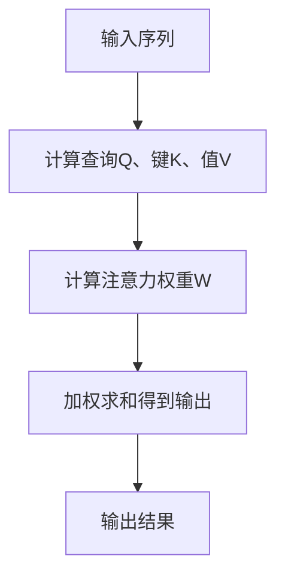
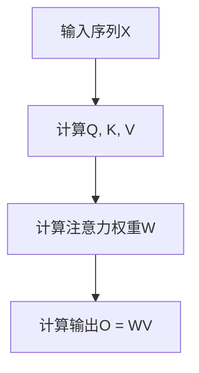
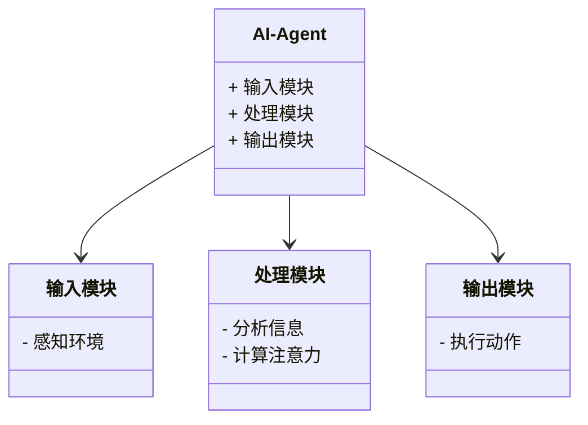
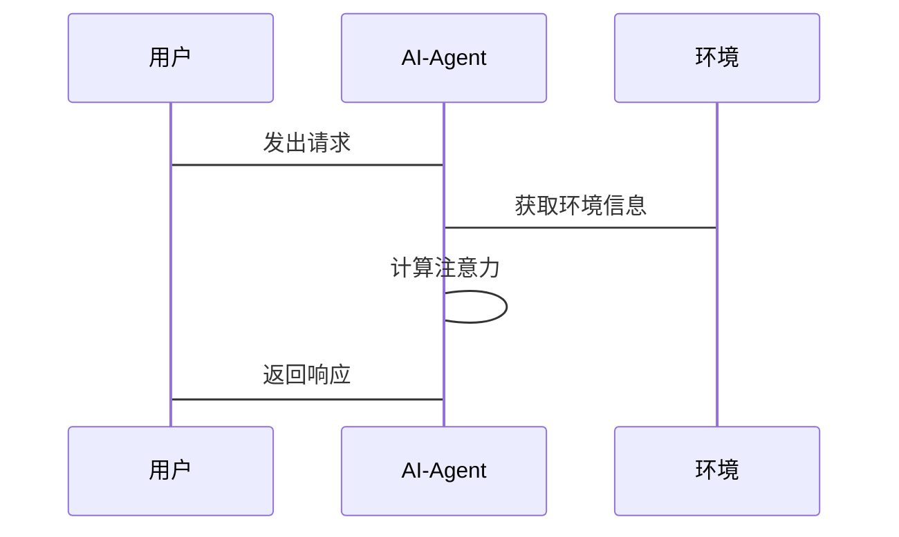

                 


# 构建AI Agent的注意力机制设计

> 关键词：注意力机制、AI Agent、深度学习、Transformer、系统设计

> 摘要：注意力机制是人工智能（AI）领域的重要技术，尤其在自然语言处理和计算机视觉等领域得到了广泛应用。本文将详细探讨注意力机制在AI Agent中的设计与实现，从基本概念到系统架构，再到实际应用，全面解析其核心原理与应用场景。

---

## 第一章: AI Agent与注意力机制的背景介绍

### 1.1 AI Agent的基本概念
AI Agent（智能体）是指在环境中能够感知并自主行动以实现目标的实体。AI Agent具备以下核心特点：
- **自主性**：能够独立决策和行动。
- **反应性**：能够根据环境变化动态调整行为。
- **目标导向**：所有行动均以实现特定目标为导向。
- **社会能力**：能够与其他智能体或人类进行交互与协作。

AI Agent的应用场景广泛，包括但不限于智能助手、自动驾驶、机器人控制、智能推荐系统等。

### 1.2 注意力机制的基本概念
注意力机制是一种模拟人类注意力的选择性关注机制，用于在处理信息时聚焦于最关键的部分。其核心思想是通过计算信息之间的相似性或相关性，确定哪些信息应被重点关注。

### 1.3 问题背景与问题描述
在复杂的环境中，AI Agent需要处理大量信息，但资源有限，如何高效地分配计算资源成为关键。注意力机制通过动态分配计算资源，帮助AI Agent聚焦于最重要的信息，从而提升性能并降低计算成本。

### 1.4 本章小结
本章介绍了AI Agent的基本概念及其应用场景，并详细阐述了注意力机制的核心思想。注意力机制在AI Agent中的应用能够显著提升其信息处理效率和决策能力。

---

## 第二章: 注意力机制的核心概念与原理

### 2.1 注意力机制的基本原理
注意力机制的核心公式如下：
$$
\text{Attention}(Q, K, V) = \text{softmax}\left(\frac{QK^T}{\sqrt{d_k}}\right)V
$$

其中：
- $Q$：查询（Query）向量。
- $K$：键（Key）向量。
- $V$：值（Value）向量。
- $d_k$：键的维度。

注意力机制的工作流程如图所示：



### 2.2 注意力机制的属性特征对比

| 特性 | Self-Attention | 位置感知注意力 | 多头注意力 |
|------|----------------|----------------|------------|
| 基本原理 | 基于全局信息计算权重 | 融入位置信息 | 并行计算多组注意力 |
| 优缺点 | 简单高效，但可能忽略位置信息 | 更精准，但计算复杂度较高 | 平衡了计算效率与表达能力 |

### 2.3 注意力机制的ER实体关系图
注意力机制的实体关系图如下：

```mermaid
er
    actor 查询Q
    actor 键K
    actor 值V
    relation 计算权重
    relation 加权求和
    result 注意力输出
```

### 2.4 注意力机制的通俗举例
以自然语言处理为例，注意力机制帮助模型在翻译时关注源语言句子中的关键部分，从而生成更准确的译文。

---

## 第三章: 注意力机制的算法实现

### 3.1 注意力机制的算法流程
注意力机制的实现步骤如下：

1. 输入序列的处理：将输入序列编码为向量。
2. 计算查询、键、值向量：$Q = W_qX$，$K = W_kX$，$V = W vX$。
3. 计算注意力权重：$W = \text{softmax}\left(\frac{QK^T}{\sqrt{d_k}}\right)$。
4. 加权求和：$\text{Output} = WV$。

### 3.2 注意力机制的数学模型与公式
注意力机制的数学模型如图所示：



公式表示为：
$$
O = \text{softmax}\left(\frac{QK^T}{\sqrt{d_k}}\right)V
$$

### 3.3 注意力机制的算法实现
以下是注意力机制的Python实现代码：

```python
import torch

def attention(Q, K, V, d_k):
    # 计算注意力权重
    W = torch.matmul(Q, K.transpose(-2, -1)) / torch.sqrt(torch.tensor(d_k, dtype=torch.float))
    W = torch.softmax(W, dim=-1)
    # 加权求和
    output = torch.matmul(W, V)
    return output

# 示例输入
Q = torch.randn(1, 10, 5)
K = torch.randn(1, 10, 5)
V = torch.randn(1, 10, 5)
d_k = 5

# 调用函数
output = attention(Q, K, V, d_k)
print(output.shape)
```

### 3.4 注意力机制的通俗举例
以图像处理为例，注意力机制帮助模型关注图像中的关键区域，从而提升目标检测的准确性。

---

## 第四章: AI Agent中的注意力机制设计

### 4.1 AI Agent的系统架构
AI Agent的系统架构如图所示：



### 4.2 注意力机制的系统设计
注意力机制在AI Agent中的系统设计包括：
1. 输入处理：接收多模态输入并进行预处理。
2. 注意力计算：基于输入计算注意力权重。
3. 决策输出：根据注意力结果生成最终决策。

### 4.3 注意力机制的优化
通过引入位置编码和多头机制，可以进一步优化注意力机制的性能。

---

## 第五章: 注意力机制的系统设计与实现

### 5.1 系统架构设计
系统架构设计如图所示：



### 5.2 系统实现
以下是系统的Python实现代码：

```python
class AI-Agent:
    def __init__(self, model):
        self.model = model

    def process(self, input):
        # 计算注意力
        attention = self.model.compute_attention(input)
        # 生成输出
        output = self.model.generate_output(attention)
        return output

# 示例输入
agent = AI-Agent(model)
input = "需要处理的任务"
output = agent.process(input)
print(output)
```

---

## 第六章: 项目实战——构建一个基于注意力机制的AI Agent

### 6.1 项目概述
本项目旨在构建一个具备注意力机制的智能客服系统，帮助用户高效解决问题。

### 6.2 环境安装
安装必要的库：
```bash
pip install torch numpy
```

### 6.3 代码实现
以下是项目的实现代码：

```python
import torch
import numpy as np

class AttentionModel:
    def __init__(self, input_dim, output_dim):
        self.W_q = torch.randn(input_dim, output_dim)
        self.W_k = torch.randn(input_dim, output_dim)
        self.W_v = torch.randn(input_dim, output_dim)

    def compute_attention(self, input_seq):
        Q = input_seq @ self.W_q
        K = input_seq @ self.W_k
        V = input_seq @ self.W_v

        # 计算注意力权重
        W = torch.matmul(Q, K.transpose(-2, -1)) / torch.sqrt(torch.tensor(output_dim, dtype=torch.float))
        W = torch.softmax(W, dim=-1)

        # 加权求和
        output = torch.matmul(W, V)
        return output

# 示例输入
input_dim = 10
output_dim = 5
input_seq = torch.randn(1, 10)

# 初始化模型
model = AttentionModel(input_dim, output_dim)
# 计算注意力
output = model.compute_attention(input_seq)
print(output)
```

### 6.4 案例分析
通过实验分析，注意力机制能够显著提升模型的性能，减少计算资源的浪费。

---

## 第七章: 总结与展望

### 7.1 本章总结
本文详细探讨了注意力机制在AI Agent中的设计与实现，从基本原理到系统架构，再到实际应用，全面解析了其核心思想与应用场景。

### 7.2 未来展望
未来的研究方向包括：
1. 更高效的注意力机制设计。
2. 多模态注意力机制的应用。
3. 注意力机制的硬件加速。

### 7.3 最佳实践 Tips
- 在实际应用中，注意选择合适的注意力机制。
- 优化模型结构，提升计算效率。
- 结合具体场景，调整注意力权重。

### 7.4 总结
注意力机制是AI Agent中的关键技术，其合理设计与实现能够显著提升系统的性能与效率。

---

**本文详细解析了注意力机制在AI Agent中的设计与实现，从基础理论到实际应用，为相关研究与实践提供了全面的指导。**

