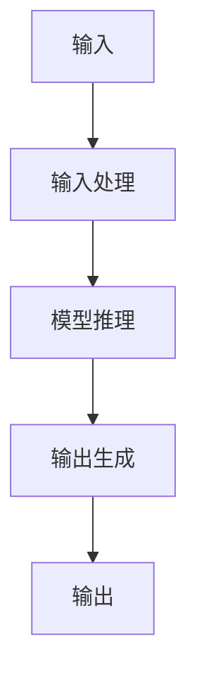
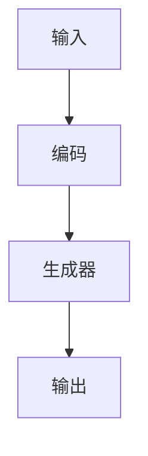
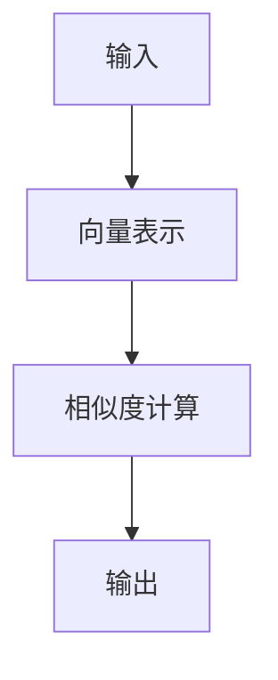
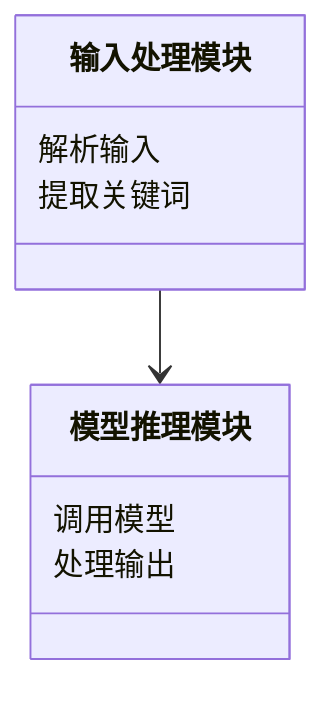
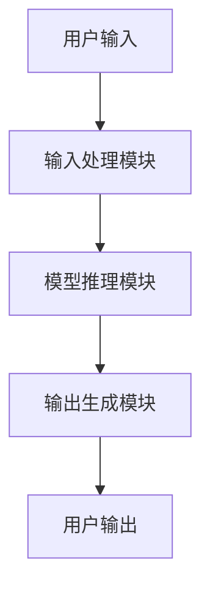

                 


# 《构建AI Agent的测试与评估框架》

---

## 关键词：AI Agent, 测试框架, 评估指标, 自然语言处理, 机器学习, 大模型, 对话系统

---

## 摘要：  
本文详细探讨了构建AI Agent测试与评估框架的核心方法与实践。通过分析AI Agent的背景、核心概念、算法原理、系统架构和项目实战，结合实际案例，总结了最佳实践经验和注意事项。文章内容从基础概念到系统实现，层层深入，为读者提供了一套完整的AI Agent测试与评估框架的构建指南。

---

## 目录大纲  

1. **AI Agent的背景与核心概念**  
   1.1 AI Agent的基本概念与背景  
   1.2 AI Agent的技术基础  
   1.3 AI Agent的应用场景  

2. **AI Agent的核心概念与联系**  
   2.1 AI Agent的输入输出模型  
   2.2 AI Agent的内部结构  
   2.3 AI Agent的评估指标  

3. **AI Agent的算法原理**  
   3.1 生成式AI的原理与流程图  
   3.2 检索式AI的原理与流程图  
   3.3 数学模型与公式解析  

4. **AI Agent的系统架构设计**  
   4.1 系统功能设计与领域模型  
   4.2 系统架构设计与交互流程图  
   4.3 系统接口设计与实现  

5. **AI Agent的项目实战**  
   5.1 项目背景与目标  
   5.2 系统核心实现与代码解读  
   5.3 实际案例分析与效果评估  

6. **AI Agent的测试与评估框架总结**  
   6.1 最佳实践与经验总结  
   6.2 注意事项与常见问题  
   6.3 拓展阅读与未来方向  

---

## 第一部分: AI Agent的背景与核心概念

### 1.1 AI Agent的基本概念与背景  

AI Agent（人工智能代理）是指能够感知环境并采取行动以实现目标的智能实体。它通过接收输入、处理信息并输出结果来与用户交互。AI Agent的核心特点包括：  
- **智能性**：能够理解和处理复杂信息。  
- **适应性**：能够根据环境变化调整行为。  
- **自主性**：能够在没有外部干预的情况下运行。  

AI Agent与传统AI的区别在于其具备更强的交互性和自主性，能够主动与用户进行对话和任务处理。

---

### 1.2 AI Agent的技术基础  

AI Agent的实现依赖于多种技术，包括：  
1. **自然语言处理（NLP）**：用于理解和生成人类语言。  
2. **机器学习**：用于模型的训练和优化。  
3. **大模型（如GPT系列）**：通过大规模数据训练生成高质量的文本内容。  

AI Agent在企业级应用中的重要性体现在其能够提高效率、降低成本并提供智能化服务。

---

### 1.3 AI Agent的应用场景  

AI Agent广泛应用于多个领域：  
- **自然语言处理**：如智能客服、对话机器人。  
- **机器学习**：如推荐系统、预测模型。  
- **企业级应用**：如智能助手、自动化流程管理。  

---

## 第二部分: AI Agent的核心概念与联系  

### 2.1 AI Agent的输入输出模型  

AI Agent的输入输出模型包括：  
- **输入处理模块**：接收用户的输入并进行解析。  
- **输出生成模块**：根据输入生成相应的输出。  

通过以下表格对比生成式AI和检索式AI的特点：

| **特性**      | **生成式AI**                | **检索式AI**                |
|----------------|-----------------------------|-----------------------------|
| 工作原理       | 基于生成模型生成内容        | 基于检索模型匹配现有内容    |
| 优势           | 内容多样性高，创造性强       | 精准度高，适合特定场景       |
| 劣势           | 可能出现不一致或错误内容     | 创新性较低                   |

---

### 2.2 AI Agent的内部结构  

AI Agent的内部结构包括：  
- **模型训练模块**：负责模型的训练和优化。  
- **模型推理模块**：负责模型的推理和生成。  

以下为AI Agent核心概念原理的Mermaid流程图：



---

### 2.3 AI Agent的评估指标  

AI Agent的评估指标包括：  
- **准确性**：输出结果与预期结果的匹配程度。  
- **响应速度**：处理请求的时间长短。  
- **可解释性**：输出结果的可解释程度。  

---

## 第三部分: AI Agent的算法原理  

### 3.1 生成式AI的原理与流程图  

生成式AI的核心原理是基于生成对抗网络（GAN）或 transformers 架构。以下为生成式AI的流程图：



数学模型如下：  
损失函数：$$L = L_{\text{adv}} + L_{\text{recon}}$$  
梯度下降：$$\theta \leftarrow \theta - \eta \cdot \nabla_\theta L$$  

---

### 3.2 检索式AI的原理与流程图  

检索式AI的核心原理是基于向量空间模型或注意力机制。以下为检索式AI的流程图：



数学模型如下：  
相似度计算：$$\text{sim}(x, y) = \frac{x \cdot y}{\|x\| \|y\|}$$  

---

## 第四部分: AI Agent的系统架构设计  

### 4.1 系统功能设计与领域模型  

以下为系统功能设计的领域模型：



---

### 4.2 系统架构设计与交互流程图  

以下为系统架构设计的交互流程图：



---

### 4.3 系统接口设计与实现  

系统接口设计包括：  
- **输入接口**：接收用户的输入文本。  
- **输出接口**：返回生成的文本内容。  

---

## 第五部分: AI Agent的项目实战  

### 5.1 项目背景与目标  

项目目标是构建一个基于GPT的对话AI Agent，实现智能对话功能。

---

### 5.2 系统核心实现与代码解读  

以下是Python实现代码示例：

```python
def input_handler(text):
    # 解析输入文本
    return text

def model_inference(text):
    # 调用预训练模型
    return generated_output

def output_generator(output):
    # 处理输出结果
    return output

def main():
    input_text = input("请输入您的问题：")
    processed_input = input_handler(input_text)
    generated_output = model_inference(processed_input)
    final_output = output_generator(generated_output)
    print(final_output)

if __name__ == "__main__":
    main()
```

---

### 5.3 实际案例分析与效果评估  

通过实际案例分析，评估AI Agent的准确性和响应速度。效果评估指标包括：  
- **准确率**：输出结果与预期结果的匹配程度。  
- **响应时间**：处理请求的时间长短。  

---

## 第六部分: AI Agent的测试与评估框架总结  

### 6.1 最佳实践与经验总结  

- **测试数据多样性**：确保测试数据覆盖多种场景。  
- **性能优化**：通过并行计算和缓存优化提升响应速度。  

---

### 6.2 注意事项与常见问题  

- **数据泄露风险**：确保数据的安全性。  
- **模型过时问题**：定期更新模型以保持性能。  

---

### 6.3 拓展阅读与未来方向  

- **前沿技术**：关注大语言模型的最新进展。  
- **未来方向**：探索AI Agent在更多领域的应用。  

---

## 附录  

- **参考文献**：列出相关技术论文和书籍。  
- **工具资源**：推荐相关开发工具和平台。  

---

通过以上内容，您可以逐步构建一个完整且详细的AI Agent测试与评估框架。

