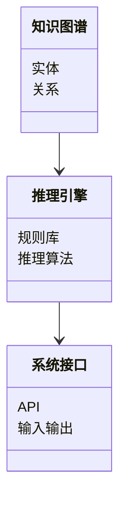
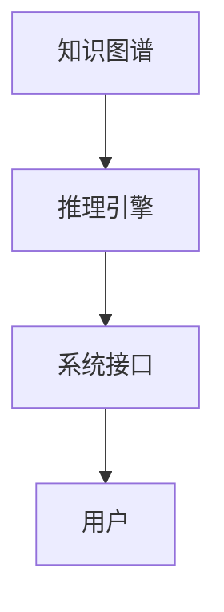
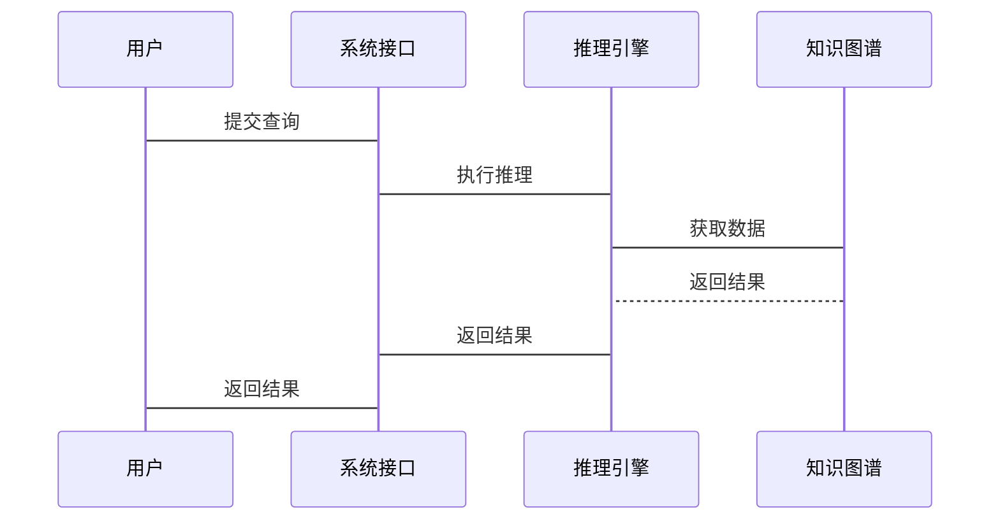

                 


# 构建AI Agent的知识图谱推理引擎优化

> 关键词：AI Agent，知识图谱，推理引擎，优化，图神经网络，知识表示

> 摘要：本文系统地探讨了构建AI Agent的知识图谱推理引擎的优化方法。从AI Agent的基本概念到知识图谱的表示方法，再到推理引擎的算法原理和系统架构设计，本文深入分析了如何通过优化知识图谱推理引擎来提升AI Agent的智能水平。文章结合实际案例和代码实现，详细讲解了知识图谱推理引擎的核心算法和系统设计，为AI开发者和研究人员提供了理论和实践指导。

---

# 第一部分: AI Agent与知识图谱推理引擎概述

## 第1章: AI Agent与知识图谱推理引擎的背景介绍

### 1.1 AI Agent的基本概念

#### 1.1.1 AI Agent的定义与特点
AI Agent（人工智能代理）是指能够感知环境、自主决策并执行任务的智能实体。AI Agent可以是软件程序、机器人或其他智能系统，其核心目标是通过感知和行动来实现特定任务或目标。AI Agent的特点包括自主性、反应性、主动性、社会性和学习性。

#### 1.1.2 知识图谱在AI Agent中的作用
知识图谱是一种以结构化方式表示知识的图数据，通过实体（节点）和关系（边）构建语义网络。在AI Agent中，知识图谱作为知识库，为推理和决策提供支持。知识图谱能够帮助AI Agent理解上下文、推理新知识，并做出更智能的决策。

#### 1.1.3 推理引擎在AI Agent中的核心地位
推理引擎是AI Agent的核心组件，负责根据知识库中的信息进行推理和逻辑运算。推理引擎能够从已知事实中推导出新的事实，支持AI Agent的智能行为。推理引擎的性能直接影响AI Agent的决策能力和响应速度。

### 1.2 知识图谱的基本概念

#### 1.2.1 知识图谱的定义与特点
知识图谱是一种大规模的语义网络，由实体和关系组成，广泛应用于搜索引擎、自然语言处理和推荐系统等领域。知识图谱的特点包括大规模性、结构化和语义丰富性。

#### 1.2.2 知识图谱的构建过程
知识图谱的构建过程包括数据收集、数据清洗、实体识别、关系抽取和知识融合等步骤。数据来源可以是结构化数据、文本数据或外部知识库。

#### 1.2.3 知识图谱的表示方法
知识图谱的表示方法包括三元组表示法（主语-谓词-宾语）和图结构表示法。三元组表示法简单直观，而图结构表示法则能够更复杂地描述实体之间的关系。

### 1.3 推理引擎的基本概念

#### 1.3.1 推理引擎的定义与分类
推理引擎是一种用于从知识库中推导新事实的算法或系统。推理引擎可以分为基于规则的推理引擎、基于概率的推理引擎和基于图的推理引擎。

#### 1.3.2 常见的推理算法
常见的推理算法包括RDFS（RDF Schema）、OWL（Web Ontology Language）和SPARQL。这些算法分别适用于不同的推理场景。

#### 1.3.3 推理引擎的应用场景
推理引擎广泛应用于搜索引擎优化、问答系统、推荐系统和对话系统等领域。通过推理引擎，AI Agent能够更好地理解用户需求并提供更智能的服务。

### 1.4 知识图谱推理引擎的核心问题

#### 1.4.1 知识图谱推理的基本问题
知识图谱推理的基本问题包括从已知事实中推导新事实、处理不完整或不确定的知识，以及在大规模数据中高效推理。

#### 1.4.2 推理引擎的性能瓶颈
推理引擎的性能瓶颈主要体现在处理大规模数据时的计算效率低下、推理算法的复杂性和知识表示的不一致性。

#### 1.4.3 优化的目标与方向
优化的目标是提升推理引擎的效率、准确性和可扩展性。优化的方向包括算法改进、知识表示优化和分布式计算。

### 1.5 本章小结
本章介绍了AI Agent、知识图谱和推理引擎的基本概念，探讨了知识图谱推理引擎的核心问题和优化方向，为后续章节的深入分析奠定了基础。

---

# 第二部分: 知识图谱推理引擎的核心概念与联系

## 第2章: 知识图谱推理引擎的核心概念

### 2.1 知识图谱的结构与表示

#### 2.1.1 三元组表示法
三元组表示法通过主语、谓词和宾语的形式描述知识。例如，"张三 爱 姐妹"，其中"张三"是主语，"爱"是谓词，"姐妹"是宾语。

#### 2.1.2 图结构表示法
图结构表示法将知识图谱表示为图数据，其中节点表示实体，边表示关系。例如，节点A连接到节点B，表示A与B之间的关系。

#### 2.1.3 知识图谱的层次化组织
知识图谱可以按照层次化的方式组织，例如将实体分为类别，每个类别下有具体的实例。

### 2.2 推理引擎的原理与机制

#### 2.2.1 基于规则的推理
基于规则的推理通过预定义的规则进行推理。例如，如果A是B的父亲，B是C的父亲，那么A是C的祖父。

#### 2.2.2 基于概率的推理
基于概率的推理使用概率论进行推理，例如贝叶斯网络。

#### 2.2.3 基于图的推理
基于图的推理通过图结构进行推理，例如通过遍历图中的路径来推断关系。

### 2.3 知识图谱与推理引擎的关系

#### 2.3.1 知识图谱作为推理引擎的知识库
知识图谱为推理引擎提供知识支持，推理引擎基于知识图谱进行推理。

#### 2.3.2 推理引擎作为知识图谱的推理工具
推理引擎是知识图谱的推理工具，能够帮助知识图谱进行推理和扩展。

#### 2.3.3 知识图谱与推理引擎的协同优化
知识图谱和推理引擎需要协同优化，例如通过优化知识表示和推理算法来提升推理效率。

### 2.4 核心概念对比与ER实体关系图

#### 2.4.1 核心概念对比表格
| 概念 | 定义 | 优缺点 |
|------|------|--------|
| 三元组表示法 | 主语-谓词-宾语 | 简单直观，但难以表示复杂关系 |
| 图结构表示法 | 节点和边 | 能够表示复杂关系，但表示冗余 |

#### 2.4.2 ER实体关系图的Mermaid流程图


---

# 第三部分: 知识图谱推理引擎的算法原理

## 第3章: 知识图谱推理算法的数学模型

### 3.1 基于规则的推理算法

#### 3.1.1 三元组规则的数学表示
三元组规则可以通过逻辑表达式表示。例如，如果A是B的子类，B是C的子类，则A是C的子类。

#### 3.1.2 规则匹配的算法流程
1. 输入三元组数据。
2. 匹配预定义的规则。
3. 输出推理结果。

#### 3.1.3 示例：简单规则推理


### 3.2 基于概率的推理算法

#### 3.2.1 概率推理的数学模型
概率推理可以使用贝叶斯网络进行建模。例如，P(A|B) = P(B|A) * P(A) / P(B)。

#### 3.2.2 贝叶斯网络的应用
贝叶斯网络可以用于疾病诊断推理。例如，根据症状推断疾病的可能性。

### 3.3 基于图的推理算法

#### 3.3.1 图神经网络的数学模型
图神经网络（GNN）通过聚合节点特征和邻居特征进行推理。例如，RGCN（关系聚合网络）用于知识图谱推理。

#### 3.3.2 图神经网络的推理流程
1. 输入图数据。
2. 聚合邻居特征。
3. 更新节点表示。
4. 输出推理结果。

### 3.4 基于规则和图神经网络的对比分析

#### 3.4.1 基于规则的推理优缺点
优点：简单直观，易于解释。缺点：难以处理复杂关系。

#### 3.4.2 基于图神经网络的推理优缺点
优点：能够处理复杂关系，具有强大的表达能力。缺点：计算复杂，需要大量数据训练。

---

## 第四章: 知识图谱推理引擎的系统分析与架构设计

### 4.1 系统分析与问题场景介绍

#### 4.1.1 系统功能需求
系统需要支持知识图谱构建、推理引擎优化和结果展示。

#### 4.1.2 系统性能需求
系统需要高效处理大规模数据，支持实时推理和高可用性。

### 4.2 系统架构设计

#### 4.2.1 领域模型Mermaid类图


#### 4.2.2 系统架构Mermaid架构图


### 4.3 系统交互设计

#### 4.3.1 系统交互Mermaid序列图


### 4.4 系统接口设计

#### 4.4.1 接口功能
系统接口提供查询、更新和管理功能。

#### 4.4.2 接口规范
接口使用RESTful API，支持JSON格式的数据交换。

---

## 第五章: 项目实战——知识图谱推理引擎的实现

### 5.1 环境安装与配置

#### 5.1.1 安装Python环境
使用Python 3.8及以上版本。

#### 5.1.2 安装依赖库
安装numpy、pandas、networkx和scikit-learn等依赖库。

### 5.2 知识图谱构建与推理引擎实现

#### 5.2.1 知识图谱构建代码
```python
import networkx as nx

G = nx.Graph()
G.add_edge("张三", "爱")
G.add_edge("爱", "姐妹")
```

#### 5.2.2 推理引擎实现代码
```python
def infer(G, subject, predicate):
    for edge in G.edges(subject):
        if edge[1] == predicate:
            return edge[2]
    return None
```

### 5.3 代码应用与案例分析

#### 5.3.1 代码功能解读
上述代码构建了一个简单的知识图谱，并实现了基本的推理功能。

#### 5.3.2 案例分析
以“张三爱姐妹”为例，推理引擎能够推断出张三与姐妹之间的关系。

### 5.4 项目小结

#### 5.4.1 代码实现总结
代码实现了基本的知识图谱构建和推理功能，为后续优化奠定了基础。

#### 5.4.2 项目经验总结
项目中需要注意知识图谱的规模和推理算法的效率问题。

---

## 第六章: 知识图谱推理引擎的优化与展望

### 6.1 优化策略

#### 6.1.1 知识表示优化
通过优化知识表示方法，例如使用层次化知识表示，可以提升推理效率。

#### 6.1.2 推理算法优化
通过改进推理算法，例如使用更高效的图神经网络算法，可以提升推理速度。

#### 6.1.3 系统架构优化
通过分布式计算和并行处理，可以提升系统的扩展性和性能。

### 6.2 优化效果评估

#### 6.2.1 性能指标
性能指标包括推理时间、准确率和系统吞吐量。

#### 6.2.2 实验对比
通过实验对比，验证优化策略的有效性。

### 6.3 未来研究方向

#### 6.3.1 新型推理算法研究
研究新型推理算法，例如基于深度学习的推理方法。

#### 6.3.2 知识图谱的动态更新
研究知识图谱的动态更新技术，提升系统的实时性。

#### 6.3.3 多模态知识图谱推理
研究多模态知识图谱的推理方法，例如结合文本、图像等多种数据源。

---

## 第七章: 最佳实践与总结

### 7.1 最佳实践

#### 7.1.1 知识图谱构建的注意事项
在构建知识图谱时，需要注意数据的准确性和完整性。

#### 7.1.2 推理引擎优化的注意事项
在优化推理引擎时，需要注意算法的效率和系统的扩展性。

### 7.2 小结与总结

#### 7.2.1 核心知识点总结
本文系统地介绍了AI Agent、知识图谱和推理引擎的基本概念，分析了知识图谱推理引擎的核心算法和系统设计。

#### 7.2.2 未来展望
未来的研究方向包括新型推理算法、知识图谱的动态更新和多模态知识图谱推理。

---

## 参考文献

1. 维基百科：人工智能代理
2. 图灵网：知识图谱
3. 推理引擎相关论文

---

通过以上结构和内容安排，读者可以逐步深入理解构建AI Agent的知识图谱推理引擎优化的理论和实践。文章从基础概念到实际应用，结合理论分析和代码实现，为读者提供了全面的知识框架和实践指导。

