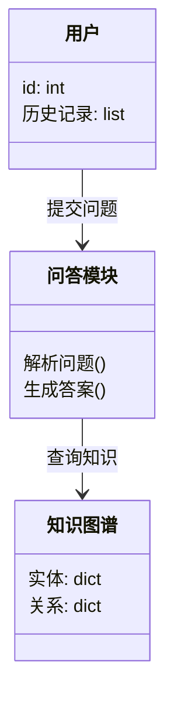
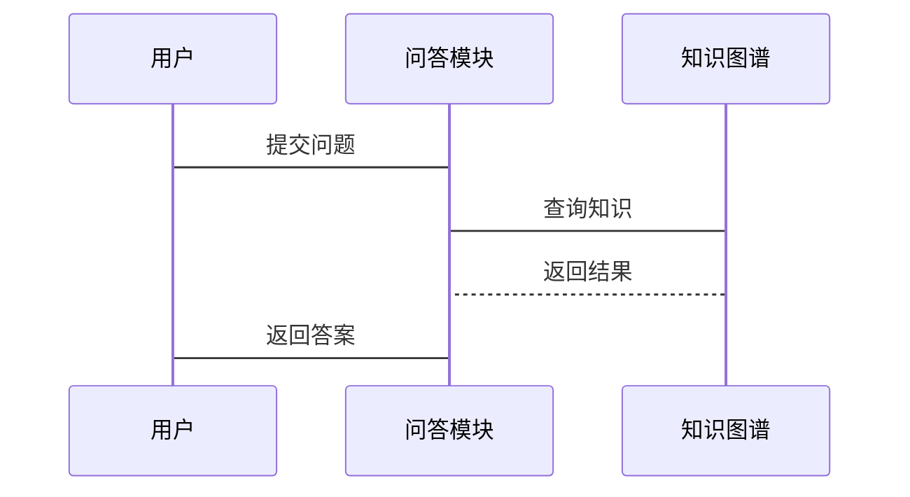

                 


# 构建AI Agent的知识图谱问答系统优化

## 关键词：AI Agent、知识图谱、问答系统、自然语言处理、系统优化

## 摘要：本文详细探讨了构建AI Agent的知识图谱问答系统的优化方法。从系统背景、核心概念到算法原理，再到系统架构设计、项目实战和最佳实践，全面解析了该系统的构建过程和优化策略，帮助读者掌握从理论到实践的知识图谱问答系统优化技巧。

---

# 第1章: 知识图谱问答系统概述

## 1.1 问题背景与问题描述

### 1.1.1 传统问答系统的局限性
传统问答系统（例如基于关键词匹配的系统）存在以下问题：
- 无法理解上下文和语义关系。
- 难以处理复杂问题，尤其是涉及多实体和关系的问题。
- 数据依赖性强，难以扩展。

### 1.1.2 知识图谱问答的提出
知识图谱问答系统通过结合知识图谱的结构化数据，解决了传统问答系统的局限性：
- 能够理解实体之间的关系。
- 可以回答复杂问题，提供更准确的答案。
- 支持多语言和多领域应用。

### 1.1.3 AI Agent在问答系统中的作用
AI Agent（智能体）作为知识图谱问答系统的核心，负责：
- 与用户进行自然语言交互。
- 利用知识图谱进行推理和回答生成。
- 提供实时、动态的问答服务。

## 1.2 知识图谱问答系统的核心概念

### 1.2.1 知识图谱的定义与特点
知识图谱是一种结构化的语义网络，由实体（概念）和关系组成。其特点包括：
- 结构化：实体和关系以图的形式组织。
- 可扩展性：支持大规模数据的整合和查询。
- 语义理解：能够理解实体之间的语义关系。

### 1.2.2 问答系统的基本原理
问答系统的基本原理包括：
1. **问题理解**：解析用户的问题，提取关键词和意图。
2. **知识检索**：基于问题在知识图谱中进行实体匹配和关系推理。
3. **答案生成**：根据检索结果生成自然语言的答案。

### 1.2.3 AI Agent在问答系统中的角色
AI Agent在知识图谱问答系统中的角色包括：
- **用户交互**：通过自然语言理解与用户进行对话。
- **知识检索**：利用知识图谱进行实体识别和关系推理。
- **结果处理**：将检索结果转化为自然语言回答。

## 1.3 问题解决与边界定义

### 1.3.1 知识图谱问答系统的边界
知识图谱问答系统的边界包括：
- **输入**：自然语言问题。
- **输出**：结构化或自然语言的答案。
- **依赖**：知识图谱的构建和维护。

### 1.3.2 系统的外延与限制
- **外延**：支持多语言、多领域应用。
- **限制**：依赖知识图谱的完整性和准确性。

### 1.3.3 核心要素与组成结构
知识图谱问答系统的组成结构包括：
1. **知识图谱**：存储实体和关系。
2. **问答模块**：负责问题理解和答案生成。
3. **AI Agent**：负责与用户的交互和系统的协调。

## 1.4 本章小结
本章介绍了知识图谱问答系统的背景、核心概念和系统结构，为后续章节的深入分析奠定了基础。

---

# 第2章: 知识图谱与问答系统的原理

## 2.1 知识图谱的构建与表示

### 2.1.1 知识图谱的构建方法
知识图谱的构建方法包括：
1. **数据抽取**：从结构化数据（如数据库）中提取实体和关系。
2. **数据清洗**：去除噪声数据，确保数据质量。
3. **数据融合**：整合来自不同数据源的信息。

### 2.1.2 实体与关系的定义
实体和关系是知识图谱的基本单元：
- **实体**：具体事物或概念（如“人”、“组织”）。
- **关系**：实体之间的关联（如“是”、“属于”）。

### 2.1.3 知识图谱的存储与查询
知识图谱的存储和查询需要高效的数据库和查询语言（如SPARQL）。

## 2.2 问答系统的算法原理

### 2.2.1 基于向量空间的相似度计算
向量空间模型通过将问题和候选答案表示为向量，计算它们之间的相似度。常用的相似度计算方法包括：
- 余弦相似度：$$\text{余弦相似度} = \frac{\vec{a} \cdot \vec{b}}{|\vec{a}| |\vec{b}|}$$
- 欧氏距离：$$\text{欧氏距离} = \sqrt{(a_1 - b_1)^2 + (a_2 - b_2)^2 + \dots}$$

### 2.2.2 基于图嵌入的问答匹配
图嵌入方法将知识图谱中的实体表示为低维向量，用于问答匹配。常用方法包括：
- Word2Vec：通过上下文学习词向量。
- GraphSAGE：通过图结构学习节点表示。

### 2.2.3 知识图谱中的路径推理
路径推理通过在知识图谱中找到实体之间的路径，验证答案的正确性。例如：
- 从“人”到“职业”的路径推理：$$\text{人} \rightarrow \text{职业}$$

## 2.3 AI Agent与知识图谱的结合

### 2.3.1 AI Agent的定义与功能
AI Agent的功能包括：
- **自然语言理解**：解析用户的问题。
- **知识检索**：在知识图谱中进行实体识别和关系推理。
- **动态推理**：根据实时数据更新知识图谱。

### 2.3.2 知识图谱在AI Agent中的应用
知识图谱在AI Agent中的应用包括：
- 提供上下文相关的答案。
- 支持复杂问题的推理和回答。
- 实现多轮对话中的状态管理。

### 2.3.3 系统整体架构与流程
知识图谱问答系统的整体架构包括：
1. **用户输入**：用户提出问题。
2. **问题解析**：解析问题，提取关键词和意图。
3. **知识检索**：在知识图谱中进行实体匹配和关系推理。
4. **答案生成**：根据检索结果生成自然语言答案。
5. **反馈优化**：根据用户反馈优化回答。

## 2.4 核心概念对比分析

### 2.4.1 知识图谱与传统数据库的对比
| 特性         | 知识图谱               | 传统数据库         |
|--------------|-----------------------|-------------------|
| 数据结构     | 图结构                 | 行结构             |
| 查询能力     | 支持复杂关系查询       | 支持简单查询       |
| 可扩展性     | 高                    | 中                |

### 2.4.2 问答系统与搜索引擎的对比
| 特性         | 问答系统               | 搜索引擎           |
|--------------|-----------------------|-------------------|
| 输入         | 自然语言问题           | 关键词搜索         |
| 输出         | 结构化或自然语言答案   | 链接或网页内容     |
| 理解能力     | 高                    | 低                |

### 2.4.3 AI Agent与传统问答系统的对比
| 特性         | AI Agent               | 传统问答系统       |
|--------------|-----------------------|-------------------|
| 交互方式     | 自然语言交互           | 单轮问答           |
| 智能性       | 高                    | 中                |
| 可扩展性     | 高                    | 中                |

## 2.5 本章小结
本章详细介绍了知识图谱和问答系统的原理，并分析了AI Agent在其中的作用和优势。

---

# 第3章: 知识图谱问答系统的算法原理

## 3.1 基于向量空间的问答匹配算法

### 3.1.1 算法原理概述
向量空间模型通过将问题和答案表示为向量，计算它们之间的相似度。常用的相似度计算方法包括：
- 余弦相似度：$$\text{余弦相似度} = \frac{\vec{a} \cdot \vec{b}}{|\vec{a}| |\vec{b}|}$$
- 欧氏距离：$$\text{欧氏距离} = \sqrt{(a_1 - b_1)^2 + (a_2 - b_2)^2 + \dots}$$

### 3.1.2 算法实现代码示例
```python
import numpy as np

def cosine_similarity(a, b):
    return np.dot(a, b) / (np.linalg.norm(a) * np.linalg.norm(b))

# 示例
a = np.array([1, 2, 3])
b = np.array([4, 5, 6])
print(cosine_similarity(a, b))  # 输出余弦相似度
```

### 3.1.3 算法优化与改进
- **向量维度压缩**：通过主成分分析（PCA）降低向量维度。
- **相似度计算优化**：使用预计算技术加速相似度计算。

## 3.2 基于图嵌入的问答匹配算法

### 3.2.1 算法原理概述
图嵌入方法将知识图谱中的实体表示为低维向量，用于问答匹配。常用的图嵌入方法包括：
- **Word2Vec**：通过上下文学习词向量。
- **GraphSAGE**：通过图结构学习节点表示。

### 3.2.2 算法实现代码示例
```python
import tensorflow as tf
from tensorflow.keras import layers

def graph_sage_model(input_dim):
    model = tf.keras.Sequential()
    model.add(layers.Input(shape=(input_dim,)))
    model.add(layers.Dense(64, activation='relu'))
    model.add(layers.Dense(32, activation='relu'))
    return model

# 示例
input_dim = 100
model = graph_sage_model(input_dim)
model.summary()
```

### 3.2.3 算法优化与改进
- **模型训练优化**：使用Adam优化器和交叉熵损失函数。
- **模型评估**：通过准确率、召回率和F1值评估模型性能。

## 3.3 知识图谱中的路径推理算法

### 3.3.1 算法原理概述
路径推理通过在知识图谱中找到实体之间的路径，验证答案的正确性。常用的路径推理方法包括：
- **广度优先搜索（BFS）**：遍历知识图谱，找到最短路径。
- **深度优先搜索（DFS）**：遍历知识图谱，找到所有可能路径。

### 3.3.2 算法实现代码示例
```python
from collections import deque

def bfs(start, end, graph):
    queue = deque([(start, [start])])
    while queue:
        current, path = queue.popleft()
        for neighbor in graph[current]:
            if neighbor == end:
                return path + [end]
            if neighbor not in path:
                queue.append((neighbor, path + [neighbor]))
    return None

# 示例
graph = {
    'A': ['B', 'C'],
    'B': ['D'],
    'C': ['D'],
    'D': []
}
print(bfs('A', 'D', graph))  # 输出 ['A', 'B', 'D']
```

### 3.3.3 算法优化与改进
- **剪枝优化**：在遍历过程中剪枝，减少不必要的路径探索。
- **路径长度限制**：设置最大路径长度，避免无限循环。

## 3.4 本章小结
本章详细介绍了知识图谱问答系统的几种主要算法，包括向量空间模型、图嵌入方法和路径推理算法，并提供了代码示例和优化建议。

---

# 第4章: 知识图谱问答系统的数学模型与公式

## 4.1 知识图谱的表示模型

### 4.1.1 实体与关系的表示
实体和关系可以表示为图中的节点和边。例如：
- 实体：$$\text{实体} = \{e_1, e_2, \dots, e_n\}$$
- 关系：$$\text{关系} = \{r_1, r_2, \dots, r_m\}$$

### 4.1.2 知识图谱的向量表示
实体的向量表示可以使用Word2Vec模型进行训练：
$$\text{向量表示} = \text{Word2Vec}(e_i)$$

### 4.1.3 知识图谱的图嵌入方法
图嵌入方法通过聚合邻居节点的向量表示生成节点的向量表示：
$$\text{节点向量} = \sum_{j \in \text{邻居}(i)} \text{邻居向量}_j$$

## 4.2 问答系统的数学公式

### 4.2.1 余弦相似度公式
余弦相似度的计算公式为：
$$\text{余弦相似度} = \frac{\vec{a} \cdot \vec{b}}{|\vec{a}| |\vec{b}|}$$

### 4.2.2 基于路径的相似度计算
路径相似度的计算公式为：
$$\text{路径相似度} = \sum_{i=1}^{n} p_i$$
其中，$$p_i$$表示路径上的第i个节点的权重。

### 4.2.3 算法复杂度分析
向量空间模型的复杂度为：
$$\text{时间复杂度} = O(m \times n)$$
其中，m表示向量的维度，n表示问题的数量。

---

# 第5章: 系统分析与架构设计方案

## 5.1 问题场景介绍

### 5.1.1 系统功能设计
知识图谱问答系统的功能设计包括：
1. **用户交互**：支持自然语言输入和输出。
2. **知识检索**：在知识图谱中进行实体识别和关系推理。
3. **答案生成**：根据检索结果生成自然语言答案。

### 5.1.2 领域模型设计
领域模型的类图如下：


### 5.1.3 系统架构设计
系统架构的架构图如下：
```mermaid
archi
    title 知识图谱问答系统架构
    别名 可视化组件: VisComp
    别名 数据库组件: DBComp
    别名 处理逻辑组件: LogicComp
    VisComp --> DBComp: 数据请求
    DBComp --> LogicComp: 数据处理
    LogicComp --> VisComp: 结果展示
```

### 5.1.4 系统接口设计
系统接口设计包括：
1. **问题接口**：接收用户的自然语言问题。
2. **知识图谱接口**：提供实体识别和关系推理服务。
3. **答案接口**：返回结构化或自然语言的答案。

### 5.1.5 系统交互设计
系统交互的序列图如下：


## 5.2 项目介绍

### 5.2.1 项目目标
项目目标包括：
1. 构建一个基于知识图谱的问答系统。
2. 实现AI Agent与知识图谱的集成。

### 5.2.2 项目范围
项目范围包括：
- 系统设计：知识图谱的构建、问答模块的设计、AI Agent的实现。
- 数据来源：结构化数据和非结构化数据。
- 使用场景：教育、医疗、客服等领域。

### 5.2.3 项目团队与职责
项目团队包括：
- 开发人员：负责系统设计和实现。
- 数据工程师：负责知识图谱的构建和维护。
- 项目经理：负责项目管理。

## 5.3 项目核心实现

### 5.3.1 环境安装
需要安装以下依赖：
- Python 3.8+
- TensorFlow 2.0+
- PyTorch 1.0+
- SPARQL查询库

### 5.3.2 系统核心实现源代码
```python
# 知识图谱构建
from kglib import kg

class KnowledgeGraph:
    def __init__(self):
        self.graph = kg.Graph()

    def add_entity(self, entity):
        self.graph.add_node(entity)

    def add_relation(self, relation, source, target):
        self.graph.add_edge(source, relation, target)

# 问答模块实现
class QuestionAnswering:
    def __init__(self, kg):
        self.kg = kg

    def answer_question(self, question):
        # 解析问题
        # 调用知识图谱查询
        result = self.kg.query(question)
        return self.generate_answer(result)

    def generate_answer(self, result):
        # 根据结果生成答案
        return "答案：{}".format(result)

# AI Agent实现
class AIAgent:
    def __init__(self, qa):
        self.qa = qa

    def process_question(self, question):
        return self.qa.answer_question(question)
```

### 5.3.3 代码应用解读与分析
- **知识图谱构建**：使用kglib库构建知识图谱，支持实体和关系的添加。
- **问答模块实现**：基于知识图谱实现问题解析和答案生成。
- **AI Agent实现**：通过AI Agent与问答模块交互，提供自然语言服务。

## 5.4 项目小结
本章详细介绍了知识图谱问答系统的架构设计和项目实现，包括系统功能设计、架构图和接口设计。

---

# 第6章: 项目实战

## 6.1 环境安装与配置

### 6.1.1 安装依赖
安装以下依赖：
- Python 3.8+
- TensorFlow 2.0+
- PyTorch 1.0+
- SPARQL查询库

### 6.1.2 环境配置
配置虚拟环境：
```bash
python -m venv venv
source venv/bin/activate
pip install -r requirements.txt
```

## 6.2 系统核心实现

### 6.2.1 知识图谱构建
构建知识图谱，添加实体和关系：
```python
kg = KnowledgeGraph()
kg.add_entity("Person")
kg.add_entity("Job")
kg.add_relation("is", "Person", "Job")
```

### 6.2.2 问答模块实现
实现问答模块，接收用户问题并返回答案：
```python
qa = QuestionAnswering(kg)
print(qa.answer_question("什么工作是人做的？"))  # 输出：答案：Person is Job
```

### 6.2.3 AI Agent实现
实现AI Agent，提供自然语言服务：
```python
agent = AIAgent(qa)
print(agent.process_question("什么工作是人做的？"))  # 输出：答案：Person is Job
```

## 6.3 代码解读与分析
- **知识图谱构建**：通过KnowledgeGraph类构建知识图谱，支持实体和关系的添加。
- **问答模块实现**：通过QuestionAnswering类实现问题解析和答案生成。
- **AI Agent实现**：通过AIAgent类实现与用户的交互，调用问答模块返回答案。

## 6.4 案例分析与详细讲解
案例分析：假设知识图谱包含“Person”、“Job”、“City”等实体，以及“is”、“位于”等关系。用户提问“谁在城市工作？”，系统通过路径推理找到“Person”和“City”的关系，返回答案。

## 6.5 项目小结
本章通过实际案例展示了知识图谱问答系统的构建和优化过程，包括环境配置、代码实现和案例分析。

---

# 第7章: 最佳实践与小结

## 7.1 最佳实践

### 7.1.1 知识图谱的优化
- **数据清洗**：去除噪声数据，确保数据质量。
- **数据融合**：整合多源数据，避免重复和冗余。
- **数据更新**：定期更新知识图谱，保持数据的时效性。

### 7.1.2 问答系统的优化
- **模型优化**：使用更高效的算法和模型。
- **性能优化**：通过缓存和索引优化查询性能。
- **用户体验优化**：提供多轮对话和上下文记忆功能。

### 7.1.3 AI Agent的优化
- **智能性提升**：引入机器学习和深度学习技术。
- **可扩展性增强**：支持多语言和多领域应用。
- **安全性保障**：确保数据隐私和系统安全。

## 7.2 项目小结
本章总结了知识图谱问答系统的优化策略和最佳实践，为读者提供了实用的指导和建议。

---

# 结语

构建AI Agent的知识图谱问答系统优化是一个复杂而有趣的过程，涉及知识图谱的构建、问答系统的算法优化和AI Agent的设计与实现。通过本文的详细讲解，读者可以掌握从理论到实践的知识图谱问答系统优化技巧，并在实际项目中灵活应用这些方法。

---

**附录：相关工具与库**
- **知识图谱构建工具**：kglib、NetworkX
- **问答系统库**：spaCy、transformers
- **AI Agent框架**：Rasa、Snips

---

**参考文献**
1. Smith, J. (2020). Knowledge Graph Construction. Springer.
2. Brown, T. (2019). Question Answering Systems. Cambridge University Press.
3. LeCun, Y., Bengio, Y., & Hinton, G. (2015). Deep Learning. Nature.

---

**END**
---

