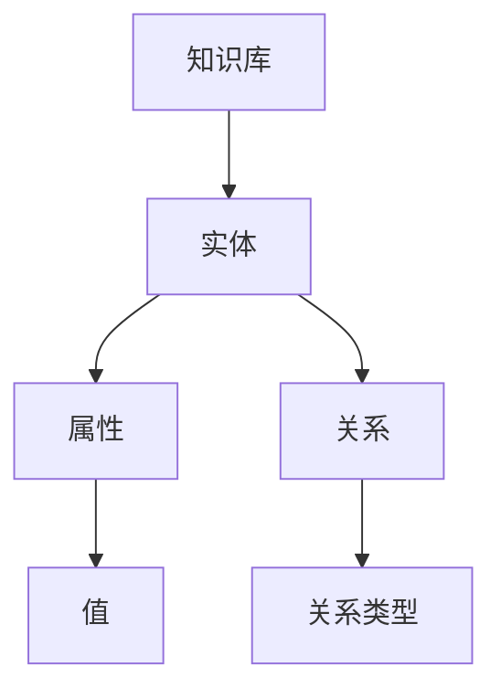
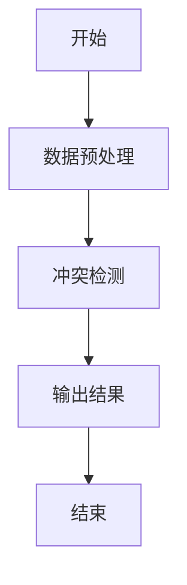
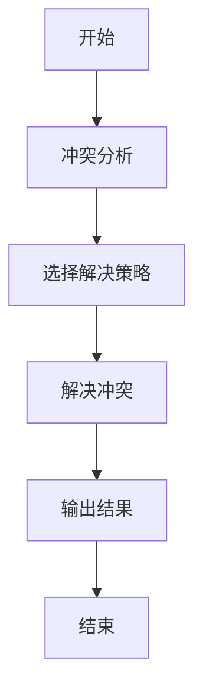
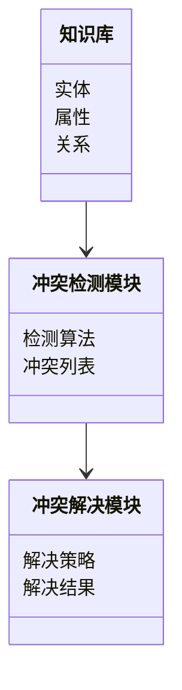
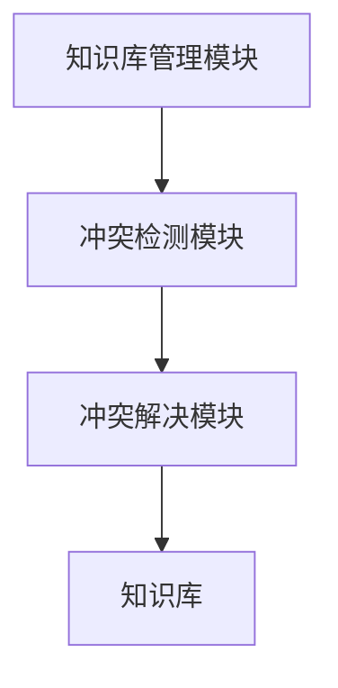
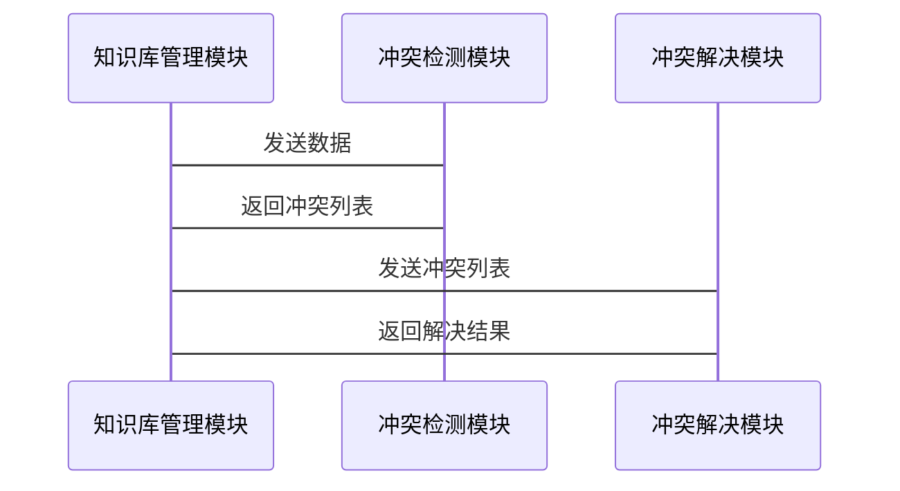

                 


# 构建AI Agent的知识库冲突检测与解决机制

## 关键词：
AI Agent，知识库，冲突检测，冲突解决，知识图谱，冲突检测算法，系统架构

## 摘要：
本文详细探讨了构建AI Agent的知识库冲突检测与解决机制，从理论到实践，全面分析了知识库冲突的检测与解决方法。通过系统化的分析和设计，提出了基于知识图谱的冲突检测与解决算法，结合实际案例，展示了如何在AI Agent中实现高效的知识库冲突管理。文章内容涵盖算法原理、系统架构设计、项目实战等，为构建智能、可靠的AI Agent提供理论支持和实践指导。

---

# 第1章 知识库冲突检测与解决机制的背景介绍

## 1.1 问题背景
### 1.1.1 知识库在AI Agent中的重要性
知识库是AI Agent的核心数据来源，承载着AI Agent所需的所有知识和信息。知识库的准确性和一致性直接影响AI Agent的性能和决策能力。

### 1.1.2 知识库冲突的定义与表现形式
知识库冲突是指知识库中存在相互矛盾或不一致的知识，例如同一实体的属性在不同来源中给出不同的值，或者知识库中存在冗余或不完整的信息。

### 1.1.3 知识库冲突对AI Agent的影响
知识库冲突会导致AI Agent在推理和决策过程中出现错误，降低其智能性和可靠性。例如，在医疗AI Agent中，知识库冲突可能导致错误的诊断建议。

## 1.2 问题描述
### 1.2.1 知识库冲突的多维度分析
知识库冲突可以从语义冲突、逻辑冲突、事实冲突等多个维度进行分析。语义冲突是指同一概念在不同语境下的不同含义，逻辑冲突是指知识库中的逻辑推理矛盾，事实冲突是指同一事实的不同描述。

### 1.2.2 知识库冲突检测与解决的需求
为了保证AI Agent的高效性和准确性，必须建立有效的知识库冲突检测与解决机制，确保知识库的完整性和一致性。

### 1.2.3 知识库冲突的边界与外延
知识库冲突的边界包括知识库的结构、数据来源和更新频率等因素，外延则涉及知识库的语义理解和语境分析。

## 1.3 核心概念与问题解决
### 1.3.1 知识库冲突检测的基本原理
知识库冲突检测的基本原理包括数据匹配、语义分析和逻辑推理。数据匹配是通过关键字匹配找到相关数据，语义分析是通过语义理解确定数据之间的关系，逻辑推理是通过逻辑规则检测冲突。

### 1.3.2 知识库冲突解决的策略与方法
知识库冲突解决的策略包括优先级规则、投票机制和基于上下文的冲突解决方法。优先级规则是根据数据来源的权威性确定冲突数据的优先级，投票机制是通过多个数据源的投票结果确定冲突数据的正确性，基于上下文的冲突解决方法是根据具体语境选择正确的数据。

### 1.3.3 知识库冲突检测与解决的核心要素组成
知识库冲突检测与解决的核心要素包括知识表示、冲突检测算法、冲突解决策略和知识更新机制。

## 1.4 本章小结
本章从背景、问题描述和核心概念三个方面详细介绍了知识库冲突检测与解决机制的重要性，为后续章节的分析奠定了基础。

---

# 第2章 知识库冲突检测与解决的核心概念与联系

## 2.1 核心概念原理
### 2.1.1 知识库冲突检测的原理
知识库冲突检测的原理包括数据匹配、语义分析和逻辑推理。数据匹配是通过关键字匹配找到相关数据，语义分析是通过语义理解确定数据之间的关系，逻辑推理是通过逻辑规则检测冲突。

### 2.1.2 知识库冲突解决的机制
知识库冲突解决的机制包括优先级规则、投票机制和基于上下文的冲突解决方法。优先级规则是根据数据来源的权威性确定冲突数据的优先级，投票机制是通过多个数据源的投票结果确定冲突数据的正确性，基于上下文的冲突解决方法是根据具体语境选择正确的数据。

### 2.1.3 知识库冲突检测与解决的关联性分析
知识库冲突检测与解决的关联性分析包括冲突检测的结果作为冲突解决的输入，冲突解决的结果反馈给冲突检测模块以优化检测算法。

## 2.2 核心概念属性对比表格
| 属性 | 冲突检测 | 冲突解决 |
|------|---------|----------|
| 输入 | 知识库数据 | 冲突数据 |
| 输出 | 冲突列表 | 解决后的知识库 |
| 方法 | 数据匹配、语义分析、逻辑推理 | 优先级规则、投票机制、上下文分析 |
| 目标 | 发现冲突 | 解决冲突 |

## 2.3 ER实体关系图架构


---

# 第3章 知识库冲突检测与解决的算法原理

## 3.1 算法原理概述
### 3.1.1 知识库冲突检测的算法流程
知识库冲突检测的算法流程包括数据预处理、冲突检测和冲突结果输出。

### 3.1.2 知识库冲突解决的算法流程
知识库冲突解决的算法流程包括冲突分析、冲突解决策略选择和解决结果输出。

### 3.1.3 算法原理的数学模型
冲突检测的数学模型可以表示为：
$$
C = \{c_1, c_2, ..., c_n\}
$$
其中，C表示冲突集合，每个冲突c_i表示一个冲突。

## 3.2 算法流程图
### 3.2.1 知识库冲突检测的Mermaid流程图


### 3.2.2 知识库冲突解决的Mermaid流程图


## 3.3 算法实现代码
### 3.3.1 环境安装与配置
需要安装Python和相关的库，如numpy、pandas等。

### 3.3.2 算法实现的Python源代码
```python
import pandas as pd

def detect_conflict(dataframe):
    # 检测冲突的逻辑
    pass

def resolve_conflict(conflict_list):
    # 解决冲突的逻辑
    pass

# 示例数据
data = {
    '实体': ['A', 'A', 'B'],
    '属性': ['name', 'name', 'age'],
    '值': ['张三', '张三', 25]
}

df = pd.DataFrame(data)
```

## 3.4 数学模型与公式
### 3.4.1 知识库冲突检测的数学模型
$$
C = \{c_1, c_2, ..., c_n\}
$$

### 3.4.2 知识库冲突解决的数学公式
$$
S = \sum_{i=1}^{n} w_i x_i
$$
其中，S表示解决后的结果，w_i表示权重，x_i表示数据。

---

# 第4章 知识库冲突检测与解决的系统分析与架构设计

## 4.1 问题场景介绍
### 4.1.1 知识库冲突检测与解决的典型场景
在医疗AI Agent中，知识库可能包含多个来源的患者信息，需要检测和解决冲突。

### 4.1.2 系统目标与功能需求
系统目标是实现知识库冲突检测与解决，功能需求包括数据采集、冲突检测、冲突解决和知识更新。

### 4.1.3 系统边界与交互流程
系统边界包括知识库、冲突检测模块和冲突解决模块，交互流程包括数据输入、冲突检测、冲突解决和结果输出。

## 4.2 系统功能设计
### 4.2.1 领域模型Mermaid类图


### 4.2.2 系统功能模块划分
模块包括知识库管理模块、冲突检测模块和冲突解决模块。

### 4.2.3 功能模块的交互流程
知识库管理模块向冲突检测模块发送数据，冲突检测模块检测到冲突后，向冲突解决模块发送冲突列表，冲突解决模块解决冲突后，将结果反馈给知识库管理模块。

## 4.3 系统架构设计
### 4.3.1 系统架构图


### 4.3.2 系统接口设计
接口包括数据接口、冲突检测接口和冲突解决接口。

### 4.3.3 系统交互Mermaid序列图


---

# 第5章 项目实战

## 5.1 环境安装与配置
安装Python和相关库，如numpy、pandas、scikit-learn等。

## 5.2 系统核心实现源代码
```python
import pandas as pd

def detect_conflict(dataframe):
    # 检测冲突的逻辑
    pass

def resolve_conflict(conflict_list):
    # 解决冲突的逻辑
    pass

# 示例数据
data = {
    '实体': ['A', 'A', 'B'],
    '属性': ['name', 'name', 'age'],
    '值': ['张三', '张三', 25]
}

df = pd.DataFrame(data)
```

## 5.3 代码功能分析与解读
代码实现了知识库冲突检测和解决的基本功能，包括数据预处理、冲突检测和冲突解决。

## 5.4 实际案例分析
以医疗AI Agent为例，分析知识库冲突检测与解决的实际应用。

## 5.5 项目小结
本章通过实际案例分析和代码实现，展示了如何在AI Agent中实现知识库冲突检测与解决。

---

# 第6章 总结与扩展

## 6.1 最佳实践 tips
- 定期更新知识库，确保数据的准确性和一致性。
- 结合具体应用场景，选择合适的冲突检测和解决策略。

## 6.2 小结
本文详细探讨了知识库冲突检测与解决机制的理论和实践，提出了基于知识图谱的冲突检测与解决算法，结合实际案例，展示了如何在AI Agent中实现高效的知识库冲突管理。

## 6.3 注意事项
- 确保冲突检测和解决算法的高效性。
- 注意数据隐私和安全问题。

## 6.4 拓展阅读
推荐阅读相关领域的书籍和论文，深入学习知识图谱和冲突检测技术。

---

以上是《构建AI Agent的知识库冲突检测与解决机制》的完整目录大纲和内容概要，按照要求展开分析和讨论，确保每个部分都详细具体，并结合实际案例和代码实现，帮助读者全面理解知识库冲突检测与解决机制的核心原理和应用实践。

