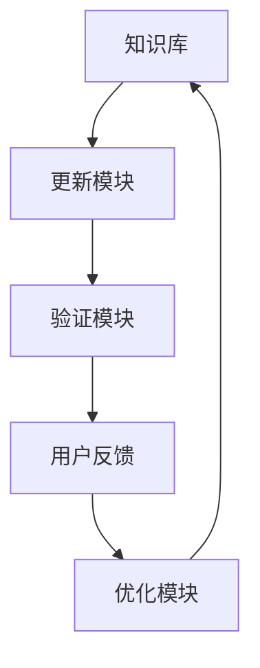
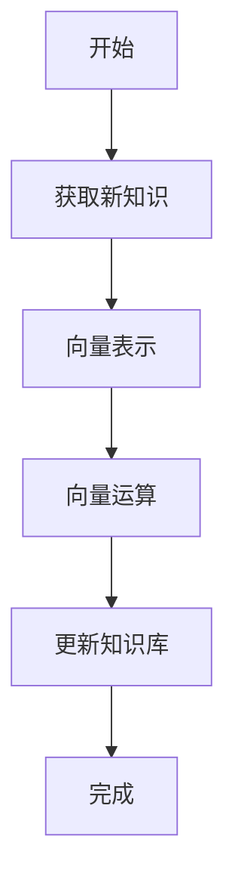
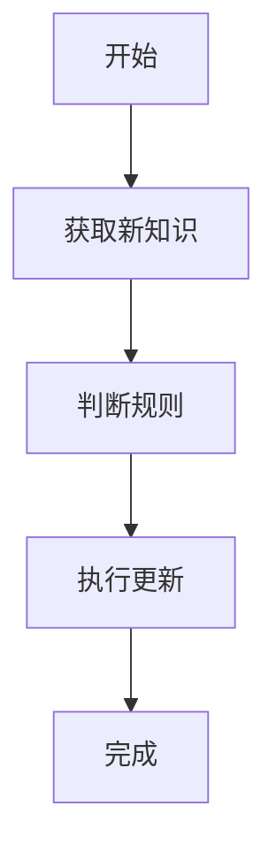
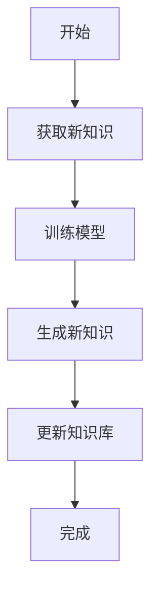
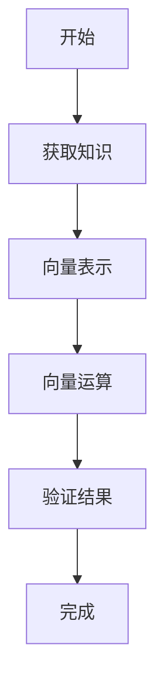
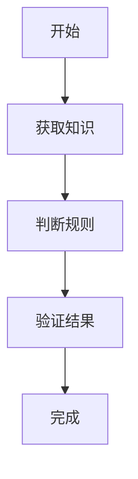
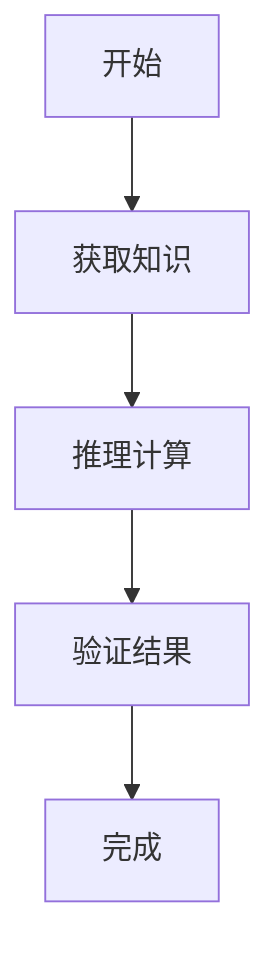
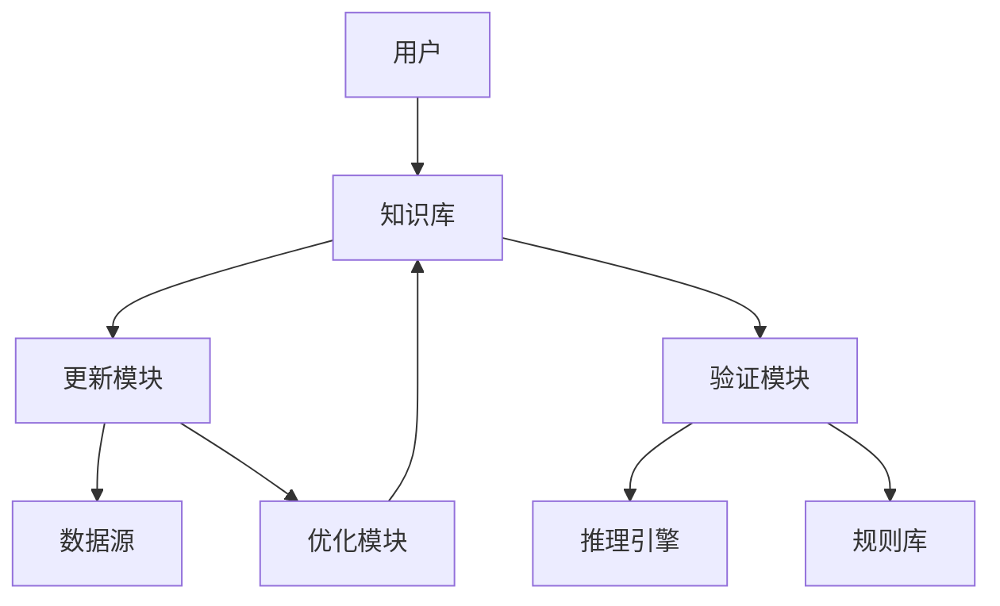
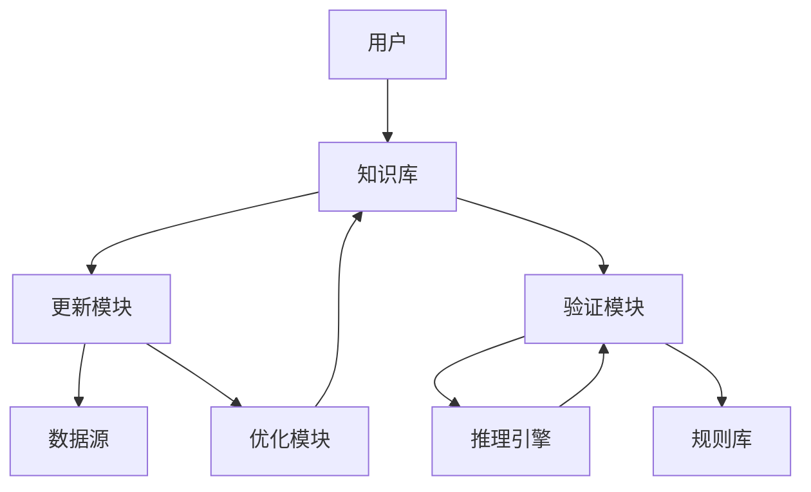

                 


# 《构建AI Agent的知识库更新与验证流程》

> **关键词**：AI Agent, 知识库更新, 知识库验证, 算法原理, 系统架构设计, 项目实战

> **摘要**：  
本文将详细探讨构建AI Agent的知识库更新与验证流程，从问题背景、核心概念、算法原理到系统架构设计，再到项目实战，全面解析如何高效地更新和验证AI Agent的知识库。通过具体案例分析和代码实现，为读者提供实践指导。

---

# 第1章: 背景介绍

## 1.1 问题背景

### 1.1.1 AI Agent的定义与特点  
AI Agent（人工智能代理）是指能够感知环境、自主决策并执行任务的智能体。它具备以下特点：  
- **自主性**：能够在没有外部干预的情况下自主运行。  
- **反应性**：能够实时感知环境并做出反应。  
- **目标导向**：以实现特定目标为导向进行决策。  
- **学习能力**：能够通过经验或数据优化自身性能。  

### 1.1.2 知识库在AI Agent中的作用  
知识库是AI Agent的核心组成部分，它存储了AI Agent所需的所有知识，包括事实、规则、经验等。知识库的作用如下：  
- **提供决策依据**：AI Agent通过查询知识库获取所需信息，做出决策。  
- **支持学习与优化**：知识库中的数据为AI Agent的学习和优化提供基础。  
- **实现知识共享**：知识库存储的知识可以被多个AI Agent共享和复用。  

### 1.1.3 知识库更新与验证的必要性  
知识库的更新与验证是确保AI Agent性能持续优化的关键环节。  
- **知识库更新**：随着环境的变化，知识库需要不断更新以保持准确性。  
- **知识库验证**：验证知识库的正确性，确保AI Agent在使用知识库时不会产生错误决策。  

## 1.2 问题描述

### 1.2.1 知识库更新的挑战  
知识库更新面临以下挑战：  
- **数据质量**：新数据可能存在噪声或不一致，影响知识库的准确性。  
- **更新效率**：大规模知识库的更新需要高效算法支持，否则会严重拖慢AI Agent的性能。  
- **版本控制**：知识库的更新需要进行版本管理，确保不同版本之间的兼容性。  

### 1.2.2 知识库验证的难点  
知识库验证的难点包括：  
- **验证标准**：如何定义知识库的正确性，是一个主观性很强的问题。  
- **验证效率**：大规模知识库的验证需要高效的方法和工具支持。  
- **动态验证**：环境动态变化，知识库的验证需要实时更新和调整。  

### 1.2.3 知识库更新与验证的边界与外延  
知识库的更新与验证需要明确其边界与外延：  
- **边界**：知识库更新和验证的范围，不包括数据源的选择和外部接口的设计。  
- **外延**：知识库更新和验证的结果将影响AI Agent的性能和用户体验。  

## 1.3 问题解决

### 1.3.1 知识库更新的解决方案  
知识库更新的解决方案包括：  
- **增量更新**：仅更新知识库中发生变化的部分，减少计算量。  
- **批量更新**：对知识库进行周期性批量更新，确保知识库的准确性。  
- **自适应更新**：根据环境变化自适应调整知识库的更新频率和内容。  

### 1.3.2 知识库验证的解决方案  
知识库验证的解决方案包括：  
- **基于规则的验证**：通过预定义的规则检查知识库的正确性。  
- **基于推理的验证**：利用推理算法验证知识库的逻辑一致性。  
- **基于反馈的验证**：通过用户反馈不断优化知识库的准确性。  

### 1.3.3 知识库更新与验证的核心要素  
知识库更新与验证的核心要素包括：  
- **数据源**：知识库的更新数据来源，包括结构化数据、非结构化数据等。  
- **更新策略**：知识库更新的规则和优先级，确保更新的高效性和准确性。  
- **验证方法**：知识库验证的具体方法和技术，确保知识库的正确性。  

## 1.4 本章小结  
本章从AI Agent的定义与特点出发，详细探讨了知识库在AI Agent中的作用，分析了知识库更新与验证的必要性，并提出了相关的解决方案。接下来的章节将深入探讨知识库更新与验证的核心概念与联系。

---

# 第2章: 核心概念与联系

## 2.1 核心概念原理

### 2.1.1 知识库更新的原理  
知识库更新的原理包括：  
- **数据预处理**：对新数据进行清洗、转换和格式化处理。  
- **知识融合**：将新数据与现有知识库进行融合，避免信息冗余和冲突。  
- **知识存储**：将更新后的知识存储到知识库中，确保知识库的完整性和一致性。  

### 2.1.2 知识库验证的原理  
知识库验证的原理包括：  
- **规则检查**：根据预定义的规则检查知识库的语法和语义正确性。  
- **逻辑推理**：利用推理算法验证知识库的逻辑一致性。  
- **事实校验**：通过外部数据源校验知识库中的事实准确性。  

### 2.1.3 更新与验证的协同关系  
知识库更新与验证是相互依存的过程：  
- **更新为验证提供基础**：只有高质量的更新数据才能为验证提供可靠的基础。  
- **验证指导更新**：通过验证结果不断优化知识库的更新策略和方法。  

## 2.2 核心概念对比

### 2.2.1 不同知识库更新机制的对比  
| 更新机制 | 描述 | 优缺点 |  
|----------|------|--------|  
| 增量更新 | 仅更新发生变化的部分 | 效率高，资源消耗少 |  
| 批量更新 | 周期性批量更新 | 稳定性高，适合大规模知识库 |  
| 自适应更新 | 根据环境变化自适应调整 | 灵活性强，适合动态环境 |  

### 2.2.2 不同知识库验证方法的对比  
| 验证方法 | 描述 | 优缺点 |  
|----------|------|--------|  
| 基于规则的验证 | 根据预定义规则验证知识库 | 简单易实现，但灵活性差 |  
| 基于推理的验证 | 利用推理算法验证知识库 | 准确性高，但计算复杂度高 |  
| 基于反馈的验证 | 根据用户反馈优化知识库 | 灵活性高，但依赖用户反馈 |  

### 2.2.3 更新与验证效率的对比分析  
| 更新与验证 | 描述 | 效率对比 |  
|------------|------|----------|  
| 增量更新+基于规则的验证 | 更新和验证效率均较高 | 效率高，适合小型知识库 |  
| 批量更新+基于推理的验证 | 更新效率低，验证效率高 | 适合大型知识库，但资源消耗大 |  
| 自适应更新+基于反馈的验证 | 更新和验证效率均较低 | 适合动态环境，但资源消耗大 |  

## 2.3 实体关系图  
以下是知识库更新与验证的实体关系图：  



## 2.4 本章小结  
本章通过对比分析不同知识库更新与验证机制，揭示了它们的优缺点和适用场景，并通过实体关系图展示了知识库更新与验证的协同关系。接下来的章节将深入探讨知识库更新与验证的算法原理和系统架构设计。

---

# 第3章: 算法原理讲解

## 3.1 知识库更新算法

### 3.1.1 基于向量空间模型的更新算法  
基于向量空间模型的更新算法是一种常用的向量空间更新方法。其核心思想是将知识库中的知识表示为向量，通过向量运算实现知识的更新。  

#### 3.1.1.1 算法流程图  


#### 3.1.1.2 算法实现代码  
```python
def update_vector_space(new_data, knowledge_base):
    # 将新数据转换为向量表示
    vector_new = vectorizer.transform([new_data])
    # 更新知识库的向量空间模型
    knowledge_base.vector_model += vector_new
    return knowledge_base
```

### 3.1.2 基于规则的更新算法  
基于规则的更新算法是一种通过预定义规则实现知识库更新的方法。其核心思想是根据预定义的规则，对新数据进行判断，决定是否需要更新知识库。  

#### 3.1.2.1 算法流程图  


#### 3.1.2.2 算法实现代码  
```python
def update_rule_based(new_data, knowledge_base):
    # 根据规则判断是否需要更新
    if satisfies_rule(new_data):
        knowledge_base.update(new_data)
    return knowledge_base
```

### 3.1.3 基于机器学习的更新算法  
基于机器学习的更新算法是一种通过机器学习模型实现知识库更新的方法。其核心思想是利用机器学习模型对新数据进行学习，生成新的知识表示，从而实现知识库的更新。  

#### 3.1.3.1 算法流程图  


#### 3.1.3.2 算法实现代码  
```python
def update_machine_learning(new_data, knowledge_base):
    # 训练机器学习模型
    model = train_model(new_data)
    # 生成新知识
    new_knowledge = generate_knowledge(model)
    # 更新知识库
    knowledge_base.update(new_knowledge)
    return knowledge_base
```

## 3.2 知识库验证算法

### 3.2.1 基于向量空间模型的验证算法  
基于向量空间模型的验证算法是一种通过向量空间模型验证知识库正确性的方法。其核心思想是利用向量运算验证知识库中知识的准确性。  

#### 3.2.1.1 算法流程图  


#### 3.2.1.2 算法实现代码  
```python
def validate_vector_space(knowledge_base):
    # 将知识库中的知识表示为向量
    vectors = vectorizer.transform(knowledge_base.data)
    # 计算向量相似度
    similarity = calculate_similarity(vectors)
    # 验证知识库的正确性
    if similarity < threshold:
        return "知识库存在错误"
    else:
        return "知识库正确"
```

### 3.2.2 基于规则的验证算法  
基于规则的验证算法是一种通过预定义规则验证知识库正确性的方法。其核心思想是根据预定义的规则，检查知识库中的知识是否符合要求。  

#### 3.2.2.1 算法流程图  


#### 3.2.2.2 算法实现代码  
```python
def validate_rule_based(knowledge_base):
    # 根据规则验证知识库
    for knowledge in knowledge_base.data:
        if not satisfies_rule(knowledge):
            return "知识库存在错误"
    return "知识库正确"
```

### 3.2.3 基于推理的验证算法  
基于推理的验证算法是一种通过推理算法验证知识库逻辑一致性的方法。其核心思想是利用推理算法验证知识库中的知识是否符合逻辑。  

#### 3.2.3.1 算法流程图  


#### 3.2.3.2 算法实现代码  
```python
def validate_reasoning(knowledge_base):
    # 使用推理算法验证知识库的逻辑一致性
    if is_consistent(knowledge_base.data):
        return "知识库正确"
    else:
        return "知识库存在错误"
```

## 3.3 算法的数学模型与公式

### 3.3.1 向量空间模型的更新与验证  
向量空间模型的更新与验证可以通过向量运算实现。假设知识库中的知识表示为向量$\vec{v}_i$，新数据表示为向量$\vec{v}_{new}$，则向量空间模型的更新可以表示为：  
$$
\vec{v}_{new} = \alpha \vec{v}_{new} + (1 - \alpha) \vec{v}_i
$$  
其中，$\alpha$ 是更新系数，$0 < \alpha \leq 1$。  

验证时，可以通过计算向量相似度来判断知识库的正确性：  
$$
\text{similarity} = \frac{\vec{v}_i \cdot \vec{v}_j}{\|\vec{v}_i\| \|\vec{v}_j\|}
$$  
其中，$\vec{v}_i$ 和 $\vec{v}_j$ 是知识库中的两个向量。  

### 3.3.2 基于规则的验证算法  
基于规则的验证算法可以通过预定义的规则集进行验证。假设规则集为$R = \{r_1, r_2, ..., r_n\}$，则知识库中的知识$k$需要满足所有规则$r_i$：  
$$
\forall r_i \in R, r_i(k) \text{ 为真}
$$  

### 3.3.3 基于推理的验证算法  
基于推理的验证算法可以通过逻辑推理验证知识库的逻辑一致性。假设知识库中的知识表示为逻辑公式$F$，则验证过程可以通过逻辑推理验证$F$的正确性：  
$$
\text{验证结果} = \text{推理}(F)
$$  
其中，$\text{推理}(\cdot)$ 是具体的推理算法，如演绎推理或归纳推理。  

## 3.4 本章小结  
本章详细讲解了知识库更新与验证的算法原理，包括基于向量空间模型、基于规则和基于机器学习的更新算法，以及基于向量空间模型、基于规则和基于推理的验证算法。接下来的章节将从系统架构设计的角度深入探讨知识库更新与验证的具体实现。

---

# 第4章: 系统分析与架构设计

## 4.1 问题场景介绍

### 4.1.1 问题场景描述  
知识库更新与验证系统需要解决以下问题：  
- 如何高效地更新知识库？  
- 如何准确地验证知识库的正确性？  
- 如何确保知识库更新与验证的高效性和准确性？  

### 4.1.2 系统目标  
系统的总体目标是：  
- 提供高效的知识库更新机制，确保知识库的准确性和完整性。  
- 提供准确的知识库验证方法，确保知识库的正确性和一致性。  
- 提供灵活的接口设计，支持多种知识库更新与验证场景。  

## 4.2 系统功能设计

### 4.2.1 领域模型  
以下是知识库更新与验证系统的领域模型：  

```mermaid
classDiagram
    class 知识库 {
        + 数据：Knowledge
        + 更新模块：Updater
        + 验证模块：Validator
        + 用户反馈：UserFeedback
    }
    classUpdater {
        + 更新策略：UpdateStrategy
        + 数据源：DataSource
    }
    class Validator {
        + 验证规则：ValidationRule
        + 推理引擎：ReasoningEngine
    }
    class UserFeedback {
        + 反馈数据：FeedbackData
        + 优化模块：Optimizer
    }
    知识库 -->Updater
    知识库 -->Validator
    知识库 -->UserFeedback
```

### 4.2.2 系统架构设计  
以下是知识库更新与验证系统的架构设计：  



### 4.2.3 系统接口设计  
知识库更新与验证系统的接口设计包括：  
- **更新接口**：提供更新知识库的API，支持多种更新策略。  
- **验证接口**：提供验证知识库的API，支持多种验证方法。  
- **反馈接口**：提供用户反馈的API，支持优化知识库的更新策略。  

### 4.2.4 系统交互设计  
以下是知识库更新与验证系统的交互设计：  



## 4.3 本章小结  
本章从系统架构设计的角度，详细探讨了知识库更新与验证系统的功能设计、架构设计和交互设计。接下来的章节将通过项目实战，展示如何具体实现知识库更新与验证系统。

---

# 第5章: 项目实战

## 5.1 环境安装

### 5.1.1 安装Python环境  
确保安装了Python 3.8或更高版本。  

### 5.1.2 安装相关依赖  
安装以下依赖：  
```bash
pip install numpy
pip install scikit-learn
pip install mermaid
```

## 5.2 系统核心实现

### 5.2.1 知识库更新模块实现  
以下是知识库更新模块的实现代码：  

```python
class KnowledgeBaseUpdater:
    def __init__(self, knowledge_base):
        self.knowledge_base = knowledge_base
        self.strategy = self.default_update_strategy()

    def default_update_strategy(self):
        return IncrementalUpdateStrategy()

    def update(self, new_data):
        self.strategy.update(self.knowledge_base, new_data)
```

### 5.2.2 知识库验证模块实现  
以下是知识库验证模块的实现代码：  

```python
class KnowledgeBaseValidator:
    def __init__(self, knowledge_base):
        self.knowledge_base = knowledge_base
        self.rule_set = self.default_validation_rules()

    def default_validation_rules(self):
        return [self.rule1, self.rule2, ...]

    def validate(self):
        for knowledge in self.knowledge_base.data:
            if not self.apply_rules(knowledge):
                return False
        return True

    def apply_rules(self, knowledge):
        for rule in self.rule_set:
            if not rule(knowledge):
                return False
        return True
```

### 5.2.3 算法实现代码  
以下是向量空间模型的更新与验证算法实现代码：  

```python
class VectorSpaceUpdater:
    def update(self, knowledge_base, new_data):
        vectorizer = TfidfVectorizer()
        new_vectors = vectorizer.fit_transform([new_data])
        knowledge_base.vector_model = new_vectors

class VectorSpaceValidator:
    def validate(self, knowledge_base):
        similarity = cosine_similarity(knowledge_base.vector_model)
        if similarity < threshold:
            return False
        return True
```

## 5.3 代码应用解读与分析  
通过上述代码，我们可以看到知识库更新与验证系统的实现细节。更新模块负责将新数据转换为向量表示，并更新知识库的向量模型；验证模块负责根据预定义的规则或推理算法验证知识库的正确性。  

## 5.4 案例分析与详细讲解  
以下是一个具体的案例分析：  
假设我们有一个医疗AI Agent的知识库，包含疾病症状、治疗方法等知识。我们需要定期更新知识库，以反映最新的医学研究成果。更新模块将从医学数据库中获取新数据，并通过向量空间模型更新知识库。验证模块将通过预定义的规则和推理算法验证知识库的正确性，确保AI Agent在使用知识库时不会产生错误决策。  

## 5.5 本章小结  
本章通过具体的代码实现和案例分析，展示了如何将知识库更新与验证算法应用于实际项目中。接下来的章节将总结知识库更新与验证的最佳实践和未来发展方向。

---

# 第6章: 最佳实践与未来展望

## 6.1 最佳实践

### 6.1.1 知识库更新的最佳实践  
- **选择合适的更新策略**：根据知识库的规模和更新频率选择增量更新或批量更新。  
- **确保数据质量**：对新数据进行清洗和格式化处理，避免噪声数据影响知识库的准确性。  
- **合理配置更新频率**：根据知识库的使用场景合理配置更新频率，确保知识库的及时性和准确性。  

### 6.1.2 知识库验证的最佳实践  
- **制定合理的验证规则**：根据知识库的内容和使用场景制定合理的验证规则。  
- **结合多种验证方法**：结合基于规则和基于推理的验证方法，确保知识库的正确性。  
- **及时处理验证结果**：根据验证结果不断优化知识库的更新策略和内容。  

## 6.2 未来展望  
随着AI技术的不断发展，知识库更新与验证技术也将不断进步。未来的发展方向包括：  
- **智能化更新**：利用机器学习和深度学习技术实现知识库的智能化更新。  
- **自适应验证**：根据环境变化自适应调整知识库的验证策略和方法。  
- **多模态知识库**：支持多模态数据的知识库，如文本、图像、语音等，提升知识库的丰富性和准确性。  

## 6.3 本章小结  
本章总结了知识库更新与验证的最佳实践，并展望了未来的发展方向。希望读者能够根据本文的指导，在实际项目中不断优化知识库的更新与验证流程。

---

# 附录

## 附录A: 术语表  
- **AI Agent**：人工智能代理，能够感知环境、自主决策并执行任务的智能体。  
- **知识库**：存储AI Agent所需知识的数据库，包括事实、规则、经验等。  
- **更新策略**：知识库更新的具体规则和优先级，确保更新的高效性和准确性。  
- **验证规则**：知识库验证的具体规则和标准，确保知识库的正确性和一致性。  

## 附录B: 工具与技术  
- **Python**：用于实现知识库更新与验证的编程语言。  
- **scikit-learn**：用于实现向量空间模型和机器学习算法的库。  
- **Mermaid**：用于绘制系统架构图和流程图的工具。  

## 附录C: 参考文献  
- [1] 《机器学习实战》, 周志华  
- [2] 《深度学习》, Ian Goodfellow  
- [3] 《人工智能: 知识系统构建与应用》, 张钹  

---

# 结语  
本文从知识库更新与验证的背景、核心概念、算法原理到系统架构设计，再到项目实战和未来展望，全面探讨了构建AI Agent的知识库更新与验证流程。希望读者能够通过本文的指导，更好地理解和实现知识库的更新与验证，推动AI技术的发展。

