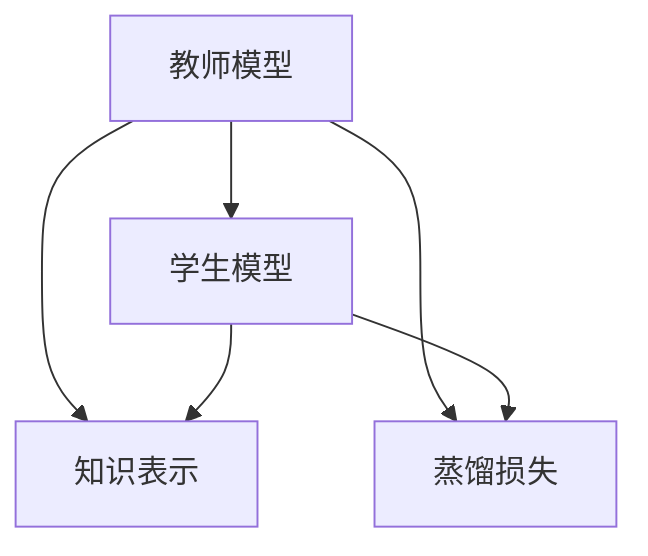
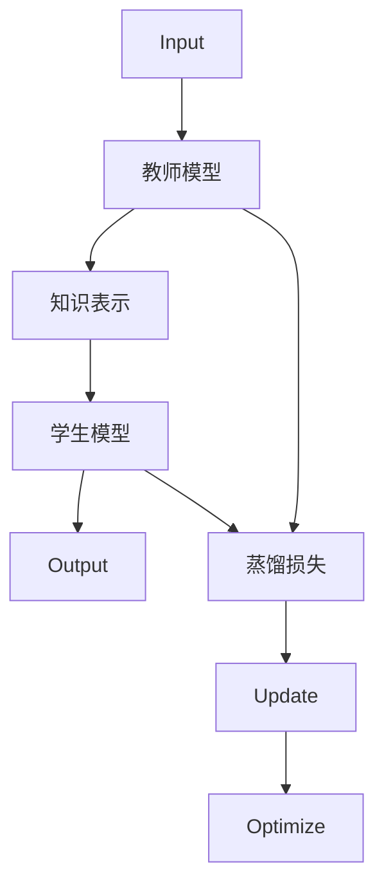
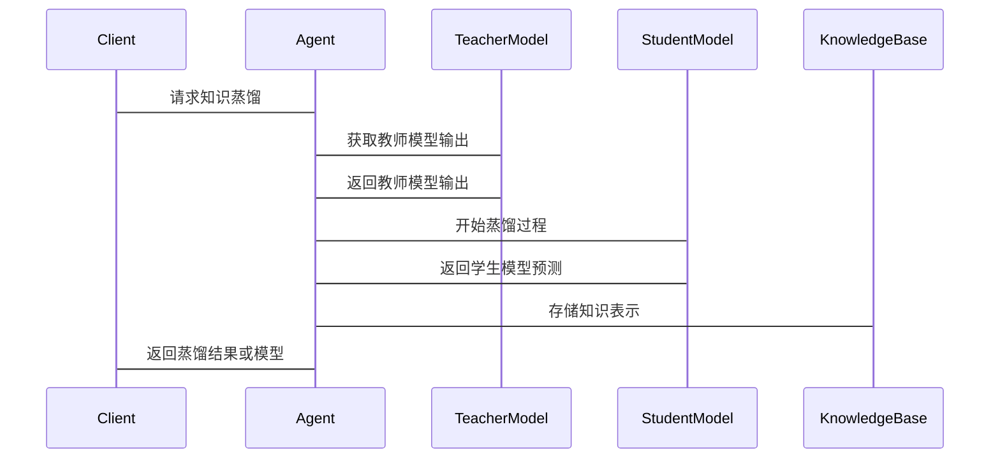

                 


# 构建AI Agent的知识蒸馏Pipeline

## 关键词
- 知识蒸馏、AI Agent、机器学习、Pipeline、算法原理

## 摘要
知识蒸馏是一种有效的模型压缩技术，通过将大型模型的知识迁移到较小模型中，提升小模型的性能。本文将详细探讨如何构建AI Agent的知识蒸馏Pipeline，涵盖知识蒸馏的基本概念、算法原理、系统架构设计以及项目实战，帮助读者全面理解并掌握这一技术。

---

## 第一部分：知识蒸馏与AI Agent的背景介绍

### 第1章：知识蒸馏的基本概念

#### 1.1 知识蒸馏的定义与技术背景
- **知识蒸馏的定义**：知识蒸馏是一种将大型模型的知识迁移到较小模型的技术，通过教师模型和学生模型的交互，提取教师模型的决策边界并传递给学生模型。
- **技术背景**：随着深度学习模型的复杂度增加，模型的训练和部署成本也急剧上升，知识蒸馏作为一种模型压缩技术，能够在保持模型性能的同时，显著降低计算和存储成本。
- **核心目标**：通过蒸馏过程，使小模型在特定任务上达到与大模型相近甚至相同的性能。

#### 1.2 AI Agent的基本概念
- **AI Agent的定义**：AI Agent是一种能够感知环境、执行任务并做出决策的智能体，广泛应用于自动驾驶、智能助手、机器人等领域。
- **AI Agent的类型**：基于智能体的智能程度，可以分为简单反射型智能体、基于模型的反应型智能体、基于目标的智能体和基于效用的智能体。
- **AI Agent的应用场景**：包括自动驾驶、智能客服、智能推荐系统等，这些场景中AI Agent需要实时处理复杂任务并做出高效决策。

#### 1.3 知识蒸馏在AI Agent中的作用
- **性能提升**：通过知识蒸馏，AI Agent可以在资源受限的环境下保持高性能，例如在移动设备或边缘计算环境中。
- **任务适应性**：蒸馏后的模型能够更好地适应特定任务的需求，减少对大量计算资源的依赖。
- **模型轻量化**：通过蒸馏，AI Agent可以运行在低功耗、低计算能力的设备上，扩大应用场景。

### 第2章：知识蒸馏的核心概念与联系

#### 2.1 知识蒸馏的核心原理
- **蒸馏过程**：知识蒸馏的核心是通过教师模型（大型复杂模型）生成的中间表示或概率分布，指导学生模型（小型简单模型）进行学习。
- **知识表示**：教师模型通过输出概率分布或中间特征，将知识传递给学生模型。
- **蒸馏损失函数**：定义学生模型预测与教师模型预测之间的差异，通过优化该损失函数，使学生模型逼近教师模型的性能。

#### 2.2 知识蒸馏与相关技术的对比
- **与模型压缩的对比**：
  - 知识蒸馏关注知识的迁移，而模型压缩关注减少模型的参数数量。
  - 知识蒸馏通常需要教师模型的辅助，而模型压缩可以独立进行。
- **与模型蒸馏的对比**：模型蒸馏是知识蒸馏的一种形式，通常指通过蒸馏技术直接从教师模型中提取知识。
- **与知识表示的对比**：知识表示关注如何有效地表示知识，而知识蒸馏关注如何将知识迁移到小模型中。

#### 2.3 知识蒸馏的ER实体关系图


### 第3章：知识蒸馏的算法原理

#### 3.1 知识蒸馏的数学模型
- **教师模型的输出**：教师模型对输入样本的预测结果为概率分布$P_{\theta}(y|x)$。
- **学生模型的输出**：学生模型对同一输入样本的预测结果为概率分布$P_{\phi}(y|x)$。
- **蒸馏损失函数**：定义为教师模型和学生模型输出之间的KL散度：
  $$L_{distill} = \text{KL}(P_{\theta}(y|x) || P_{\phi}(y|x))$$
- **总体损失函数**：结合蒸馏损失和原始任务损失：
  $$L = \alpha L_{distill} + (1-\alpha)L_{task}$$
  其中$\alpha$是蒸馏损失的权重，$L_{task}$是任务损失。

#### 3.2 知识蒸馏的算法流程


#### 3.3 知识蒸馏的Python实现
```python
import torch
import torch.nn as nn
import torch.optim as optim

class TeacherModel(nn.Module):
    def __init__(self):
        super(TeacherModel, self).__init__()
        # 定义教师模型的网络结构

    def forward(self, x):
        return self.teacher_layer(x)

class StudentModel(nn.Module):
    def __init__(self):
        super(StudentModel, self).__init__()
        # 定义学生模型的网络结构

    def forward(self, x):
        return self.student_layer(x)

def distillation_loss_fn(output, teacher_output, alpha=0.5, T=3):
    # 知识蒸馏损失函数
    criterion = nn.KLDivLoss(reduction='batchmean')
    loss = criterion(torch.log(F.softmax(output, dim=1)), F.softmax(teacher_output, dim=1))
    return alpha * loss

def train(model, teacher_model, dataloader, optimizer, scheduler, epochs=100):
    for epoch in range(epochs):
        for batch, (x, y) in enumerate(dataloader):
            # 前向传播
            output = model(x)
            teacher_output = teacher_model(x)
            # 计算蒸馏损失
            loss = distillation_loss_fn(output, teacher_output)
            # 反向传播与优化
            optimizer.zero_grad()
            loss.backward()
            optimizer.step()
        scheduler.step()
```

---

## 第二部分：知识蒸馏的系统分析与架构设计

### 第4章：系统分析与架构设计方案

#### 4.1 问题场景介绍
- **需求分析**：构建一个高效的知识蒸馏Pipeline，支持AI Agent在资源受限环境下的高性能推理。
- **项目介绍**：设计一个知识蒸馏系统，用于将复杂模型的知识迁移到轻量级模型中。

#### 4.2 系统功能设计
- **领域模型**：
  ```mermaid
  classDiagram
  class Agent {
      - id: int
      - name: str
      - model: Model
      - tasks: List<Task>
  }
  class Model {
      - params: dict
      - forward: method
  }
  class Task {
      - id: int
      - name: str
      - function: method
  }
  Agent --> Model
  Agent --> Task
  ```

- **系统架构设计**：
  ```mermaid
  architectureDiagram
  Client ---(知识蒸馏请求)--> Agent
  Agent ---(教师模型)--> TeacherModel
  Agent ---(蒸馏过程)--> StudentModel
  Agent ---(知识表示)--> KnowledgeBase
  ```

#### 4.3 系统接口设计
- **输入接口**：接收教师模型的输出和学生模型的预测结果。
- **输出接口**：输出蒸馏后的模型或模型性能评估结果。

#### 4.4 系统交互设计


---

## 第三部分：知识蒸馏的项目实战

### 第5章：知识蒸馏的项目实战

#### 5.1 环境安装与配置
- **Python环境**：建议使用Anaconda或virtualenv管理环境。
- **依赖库安装**：`pip install torch numpy matplotlib`

#### 5.2 系统核心实现
```python
import torch
import torch.nn as nn
import torch.optim as optim

class Distiller:
    def __init__(self, teacher_model, student_model, optimizer, scheduler, device='cuda'):
        self.teacher = teacher_model
        self.student = student_model
        self.optimizer = optimizer
        self.scheduler = scheduler
        self.device = device

    def train(self, dataloader, epochs=100):
        for epoch in range(epochs):
            for batch, (x, y) in enumerate(dataloader):
                x = x.to(self.device)
                y = y.to(self.device)
                # 前向传播
                with torch.no_grad():
                    teacher_output = self.teacher(x)
                student_output = self.student(x)
                # 计算蒸馏损失
                loss = self.distillation_loss(teacher_output, student_output)
                # 反向传播与优化
                self.optimizer.zero_grad()
                loss.backward()
                self.optimizer.step()
            self.scheduler.step()

    def distillation_loss(self, teacher_output, student_output):
        criterion = nn.KLDivLoss(reduction='batchmean')
        loss = criterion(torch.log(F.softmax(student_output, dim=1)), F.softmax(teacher_output, dim=1))
        return loss
```

#### 5.3 代码实现与解读
- **教师模型与学生模型的定义**：教师模型是一个复杂的深度学习模型，学生模型是一个轻量级模型。
- **蒸馏过程的实现**：通过优化蒸馏损失函数，使学生模型逼近教师模型的性能。
- **性能评估**：在测试集上评估蒸馏后模型的准确率和计算效率。

#### 5.4 实际案例分析
- **案例背景**：假设我们有一个图像分类任务，教师模型是一个大型卷积神经网络（如ResNet-50），学生模型是一个轻量级的MobileNet。
- **蒸馏过程**：通过多次迭代优化，使MobileNet在图像分类任务上的准确率达到与ResNet-50相近的水平，同时显著降低计算资源需求。

#### 5.5 项目总结与优化建议
- **总结**：通过知识蒸馏，成功将教师模型的知识迁移到学生模型中，显著提升了学生模型的性能。
- **优化建议**：可以结合模型剪枝、量化等技术进一步优化模型，同时探索更高效的蒸馏策略。

---

## 第四部分：知识蒸馏的总结与展望

### 第6章：总结与展望

#### 6.1 总结
- **核心内容回顾**：本文详细介绍了知识蒸馏的基本概念、算法原理、系统架构设计以及项目实战，帮助读者全面理解知识蒸馏技术。
- **关键点总结**：
  - 知识蒸馏是一种有效的模型压缩技术，能够将大型模型的知识迁移到小模型中。
  - 在AI Agent中，知识蒸馏可以提升模型的性能和计算效率，扩大应用场景。
  - 通过系统化的Pipeline设计，可以高效地实现知识蒸馏过程。

#### 6.2 未来展望
- **研究方向**：
  - 探索更高效的蒸馏算法，如自适应蒸馏、动态蒸馏等。
  - 研究知识蒸馏在多模态模型中的应用。
  - 结合边缘计算和物联网技术，进一步扩展知识蒸馏的应用场景。
- **技术趋势**：随着AI技术的不断发展，知识蒸馏将在更多领域得到应用，成为模型优化的重要工具。

---

通过以上目录结构，我们可以看到《构建AI Agent的知识蒸馏Pipeline》一书内容丰富，涵盖了从理论到实践的各个方面，帮助读者全面理解和掌握知识蒸馏技术。

