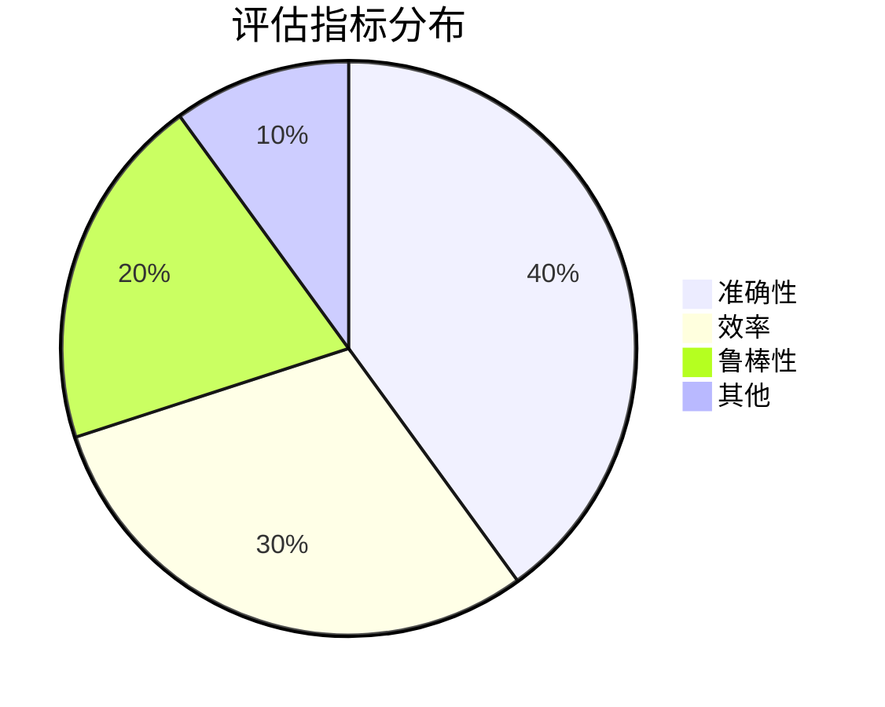
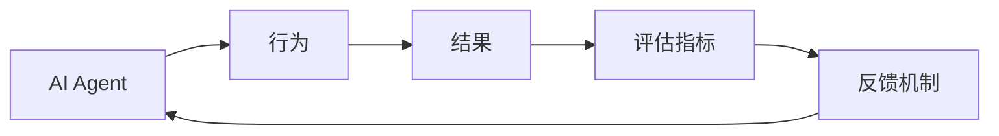
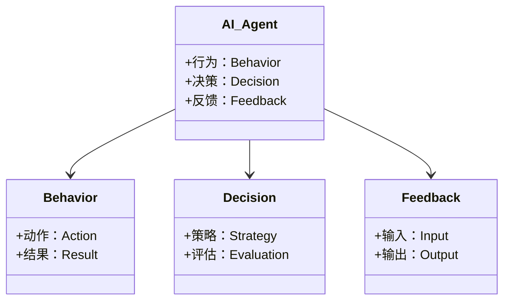
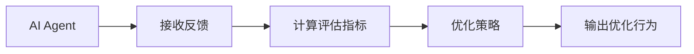
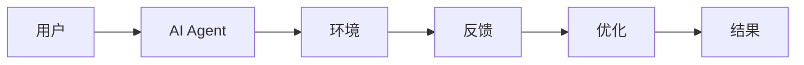

                 


# 构建AI Agent的自我评估机制：持续改进性能

## 关键词：AI Agent, 自我评估机制, 持续改进, 优化算法, 反馈机制

## 摘要：  
AI Agent的自我评估机制是实现智能化系统持续改进的核心技术。本文从AI Agent的基本概念出发，深入探讨自我评估机制的核心原理、算法实现、系统架构设计及实际应用案例。通过理论分析与实践结合，为读者提供构建高效AI Agent自我评估机制的方法论和工具支持。

---

# 第1章: AI Agent与自我评估机制的背景介绍

## 1.1 AI Agent的基本概念

### 1.1.1 AI Agent的定义与特点  
AI Agent（人工智能代理）是指能够感知环境、自主决策并执行任务的智能体。它具备以下特点：  
- **自主性**：无需外部干预，自主完成任务。  
- **反应性**：能够实时感知环境并做出响应。  
- **目标导向性**：以明确的目标为导向，优化行为。  

### 1.1.2 自我评估机制的必要性  
AI Agent需要在动态环境中持续优化性能，而自我评估机制是其实现这一目标的核心能力。通过自我评估，AI Agent能够：  
- 检测性能瓶颈。  
- 发现行为偏差。  
- 调整策略以适应环境变化。  

### 1.1.3 问题背景与目标设定  
在实际应用中，AI Agent可能面临以下问题：  
- **环境不确定性**：动态环境可能导致决策失误。  
- **任务复杂性**：复杂任务需要多目标优化。  
- **性能退化**：长期运行可能导致性能下降。  

目标设定：通过构建自我评估机制，确保AI Agent能够：  
1. 实时监控性能。  
2. 分析行为偏差。  
3. 自动优化策略。  

## 1.2 自我评估机制的核心概念  

### 1.2.1 自我评估的定义与范围  
自我评估机制是指AI Agent通过内部或外部反馈，对其行为、决策和性能进行分析、判断并优化的过程。其范围包括：  
- **行为评估**：对AI Agent的行为进行分析和评分。  
- **决策评估**：对决策过程进行验证和优化。  
- **性能评估**：对整体性能进行量化评估。  

### 1.2.2 评估指标与评估标准  
常用的评估指标包括：  
- **准确性**：决策的正确性。  
- **效率**：完成任务的速度。  
- **鲁棒性**：应对环境变化的能力。  

评估标准：  
- **定性评估**：基于主观判断的评估。  
- **定量评估**：基于数据和指标的评估。  

### 1.2.3 边界与外延  
- **边界**：自我评估机制仅关注AI Agent的行为和决策，不涉及外部系统的优化。  
- **外延**：自我评估机制可以与其他优化算法结合使用，如强化学习、遗传算法等。  

## 1.3 核心要素与组成结构  

### 1.3.1 AI Agent的行为模型  
AI Agent的行为模型包括：  
- **感知层**：通过传感器或数据输入感知环境。  
- **决策层**：基于感知信息做出决策。  
- **执行层**：将决策转化为具体行动。  

### 1.3.2 自我评估机制的模块划分  
自我评估机制通常包括以下模块：  
- **反馈采集模块**：收集行为结果和环境反馈。  
- **评估指标模块**：定义评估指标并计算评估结果。  
- **优化策略模块**：根据评估结果调整行为策略。  

### 1.3.3 机制与目标的关系  
- **直接关系**：评估机制直接为优化目标服务。  
- **间接关系**：通过中间步骤间接影响目标的实现。  

## 1.4 本章小结  
本章介绍了AI Agent的基本概念、自我评估机制的必要性及其核心要素。通过分析问题背景和目标设定，为后续章节的深入讨论奠定了基础。

---

# 第2章: 自我评估机制的核心概念与联系

## 2.1 核心概念的原理分析  

### 2.1.1 反馈机制的作用  
反馈机制是自我评估的核心，它通过以下方式发挥作用：  
- **实时反馈**：帮助AI Agent快速调整行为。  
- **延迟反馈**：用于长期行为优化。  

### 2.1.2 优化算法的实现方式  
常用的优化算法包括：  
- **梯度下降**：通过调整参数优化目标函数。  
- **强化学习**：通过奖励机制优化策略。  
- **遗传算法**：通过模拟进化优化解。  

### 2.1.3 多目标评估的平衡策略  
在多目标优化中，可以通过以下方式实现平衡：  
- **加权和法**：将多个目标转化为一个加权和。  
- **分层优化**：优先优化关键目标，再优化次要目标。  

## 2.2 核心概念的属性特征对比  

### 2.2.1 表格对比：评估指标与评估方法  
| 评估指标 | 评估方法 | 优点 | 缺点 |
|----------|----------|------|------|
| 准确性   | 精准率   | 客观 | 计算复杂 |
| 效率     | 响应时间 | 易量 化 | 易受环境影响 |  

### 2.2.2 图表分析：评估结果的可视化  
以下为评估结果的可视化图表：  


## 2.3 实体关系图  

### 2.3.1 实体关系图  
以下为自我评估机制的实体关系图：  


## 2.4 本章小结  
本章通过对比分析和图表展示，进一步明确了自我评估机制的核心概念及其在实际应用中的作用。

---

# 第3章: 自我评估机制的算法原理

## 3.1 算法原理概述  

### 3.1.1 基于反馈的优化算法  
- **基本原理**：通过反馈信号调整参数，优化目标函数。  
- **数学模型**：  
$$ J = \sum_{i=1}^{n} (y_i - \hat{y_i})^2 $$
其中，\( J \) 为目标函数，\( y_i \) 为实际值，\( \hat{y_i} \) 为预测值。  

### 3.1.2 基于强化学习的评估方法  
- **基本原理**：通过奖励机制优化策略。  
- **数学模型**：  
$$ R = \sum_{t=1}^{T} r_t $$
其中，\( R \) 为总奖励，\( r_t \) 为时间 \( t \) 的奖励值。  

### 3.1.3 基于监督学习的评估策略  
- **基本原理**：通过标注数据训练模型，优化评估指标。  
- **数学模型**：  
$$ L = \sum_{i=1}^{n} (y_i - f(x_i))^2 $$
其中，\( L \) 为损失函数，\( f(x_i) \) 为模型预测值。  

## 3.2 算法流程图  

### 3.2.1 算法流程图  
以下为基于反馈的优化算法流程图：  


## 3.3 算法实现  

### 3.3.1 Python源代码实现  
以下为基于反馈的优化算法的Python代码示例：  
```python
import numpy as np

def evaluate_behavior(feedback):
    # 计算评估指标
    accuracy = np.mean(feedback['accuracy'])
    efficiency = np.mean(feedback['efficiency'])
    robustness = np.mean(feedback['robustness'])
    return accuracy, efficiency, robustness

def optimize_behavior(current_behavior, target_behavior):
    # 调整行为策略
    delta = target_behavior - current_behavior
    current_behavior += delta * 0.1
    return current_behavior

# 示例使用
feedback = {
    'accuracy': [0.8, 0.9, 0.7],
    'efficiency': [0.6, 0.7, 0.5],
    'robustness': [0.9, 0.8, 0.8]
}

accuracy, efficiency, robustness = evaluate_behavior(feedback)
print(f"评估结果：准确性={accuracy}, 效率={efficiency}, 鲁棒性={robustness}")
current_behavior = np.array([0.5, 0.5, 0.5])
target_behavior = np.array([0.7, 0.8, 0.6])
optimized_behavior = optimize_behavior(current_behavior, target_behavior)
print(f"优化后行为：{optimized_behavior}")
```

### 3.3.2 算法原理的数学公式  
以下为优化算法的数学公式：  
$$ x_{t+1} = x_t + \alpha (x_t - x_{t-1}) $$
其中，\( \alpha \) 为学习率，\( x_t \) 为当前参数，\( x_{t-1} \) 为上一次参数。  

## 3.4 本章小结  
本章通过数学公式和代码实现，详细讲解了自我评估机制的算法原理及其实际应用。

---

# 第4章: 自我评估机制的系统分析与架构设计

## 4.1 问题场景介绍  

### 4.1.1 系统目标  
设计一个AI Agent的自我评估机制，实现以下目标：  
1. 实时监控AI Agent的行为。  
2. 分析行为偏差并优化策略。  

### 4.1.2 项目介绍  
本项目旨在构建一个通用的AI Agent自我评估框架，支持多种评估指标和优化算法。

## 4.2 系统功能设计  

### 4.2.1 领域模型类图  
以下为系统领域模型类图：  


### 4.2.2 系统架构图  
以下为系统架构图：  


## 4.3 系统接口设计  

### 4.3.1 接口定义  
- **输入接口**：接收环境反馈和行为结果。  
- **输出接口**：输出优化后的行为策略。  

### 4.3.2 接口交互流程图  


## 4.4 系统交互设计  

### 4.4.1 交互流程图  


## 4.5 本章小结  
本章通过系统架构设计和交互流程图，展示了自我评估机制在实际系统中的应用。

---

# 第5章: 自我评估机制的项目实战

## 5.1 环境安装  

### 5.1.1 安装Python  
确保安装Python 3.8或更高版本。  

### 5.1.2 安装依赖库  
安装以下依赖库：  
- `numpy`  
- `matplotlib`  
- `scikit-learn`  

## 5.2 系统核心实现  

### 5.2.1 核心代码实现  
以下为系统核心代码实现：  
```python
import numpy as np
import matplotlib.pyplot as plt

class AI_Agent:
    def __init__(self):
        self.current_behavior = np.array([0.5, 0.5, 0.5])
    
    def evaluate(self, feedback):
        # 计算评估指标
        accuracy = np.mean(feedback['accuracy'])
        efficiency = np.mean(feedback['efficiency'])
        robustness = np.mean(feedback['robustness'])
        return accuracy, efficiency, robustness
    
    def optimize(self, target_behavior):
        # 调整行为策略
        delta = target_behavior - self.current_behavior
        self.current_behavior += delta * 0.1
        return self.current_behavior

# 示例使用
agent = AI_Agent()
target_behavior = np.array([0.7, 0.8, 0.6])
optimized_behavior = agent.optimize(target_behavior)
print(f"优化后行为：{optimized_behavior}")

# 可视化评估结果
feedback = {
    'accuracy': [0.8, 0.9, 0.7],
    'efficiency': [0.6, 0.7, 0.5],
    'robustness': [0.9, 0.8, 0.8]
}
accuracy, efficiency, robustness = agent.evaluate(feedback)
print(f"评估结果：准确性={accuracy}, 效率={efficiency}, 鲁棒性={robustness}")
plt.bar(['准确性', '效率', '鲁棒性'], [accuracy, efficiency, robustness])
plt.show()
```

### 5.2.2 代码解读与分析  
- **类定义**：`AI_Agent`类包含行为评估和优化方法。  
- **评估方法**：`evaluate`方法计算评估指标。  
- **优化方法**：`optimize`方法调整行为策略。  
- **可视化**：使用`matplotlib`绘制评估结果的柱状图。  

## 5.3 实际案例分析  

### 5.3.1 案例背景  
以智能客服系统为例，AI Agent需要实时评估其回答的准确性和效率。  

### 5.3.2 案例实现  
以下为案例实现代码：  
```python
# 示例：智能客服系统的自我评估
class Customer_Service_Agent(AI_Agent):
    def __init__(self):
        super().__init__()
        self.current_behavior = np.array([0.6, 0.6, 0.6])  # 初始化行为参数

    def evaluate_customer_service(self, feedback):
        # 评估客户服务质量
        customer_satisfaction = np.mean(feedback['customer_satisfaction'])
        response_time = np.mean(feedback['response_time'])
        return customer_satisfaction, response_time

# 示例使用
agent = Customer_Service_Agent()
target_behavior = np.array([0.8, 0.8, 0.8])
optimized_behavior = agent.optimize(target_behavior)
print(f"优化后行为：{optimized_behavior}")

feedback = {
    'customer_satisfaction': [0.8, 0.9, 0.7],
    'response_time': [2.0, 1.8, 2.2]
}
customer_satisfaction, response_time = agent.evaluate_customer_service(feedback)
print(f"评估结果：客户满意度={customer_satisfaction}, 响应时间={response_time}")
plt.bar(['客户满意度', '响应时间'], [customer_satisfaction, response_time])
plt.show()
```

## 5.4 本章小结  
本章通过实际案例展示了自我评估机制的实现过程，包括环境安装、代码实现和案例分析。

---

# 第6章: 自我评估机制的最佳实践与小结

## 6.1 最佳实践  

### 6.1.1 选择合适的评估指标  
根据具体场景选择合适的评估指标，避免使用不相关的指标。  

### 6.1.2 定期更新评估策略  
随着环境变化，及时更新评估策略以保持评估的有效性。  

### 6.1.3 处理常见问题  
- **过拟合**：通过正则化方法避免过拟合。  
- **数据稀疏性**：通过数据增强方法缓解数据稀疏性。  

## 6.2 小结  

### 6.2.1 全文总结  
本文详细介绍了AI Agent自我评估机制的构建过程，包括背景介绍、核心概念、算法原理、系统架构设计和实际应用案例。通过理论分析与实践结合，为读者提供了一套完整的构建方法论。

### 6.2.2 注意事项  
- 确保评估指标的合理性。  
- 定期监控和优化评估机制。  

## 6.3 拓展阅读  

### 6.3.1 相关领域  
- **强化学习**：进一步优化评估策略。  
- **分布式系统**：在分布式环境中实现自我评估机制。  

## 6.4 本章小结  
本章通过总结和建议，为读者提供了构建高效AI Agent自我评估机制的实践指导。

---

# 附录: 索引

- **评估指标**：见第2章。  
- **算法原理**：见第3章。  
- **系统架构**：见第4章。  
- **项目实战**：见第5章。  

---

通过以上详细内容，您可以逐步构建一个完整的AI Agent自我评估机制，并实现持续改进性能的目标。

