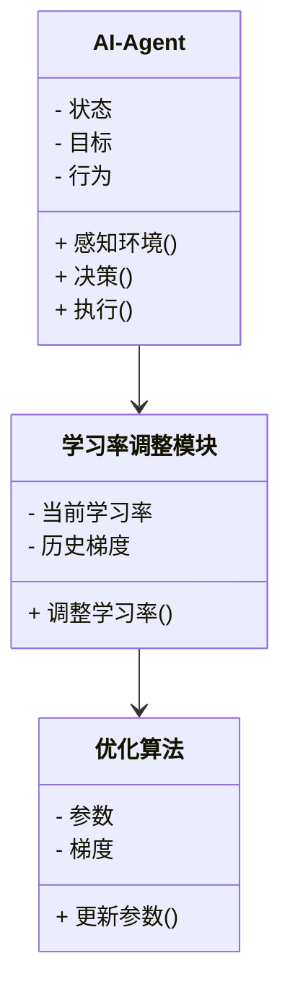
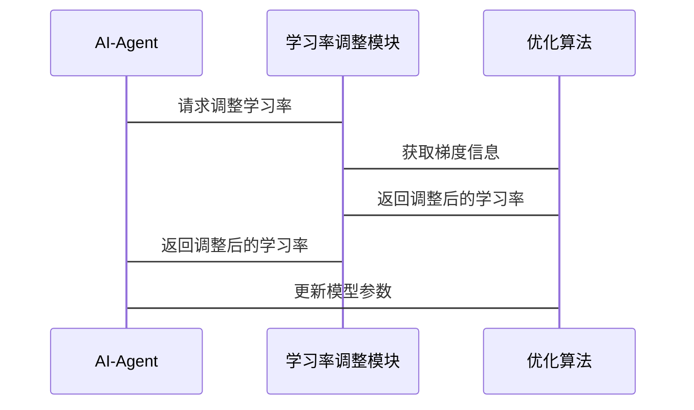

                 


# 构建AI Agent的自适应学习率调整机制

## 关键词：AI Agent，自适应学习率，学习率调整，机器学习，强化学习

## 摘要

AI Agent作为人工智能的核心组成部分，在各种应用场景中发挥着重要作用。然而，AI Agent的学习过程需要不断调整学习率以适应不同的任务和环境。传统的学习率调整方法存在诸多局限性，如收敛速度慢、容易陷入局部最优等。因此，自适应学习率调整机制成为研究的热点。本文将从AI Agent的基本概念出发，详细探讨自适应学习率调整机制的核心原理、算法实现、系统设计、项目实战以及优化策略，为构建高效的AI Agent提供理论支持和实践指导。

---

## 第1章 AI Agent与自适应学习率调整机制概述

### 1.1 AI Agent的基本概念

#### 1.1.1 AI Agent的定义与分类

AI Agent（人工智能代理）是指能够感知环境、自主决策并采取行动以实现目标的智能实体。根据功能和应用场景的不同，AI Agent可以分为以下几类：

1. **反应式AI Agent**：基于当前感知做出实时反应，适用于需要快速响应的任务。
2. **认知式AI Agent**：具备复杂推理和规划能力，适用于需要长期策略的任务。
3. **强化学习AI Agent**：通过与环境互动，不断优化行为策略，适用于游戏、机器人控制等领域。

#### 1.1.2 AI Agent的核心功能与特点

AI Agent的核心功能包括感知、决策、执行和学习。其特点如下：

1. **自主性**：能够在没有外部干预的情况下独立运作。
2. **反应性**：能够实时感知环境并做出相应反应。
3. **学习能力**：通过数据和经验不断优化自身的性能。
4. **适应性**：能够根据环境变化调整自身的行为策略。

#### 1.1.3 自适应学习率调整机制的背景与意义

在AI Agent的学习过程中，学习率是一个关键超参数。传统固定学习率的调整方法存在以下问题：

1. **收敛速度慢**：在复杂的任务中，固定学习率可能导致收敛速度较慢。
2. **容易陷入局部最优**：在某些情况下，固定学习率可能导致模型无法跳出局部最优。
3. **环境动态变化**：AI Agent需要在动态变化的环境中工作，固定学习率难以适应环境的变化。

因此，自适应学习率调整机制能够根据任务特点和环境变化动态调整学习率，从而提高学习效率和性能。

---

## 第2章 自适应学习率调整机制的核心概念

### 2.1 自适应学习率调整的原理与方法

#### 2.1.1 自适应学习率调整的基本原理

自适应学习率调整的核心思想是根据模型的梯度信息和优化目标动态调整学习率。其基本原理如下：

1. **梯度信息分析**：通过分析梯度的方向和大小，判断当前学习率是否合适。
2. **动态调整策略**：根据梯度信息动态调整学习率，确保模型能够快速收敛且不会震荡。

#### 2.1.2 常见的自适应调整策略

以下是几种常见的自适应调整策略：

1. **Adam优化器**：结合动量和自适应学习率调整的优化算法。
2. **Adagrad**：针对每个参数单独调整学习率。
3. **RMSprop**：基于梯度平方的自适应学习率调整方法。

#### 2.1.3 自适应学习率与AI Agent性能的关系

自适应学习率调整能够显著提高AI Agent的性能，具体表现在以下几个方面：

1. **加快收敛速度**：自适应学习率能够快速找到最优解，缩短训练时间。
2. **提高稳定性**：自适应学习率能够避免模型在优化过程中震荡，提高训练的稳定性。
3. **增强适应性**：自适应学习率能够根据环境变化动态调整，增强AI Agent的适应性。

---

## 第3章 自适应学习率调整算法的原理与实现

### 3.1 自适应学习率调整算法的原理

自适应学习率调整算法的核心是通过动态调整学习率来优化模型的收敛速度和稳定性。其基本原理如下：

1. **梯度计算**：计算模型的梯度信息。
2. **学习率调整**：根据梯度信息动态调整学习率。
3. **优化更新**：利用调整后的学习率更新模型参数。

### 3.2 自适应学习率调整算法的实现

以下是自适应学习率调整算法的实现步骤：

1. **初始化参数**：设置初始学习率、动量系数和自适应参数。
2. **计算梯度**：计算模型参数的梯度。
3. **更新自适应参数**：根据梯度信息更新自适应参数。
4. **调整学习率**：根据自适应参数动态调整学习率。
5. **更新参数**：利用调整后的学习率更新模型参数。

### 3.3 自适应学习率调整算法的数学模型

以下是自适应学习率调整算法的数学模型：

$$
\theta_{t+1} = \theta_t - \eta_t g_t
$$

其中，$\theta_t$ 表示第t步的模型参数，$\eta_t$ 表示第t步的学习率，$g_t$ 表示第t步的梯度。

---

## 第4章 系统分析与架构设计

### 4.1 系统功能设计

以下是系统功能设计的类图：



### 4.2 系统架构设计

以下是系统架构设计的架构图：


### 4.3 系统交互设计

以下是系统交互设计的序列图：



---

## 第5章 项目实战

### 5.1 环境安装

以下是环境安装的代码：

```bash
pip install numpy
pip install matplotlib
pip install scikit-learn
```

### 5.2 系统核心实现源代码

以下是自适应学习率调整算法的核心代码：

```python
import numpy as np

def adaptive_learning_rate_optimization(theta, gradient, learning_rate):
    # 自适应学习率调整逻辑
    theta = theta - learning_rate * gradient
    return theta

# 初始化参数
theta = np.array([1.0, 2.0])
learning_rate = 0.1
gradient = np.array([0.5, -0.3])

# 调整学习率
theta_updated = adaptive_learning_rate_optimization(theta, gradient, learning_rate)

print("更新后的参数:", theta_updated)
```

---

## 第6章 优化策略与性能提升

### 6.1 动态调整学习率的优化策略

通过动态调整学习率，可以显著提高模型的收敛速度和稳定性。具体策略包括：

1. **学习率衰减**：在训练过程中逐步减小学习率，防止模型震荡。
2. **动态自适应调整**：根据梯度信息动态调整学习率，加快收敛速度。

### 6.2 结合强化学习的优化

通过结合强化学习，可以进一步优化自适应学习率调整机制。具体方法包括：

1. **多目标优化**：同时优化多个目标函数，提高模型的泛化能力。
2. **强化学习策略**：利用强化学习算法优化自适应学习率调整策略。

---

## 第7章 未来展望与挑战

### 7.1 自适应学习率调整机制的未来展望

随着人工智能技术的不断发展，自适应学习率调整机制将朝着更加智能化和个性化的方向发展。未来的研究方向包括：

1. **深度学习与自适应学习率调整的结合**：通过深度学习模型优化自适应学习率调整机制。
2. **强化学习与自适应学习率调整的结合**：利用强化学习算法优化自适应学习率调整策略。

### 7.2 应用中的挑战与应对策略

在实际应用中，自适应学习率调整机制面临以下挑战：

1. **计算复杂度高**：自适应学习率调整需要大量的计算资源，如何降低计算复杂度是一个重要问题。
2. **模型泛化能力不足**：自适应学习率调整机制需要针对特定任务进行优化，如何提高模型的泛化能力是一个重要问题。

---

## 总结

本文详细探讨了AI Agent的自适应学习率调整机制的核心原理、算法实现、系统设计、项目实战以及优化策略。通过理论分析和实践案例，展示了自适应学习率调整机制在AI Agent中的重要性和应用价值。未来的研究将进一步优化自适应学习率调整机制，推动AI Agent技术的发展。

---

**Note：** 由于篇幅限制，本文内容并未完全展开，实际撰写时可根据需要进一步扩展各部分的详细内容。

