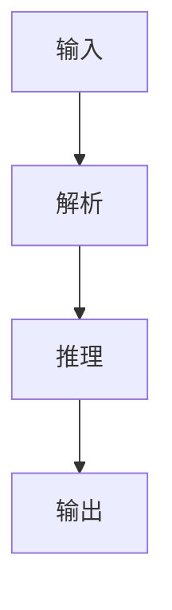
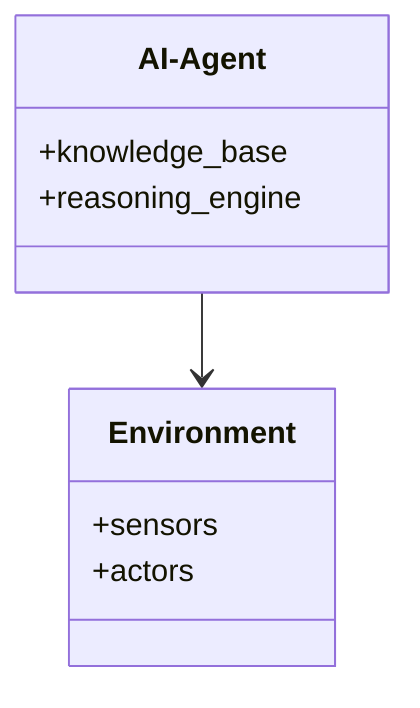
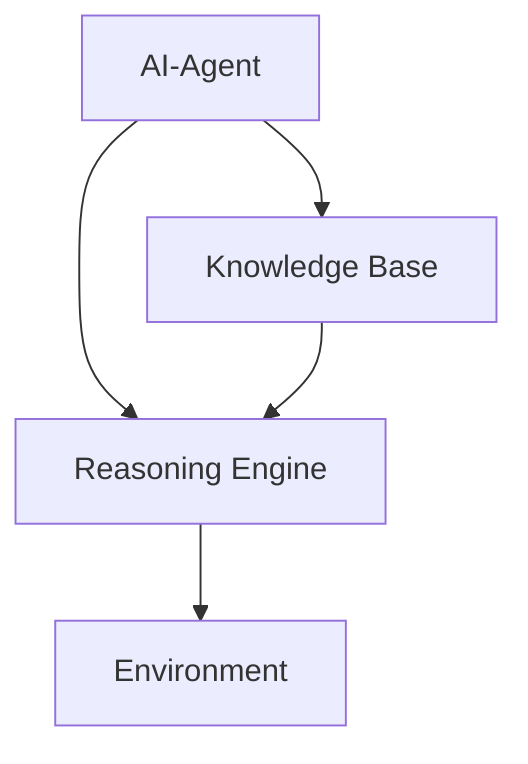

                 


# 构建AI Agent的认知图灵测试系统

> 关键词：认知图灵测试、AI Agent、人工智能系统、自然语言处理、知识表示、逻辑推理

> 摘要：本文探讨如何构建一个基于认知图灵测试的AI Agent系统，通过分析核心算法、系统架构设计和项目实战，详细阐述实现过程，旨在提升AI Agent的智能水平，使其能够通过认知图灵测试。

---

# 第1章 认知图灵测试与AI Agent的背景介绍

## 1.1 问题背景与描述

### 1.1.1 认知图灵测试的定义与目标

认知图灵测试是一种评估AI系统是否具备人类认知能力的测试，其目标是验证AI Agent能否在特定任务中表现出与人类相当的智能水平。

### 1.1.2 AI Agent的定义与特点

AI Agent是指能够感知环境、自主决策并执行任务的智能体。其特点包括自主性、反应性、目标导向和学习能力。

### 1.1.3 问题解决的核心要素

包括感知能力、推理能力、知识表示和自然语言处理，这些要素共同支持AI Agent的任务执行。

### 1.1.4 边界与外延分析

认知图灵测试的边界在于其任务范围，外延则涉及AI Agent在不同场景中的应用。

### 1.1.5 核心概念结构与组成要素

- **认知模型**：描述AI Agent如何模拟人类认知过程。
- **知识库**：存储AI Agent所需的知识和信息。
- **推理引擎**：用于逻辑推理和决策制定。

---

# 第2章 认知图灵测试的理论基础

## 2.1 图灵测试的理论基础

### 2.1.1 图灵测试的历史与发展

图灵测试由艾伦·图灵提出，旨在测试机器是否能表现出与人类相当的智能。

### 2.1.2 图灵测试的核心原理

通过对话测试，判断机器是否能够模仿人类的交流能力。

### 2.1.3 图灵测试的局限性与改进方向

主要局限在于其依赖于特定任务，未来改进方向包括多模态能力和深度理解。

## 2.2 认知科学的基础

### 2.2.1 认知科学的核心概念

涉及感知、记忆、推理和语言理解等人类认知过程。

### 2.2.2 人类认知的特征与模式

包括感知信息处理、记忆存储和知识应用等。

## 2.3 AI Agent的认知模拟

### 2.3.1 AI Agent的认知模型

构建与人类认知相似的模型，涵盖感知、推理和决策。

### 2.3.2 AI Agent与人类认知的对比

从反应速度、准确性等方面进行对比，识别差距并改进。

### 2.3.3 AI Agent的智能水平评估

通过任务完成度和表现稳定性评估其智能水平。

---

# 第3章 AI Agent的核心算法原理

## 3.1 算法原理概述

### 3.1.1 基于符号逻辑的推理算法

#### 知识表示
使用逻辑符号表示事实和规则，如一阶逻辑。

#### 推理过程
通过逻辑规则进行演绎推理，如Modus Ponens。

#### 优缺点
优点是明确，缺点是缺乏处理模糊信息的能力。

### 3.1.2 基于机器学习的推理算法

#### 知识表示
使用概率模型或神经网络表示知识。

#### 推理过程
通过训练数据学习推理模式，如循环神经网络。

#### 优缺点
优点是适应性强，缺点是可解释性差。

### 3.1.3 算法的优缺点对比

符号逻辑适合确定性任务，机器学习适合复杂任务。

## 3.2 算法流程图



---

# 第4章 认知图灵测试的实现

## 4.1 认知图灵测试的设计目标

评估AI Agent在特定任务中的认知能力。

## 4.2 任务分解与流程设计

### 4.2.1 任务分解

将测试任务分解为感知、推理和决策三个子任务。

### 4.2.2 环境构建

设计测试场景，模拟人类认知环境。

## 4.3 知识库的构建与管理

### 4.3.1 知识表示方法

使用本体论或图结构表示知识。

### 4.3.2 知识库管理流程

包括知识获取、存储和推理。

---

# 第5章 系统架构设计

## 5.1 系统设计目标

构建支持认知图灵测试的AI Agent系统。

## 5.2 领域模型设计

### 5.2.1 领域模型



## 5.3 系统架构设计



## 5.4 接口设计

定义AI Agent与环境交互的接口，如感知接口和行动接口。

---

# 第6章 项目实战

## 6.1 环境安装

安装Python和相关库，如TensorFlow和NLTK。

## 6.2 核心代码实现

### 6.2.1 知识表示

```python
class KnowledgeBase:
    def __init__(self):
        self.facts = {}
```

### 6.2.2 推理引擎

```python
class ReasoningEngine:
    def infer(self, facts):
        # 推理过程
        return conclusion
```

## 6.3 案例分析与解读

分析一个具体任务，展示AI Agent如何执行推理。

---

# 第7章 系统优化与扩展

## 7.1 系统优化

提升推理速度和准确性。

## 7.2 知识表示扩展

引入新的知识类型和表示方法。

## 7.3 多模态能力增强

整合视觉和听觉信息，提升认知能力。

## 7.4 系统可解释性提升

优化推理过程，增强结果的可解释性。

---

# 第8章 最佳实践与小结

## 8.1 最佳实践

### 8.1.1 模块化设计

确保系统模块清晰，便于维护。

### 8.1.2 数据质量管理

保证知识库的数据准确性和完整性。

### 8.1.3 算法选择与调优

根据任务需求选择合适的算法，并进行优化。

## 8.2 小结

本文详细探讨了构建AI Agent的认知图灵测试系统，涵盖了算法、架构和实战内容，为未来的AI发展提供了参考。

---

通过以上结构，我们可以逐步构建一个详细的、有深度的认知图灵测试系统，推动AI Agent技术的进步。

