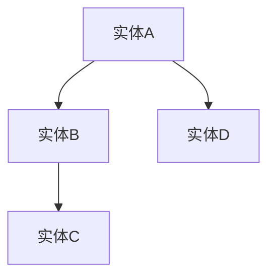
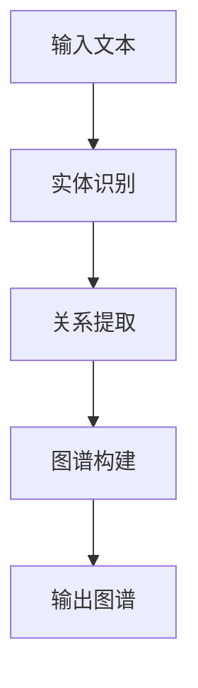
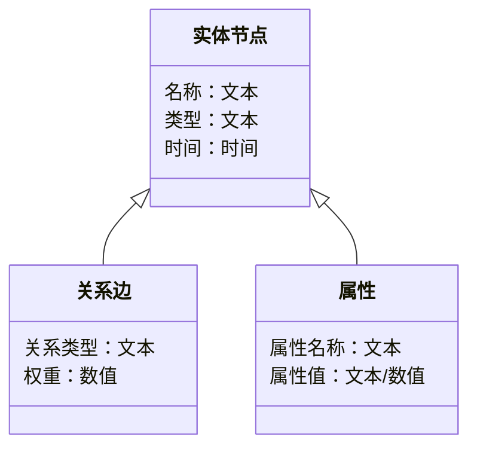
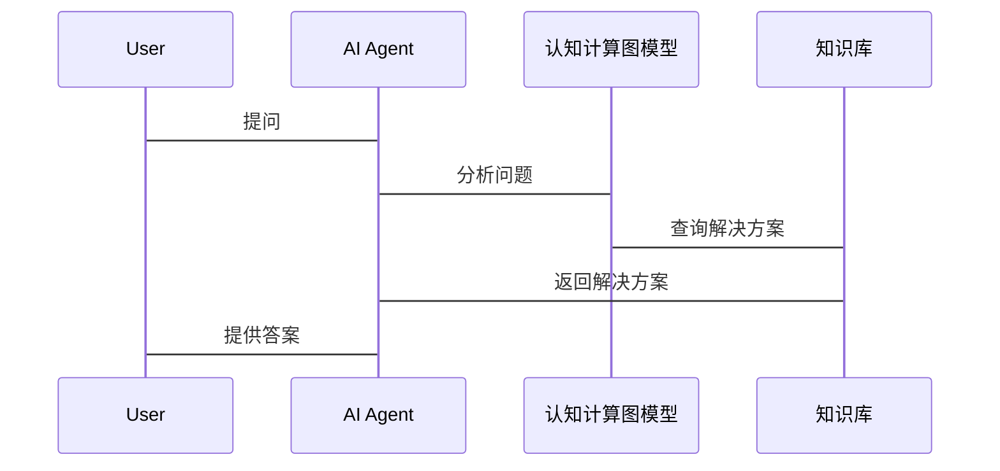

                 


# 构建AI Agent的认知计算图模型

> **关键词**：AI Agent，认知计算图模型，图计算，算法原理，系统架构设计，项目实战

> **摘要**：构建AI Agent的认知计算图模型是实现智能代理的核心任务之一。本文从AI Agent的基本概念出发，详细阐述认知计算图模型的核心概念、算法原理、系统架构设计、项目实战以及最佳实践。通过理论与实践相结合的方式，帮助读者全面理解和掌握如何构建高效的AI Agent认知计算图模型。

---

## 第一部分: 构建AI Agent的认知计算图模型概述

### 第1章: AI Agent与认知计算图模型概述

#### 1.1 AI Agent的基本概念

##### 1.1.1 AI Agent的定义与特点
AI Agent（人工智能代理）是指能够感知环境、自主决策并采取行动以实现目标的智能实体。AI Agent具有以下特点：
- **自主性**：能够在没有外部干预的情况下自主运作。
- **反应性**：能够实时感知环境并做出反应。
- **目标导向性**：所有行动都以实现特定目标为导向。
- **学习能力**：能够通过经验改进自身性能。

##### 1.1.2 认知计算图模型的定义
认知计算图模型是一种基于图结构的数据表示方法，用于描述实体、关系和属性，支持AI Agent的认知过程。它通过节点和边来表示实体、关系和属性，具有以下特点：
- **图结构**：通过节点表示实体，通过边表示实体之间的关系。
- **可扩展性**：能够动态扩展，适应复杂场景的需求。
- **语义丰富性**：通过属性和关系，能够表达丰富的语义信息。

##### 1.1.3 AI Agent与认知计算图模型的关系
AI Agent依赖于认知计算图模型来实现认知功能。认知计算图模型为AI Agent提供了知识表示和推理的基础，而AI Agent则利用这些模型进行感知、推理和决策。

---

#### 1.2 认知计算图模型的背景与意义

##### 1.2.1 当前AI发展的挑战
随着AI技术的快速发展，AI Agent的应用场景越来越广泛，但也面临以下挑战：
- **复杂环境下的决策能力**：在复杂动态环境中，AI Agent需要快速做出准确的决策。
- **知识表示与推理**：如何高效地表示和推理复杂知识是AI Agent的核心问题。
- **实时性与效率**：在实时应用场景中，AI Agent需要快速响应，这对计算效率提出了更高的要求。

##### 1.2.2 认知计算图模型的提出
认知计算图模型作为一种图结构的知识表示方法，能够有效解决AI Agent在知识表示和推理方面的挑战。它通过图结构的可扩展性和语义丰富性，为AI Agent提供了强大的认知能力。

##### 1.2.3 认知计算图模型的应用前景
认知计算图模型在多个领域具有广泛的应用前景，如自然语言处理、智能推荐、自动驾驶等。它能够帮助AI Agent更好地理解和处理复杂场景中的信息，提升决策的准确性和效率。

---

#### 1.3 本书的目标与结构

##### 1.3.1 本书的核心目标
本书旨在帮助读者全面理解认知计算图模型的核心概念、算法原理和系统架构设计，掌握构建高效AI Agent认知计算图模型的方法和技巧。

##### 1.3.2 目录结构概览
本书分为六个主要部分：
1. 背景与概念：介绍AI Agent和认知计算图模型的基本概念。
2. 核心概念与原理：详细阐述认知计算图模型的核心概念和原理。
3. 算法原理：讲解认知计算图模型的算法流程和数学模型。
4. 系统架构设计：介绍系统架构设计的方法和步骤。
5. 项目实战：通过实际案例展示认知计算图模型的构建过程。
6. 最佳实践：总结经验，提供注意事项和拓展阅读建议。

##### 1.3.3 学习方法与注意事项
读者在学习过程中应注重理论与实践相结合，通过代码实现和案例分析加深对知识的理解。建议读者具备一定的图计算和Python编程基础，以便更好地掌握本书内容。

---

## 第二部分: 认知计算图模型的核心概念与原理

### 第2章: 认知计算图模型的核心概念

#### 2.1 认知计算图模型的构成要素

##### 2.1.1 实体节点的定义与分类
实体节点是认知计算图模型的基本组成单位，用于表示现实世界中的实体。实体节点可以分为以下几类：
- **实体类型**：如人、地点、事件等。
- **实体属性**：如名称、时间、空间等。

##### 2.1.2 关系边的定义与类型
关系边用于表示实体之间的关系，可以是直接关系或间接关系。常见的关系边类型包括：
- **关联关系**：如“属于”、“包含”等。
- **动作关系**：如“购买”、“访问”等。

##### 2.1.3 属性的定义与表示
属性用于描述实体的特征，可以是定性或定量的。属性的表示方式包括：
- **标签表示**：如“颜色：红色”。
- **数值表示**：如“年龄：25”。

##### 2.1.4 通过表格对比概念属性特征
以下表格对比了实体节点、关系边和属性的核心属性特征：

| 概念 | 属性 | 类型 | 示例 |
|------|------|------|------|
| 实体节点 | 名称 | 文本 | “用户1” |
|        | 时间 | 时间 | “2023-10-01” |
| 关系边 | 关系类型 | 文本 | “购买” |
|        | 权重 | 数值 | 0.85 |
| 属性   | 属性名称 | 文本 | “年龄” |
|        | 属性值 | 文本/数值 | “25” |

##### 2.1.5 通过Mermaid绘制ER实体关系图
以下是认知计算图模型的ER实体关系图示例：

```mermaid
er
actor: 用户
event: 事件
place: 地点
```

---

#### 2.2 认知计算图模型的属性特征对比

##### 2.2.1 实体节点的属性对比
实体节点的属性特征如下：
- **名称**：实体的唯一标识。
- **类型**：实体所属的类别。
- **时间**：实体的时间属性。

##### 2.2.2 关系边的属性对比
关系边的属性特征如下：
- **关系类型**：边表示的关系类型。
- **权重**：关系的重要性或概率。

##### 2.2.3 属性特征的表格总结
以下表格总结了实体节点、关系边和属性的核心属性特征：

| 概念 | 属性 | 类型 | 示例 |
|------|------|------|------|
| 实体节点 | 名称 | 文本 | “用户1” |
|        | 类型 | 文本 | “用户” |
|        | 时间 | 时间 | “2023-10-01” |
| 关系边 | 关系类型 | 文本 | “购买” |
|        | 权重 | 数值 | 0.85 |
| 属性   | 属性名称 | 文本 | “年龄” |
|        | 属性值 | 文本/数值 | “25” |

---

#### 2.3 ER实体关系图的构建

##### 2.3.1 ER实体关系图的定义
ER实体关系图是一种用于描述实体及其关系的图模型，通过实体节点和关系边来表示现实世界中的实体关系。

##### 2.3.2 ER实体关系图的构建步骤
1. **识别实体**：确定系统中涉及的所有实体。
2. **定义关系**：描述实体之间的关系类型。
3. **绘制图谱**：使用工具（如Mermaid）绘制ER实体关系图。

##### 2.3.3 ER实体关系图的Mermaid流程图
以下是认知计算图模型的ER实体关系图示例：



---

## 第三部分: 认知计算图模型的算法原理

### 第3章: 认知计算图模型的算法原理

#### 3.1 算法原理概述

##### 3.1.1 算法的整体流程
认知计算图模型的算法流程包括以下步骤：
1. **实体节点识别**：从数据中提取实体节点。
2. **关系边构建**：根据实体节点构建关系边。
3. **属性提取**：提取实体的属性信息。
4. **图谱构建**：将实体节点、关系边和属性整合成图谱。

##### 3.1.2 算法的核心思想
算法的核心思想是通过图结构来表示知识，并利用图计算技术进行推理和决策。

##### 3.1.3 算法的输入输出
- **输入**：原始数据（如文本、关系等）。
- **输出**：认知计算图模型的图谱表示。

#### 3.2 算法的详细步骤

##### 3.2.1 实体节点的识别与提取
实体节点的识别与提取是认知计算图模型构建的第一步，通常采用自然语言处理技术。例如，使用命名实体识别（NER）算法提取文本中的实体。

##### 3.2.2 关系边的构建与权重计算
关系边的构建需要确定实体之间的关系类型，并为每条边分配权重。权重通常表示关系的强度或概率。

##### 3.2.3 属性的提取与关联
属性的提取与关联需要将实体的属性信息与实体节点相关联，例如将“用户A的年龄是25岁”中的“年龄”属性与“用户A”节点关联。

#### 3.3 算法的数学模型与公式

##### 3.3.1 实体节点表示的数学模型
实体节点可以用向量表示，例如使用Word2Vec模型将实体表示为高维向量。

##### 3.3.2 关系边权重计算的数学公式
关系边权重可以通过相似性计算公式确定，例如余弦相似度：

$$ \text{权重} = \frac{\vec{u} \cdot \vec{v}}{|\vec{u}| |\vec{v}|} $$

##### 3.3.3 属性关联的数学模型
属性关联可以通过条件概率公式表示：

$$ P(\text{属性}| \text{实体}) = \frac{\text{实体的属性出现次数}}{\text{实体的总出现次数}} $$

#### 3.4 算法的Python实现

##### 3.4.1 环境安装与配置
需要安装以下Python库：
- `networkx`：用于图结构的构建和操作。
- `numpy`：用于数值计算。
- `spacy`：用于自然语言处理。

##### 3.4.2 核心代码实现

```python
import networkx as nx
import spacy
import numpy as np

# 初始化spaCy模型
nlp = spacy.load("en_core_web_sm")

# 实体节点识别
def extract_entities(text):
    doc = nlp(text)
    entities = [ent.text for ent in doc.ents]
    return entities

# 关系边构建
def build_relations(text):
    doc = nlp(text)
    relations = []
    for sent in doc.sents:
        for token in sent:
            if token.dep_ == "ROOT":
                root = token
                for child in root.children:
                    if child.dep_ == "nsubj":
                        subject = child
                    if child.dep_ == "dobj":
                        object = child
                    relations.append((subject.text, "动词", object.text))
    return relations

# 图谱构建
def build_graph(entities, relations):
    G = nx.Graph()
    G.add_nodes_from(entities)
    G.add_edges_from(relations)
    return G

# 示例
text = "用户A购买了一台电脑。"
entities = extract_entities(text)
relations = build_relations(text)
graph = build_graph(entities, relations)
```

##### 3.4.3 代码解读与分析
1. **实体节点识别**：使用spaCy模型提取文本中的实体。
2. **关系边构建**：通过依存关系分析确定实体之间的关系。
3. **图谱构建**：使用networkx库构建图谱。

#### 3.5 通过Mermaid绘制算法流程图



---

## 第四部分: 系统分析与架构设计

### 第4章: 系统分析与架构设计

#### 4.1 问题场景介绍

##### 4.1.1 问题背景
在智能客服系统中，AI Agent需要理解用户的问题并提供相应的解决方案。

##### 4.1.2 问题描述
用户提问：“如何处理订单错误？”

##### 4.1.3 问题解决
AI Agent需要理解用户的意图，并关联到相关的知识库，提供解决方案。

#### 4.2 系统功能设计

##### 4.2.1 领域模型设计
以下是领域模型的Mermaid类图：



##### 4.2.2 系统架构设计
以下是系统的架构图：


##### 4.2.3 系统接口设计
系统接口包括：
- **输入接口**：接收用户输入的文本。
- **输出接口**：输出处理结果。

##### 4.2.4 系统交互设计
以下是系统的交互图：



---

## 第五部分: 项目实战

### 第5章: 项目实战

#### 5.1 环境安装与配置

##### 5.1.1 安装依赖
```bash
pip install networkx numpy spacy
python -m spacy download en_core_web_sm
```

#### 5.2 核心代码实现

##### 5.2.1 实体节点识别
```python
import spacy

nlp = spacy.load("en_core_web_sm")

def extract_entities(text):
    doc = nlp(text)
    entities = [ent.text for ent in doc.ents]
    return entities
```

##### 5.2.2 关系边构建
```python
def build_relations(text):
    doc = nlp(text)
    relations = []
    for sent in doc.sents:
        for token in sent:
            if token.dep_ == "ROOT":
                root = token
                for child in root.children:
                    if child.dep_ == "nsubj":
                        subject = child
                    if child.dep_ == "dobj":
                        object = child
                    relations.append((subject.text, "动词", object.text))
    return relations
```

##### 5.2.3 图谱构建
```python
import networkx as nx

def build_graph(entities, relations):
    G = nx.Graph()
    G.add_nodes_from(entities)
    G.add_edges_from(relations)
    return G
```

##### 5.2.4 示例代码
```python
text = "用户A购买了一台电脑。"
entities = extract_entities(text)
relations = build_relations(text)
graph = build_graph(entities, relations)
print(graph.nodes())
print(graph.edges())
```

#### 5.3 代码解读与分析

##### 5.3.1 实体节点识别
使用spaCy模型提取文本中的实体节点。

##### 5.3.2 关系边构建
通过依存关系分析构建实体之间的关系边。

##### 5.3.3 图谱构建
使用networkx库构建认知计算图模型。

#### 5.4 案例分析与详细讲解

##### 5.4.1 案例分析
以文本“用户A购买了一台电脑。”为例，构建认知计算图模型。

##### 5.4.2 详细讲解
1. **实体识别**：提取“用户A”和“电脑”作为实体节点。
2. **关系提取**：提取“购买”关系。
3. **图谱构建**：构建用户A与电脑之间的“购买”关系。

#### 5.5 项目小结

##### 5.5.1 核心代码实现总结
通过Python代码实现了认知计算图模型的构建过程，包括实体识别、关系提取和图谱构建。

##### 5.5.2 项目经验总结
- **实体识别**：spaCy模型在实体识别方面表现良好。
- **关系提取**：依存关系分析是构建关系边的有效方法。
- **图谱构建**：networkx库提供了丰富的图结构操作接口。

---

## 第六部分: 最佳实践

### 第6章: 最佳实践

#### 6.1 小结

##### 6.1.1 核心内容回顾
认知计算图模型是构建AI Agent的重要工具，通过图结构表示知识，并利用图计算技术进行推理和决策。

##### 6.1.2 学习成果总结
读者应掌握认知计算图模型的核心概念、算法原理和系统架构设计，并能够通过Python代码实现模型的构建。

#### 6.2 注意事项

##### 6.2.1 开发注意事项
- **数据质量**：确保输入数据的准确性和完整性。
- **模型优化**：通过优化算法和参数提升模型性能。
- **安全性**：注意数据隐私和模型安全。

##### 6.2.2 部署注意事项
- **资源分配**：合理分配计算资源。
- **错误处理**：设计完善的错误处理机制。

#### 6.3 拓展阅读

##### 6.3.1 推荐书籍
1. 《图计算：算法与应用》
2. 《自然语言处理入门》

##### 6.3.2 推荐论文
1. “Graph Neural Networks: A Review of Methods, Applications, and Open Challenges”（arXiv）
2. “Entity Recognition and Linking: A Survey”（Computational Intelligence Review）

---

## 总结

构建AI Agent的认知计算图模型是一项复杂的任务，需要结合图计算、自然语言处理和系统架构设计等多方面的知识。通过理论学习和实践操作，读者可以掌握构建高效AI Agent认知计算图模型的方法和技巧，为实现智能代理奠定坚实基础。

