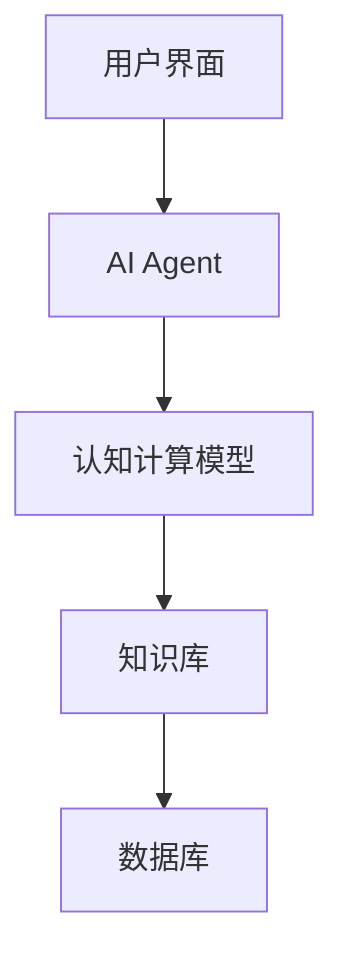
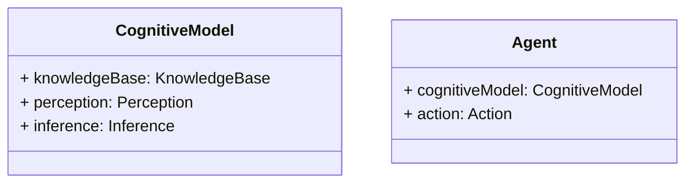
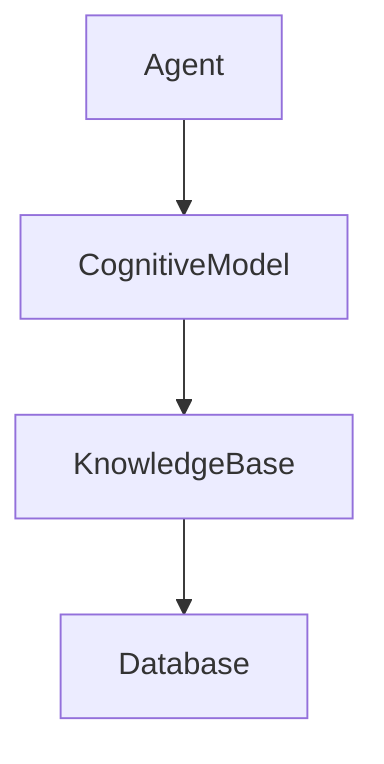
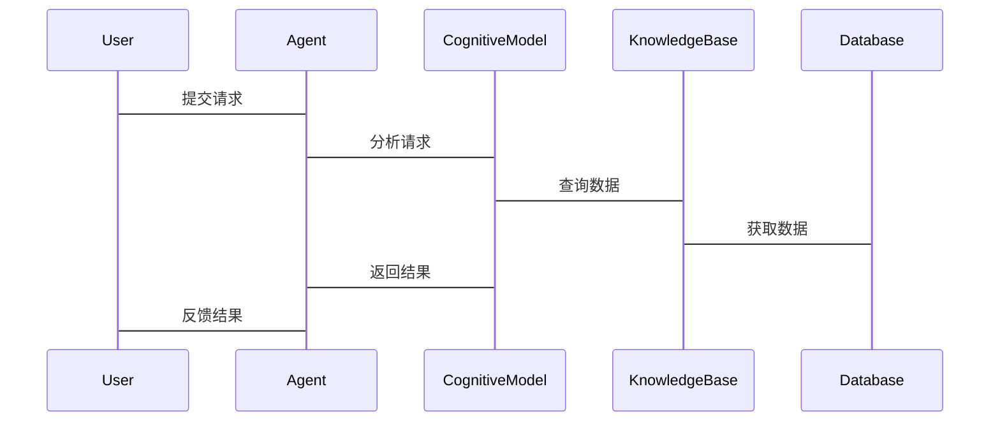

                 


# 构建AI Agent的认知计算模型

> 关键词：AI Agent, 认知计算模型, 人工智能, 系统架构, 算法原理

> 摘要：本文详细探讨了构建AI Agent的认知计算模型，从核心概念、算法原理到系统架构设计，结合实际案例分析，深入剖析了AI Agent的认知机制与实现方法。

---

## 第1章：认知计算模型与AI Agent背景介绍

### 1.1 问题背景

#### 1.1.1 认知计算模型的起源与发展
认知计算模型是一种模拟人类认知过程的计算模型，起源于人工智能领域。随着技术的发展，认知计算模型在自然语言处理、知识表示、推理等领域得到了广泛应用。其核心思想是通过模拟人类的感知、记忆、推理和学习过程，构建能够理解、推理和决策的智能系统。

#### 1.1.2 AI Agent的基本概念与应用场景
AI Agent（人工智能代理）是一种能够感知环境并自主决策的智能实体。它可以分为简单反射型、基于模型的反应型、目标驱动型和效用驱动型等类型。AI Agent广泛应用于自动驾驶、智能助手、推荐系统等领域，能够帮助人类完成复杂任务。

#### 1.1.3 认知计算模型与AI Agent的关系
认知计算模型为AI Agent提供了认知能力的实现基础。通过认知模型，AI Agent能够理解输入的信息，进行推理和决策，并与环境进行交互。认知计算模型是AI Agent实现智能化的关键技术。

### 1.2 核心概念与问题描述

#### 1.2.1 认知计算模型的核心要素
认知计算模型通常包括感知、记忆、推理和学习四个核心要素。感知模块负责获取环境信息，记忆模块负责存储和管理知识，推理模块负责逻辑推理，学习模块负责模型的优化和改进。

#### 1.2.2 AI Agent的定义与分类
AI Agent是一种能够感知环境并自主决策的智能实体。根据智能水平和决策能力，AI Agent可以分为反应式和基于模型的两类。

#### 1.2.3 问题的边界与外延
认知计算模型与AI Agent的结合需要考虑模型的复杂性、计算资源和环境动态性等因素。模型的边界包括感知范围、知识表示和决策空间，外延则涉及模型的扩展性和适应性。

### 1.3 问题解决与模型构建

#### 1.3.1 认知计算模型的构建方法
构建认知计算模型需要明确目标、选择合适的知识表示方法，并设计推理算法。常用的知识表示方法包括逻辑推理、语义网络和图模型。

#### 1.3.2 AI Agent的任务分解与实现
AI Agent的任务分解需要将复杂任务拆解为多个子任务，并通过协同完成。每个子任务需要明确目标、输入、输出和执行步骤。

#### 1.3.3 模型的验证与优化
验证模型需要通过测试用例和性能评估，优化模型则需要调整参数和算法，以提高准确性和效率。

### 1.4 案例分析与小结

#### 1.4.1 实际案例分析
以智能客服为例，认知计算模型可以通过自然语言处理理解用户需求，AI Agent则根据需求执行查询和反馈。

#### 1.4.2 本章小结
本章介绍了认知计算模型和AI Agent的基本概念，分析了它们的关系和构建方法，并通过案例展示了实际应用。

---

## 第2章：认知计算模型的核心概念与联系

### 2.1 核心概念原理

#### 2.1.1 认知计算模型的原理
认知计算模型通过模拟人类认知过程，实现信息处理和决策。其核心原理包括感知、记忆、推理和学习。

#### 2.1.2 AI Agent的认知机制
AI Agent通过感知环境、分析信息、推理决策和执行动作，实现与环境的交互。

#### 2.1.3 模型与Agent的交互关系
认知计算模型为AI Agent提供认知能力，AI Agent则通过执行任务验证模型的有效性。

### 2.2 概念属性特征对比

#### 2.2.1 模型属性对比表
| 属性 | 认知计算模型 | AI Agent |
|------|--------------|----------|
| 核心能力 | 认知能力 | 执行能力 |
| 输入 | 环境信息 | 任务目标 |
| 输出 | 决策 | 动作 |

#### 2.2.2 功能对比表
| 功能 | 认知计算模型 | AI Agent |
|------|--------------|----------|
| 感知 | 收集信息 | 感知环境 |
| 推理 | 逻辑推理 | 判断 |
| 决策 | 策略制定 | 执行 |

### 2.3 ER实体关系图

```mermaid
er
    actor 认知模型
    actor AI Agent
    actor 任务目标
    relation 实现
    relation 依赖
```

### 2.4 本章小结
本章详细分析了认知计算模型和AI Agent的核心概念，并通过对比和图表展示了它们之间的关系和联系。

---

## 第3章：认知计算模型的算法原理

### 3.1 算法原理概述

#### 3.1.1 认知计算模型的算法特点
认知计算模型的算法通常具有自适应性、学习能力和高效性，能够处理复杂的信息和任务。

#### 3.1.2 AI Agent算法的核心步骤
AI Agent的算法通常包括感知、推理、决策和执行四个步骤。感知环境、分析信息、制定策略并执行动作。

#### 3.1.3 算法的优化
优化算法需要考虑计算效率、准确性和适应性，通过改进算法结构和参数调整来提高性能。

### 3.2 算法实现

#### 3.2.1 算法流程图

```mermaid
graph TD
    A[开始] -> B[感知环境]
    B -> C[分析信息]
    C -> D[推理决策]
    D -> E[执行动作]
    E -> F[结束]
```

#### 3.2.2 Python代码实现

```python
def cognitive_model(agent):
    while True:
        environment = agent.perceive()
        knowledge = agent.reason(environment)
        decision = agent.decide(knowledge)
        agent.act(decision)
```

### 3.3 数学模型与公式

#### 3.3.1 推理公式
$$ p(decision | environment) = \prod_{i=1}^{n} p(decision | environment_i) $$

#### 3.3.2 学习公式
$$ \theta^{(t+1)} = \theta^{(t)} + \alpha \nabla L(\theta^{(t)}) $$

### 3.4 本章小结
本章详细讲解了认知计算模型和AI Agent的算法原理，通过流程图和代码示例展示了算法的实现过程。

---

## 第4章：系统分析与架构设计

### 4.1 系统分析

#### 4.1.1 问题场景介绍
以智能助手为例，系统需要处理用户的自然语言输入，理解需求并执行相应任务。

#### 4.1.2 系统功能设计

#### 4.1.3 系统架构设计



### 4.2 系统架构设计

#### 4.2.1 领域模型类图



#### 4.2.2 系统架构图



### 4.3 接口设计与交互流程

#### 4.3.1 系统接口设计
系统需要定义清晰的接口规范，确保模块之间的通信和协作。

#### 4.3.2 交互流程



### 4.4 本章小结
本章通过系统分析和架构设计，展示了如何构建基于认知计算模型的AI Agent系统。

---

## 第5章：项目实战

### 5.1 环境安装与配置

#### 5.1.1 环境要求
需要安装Python、TensorFlow、Numpy等库。

#### 5.1.2 安装步骤

```bash
pip install numpy tensorflow
```

### 5.2 核心代码实现

#### 5.2.1 认知计算模型实现

```python
class CognitiveModel:
    def __init__(self, knowledge_base):
        self.knowledge_base = knowledge_base
    def perceive(self, input):
        # 处理输入
        pass
    def reason(self, input):
        # 推理
        pass
```

#### 5.2.2 AI Agent实现

```python
class Agent:
    def __init__(self, cognitive_model):
        self.cognitive_model = cognitive_model
    def act(self, decision):
        # 执行动作
        pass
```

### 5.3 代码解读与分析
通过具体代码示例，分析认知计算模型和AI Agent的实现细节，包括输入处理、推理算法和动作执行。

### 5.4 案例分析与优化

#### 5.4.1 案例分析
通过实际案例展示模型的应用和效果。

#### 5.4.2 优化建议
根据测试结果，提出优化模型和算法的建议。

### 5.5 项目小结
总结项目实现过程中的经验和教训，为后续开发提供参考。

---

## 第6章：最佳实践与拓展

### 6.1 最佳实践

#### 6.1.1 设计建议
在设计认知计算模型时，建议采用模块化设计，便于扩展和维护。

#### 6.1.2 开发注意事项
注意模型的可解释性和可扩展性，确保算法的高效性和准确性。

### 6.2 小结
回顾全书内容，总结核心观点和关键知识点。

### 6.3 注意事项
在实际应用中，需关注数据隐私、模型安全和性能优化等问题。

### 6.4 拓展阅读
推荐阅读相关领域的书籍和论文，深入学习认知计算模型和AI Agent的前沿技术。

---

## 附录

### 附录A：数学公式汇总
列出全书涉及的数学公式，便于查阅。

### 附录B：代码示例汇总
汇总全书中的代码示例，方便读者参考。

---

# 结语

构建AI Agent的认知计算模型是一项复杂而有趣的任务，需要结合理论知识和实际应用。通过系统的分析和实践，我们可以设计出高效、智能的AI Agent，为人类社会的发展带来更多的便利和可能性。

