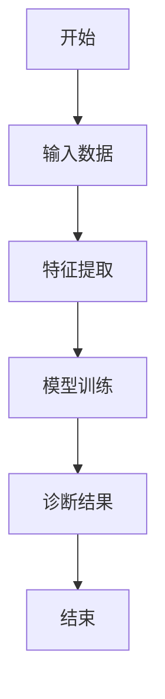

                 


# 构建AI Agent的认知诊断模型

> **关键词**: AI Agent, 认知诊断模型, 机器学习, 系统架构, 项目实战

> **摘要**: 本文详细介绍了构建AI Agent的认知诊断模型的背景、核心概念、算法原理、系统架构、项目实战及最佳实践。通过逐步分析和推理，帮助读者全面理解认知诊断模型的构建过程，并掌握实际应用中的关键技能。

---

## 第一部分: 构建AI Agent的认知诊断模型概述

### 第1章: AI Agent与认知诊断模型的背景介绍

#### 1.1 问题背景与问题描述
- **1.1.1 AI Agent的核心概念与应用场景**
  - AI Agent的定义及其在智能系统中的角色。
  - AI Agent在医疗、金融、教育等领域的具体应用案例。
- **1.1.2 认知诊断模型的定义与目标**
  - 认知诊断模型的定义及其在AI Agent中的作用。
  - 认知诊断模型的目标，如识别Agent的认知偏差、优化其决策能力。
- **1.1.3 问题解决的必要性与意义**
  - 为什么需要构建认知诊断模型？
  - 认知诊断模型在提升AI Agent性能中的重要性。

#### 1.2 问题的边界与外延
- **1.2.1 AI Agent认知诊断的边界**
  - 认知诊断的范围：从简单行为分析到复杂决策支持。
  - 边界案例分析：何时需要进行认知诊断。
- **1.2.2 认知诊断模型的适用范围**
  - 确定模型适用的场景：实时诊断与离线诊断。
  - 不适用场景的讨论：认知诊断的局限性。
- **1.2.3 相关概念的对比与区分**
  - AI Agent与传统智能体的区别。
  - 认知诊断与传统诊断方法的对比。

#### 1.3 概念结构与核心要素
- **1.3.1 AI Agent的认知模型**
  - 知识表示、推理机制、学习能力。
- **1.3.2 认知诊断的核心要素**
  - 诊断指标、诊断方法、诊断结果。
- **1.3.3 模型的输入输出关系**
  - 输入：Agent的行为数据、环境信息。
  - 输出：诊断结果、优化建议。

---

### 第2章: AI Agent认知诊断模型的核心概念与联系

#### 2.1 核心概念原理
- **2.1.1 AI Agent的智能体模型**
  - 经典智能体模型：反应式、认知式、混合式。
- **2.1.2 认知诊断的核心算法**
  - 基于规则的诊断、基于机器学习的诊断。
- **2.1.3 模型的训练与优化**
  - 监督学习、无监督学习、强化学习在诊断中的应用。

#### 2.2 核心概念属性特征对比表
- **表2-1: AI Agent与传统智能体的对比**
  | 属性 | AI Agent | 传统智能体 |
  |------|----------|------------|
  | 行为方式 | 基于AI算法 | 基于规则 |
  | 学习能力 | 具备 | 无 |
- **表2-2: 认知诊断模型的特征分解**
  | 特征 | 描述 |
  |------|------|
  | 输入 | Agent的行为数据 |
  | 输出 | 诊断结果 |
  | 方法 | 基于机器学习的分类 |

#### 2.3 ER实体关系图
```mermaid
er
  actor(Agent, "拥有者")
  actor(Diagnosis, "诊断结果")
  relation(Association, "属于")
  relation(Composition, "包含")
```

---

### 第3章: AI Agent认知诊断模型的算法原理

#### 3.1 算法原理概述
- **3.1.1 算法的输入与输出**
  - 输入：Agent的行为数据、环境信息。
  - 输出：诊断结果、优化建议。
- **3.1.2 算法的基本流程**
  - 数据预处理、特征提取、模型训练、诊断推理。
- **3.1.3 算法的优化方向**
  - 提高诊断准确率、减少计算复杂度。

#### 3.2 算法流程图


#### 3.3 算法实现代码
```python
def diagnose_agent(agent_data):
    # 特征提取
    features = extract_features(agent_data)
    # 模型训练
    model = train_model(features)
    # 诊断结果
    result = model.predict(features)
    return result
```

#### 3.4 数学模型与公式
- **3.4.1 模型的损失函数**
  $$ L = \frac{1}{n}\sum_{i=1}^{n}(y_i - \hat{y_i})^2 $$
  - 其中，\( y_i \) 是真实标签，\( \hat{y_i} \) 是模型预测值。

---

## 第二部分: 系统分析与架构设计

### 第4章: 系统分析与架构设计

#### 4.1 问题场景介绍
- **4.1.1 项目背景**
  - 构建AI Agent的认知诊断模型的目标。
- **4.1.2 项目介绍**
  - 项目的核心功能与目标用户。
- **4.1.3 系统功能设计**
  - 系统功能模块划分：数据采集、特征提取、模型训练、诊断推理。

#### 4.2 系统架构设计
- **4.2.1 系统架构图**
  ```mermaid
  architecture
    客户端 <--(HTTP)--> API网关
    API网关 -->(任务队列)--> 工作节点
    工作节点 -->(文件存储)--> 数据库
  ```

---

### 第5章: 项目实战

#### 5.1 环境安装
- 安装Python、机器学习库（如scikit-learn、TensorFlow）。

#### 5.2 核心代码实现
```python
# 特征提取
def extract_features(agent_data):
    features = []
    for data in agent_data:
        # 提取特征
        features.append(data['behavior'])
    return features

# 模型训练
def train_model(features):
    from sklearn.tree import DecisionTreeClassifier
    model = DecisionTreeClassifier()
    model.fit(features, labels)
    return model

# 诊断推理
def diagnose_model(model, new_data):
    result = model.predict(new_data)
    return result
```

#### 5.3 案例分析与解读
- **案例1**: 诊断AI Agent在医疗场景中的决策偏差。
- **案例2**: 优化金融交易中的AI Agent认知模型。

---

## 第三部分: 最佳实践与总结

### 第6章: 最佳实践与总结

#### 6.1 小结
- 本文总结了构建AI Agent认知诊断模型的核心内容。
- 强调了理论与实践相结合的重要性。

#### 6.2 注意事项
- 数据质量对模型性能的影响。
- 模型的可解释性与鲁棒性。

#### 6.3 拓展阅读
- 推荐相关书籍和论文。
- 提供进一步学习的资源。

---

通过以上目录结构，读者可以系统地学习构建AI Agent认知诊断模型的全过程，从理论到实践，逐步掌握相关技术和方法。

